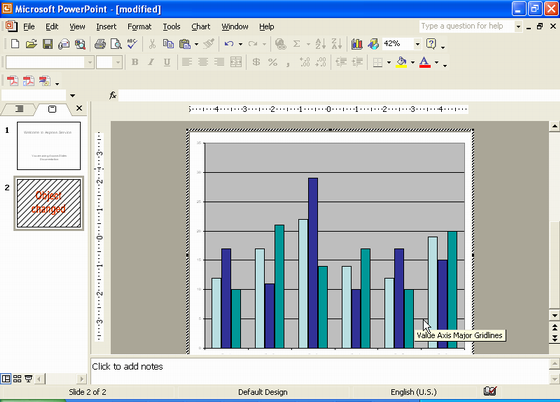
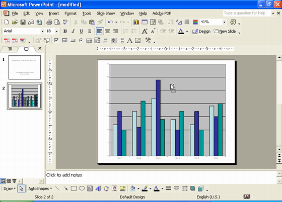
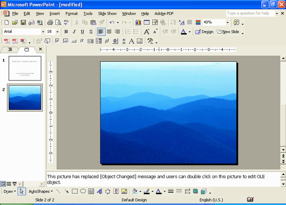

## **Issue Statement**
When developers add an **OleObjectFrame** to their slides using Aspose.Slides for Android via Java, an **Object Changed** message is shown on the output slide instead of the **OLE Object**. Most of the Aspose.Slides for Android via Java customers thinks that it is a bug or error in Aspose.Slides for Android via Java.
## **Critic Analysis and Explanation**
First of all, it is important to know that **Object Changed** message shown by Aspose.Slides for Android via Java after adding **OleObjectFrame** in the slide, is **NOT** an error or bug in Aspose.Slides for Android via Java. It's just an information or message to notify users that object is changed and image should be updated.

For example, if you add a **Microsoft Excel Chart** as an **OleObjectFrame** to your slide (for more details and code snippet about adding **OleObjectFrame** to your slide, [click here](/slides/androidjava/adding-frame-to-the-slide/)) and then open the presentation file using MS PowerPoint then the slide (where the **OLE Object** was added) would look like this:

**Figure**: Slide showing **Object Changed** message after **OLE Object** is added

This is not an error and your OLE Object is still added to the slide. If you want to test it then **Double Click** on the **Object Changed** message or **Right Click** on it and select **Worksheet Object -> Edit** option as shown below in the figure:

**Figure**: Selecting **Edit** option to edit the **OLE Object**

After you select **Edit** option of the popup menu, you will see that **Embedded OLE Object** will become visible in editable form as shown below:

**Figure**: **OLE Object** in editable form

You can still see the **Object Changed** message on the slide in the **Left Pane** of MS PowerPoint that shows slides previews. Once you click on the **OLE Object**, you will see that slide preview would also be changed and the **Changed Object** message would be replaced by the image of **OLE Object** as shown below:

**Figure**: Updation of **OLE Object** image

Now, you should **Save** your presentation file using MS PowerPoint so that the image of **OLE Object** should be updated. Once you save your presentation and open again using MS PowerPoint, you will see that no **Object Changed** message would be there.
## **More Solutions**
In the above critic analysis, we demonstrated that the image of **OLE Object** can be updated by opening the presentation file in MS PowerPoint and then saving it. But, there are two more solutions to deal with **Object Changed** message.
## **1st Solution: Replacing Object Changed Message with an Image**
If you don't like the **Object Changed** message then you can also replace that message with your own image. You can add any desired picture to your presentation and then use the Id of that added picture to replace the **Object Changed** message.

To achieve this, you can add these few lines of code in your application after adding **OleObjectFrame** to your slide.
## **Example**


After adding above lines in your application, the resulting slide containing **OleObjectFrame** would look like this:

**Figure**: **Object Changed** message replaced with an image
## **2nd Solution: Creating an Add-On for MS PowerPoint**
You can also try to create an add-on for MS PowerPoint, which updates all **OLE objects** when you open presentation in MS PowerPoint.
