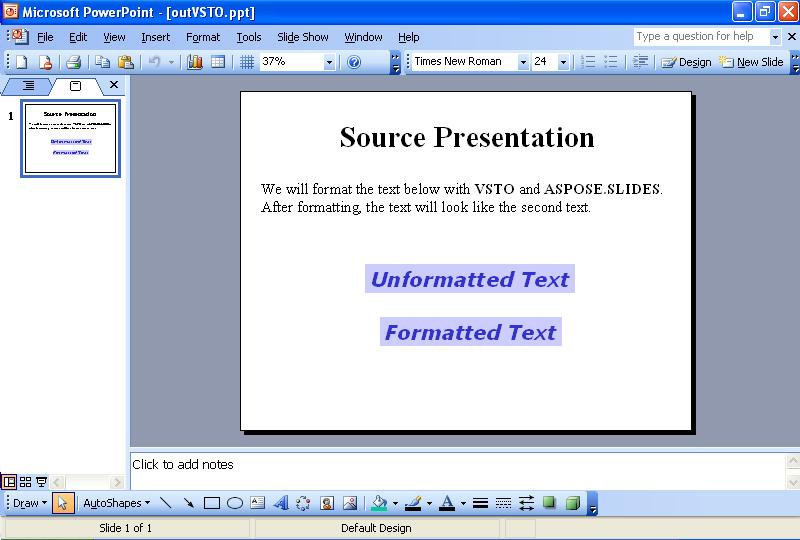
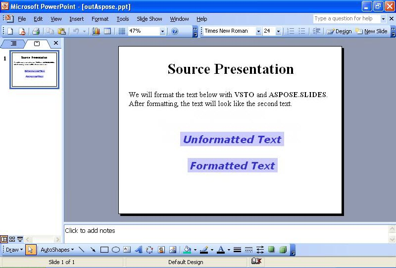

{} 

Sometimes, you need to format the text on slides programmatically. This article shows how to read a sample presentation with some text on the first slide using either [VSTO](/slides/androidjava/format-text-using-vsto-and-aspose-slides-for-java/) and [Aspose.Slides for Java](/slides/androidjava/format-text-using-vsto-and-aspose-slides-for-java/). The code formats the text in the third textbox on the slide to look like the text in the last textbox.

{} 
## **Formatting Text**
Both the VSTO and Aspose.Slides methods take the following steps:

1. Open the source presentation.
1. Access the first slide.
1. Access the third text box.
1. Change the formatting of the text in the third text box.
1. Save the presentation to disk.

The screenshots below show the sample slide before and after the execution of the VSTO and Aspose.Slides for Java code.

**The input presentation** 

### **VSTO Code Example**
The code below shows how to reformat text on a slide using VSTO.

**The text reformatted with VSTO** 



### **Aspose.Slides for Java Example**
To format text with Aspose.Slides, add the font before formatting the text.

**The output presentation created with Aspose.Slides** 


