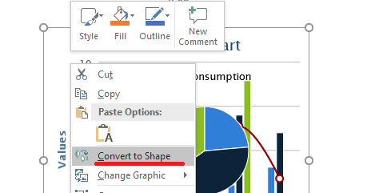

## **Images in Slides In Presentations**

Images make presentations more engaging and interesting. In Microsoft PowerPoint, you can insert pictures from a file, the internet, or other locations onto slides. Similarly, Aspose.Slides allows you to add images to slides in your presentations through different procedures. 

{} 

Aspose provides free converters—[JPEG to PowerPoint](https://products.aspose.app/slides/import/jpg-to-ppt) and [PNG to PowerPoint](https://products.aspose.app/slides/import/png-to-ppt)—that allow people to create presentations quickly from images. 

{} 

{}

If you want to add an image as a frame object—especially if you plan to use standard formatting options on it to change its size, add effects, and so on—see [Picture Frame](https://docs.aspose.com/slides/java/picture-frame/). 

{} 

{}

You can manipulate input/output operations involving images and PowerPoint presentations to convert an image from one format to another. See these pages: convert [image to JPG](https://products.aspose.com/slides/java/conversion/image-to-jpg/); convert [JPG to image](https://products.aspose.com/slides/java/conversion/jpg-to-image/); convert [JPG to PNG](https://products.aspose.com/slides/java/conversion/jpg-to-png/), convert [PNG to JPG](https://products.aspose.com/slides/java/conversion/png-to-jpg/); convert [PNG to SVG](https://products.aspose.com/slides/java/conversion/png-to-svg/), convert [SVG to PNG](https://products.aspose.com/slides/java/conversion/svg-to-png/).

{}

Aspose.Slides supports operations with images in these popular formats: JPEG, PNG, GIF, and others. 

## **Adding Images Stored Locally to Slides**

You can add one or several images on your computer onto a slide in a presentation. This sample code in Java shows you how to add an image to a slide:

```java
Presentation pres = new Presentation();
try {
	ISlide slide = pres.getSlides().get_Item(0);
	    IPPImage picture;
        IImage image = Images.fromFile("image.png");
        try {
            picture = pres.getImages().addImage(image);
        } finally {
            if (image != null) image.dispose();
        }
	slide.getShapes().addPictureFrame(ShapeType.Rectangle, 10, 10, 100, 100, picture);

	pres.save("pres.pptx", SaveFormat.Pptx);
} finally {
	if (pres != null) pres.dispose();
}
```

## **Adding Images From the Web to Slides**

If the image you want to add to a slide is unavailable on your computer, you can add the image directly from the web. 

This sample code shows you how to add an image from the web to a slide in Java:

```java
Presentation pres = new Presentation();
try {
	ISlide slide = pres.getSlides().get_Item(0);

	URL imageUrl = new URL("[REPLACE WITH URL]");
	URLConnection connection = imageUrl.openConnection();
	InputStream inputStream = connection.getInputStream();

	ByteArrayOutputStream outputStream = new ByteArrayOutputStream();
	try {
		byte[] buffer = new byte[1024];
		int read;

		while ((read = inputStream.read(buffer, 0, buffer.length)) != -1)
			outputStream.write(buffer, 0, read);

		outputStream.flush();

		IPPImage image = pres.getImages().addImage(outputStream.toByteArray());
		slide.getShapes().addPictureFrame(ShapeType.Rectangle, 10, 10, 100, 100, image);
	} finally {
		if (inputStream != null) inputStream.close();
		outputStream.close();
	}

	pres.save("pres.pptx", SaveFormat.Pptx);
} catch(IOException e) {
} finally {
	if (pres != null) pres.dispose();
}
```

## **Adding Images to Slide Masters**

A slide master is the top slide that stores and controls information (theme, layout, etc.) about all slides under it. So, when you add an image to a slide master, that image appears on every slide under that slide master. 

This Java sample code shows you how to add an image to a slide master:

```java
Presentation pres = new Presentation();
try {
	ISlide slide = pres.getSlides().get_Item(0);
	IMasterSlide masterSlide = slide.getLayoutSlide().getMasterSlide();

    IPPImage picture;
    IImage image = Images.fromFile("image.png");
    try {
        picture = pres.getImages().addImage(image);
    } finally {
        if (image != null) image.dispose();
    }
	masterSlide.getShapes().addPictureFrame(ShapeType.Rectangle, 10, 10, 100, 100, picture);

	pres.save("pres.pptx", SaveFormat.Pptx);
} finally {
	if (pres != null) pres.dispose();
}
```

## **Adding Images as Slide Background**

You may decide to use a picture as the background for a specific slide or several slides. In that case, you have to see *[Setting Images as Backgrounds for Slides](https://docs.aspose.com/slides/java/presentation-background/#setting-images-as-background-for-slides)*.

## **Adding SVG to Presentations**
You can add or insert any image into a presentation by using the [addPictureFrame](https://reference.aspose.com/slides/java/com.aspose.slides/IShapeCollection#addPictureFrame-int-float-float-float-float-com.aspose.slides.IPPImage-) method that belongs to the [IShapeCollection](https://reference.aspose.com/slides/java/com.aspose.slides/IShapeCollection) interface.

To create an image object based on SVG image, you can do it this way:

1. Create SvgImage object to insert it to ImageShapeCollection
2. Create PPImage object from ISvgImage
3. Create PictureFrame object using IPPImage interface

This sample code shows you how to implement the steps above to add an SVG image into a presentation:
```java 
// Instantiate Presentation class that represents PPTX file
Presentation pres = new Presentation();
try {
    String svgContent = new String(Files.readAllBytes(Paths.get("image.svg")));
    ISvgImage svgImage = new SvgImage(svgContent);
    IPPImage ppImage = pres.getImages().addImage(svgImage);
    pres.getSlides().get_Item(0).getShapes().addPictureFrame(ShapeType.Rectangle, 0, 0, 
			ppImage.getWidth(), ppImage.getHeight(), ppImage);
    pres.save("output.pptx", SaveFormat.Pptx);
} catch (IOException e) {
} finally {
    if (pres != null) pres.dispose();
}
```

## **Converting SVG to a Set of Shapes**
Aspose.Slides' conversion of SVG to a set of shapes is similar to the PowerPoint functionality used to work with SVG images:



The functionality is provided by one of the overloads of the [addGroupShape](https://reference.aspose.com/slides/java/com.aspose.slides/IShapeCollection#addGroupShape-com.aspose.slides.ISvgImage-float-float-float-float-) method of the [IShapeCollection](https://reference.aspose.com/slides/java/com.aspose.slides/IShapeCollection) interface that takes an [ISvgImage](https://reference.aspose.com/slides/java/com.aspose.slides/ISvgImage) object as the first argument.

This sample code shows you how to use the described method to convert an SVG file to a set of shapes:

```java 
// Create new presentation
IPresentation presentation = new Presentation();
try {
    // Read SVG file content
    byte[] svgContent = Files.readAllBytes(Paths.get("image.svg"));

    // Create SvgImage object
    ISvgImage svgImage = new SvgImage(svgContent);

    // Get slide size
    Dimension2D slideSize = presentation.getSlideSize().getSize();

    // Convert SVG image to group of shapes scaling it to slide size
    presentation.getSlides().get_Item(0).getShapes().
            addGroupShape(svgImage, 0f, 0f, (float)slideSize.getWidth(), (float)slideSize.getHeight());

    // Save presentation in PPTX format
    presentation.save("output.pptx", SaveFormat.Pptx);
} catch (IOException e) {
} finally {
    if (presentation != null) presentation.dispose();
}
```

## **Adding Images as EMF in Slides**
Aspose.Slides for Java allows you to generate EMF images from excel sheets and add the images as EMF in slides with Aspose.Cells. 

This sample code shows you how to perform the described task:

```java 
Workbook book = new Workbook("chart.xlsx");
Worksheet sheet = book.getWorksheets().get(0);
ImageOrPrintOptions options = new ImageOrPrintOptions();
options.setHorizontalResolution(200);
options.setVerticalResolution(200);
options.setImageType(ImageType.EMF);

//Save the workbook to stream
SheetRender sr = new SheetRender(sheet, options);
Presentation pres = new Presentation();
try {
    pres.getSlides().removeAt(0);
    
    String EmfSheetName = "";
    for (int j = 0; j < sr.getPageCount(); j++)
    {
    
        EmfSheetName = "test" + sheet.getName() + " Page" + (j + 1) + ".out.emf";
        sr.toImage(j, EmfSheetName);

        IPPImage picture;
        IImage image = Images.fromFile(EmfSheetName);
        try {
            picture = pres.getImages().addImage(image);
        } finally {
            if (image != null) image.dispose();
        }
        ISlide slide = pres.getSlides().addEmptySlide(pres.getLayoutSlides().getByType(SlideLayoutType.Blank));
        IShape m = slide.getShapes().addPictureFrame(ShapeType.Rectangle, 0, 0,
					(float)pres.getSlideSize().getSize().getWidth(), 
					(float)pres.getSlideSize().getSize().getHeight(), 
					picture);
    }
    
    pres.save("output.pptx", SaveFormat.Pptx);
} catch (IOException e) {
} finally {
    if (pres != null) pres.dispose();
}
```

{}

Using Aspose FREE [Text to GIF](https://products.aspose.app/slides/text-to-gif) converter, you can easily animate texts, create GIFs from texts, etc. 

{}
