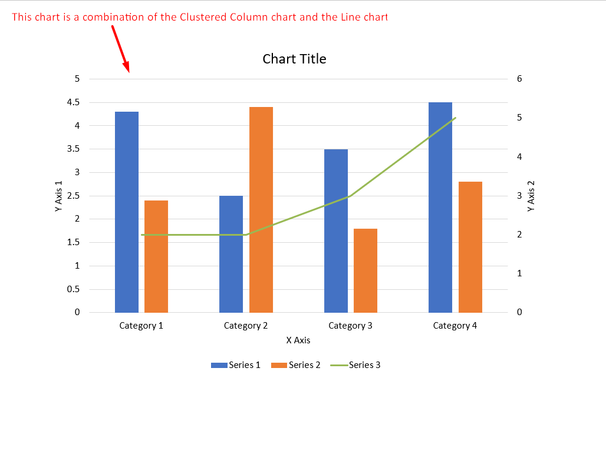

## Overview

This article describes how to **create PowerPoint Presentation Charts in the Java**. You can also **update the charts in Java**. It covers these topics.

_Chart_: **Normal**
- [Java Create PowerPoint Chart](#java-create-powerpoint-chart)
- [Java Create Presentation Chart](#java-create-presentation-chart)
- [Java Create PowerPoint Presentation Chart](#java-create-powerpoint-presentation-chart)

_Chart_: **Scattered**
- [Java Create Scattered Chart](#java-create-scattered-chart)
- [Java Create PowerPoint Scattered Chart](#java-create-powerpoint-scattered-chart)
- [Java Create PowerPoint Presentation Scattered Chart](#java-create-powerpoint-presentation-scattered-chart)

_Chart_: **Pie**
- [Java Create Pie Chart](#java-create-pie-chart)
- [Java Create PowerPoint Pie Chart](#java-create-powerpoint-pie-chart)
- [Java Create PowerPoint Presentation Pie Chart](#java-create-powerpoint-presentation-pie-chart)

_Chart_: **Tree Map**
- [Java Create Tree Map Chart](#java-create-tree-map-chart)
- [Java Create PowerPoint Tree Map Chart](#java-create-powerpoint-tree-map-chart)
- [Java Create PowerPoint Presentation Tree Map Chart](#java-create-powerpoint-presentation-tree-map-chart)

_Chart_: **Stock**
- [Java Create Stock Chart](#java-create-stock-chart)
- [Java Create PowerPoint Stock Chart](#java-create-powerpoint-stock-chart)
- [Java Create PowerPoint Presentation Stock Chart](#java-create-powerpoint-presentation-stock-chart)

_Chart_: **Box and Whisker**
- [Java Create Box and Whisker Chart](#java-create-box-and-whisker-chart)
- [Java Create PowerPoint Box and Whisker Chart](#java-create-powerpoint-box-and-whisker-chart)
- [Java Create PowerPoint Presentation Box and Whisker Chart](#java-create-powerpoint-presentation-box-and-whisker-chart)

_Chart_: **Funnel**
- [Java Create Funnel Chart](#java-create-funnel-chart)
- [Java Create PowerPoint Funnel Chart](#java-create-powerpoint-funnel-chart)
- [Java Create PowerPoint Presentation Funnel Chart](#java-create-powerpoint-presentation-funnel-chart)

_Chart_: **Sunburst**
- [Java Create Sunburst Chart](#java-create-sunburst-chart)
- [Java Create PowerPoint Sunburst Chart](#java-create-powerpoint-sunburst-chart)
- [Java Create PowerPoint Presentation Sunburst Chart](#java-create-powerpoint-presentation-sunburst-chart)

_Chart_: **Histogram**
- [Java Create Histogram Chart](#java-create-histogram-chart)
- [Java Create PowerPoint Histogram Chart](#java-create-powerpoint-histogram-chart)
- [Java Create PowerPoint Presentation Histogram Chart](#java-create-powerpoint-presentation-histogram-chart)

_Chart_: **Radar**
- [Java Create Radar Chart](#java-create-radar-chart)
- [Java Create PowerPoint Radar Chart](#java-create-powerpoint-radar-chart)
- [Java Create PowerPoint Presentation Radar Chart](#java-create-powerpoint-presentation-radar-chart)

_Chart_: **Multi Category**
- [Java Create Multi Category Chart](#java-create-multi-category-chart)
- [Java Create PowerPoint Multi Category Chart](#java-create-powerpoint-multi-category-chart)
- [Java Create PowerPoint Presentation Multi Category Chart](#java-create-powerpoint-presentation-multi-category-chart)

_Chart_: **Map**
- [Java Create Map Chart](#java-create-map-chart)
- [Java Create PowerPoint Map Chart](#java-create-powerpoint-map-chart)
- [Java Create PowerPoint Presentation Map Chart](#java-create-powerpoint-presentation-map-chart)

_Action_: **Update Chart**
- [Java Update PowerPoint Chart](#java-update-powerpoint-chart)
- [Java Update Presentation Chart](#java-update-presentation-chart)
- [Java Update PowerPoint Presentation Chart](#java-update-powerpoint-presentation-chart)


## **Create Chart**
Charts help people to quickly visualize data and gain insights, which may not be immediately obvious from a table or spreadsheet. 


**Why Create Charts?**

Using charts, you get to

* aggregate, condense, or summarize large amounts of data on a single slide in a presentation
* expose patterns and trends in data
* deduce the direction and momentum of data over time or with respect to a specific unit of measurement 
* spots outliers, aberrations, deviations, errors, nonsensical data, etc. 
* communicate or present complex data

In PowerPoint, you can create charts through the insert function, which provides templates used to design many types of charts. Using Aspose.Slides, you can create regular charts (based on popular chart types) and custom charts. 

{} 

To allow you create charts, Aspose.Slides provides the [ChartType](https://reference.aspose.com/slides/androidjava/com.aspose.slides/ChartType) class. The fields under this class correspond to different chart types.

{} 

### **Creating Normal Charts**

_Steps: Create Chart_
- <a name="java-create-powerpoint-chart" id="java-create-powerpoint-chart"><strong><em>Steps:</em> Create PowerPoint Chart in Java</strong></a>
- <a name="java-create-presentation-chart" id="java-create-presentation-chart"><strong><em>Steps:</em> Create Presentation Chart in Java</strong></a>
- <a name="java-create-powerpoint-presentation-chart" id="java-create-powerpoint-presentation-chart"><strong><em>Steps:</em> Create PowerPoint Presentation Chart in Java</strong></a>

_Code Steps:_

1. Create an instance of the [Presentation](https://reference.aspose.com/slides/androidjava/com.aspose.slides/Presentation) class.
2. Get a slide's reference through its index.
3. Add a chart with some data and specify your preferred chart type. 
4. Add a title for the chart. 
5. Access the chart data worksheet.
6. Clear all the default series and categories.
7. Add new series and categories.
8. Add some new chart data for the chart series.
9. Add a fill color for chart series.
10. Add labels for the chart series. 
11. Write the modified presentation as a PPTX file.

This Java code shows you how to create a normal chart:

```java
// Instantiates a presentation class that represents a PPTX file
Presentation pres = new Presentation();
try {
    // Accesses the first slide
    ISlide sld = pres.getSlides().get_Item(0);
    
    // Adds a chart with its default data
    IChart chart = sld.getShapes().addChart(ChartType.ClusteredColumn, 0, 0, 500, 500);
    
    // Sets the chart Title
    chart.getChartTitle().addTextFrameForOverriding("Sample Title");
    chart.getChartTitle().getTextFrameForOverriding().getTextFrameFormat().setCenterText(NullableBool.True);
    chart.getChartTitle().setHeight(20);
    chart.hasTitle();
    
    // Sets the first series to show values
    chart.getChartData().getSeries().get_Item(0).getLabels().getDefaultDataLabelFormat().setShowValue(true);
    
    // Sets the index for the chart data sheet
    int defaultWorksheetIndex = 0;
    
    // Gets the chart data WorkSheet
    IChartDataWorkbook fact = chart.getChartData().getChartDataWorkbook();
    
    // Deletes the default generated series and categories
    chart.getChartData().getSeries().clear();
    chart.getChartData().getCategories().clear();
    int s = chart.getChartData().getSeries().size();
    s = chart.getChartData().getCategories().size();
    
    // Adds new series
    chart.getChartData().getSeries().add(fact.getCell(defaultWorksheetIndex, 0, 1, "Series 1"),chart.getType());
    chart.getChartData().getSeries().add(fact.getCell(defaultWorksheetIndex, 0, 2, "Series 2"),chart.getType());
    
    // Adds new categories
    chart.getChartData().getCategories().add(fact.getCell(defaultWorksheetIndex, 1, 0, "Caetegoty 1"));
    chart.getChartData().getCategories().add(fact.getCell(defaultWorksheetIndex, 2, 0, "Caetegoty 2"));
    chart.getChartData().getCategories().add(fact.getCell(defaultWorksheetIndex, 3, 0, "Caetegoty 3"));
    
    // Takes the first chart series
    IChartSeries series = chart.getChartData().getSeries().get_Item(0);
    
    // Now populates the series data
    series.getDataPoints().addDataPointForBarSeries(fact.getCell(defaultWorksheetIndex, 1, 1, 20));
    series.getDataPoints().addDataPointForBarSeries(fact.getCell(defaultWorksheetIndex, 2, 1, 50));
    series.getDataPoints().addDataPointForBarSeries(fact.getCell(defaultWorksheetIndex, 3, 1, 30));
    
    // Sets the fill color for series
    series.getFormat().getFill().setFillType(FillType.Solid);
    series.getFormat().getFill().getSolidFillColor().setColor(Color.RED);
    
    // Takes the second chart series
    series = chart.getChartData().getSeries().get_Item(1);
    
    // Populates series data
    series.getDataPoints().addDataPointForBarSeries(fact.getCell(defaultWorksheetIndex, 1, 2, 30));
    series.getDataPoints().addDataPointForBarSeries(fact.getCell(defaultWorksheetIndex, 2, 2, 10));
    series.getDataPoints().addDataPointForBarSeries(fact.getCell(defaultWorksheetIndex, 3, 2, 60));
    
    // Sets the fill color for the series
    series.getFormat().getFill().setFillType(FillType.Solid);
    series.getFormat().getFill().getSolidFillColor().setColor(Color.GREEN);
    
    //Create custom labels for each categories for the new series
    // Sets the first label to show Category name
    IDataLabel lbl = series.getDataPoints().get_Item(0).getLabel();
    lbl.getDataLabelFormat().setShowCategoryName(true);
    
    lbl = series.getDataPoints().get_Item(1).getLabel();
    lbl.getDataLabelFormat().setShowSeriesName(true);
    
    // Shows value for the third label
    lbl = series.getDataPoints().get_Item(2).getLabel();
    lbl.getDataLabelFormat().setShowValue(true);
    lbl.getDataLabelFormat().setShowSeriesName(true);
    lbl.getDataLabelFormat().setSeparator("/");
    
    // Saves the presentation with chart
    pres.save("output.pptx", SaveFormat.Pptx);
} finally {
    if (pres != null) pres.dispose();
}
```

### **Creating Scattered Charts**
Scattered charts (also known as scattered plots or x-y graphs) are often used to check for patterns or demonstrate correlations between two variables. 

You may want to use a scattered chart when 

* you have paired numerical data
* you have 2 variables that pair well together
* you want to determine whether 2 variables are related
* you have an independent variable that has multiple values for a dependent variable

<a name="java-create-scattered-chart" id="java-create-scattered-chart"><strong><em>Steps:</em> Create Scattered Chart in Java</strong></a> |
<a name="java-create-powerpoint-scattered-chart" id="java-create-powerpoint-scattered-chart"><strong><em>Steps:</em> Create PowerPoint Scattered Chart in Java</strong></a> |
<a name="java-create-powerpoint-presentation-scattered-chart" id="java-create-powerpoint-presentation-scattered-chart"><strong><em>Steps:</em> Create PowerPoint Presentation Scattered Chart in Java</strong></a>

1. Please follow the steps mentioned above in [Creating Normal Charts](#creating-normal-charts)
2. For third step, Add a chart with some data and specify your chart type as one of the following
   1. [ChartType.ScatterWithMarkers](https://reference.aspose.com/slides/androidjava/com.aspose.slides/charttype/#ScatterWithMarkers) - _Represents Scatter Chart._
   2. [ChartType.ScatterWithSmoothLinesAndMarkers](https://reference.aspose.com/slides/androidjava/com.aspose.slides/charttype/#ScatterWithSmoothLinesAndMarkers) - _Represents Scatter Chart connected by curves, with data markers._
   3. [ChartType.ScatterWithSmoothLines](https://reference.aspose.com/slides/androidjava/com.aspose.slides/charttype/#ScatterWithSmoothLines) - _Represents Scatter Chart connected by curves, without data markers._
   4. [ChartType.ScatterWithStraightLinesAndMarkers](https://reference.aspose.com/slides/androidjava/com.aspose.slides/charttype/#ScatterWithStraightLinesAndMarkers) - _Represents Scatter Chart connected by lines, with data markers._
   5. [ChartType.ScatterWithStraightLines](https://reference.aspose.com/slides/androidjava/com.aspose.slides/charttype/#ScatterWithStraightLines) - _Represents Scatter Chart connected by lines, without data markers._

This Java code shows you how to create a scattered charts with a different series of markers: 

```java
// Instantiates a presentation class that represents a PPTX file
Presentation pres = new Presentation();
try {
    // Accesses the first slide
    ISlide slide = pres.getSlides().get_Item(0);

    // Creates the default chart
    IChart chart = slide.getShapes().addChart(ChartType.ScatterWithSmoothLines, 0, 0, 400, 400);
    
    // Gets the default chart data worksheet index
    int defaultWorksheetIndex = 0;
    
    // Gets the chart data worksheet
    IChartDataWorkbook fact = chart.getChartData().getChartDataWorkbook();
    
    // Deletes the demo series
    chart.getChartData().getSeries().clear();
    
    // Adds new series
    chart.getChartData().getSeries().add(fact.getCell(defaultWorksheetIndex, 1, 1, "Series 1"), chart.getType());
    chart.getChartData().getSeries().add(fact.getCell(defaultWorksheetIndex, 1, 3, "Series 2"), chart.getType());
    
    // Takes first chart series
    IChartSeries series = chart.getChartData().getSeries().get_Item(0);
    
    // Adds a new point (1:3) to the series
    series.getDataPoints().addDataPointForScatterSeries(fact.getCell(defaultWorksheetIndex, 2, 1, 1), fact.getCell(defaultWorksheetIndex, 2, 2, 3));
    
    // Adds a new point (2:10)
    series.getDataPoints().addDataPointForScatterSeries(fact.getCell(defaultWorksheetIndex, 3, 1, 2), fact.getCell(defaultWorksheetIndex, 3, 2, 10));
    
    // Changes the series type
    series.setType(ChartType.ScatterWithStraightLinesAndMarkers);
    
    // Changes the chart series marker
    series.getMarker().setSize(10);
    series.getMarker().setSymbol(MarkerStyleType.Star);
    
    // Takes the second chart series
    series = chart.getChartData().getSeries().get_Item(1);
    
    // Adds a new point (5:2) there
    series.getDataPoints().addDataPointForScatterSeries(fact.getCell(defaultWorksheetIndex, 2, 3, 5), fact.getCell(defaultWorksheetIndex, 2, 4, 2));
    
    // Adds a new point (3:1)
    series.getDataPoints().addDataPointForScatterSeries(fact.getCell(defaultWorksheetIndex, 3, 3, 3), fact.getCell(defaultWorksheetIndex, 3, 4, 1));
    
    // Adds a new point (2:2)
    series.getDataPoints().addDataPointForScatterSeries(fact.getCell(defaultWorksheetIndex, 4, 3, 2), fact.getCell(defaultWorksheetIndex, 4, 4, 2));
    
    // Adds a new point (5:1)
    series.getDataPoints().addDataPointForScatterSeries(fact.getCell(defaultWorksheetIndex, 5, 3, 5), fact.getCell(defaultWorksheetIndex, 5, 4, 1));
    
    // Changes the chart series marker
    series.getMarker().setSize(10);
    series.getMarker().setSymbol(MarkerStyleType.Circle);
    
    pres.save("AsposeChart_out.pptx", SaveFormat.Pptx);
} finally {
    if (pres != null) pres.dispose();
}
```

### **Creating Pie Charts**

Pie charts are best used to show the part-to-whole relationship in data, especially when the data contains categorical labels with numeric values. However, if your data contains many parts or labels, you may want to consider using a bar chart instead.

<a name="java-create-pie-chart" id="java-create-pie-chart"><strong><em>Steps:</em> Create Pie Chart in Java</strong></a> |
<a name="java-create-powerpoint-pie-chart" id="java-create-powerpoint-pie-chart"><strong><em>Steps:</em> Create PowerPoint Pie Chart in Java</strong></a> |
<a name="java-create-powerpoint-presentation-pie-chart" id="java-create-powerpoint-presentation-pie-chart"><strong><em>Steps:</em> Create PowerPoint Presentation Pie Chart in Java</strong></a>

1. Create an instance of the [Presentation](https://reference.aspose.com/slides/androidjava/com.aspose.slides/Presentation) class.
2. Obtain a slide's reference by its index.
3. Add a chart with default data along with the desired type (in this case, [ChartType](https://reference.aspose.com/slides/androidjava/com.aspose.slides/ChartType).Pie).
4. Access the chart data [IChartDataWorkbook](https://reference.aspose.com/slides/androidjava/com.aspose.slides/IChartDataWorkbook).
5. Clear the default series and categories.
6. Add new series and categories.
7. Add new chart data for the chart series.
8. Add new points for charts and add custom colors for the pie chart's sectors.
9. Set labels for series.
10. Set leader lines for series labels.
11. Set the rotation angle for pie chart slides.
12. Write the modified presentation to a PPTX file

This Java code shows you how to create a pie chart:

```java
// Instantiates a presentation class that represents a PPTX file
Presentation pres = new Presentation();
try {
    // Accesses the first slide
    ISlide slides = pres.getSlides().get_Item(0);
    
    // Adds a chart with default data
    IChart chart = slides.getShapes().addChart(ChartType.Pie, 100, 100, 400, 400);
    
    // Sets the chart Title
    chart.getChartTitle().addTextFrameForOverriding("Sample Title");
    chart.getChartTitle().getTextFrameForOverriding().getTextFrameFormat().setCenterText(NullableBool.True);
    chart.getChartTitle().setHeight(20);
    chart.setTitle(true);
    
    // Sets the first series to show values
    chart.getChartData().getSeries().get_Item(0).getLabels().getDefaultDataLabelFormat().setShowValue(true);
    
    // Sets the index for the chart data sheet
    int defaultWorksheetIndex = 0;
    
    // Gets the chart data worksheet
    IChartDataWorkbook fact = chart.getChartData().getChartDataWorkbook();
    
    // Deletes the default generated series and categories
    chart.getChartData().getSeries().clear();
    chart.getChartData().getCategories().clear();
    
    // Adds new categories
    chart.getChartData().getCategories().add(fact.getCell(0, 1, 0, "First Qtr"));
    chart.getChartData().getCategories().add(fact.getCell(0, 2, 0, "2nd Qtr"));
    chart.getChartData().getCategories().add(fact.getCell(0, 3, 0, "3rd Qtr"));
    
    // Adds new series
    IChartSeries series = chart.getChartData().getSeries().add(fact.getCell(0, 0, 1, "Series 1"), chart.getType());
    
    //Populates the series data
    series.getDataPoints().addDataPointForPieSeries(fact.getCell(defaultWorksheetIndex, 1, 1, 20));
    series.getDataPoints().addDataPointForPieSeries(fact.getCell(defaultWorksheetIndex, 2, 1, 50));
    series.getDataPoints().addDataPointForPieSeries(fact.getCell(defaultWorksheetIndex, 3, 1, 30));
    
    // Not working in new version
    // Adding new points and setting sector color
    // series.IsColorVaried = true;
    chart.getChartData().getSeriesGroups().get_Item(0).setColorVaried(true);
    
    IChartDataPoint point = series.getDataPoints().get_Item(0);
    point.getFormat().getFill().setFillType(FillType.Solid);
    point.getFormat().getFill().getSolidFillColor().setColor(Color.CYAN);
	
    // Sets the Sector border
    point.getFormat().getLine().getFillFormat().setFillType(FillType.Solid);
    point.getFormat().getLine().getFillFormat().getSolidFillColor().setColor(Color.GRAY);
    point.getFormat().getLine().setWidth(3.0);
    point.getFormat().getLine().setStyle(LineStyle.ThinThick);
    point.getFormat().getLine().setDashStyle(LineDashStyle.DashDot);
    
    IChartDataPoint point1 = series.getDataPoints().get_Item(1);
    point1.getFormat().getFill().setFillType(FillType.Solid);
    point1.getFormat().getFill().getSolidFillColor().setColor(Color.ORANGE);
    
    // Sets the Sector border
    point1.getFormat().getLine().getFillFormat().setFillType(FillType.Solid);
    point1.getFormat().getLine().getFillFormat().getSolidFillColor().setColor(Color.BLUE);
    point1.getFormat().getLine().setWidth(3.0);
    point1.getFormat().getLine().setStyle(LineStyle.Single);
    point1.getFormat().getLine().setDashStyle(LineDashStyle.LargeDashDot);
    
    IChartDataPoint point2 = series.getDataPoints().get_Item(2);
    point2.getFormat().getFill().setFillType(FillType.Solid);
    point2.getFormat().getFill().getSolidFillColor().setColor(Color.YELLOW);
    
    // Sets the Sector border
    point2.getFormat().getLine().getFillFormat().setFillType(FillType.Solid);
    point2.getFormat().getLine().getFillFormat().getSolidFillColor().setColor(Color.RED);
    point2.getFormat().getLine().setWidth(2.0);
    point2.getFormat().getLine().setStyle(LineStyle.ThinThin);
    point2.getFormat().getLine().setDashStyle(LineDashStyle.LargeDashDotDot);
    
    // Creates custom labels for each of categories for new series
    IDataLabel lbl1 = series.getDataPoints().get_Item(0).getLabel();
    
    // lbl.ShowCategoryName = true;
    lbl1.getDataLabelFormat().setShowValue(true);
    
    IDataLabel lbl2 = series.getDataPoints().get_Item(1).getLabel();
    lbl2.getDataLabelFormat().setShowValue(true);
    lbl2.getDataLabelFormat().setShowLegendKey(true);
    lbl2.getDataLabelFormat().setShowPercentage(true);
    
    IDataLabel lbl3 = series.getDataPoints().get_Item(2).getLabel();
    lbl3.getDataLabelFormat().setShowSeriesName(true);
    lbl3.getDataLabelFormat().setShowPercentage(true);
    
    // Shows Leader Lines for Chart
    series.getLabels().getDefaultDataLabelFormat().setShowLeaderLines(true);
    
    // Sets the Rotation Angle for Pie Chart Sectors
    chart.getChartData().getSeriesGroups().get_Item(0).setFirstSliceAngle(180);
    
    // Saves the presentation with a chart
    pres.save("PieChart_out.pptx", SaveFormat.Pptx);
} finally {
    if (pres != null) pres.dispose();
}
```

### **Creating Line Charts**

Line charts (also known as a line graphs) are best used in situations where you want demonstrate changes in value over time. Using a line chart, you can compare lots of data at once, track changes and trends over time, highlight anomalies in data series, etc.

1. Create an instance of the [Presentation](https://reference.aspose.com/slides/androidjava/com.aspose.slides/Presentation) class.
1. Get a slide's reference through its index.
1. Add a chart with default data along with the desired type (in this case, `ChartType.Line`).
1. Access the chart data IChartDataWorkbook.
1. Clear the default series and categories.
1. Add new series and categories.
1. Add new chart data for the chart series.
1. Write the modified presentation to a PPTX file

This Java code shows you how to create a line chart:

```java
Presentation pres = new Presentation();
try {
    IChart lineChart = pres.getSlides().get_Item(0).getShapes().addChart(ChartType.Line, 10, 50, 600, 350);

    pres.save("lineChart.pptx", SaveFormat.Pptx);
} finally {
    if (pres != null) pres.dispose();
}
```

By default, points on a line chart are joined by straight continuous lines. If you want to the points to be joined by dashes instead, you can specify your preferred dash type this way:

```java
IChart lineChart = pres.getSlides().get_Item(0).getShapes().addChart(ChartType.Line, 10, 50, 600, 350);

for (IChartSeries series : lineChart.getChartData().getSeries())
{
    series.getFormat().getLine().setDashStyle(LineDashStyle.Dash);
}
```

### **Creating Tree Map Charts**

Tree map charts are best used for sales data when you want to show the relative size of data categories and (at the same time) quickly draw attention to items that are large contributors to each category. 

<a name="java-create-tree-map-chart" id="java-create-tree-map-chart"><strong><em>Steps:</em> Create Tree Map Chart in Java</strong></a> |
<a name="java-create-powerpoint-tree-map-chart" id="java-create-powerpoint-tree-map-chart"><strong><em>Steps:</em> Create PowerPoint Tree Map Chart in Java</strong></a> |
<a name="java-create-powerpoint-presentation-tree-map-chart" id="java-create-powerpoint-presentation-tree-map-chart"><strong><em>Steps:</em> Create PowerPoint Presentation Tree Map Chart in Java</strong></a>

1. Create an instance of the [Presentation](https://reference.aspose.com/slides/androidjava/com.aspose.slides/Presentation) class.
2. Get a slide's reference through its index.
3. Add a chart with default data along with the desired type (in this case, [ChartType](https://reference.aspose.com/slides/androidjava/com.aspose.slides/ChartType).TreeMap).
4. Access the chart data [IChartDataWorkbook](https://reference.aspose.com/slides/androidjava/com.aspose.slides/IChartDataWorkbook).
5. Clear the default series and categories.
6. Add new series and categories.
7. Add new chart data for the chart series.
8. Write the modified presentation to a PPTX file

This Java code shows you how to create a tree map chart:

```java
Presentation pres = new Presentation();
try {
    IChart chart = pres.getSlides().get_Item(0).getShapes().addChart(ChartType.Treemap, 50, 50, 500, 400);
    chart.getChartData().getCategories().clear();
    chart.getChartData().getSeries().clear();

    IChartDataWorkbook wb = chart.getChartData().getChartDataWorkbook();
    wb.clear(0);

    //branch 1
    IChartCategory leaf = chart.getChartData().getCategories().add(wb.getCell(0, "C1", "Leaf1"));
    leaf.getGroupingLevels().setGroupingItem(1, "Stem1");
    leaf.getGroupingLevels().setGroupingItem(2, "Branch1");

    chart.getChartData().getCategories().add(wb.getCell(0, "C2", "Leaf2"));

    leaf = chart.getChartData().getCategories().add(wb.getCell(0, "C3", "Leaf3"));
    leaf.getGroupingLevels().setGroupingItem(1, "Stem2");

    chart.getChartData().getCategories().add(wb.getCell(0, "C4", "Leaf4"));

    //branch 2
    leaf = chart.getChartData().getCategories().add(wb.getCell(0, "C5", "Leaf5"));
    leaf.getGroupingLevels().setGroupingItem(1, "Stem3");
    leaf.getGroupingLevels().setGroupingItem(2, "Branch2");

    chart.getChartData().getCategories().add(wb.getCell(0, "C6", "Leaf6"));

    leaf = chart.getChartData().getCategories().add(wb.getCell(0, "C7", "Leaf7"));
    leaf.getGroupingLevels().setGroupingItem(1, "Stem4");

    chart.getChartData().getCategories().add(wb.getCell(0, "C8", "Leaf8"));

    IChartSeries series = chart.getChartData().getSeries().add(ChartType.Treemap);
    series.getLabels().getDefaultDataLabelFormat().setShowCategoryName(true);
    series.getDataPoints().addDataPointForTreemapSeries(wb.getCell(0, "D1", 4));
    series.getDataPoints().addDataPointForTreemapSeries(wb.getCell(0, "D2", 5));
    series.getDataPoints().addDataPointForTreemapSeries(wb.getCell(0, "D3", 3));
    series.getDataPoints().addDataPointForTreemapSeries(wb.getCell(0, "D4", 6));
    series.getDataPoints().addDataPointForTreemapSeries(wb.getCell(0, "D5", 9));
    series.getDataPoints().addDataPointForTreemapSeries(wb.getCell(0, "D6", 9));
    series.getDataPoints().addDataPointForTreemapSeries(wb.getCell(0, "D7", 4));
    series.getDataPoints().addDataPointForTreemapSeries(wb.getCell(0, "D8", 3));

    series.setParentLabelLayout(ParentLabelLayoutType.Overlapping);

    pres.save("Treemap.pptx", SaveFormat.Pptx);
} finally {
    if (pres != null) pres.dispose();
}
```

### **Creating Stock Charts**

<a name="java-create-stock-chart" id="java-create-stock-chart"><strong><em>Steps:</em> Create Stock Chart in Java</strong></a> |
<a name="java-create-powerpoint-stock-chart" id="java-powerpoint-stock-chart"><strong><em>Steps:</em> Create PowerPoint Stock Chart in Java</strong></a> |
<a name="java-create-powerpoint-presentation-stock-chart" id="java-create-powerpoint-presentation-stock-chart"><strong><em>Steps:</em> Create PowerPoint Presentation Stock Chart in Java</strong></a>

1. Create an instance of the [Presentation](https://reference.aspose.com/slides/androidjava/com.aspose.slides/Presentation) class.
2. Obtain a slide's reference by its index.
3. Add a chart with default data along with the desired type ([ChartType](https://reference.aspose.com/slides/androidjava/com.aspose.slides/ChartType).OpenHighLowClose).
4. Access the chart data [IChartDataWorkbook](https://reference.aspose.com/slides/androidjava/com.aspose.slides/IChartDataWorkbook).
5. Clear the default series and categories.
6. Add new series and categories.
7. Add new chart data for the chart series.
8. Specify HiLowLines format.
9. Write the modified presentation to a PPTX file

Sample Java code used to create a stock chart:

```java
Presentation pres = new Presentation();
try {
    IChart chart = pres.getSlides().get_Item(0).getShapes().addChart(ChartType.OpenHighLowClose, 50, 50, 600, 400, false);

    chart.getChartData().getSeries().clear();
    chart.getChartData().getCategories().clear();

    IChartDataWorkbook wb = chart.getChartData().getChartDataWorkbook();

    chart.getChartData().getCategories().add(wb.getCell(0, 1, 0, "A"));
    chart.getChartData().getCategories().add(wb.getCell(0, 2, 0, "B"));
    chart.getChartData().getCategories().add(wb.getCell(0, 3, 0, "C"));

    chart.getChartData().getSeries().add(wb.getCell(0, 0, 1, "Open"), chart.getType());
    chart.getChartData().getSeries().add(wb.getCell(0, 0, 2, "High"), chart.getType());
    chart.getChartData().getSeries().add(wb.getCell(0, 0, 3, "Low"), chart.getType());
    chart.getChartData().getSeries().add(wb.getCell(0, 0, 4, "Close"), chart.getType());

    IChartSeries series = chart.getChartData().getSeries().get_Item(0);

    series.getDataPoints().addDataPointForStockSeries(wb.getCell(0, 1, 1, 72));
    series.getDataPoints().addDataPointForStockSeries(wb.getCell(0, 2, 1, 25));
    series.getDataPoints().addDataPointForStockSeries(wb.getCell(0, 3, 1, 38));

    series = chart.getChartData().getSeries().get_Item(1);
    series.getDataPoints().addDataPointForStockSeries(wb.getCell(0, 1, 2, 172));
    series.getDataPoints().addDataPointForStockSeries(wb.getCell(0, 2, 2, 57));
    series.getDataPoints().addDataPointForStockSeries(wb.getCell(0, 3, 2, 57));

    series = chart.getChartData().getSeries().get_Item(2);
    series.getDataPoints().addDataPointForStockSeries(wb.getCell(0, 1, 3, 12));
    series.getDataPoints().addDataPointForStockSeries(wb.getCell(0, 2, 3, 12));
    series.getDataPoints().addDataPointForStockSeries(wb.getCell(0, 3, 3, 13));

    series = chart.getChartData().getSeries().get_Item(3);
    series.getDataPoints().addDataPointForStockSeries(wb.getCell(0, 1, 4, 25));
    series.getDataPoints().addDataPointForStockSeries(wb.getCell(0, 2, 4, 38));
    series.getDataPoints().addDataPointForStockSeries(wb.getCell(0, 3, 4, 50));

    chart.getChartData().getSeriesGroups().get_Item(0).getUpDownBars().setUpDownBars(true);
    chart.getChartData().getSeriesGroups().get_Item(0).getHiLowLinesFormat().getLine().getFillFormat().setFillType(FillType.Solid);

    for (IChartSeries ser : chart.getChartData().getSeries())
    {
        ser.getFormat().getLine().getFillFormat().setFillType(FillType.NoFill);
    }

    pres.save("output.pptx", SaveFormat.Pptx);
} finally {
    if (pres != null) pres.dispose();
}
```

### **Creating Box and Whisker Charts**

<a name="java-create-box-and-whisker-chart" id="java-create-box-and-whisker-chart"><strong><em>Steps:</em> Create Box and Whisker Chart in Java</strong></a> |
<a name="java-create-powerpoint-box-and-whisker-chart" id="java-powerpoint-box-and-whisker-chart"><strong><em>Steps:</em> Create PowerPoint Box and Whisker Chart in Java</strong></a> |
<a name="java-create-powerpoint-presentation-box-and-whisker-chart" id="java-create-powerpoint-presentation-box-and-whisker-chart"><strong><em>Steps:</em> Create PowerPoint Presentation Box and Whisker Chart in Java</strong></a>

1. Create an instance of the [Presentation](https://reference.aspose.com/slides/androidjava/com.aspose.slides/Presentation) class.
2. Get a slide's reference through its index.
3. Add a chart with default data along with the desired type ([ChartType](https://reference.aspose.com/slides/androidjava/com.aspose.slides/ChartType).BoxAndWhisker).
4. Access the chart data [IChartDataWorkbook](https://reference.aspose.com/slides/androidjava/com.aspose.slides/IChartDataWorkbook).
5. Clear the default series and categories.
6. Add new series and categories.
7. Add new chart data for the chart series.
8. Write the modified presentation to a PPTX file

This Java code shows you how to create a box and whisker chart:

```java
Presentation pres = new Presentation();
try {
    IChart chart = pres.getSlides().get_Item(0).getShapes().addChart(ChartType.BoxAndWhisker, 50, 50, 500, 400);
    chart.getChartData().getCategories().clear();
    chart.getChartData().getSeries().clear();

    IChartDataWorkbook wb = chart.getChartData().getChartDataWorkbook();
    wb.clear(0);

    chart.getChartData().getCategories().add(wb.getCell(0, "A1", "Category 1"));
    chart.getChartData().getCategories().add(wb.getCell(0, "A2", "Category 1"));
    chart.getChartData().getCategories().add(wb.getCell(0, "A3", "Category 1"));
    chart.getChartData().getCategories().add(wb.getCell(0, "A4", "Category 1"));
    chart.getChartData().getCategories().add(wb.getCell(0, "A5", "Category 1"));
    chart.getChartData().getCategories().add(wb.getCell(0, "A6", "Category 1"));

    IChartSeries series = chart.getChartData().getSeries().add(ChartType.BoxAndWhisker);

    series.setQuartileMethod(QuartileMethodType.Exclusive);
    series.setShowMeanLine(true);
    series.setShowMeanMarkers(true);
    series.setShowInnerPoints(true);
    series.setShowOutlierPoints(true);

    series.getDataPoints().addDataPointForBoxAndWhiskerSeries(wb.getCell(0, "B1", 15));
    series.getDataPoints().addDataPointForBoxAndWhiskerSeries(wb.getCell(0, "B2", 41));
    series.getDataPoints().addDataPointForBoxAndWhiskerSeries(wb.getCell(0, "B3", 16));
    series.getDataPoints().addDataPointForBoxAndWhiskerSeries(wb.getCell(0, "B4", 10));
    series.getDataPoints().addDataPointForBoxAndWhiskerSeries(wb.getCell(0, "B5", 23));
    series.getDataPoints().addDataPointForBoxAndWhiskerSeries(wb.getCell(0, "B6", 16));

    pres.save("BoxAndWhisker.pptx", SaveFormat.Pptx);
} finally {
    if (pres != null) pres.dispose();
}
```

### **Creating Funnel Charts**

<a name="java-create-funnel-chart" id="java-create-funnel-chart"><strong><em>Steps:</em> Create Funnel Chart in Java</strong></a> |
<a name="java-create-powerpoint-funnel-chart" id="java-create-powerpoint-funnel-chart"><strong><em>Steps:</em> Create PowerPoint Funnel Chart in Java</strong></a> |
<a name="java-create-powerpoint-presentation-funnel-chart" id="java-create-powerpoint-presentation-funnel-chart"><strong><em>Steps:</em> Create PowerPoint Presentation Funnel Chart in Java</strong></a>


1. Create an instance of the [Presentation](https://reference.aspose.com/slides/androidjava/com.aspose.slides/Presentation) class.
2. Get a slide's reference through its index.
3. Add a chart with default data along with the desired type ([ChartType](https://reference.aspose.com/slides/androidjava/com.aspose.slides/ChartType).Funnel).
4. Write the modified presentation to a PPTX file

The Java code shows you how to create a funnel chart:

```java
Presentation pres = new Presentation();
try {
    IChart chart = pres.getSlides().get_Item(0).getShapes().addChart(ChartType.Funnel, 50, 50, 500, 400);
    chart.getChartData().getCategories().clear();
    chart.getChartData().getSeries().clear();

    IChartDataWorkbook wb = chart.getChartData().getChartDataWorkbook();

    wb.clear(0);

    chart.getChartData().getCategories().add(wb.getCell(0, "A1", "Category 1"));
    chart.getChartData().getCategories().add(wb.getCell(0, "A2", "Category 2"));
    chart.getChartData().getCategories().add(wb.getCell(0, "A3", "Category 3"));
    chart.getChartData().getCategories().add(wb.getCell(0, "A4", "Category 4"));
    chart.getChartData().getCategories().add(wb.getCell(0, "A5", "Category 5"));
    chart.getChartData().getCategories().add(wb.getCell(0, "A6", "Category 6"));

    IChartSeries series = chart.getChartData().getSeries().add(ChartType.Funnel);

    series.getDataPoints().addDataPointForFunnelSeries(wb.getCell(0, "B1", 50));
    series.getDataPoints().addDataPointForFunnelSeries(wb.getCell(0, "B2", 100));
    series.getDataPoints().addDataPointForFunnelSeries(wb.getCell(0, "B3", 200));
    series.getDataPoints().addDataPointForFunnelSeries(wb.getCell(0, "B4", 300));
    series.getDataPoints().addDataPointForFunnelSeries(wb.getCell(0, "B5", 400));
    series.getDataPoints().addDataPointForFunnelSeries(wb.getCell(0, "B6", 500));

    pres.save("Funnel.pptx", SaveFormat.Pptx);
} finally {
    if (pres != null) pres.dispose();
}
```

### **Creating Sunburst Charts**

<a name="java-create-sunburst-chart" id="java-create-sunburst-chart"><strong><em>Steps:</em> Create Sunburst Chart in Java</strong></a> |
<a name="java-create-powerpoint-sunburst-chart" id="java-create-powerpoint-sunburst-chart"><strong><em>Steps:</em> Create PowerPoint Sunburst Chart in Java</strong></a> |
<a name="java-create-powerpoint-presentation-sunburst-chart" id="java-create-powerpoint-presentation-sunburst-chart"><strong><em>Steps:</em> Create PowerPoint Presentation Sunburst Chart in Java</strong></a>

1. Create an instance of the [Presentation](https://reference.aspose.com/slides/androidjava/com.aspose.slides/Presentation) class.
2. Get a slide's reference through its index.
3. Add a chart with default data along with the desired type (in this case,[ChartType](https://reference.aspose.com/slides/androidjava/com.aspose.slides/ChartType).sunburst).
4. Write the modified presentation to a PPTX file

This Java code shows you how to create a sunburst chart:

```java
Presentation pres = new Presentation();
try {
    IChart chart = pres.getSlides().get_Item(0).getShapes().addChart(ChartType.Sunburst, 50, 50, 500, 400);
    chart.getChartData().getCategories().clear();
    chart.getChartData().getSeries().clear();

    IChartDataWorkbook wb = chart.getChartData().getChartDataWorkbook();
    wb.clear(0);

    //branch 1
    IChartCategory leaf = chart.getChartData().getCategories().add(wb.getCell(0, "C1", "Leaf1"));
    leaf.getGroupingLevels().setGroupingItem(1, "Stem1");
    leaf.getGroupingLevels().setGroupingItem(2, "Branch1");

    chart.getChartData().getCategories().add(wb.getCell(0, "C2", "Leaf2"));

    leaf = chart.getChartData().getCategories().add(wb.getCell(0, "C3", "Leaf3"));
    leaf.getGroupingLevels().setGroupingItem(1, "Stem2");

    chart.getChartData().getCategories().add(wb.getCell(0, "C4", "Leaf4"));

    //branch 2
    leaf = chart.getChartData().getCategories().add(wb.getCell(0, "C5", "Leaf5"));
    leaf.getGroupingLevels().setGroupingItem(1, "Stem3");
    leaf.getGroupingLevels().setGroupingItem(2, "Branch2");

    chart.getChartData().getCategories().add(wb.getCell(0, "C6", "Leaf6"));

    leaf = chart.getChartData().getCategories().add(wb.getCell(0, "C7", "Leaf7"));
    leaf.getGroupingLevels().setGroupingItem(1, "Stem4");

    chart.getChartData().getCategories().add(wb.getCell(0, "C8", "Leaf8"));

    IChartSeries series = chart.getChartData().getSeries().add(ChartType.Sunburst);
    series.getLabels().getDefaultDataLabelFormat().setShowCategoryName(true);
    series.getDataPoints().addDataPointForSunburstSeries(wb.getCell(0, "D1", 4));
    series.getDataPoints().addDataPointForSunburstSeries(wb.getCell(0, "D2", 5));
    series.getDataPoints().addDataPointForSunburstSeries(wb.getCell(0, "D3", 3));
    series.getDataPoints().addDataPointForSunburstSeries(wb.getCell(0, "D4", 6));
    series.getDataPoints().addDataPointForSunburstSeries(wb.getCell(0, "D5", 9));
    series.getDataPoints().addDataPointForSunburstSeries(wb.getCell(0, "D6", 9));
    series.getDataPoints().addDataPointForSunburstSeries(wb.getCell(0, "D7", 4));
    series.getDataPoints().addDataPointForSunburstSeries(wb.getCell(0, "D8", 3));
    
    pres.save("Sunburst.pptx", SaveFormat.Pptx);
} finally {
    if (pres != null) pres.dispose();
}
```

### **Creating Histogram Charts**

<a name="java-create-histogram-chart" id="java-create-histogram-chart"><strong><em>Steps:</em> Create Histogram Chart in Java</strong></a> |
<a name="java-create-powerpoint-histogram-chart" id="java-create-powerpoint-histogram-chart"><strong><em>Steps:</em> Create PowerPoint Histogram Chart in Java</strong></a> |
<a name="java-create-powerpoint-presentation-histogram-chart" id="java-create-powerpoint-presentation-histogram-chart"><strong><em>Steps:</em> Create PowerPoint Presentation Histogram Chart in Java</strong></a>

1. Create an instance of the [Presentation](https://reference.aspose.com/slides/androidjava/com.aspose.slides/Presentation) class.
2. Get a slide's reference through its index.
3. Add a chart with default data along with the desired type ([ChartType](https://reference.aspose.com/slides/androidjava/com.aspose.slides/ChartType).Histogram).
4. Access the chart data [IChartDataWorkbook](https://reference.aspose.com/slides/androidjava/com.aspose.slides/IChartDataWorkbook).
5. Clear the default series and categories.
6. Add new series and categories.
7. Write the modified presentation to a PPTX file

This Java code shows you how to create an histogram chart:

```java
Presentation pres = new Presentation();
try {
    IChart chart = pres.getSlides().get_Item(0).getShapes().addChart(ChartType.Histogram, 50, 50, 500, 400);
    chart.getChartData().getCategories().clear();
    chart.getChartData().getSeries().clear();

    IChartDataWorkbook wb = chart.getChartData().getChartDataWorkbook();
    wb.clear(0);

    IChartSeries series = chart.getChartData().getSeries().add(ChartType.Histogram);
    series.getDataPoints().addDataPointForHistogramSeries(wb.getCell(0, "A1", 15));
    series.getDataPoints().addDataPointForHistogramSeries(wb.getCell(0, "A2", -41));
    series.getDataPoints().addDataPointForHistogramSeries(wb.getCell(0, "A3", 16));
    series.getDataPoints().addDataPointForHistogramSeries(wb.getCell(0, "A4", 10));
    series.getDataPoints().addDataPointForHistogramSeries(wb.getCell(0, "A5", -23));
    series.getDataPoints().addDataPointForHistogramSeries(wb.getCell(0, "A6", 16));

    chart.getAxes().getHorizontalAxis().setAggregationType(AxisAggregationType.Automatic;)

    pres.save("Histogram.pptx", SaveFormat.Pptx);
} finally {
    if (pres != null) pres.dispose();
}
```

### **Creating Radar Charts**

<a name="java-create-radar-chart" id="java-create-radar-chart"><strong><em>Steps:</em> Create Radar Chart in Java</strong></a> |
<a name="java-create-powerpoint-radar-chart" id="java-create-powerpoint-radar-chart"><strong><em>Steps:</em> Create PowerPoint Radar Chart in Java</strong></a> |
<a name="java-create-powerpoint-presentation-radar-chart" id="java-create-powerpoint-presentation-radar-chart"><strong><em>Steps:</em> Create PowerPoint Presentation Radar Chart in Java</strong></a>

1. Create an instance of the [Presentation](https://reference.aspose.com/slides/androidjava/com.aspose.slides/Presentation) class.
2. Get a slide's reference through its index. 
3. Add a chart with some data and specify your preferred chart type (`ChartType.Radar` in this case).
4. Write the modified presentation to a PPTX file

This Java code shows you how to create an radar chart:

```java
Presentation pres = new Presentation();
try {
    pres.getSlides().get_Item(0).getShapes().addChart(ChartType.Radar, 20, 20, 400, 300);
    pres.save("Radar-chart.pptx", SaveFormat.Pptx);
} finally {
    if (pres != null) pres.dispose();
}
```

### **Creating Multi Category Charts**

<a name="java-create-multi-category-chart" id="java-create-multi-category-chart"><strong><em>Steps:</em> Create Multi Category Chart in Java</strong></a> |
<a name="java-create-powerpoint-multi-category-chart" id="java-create-powerpoint-multi-category-chart"><strong><em>Steps:</em> Create PowerPoint Multi Category Chart in Java</strong></a> |
<a name="java-create-powerpoint-presentation-multi-category-chart" id="java-create-powerpoint-presentation-multi-category-chart"><strong><em>Steps:</em> Create PowerPoint Presentation Multi Category Chart in Java</strong></a>

1. Create an instance of the [Presentation](https://reference.aspose.com/slides/androidjava/com.aspose.slides/Presentation) class.
2. Get a slide's reference through its index. 
3. Add a chart with default data along with the desired type ([ChartType](https://reference.aspose.com/slides/androidjava/com.aspose.slides/ChartType).ClusteredColumn).
4. Access the chart data [IChartDataWorkbook](https://reference.aspose.com/slides/androidjava/com.aspose.slides/IChartDataWorkbook).
5. Clear the default series and categories.
6. Add new series and categories.
7. Add new chart data for the chart series.
8. Write the modified presentation to a PPTX file.

This Java code shows you how to create a multicategory chart:

```java
Presentation pres = new Presentation();
try {
    IChart ch = pres.getSlides().get_Item(0).getShapes().addChart(ChartType.ClusteredColumn, 100, 100, 600, 450);
    ch.getChartData().getSeries().clear();
    ch.getChartData().getCategories().clear();
    
    IChartDataWorkbook fact = ch.getChartData().getChartDataWorkbook();
    fact.clear(0);
    int defaultWorksheetIndex = 0;

    IChartCategory category = ch.getChartData().getCategories().add(fact.getCell(0, "c2", "A"));
    category.getGroupingLevels().setGroupingItem(1, "Group1");
    category = ch.getChartData().getCategories().add(fact.getCell(0, "c3", "B"));

    category = ch.getChartData().getCategories().add(fact.getCell(0, "c4", "C"));
    category.getGroupingLevels().setGroupingItem(1, "Group2");
    category = ch.getChartData().getCategories().add(fact.getCell(0, "c5", "D"));

    category = ch.getChartData().getCategories().add(fact.getCell(0, "c6", "E"));
    category.getGroupingLevels().setGroupingItem(1, "Group3");
    category = ch.getChartData().getCategories().add(fact.getCell(0, "c7", "F"));

    category = ch.getChartData().getCategories().add(fact.getCell(0, "c8", "G"));
    category.getGroupingLevels().setGroupingItem(1, "Group4");
    category = ch.getChartData().getCategories().add(fact.getCell(0, "c9", "H"));

    // Adding Series
    IChartSeries series = ch.getChartData().getSeries().add(fact.getCell(0, "D1", "Series 1"),
            ChartType.ClusteredColumn);

    series.getDataPoints().addDataPointForBarSeries(fact.getCell(defaultWorksheetIndex, "D2", 10));
    series.getDataPoints().addDataPointForBarSeries(fact.getCell(defaultWorksheetIndex, "D3", 20));
    series.getDataPoints().addDataPointForBarSeries(fact.getCell(defaultWorksheetIndex, "D4", 30));
    series.getDataPoints().addDataPointForBarSeries(fact.getCell(defaultWorksheetIndex, "D5", 40));
    series.getDataPoints().addDataPointForBarSeries(fact.getCell(defaultWorksheetIndex, "D6", 50));
    series.getDataPoints().addDataPointForBarSeries(fact.getCell(defaultWorksheetIndex, "D7", 60));
    series.getDataPoints().addDataPointForBarSeries(fact.getCell(defaultWorksheetIndex, "D8", 70));
    series.getDataPoints().addDataPointForBarSeries(fact.getCell(defaultWorksheetIndex, "D9", 80));
    
    // Save presentation with chart
    pres.save("AsposeChart_out.pptx", SaveFormat.Pptx);
} finally {
    if (pres != null) pres.dispose();
}
```

### **Creating Map Charts**

A map chart is a visualization of an area containing data. Map charts are best used to compare data or values across geographical regions.

<a name="java-create-map-chart" id="java-create-map-chart"><strong><em>Steps:</em> Create Map Chart in Java</strong></a> |
<a name="java-create-powerpoint-map-chart" id="java-create-powerpoint-map-chart"><strong><em>Steps:</em> Create PowerPoint Map Chart in Java</strong></a> |
<a name="java-create-powerpoint-presentation-map-chart" id="java-create-powerpoint-presentation-map-chart"><strong><em>Steps:</em> Create PowerPoint Presentation Map Chart in Java</strong></a>

This Java code shows you how to create a map chart:

```java
Presentation pres = new Presentation();
try {
    IChart chart = pres.getSlides().get_Item(0).getShapes().addChart(ChartType.Map, 50, 50, 500, 400);
    pres.save("mapChart.pptx", SaveFormat.Pptx);
} finally {
    if (pres != null) pres.dispose();
}
```

### **Creating Combination Charts**

A combination chart (or combo chart) is a chart that combines two or more charts on a single graph. Such a chart allows you to highlight, compare, or review differences between two (or more) sets of data. This way, you see the relationship (if any) between the sets of data. 



This Java code shows you how to create a combination chart in PowerPoint:

```java
private static void createComboChart()
{
    Presentation pres = new Presentation();
    {
        IChart chart = createChart(pres.getSlides().get_Item(0));
        addFirstSeriesToChart(chart);
        addSecondSeriesToChart(chart);
        pres.save("combo-chart.pptx", SaveFormat.Pptx);
    }
}

private static IChart createChart(ISlide slide)
{
    IChart chart = slide.getShapes().addChart(ChartType.ClusteredColumn, 50, 50, 500, 400);
    chart.getChartData().getSeries().clear();
    chart.getChartData().getCategories().clear();

    IChartDataWorkbook workbook = chart.getChartData().getChartDataWorkbook();
    final int worksheetIndex = 0;

    chart.getChartData().getSeries().add(workbook.getCell(worksheetIndex, 0, 1, "Series 1"), chart.getType());
    chart.getChartData().getSeries().add(workbook.getCell(worksheetIndex, 0, 2, "Series 2"), chart.getType());

    chart.getChartData().getCategories().add(workbook.getCell(worksheetIndex, 1, 0, "Caetegoty 1"));
    chart.getChartData().getCategories().add(workbook.getCell(worksheetIndex, 2, 0, "Caetegoty 2"));
    chart.getChartData().getCategories().add(workbook.getCell(worksheetIndex, 3, 0, "Caetegoty 3"));

    IChartSeries series = chart.getChartData().getSeries().get_Item(0);

    series.getDataPoints().addDataPointForBarSeries(workbook.getCell(worksheetIndex, 1, 1, 20));
    series.getDataPoints().addDataPointForBarSeries(workbook.getCell(worksheetIndex, 2, 1, 50));
    series.getDataPoints().addDataPointForBarSeries(workbook.getCell(worksheetIndex, 3, 1, 30));

    series = chart.getChartData().getSeries().get_Item(1);

    series.getDataPoints().addDataPointForBarSeries(workbook.getCell(worksheetIndex, 1, 2, 30));
    series.getDataPoints().addDataPointForBarSeries(workbook.getCell(worksheetIndex, 2, 2, 10));
    series.getDataPoints().addDataPointForBarSeries(workbook.getCell(worksheetIndex, 3, 2, 60));

    return chart;
}

private static void addFirstSeriesToChart(IChart chart)
{
    IChartDataWorkbook workbook = chart.getChartData().getChartDataWorkbook();
    final int worksheetIndex = 0;

    IChartSeries series = chart.getChartData().getSeries().add(workbook.getCell(worksheetIndex, 0, 3, "Series 3"), ChartType.ScatterWithSmoothLines);

    series.getDataPoints().addDataPointForScatterSeries(
            workbook.getCell(worksheetIndex, 0, 1, 3),
            workbook.getCell(worksheetIndex, 0, 2, 5));

    series.getDataPoints().addDataPointForScatterSeries(
            workbook.getCell(worksheetIndex, 1, 3, 10),
            workbook.getCell(worksheetIndex, 1, 4, 13));

    series.getDataPoints().addDataPointForScatterSeries(
            workbook.getCell(worksheetIndex, 2, 3, 20),
            workbook.getCell(worksheetIndex, 2, 4, 15));

    series.setPlotOnSecondAxis(true);
}

private static void addSecondSeriesToChart(IChart chart)
{
    IChartDataWorkbook workbook = chart.getChartData().getChartDataWorkbook();
    final int worksheetIndex = 0;

    IChartSeries series = chart.getChartData().getSeries().add(workbook.getCell(worksheetIndex, 0, 5, "Series 4"),
            ChartType.ScatterWithStraightLinesAndMarkers);

    series.getDataPoints().addDataPointForScatterSeries(
            workbook.getCell(worksheetIndex, 1, 3, 5),
            workbook.getCell(worksheetIndex, 1, 4, 2));

    series.getDataPoints().addDataPointForScatterSeries(
            workbook.getCell(worksheetIndex, 1, 5, 10),
            workbook.getCell(worksheetIndex, 1, 6, 7));

    series.getDataPoints().addDataPointForScatterSeries(
            workbook.getCell(worksheetIndex, 2, 5, 15),
            workbook.getCell(worksheetIndex, 2, 6, 12));

    series.getDataPoints().addDataPointForScatterSeries(
            workbook.getCell(worksheetIndex, 3, 5, 12),
            workbook.getCell(worksheetIndex, 3, 6, 9));

    series.setPlotOnSecondAxis(true);
}
```

## **Updating Charts**

<a name="java-update-powerpoint-chart" id="java-update-powerpoint-chart"><strong><em>Steps:</em> Update PowerPoint Chart in Java</strong></a> |
<a name="java-update-presentation-chart" id="java-update-presentation-chart"><strong><em>Steps:</em> Update Presentation Chart in Java</strong></a> |
<a name="java-update-powerpoint-presentation-chart" id="java-update-powerpoint-presentation-chart"><strong><em>Steps:</em> Update PowerPoint Presentation Chart in Java</strong></a>

1. Instantiate a [Presentation](https://reference.aspose.com/slides/androidjava/com.aspose.slides/Presentation) class that represents the presentation containing the chart you want to update.
2. Obtain the reference of a slide by using its Index.
3. Traverse through all shapes to find the desired chart.
4. Access the chart data worksheet.
5. Modify the chart data series data by changing series values.
6. Add a new series and populate the data in it.
7. Write the modified presentation as a PPTX file.

This Java code shows you how to update a chart:

```java
Presentation pres = new Presentation();
try {
    // Access first slideMarker
    ISlide sld = pres.getSlides().get_Item(0);

    // Get chart with default data
    IChart chart = (IChart)sld.getShapes().get_Item(0);

    // Setting the index of chart data sheet
    int defaultWorksheetIndex = 0;

    // Getting the chart data worksheet
    IChartDataWorkbook fact = chart.getChartData().getChartDataWorkbook();

    // Changing chart Category Name
    fact.getCell(defaultWorksheetIndex, 1, 0, "Modified Category 1");
    fact.getCell(defaultWorksheetIndex, 2, 0, "Modified Category 2");

    // Take first chart series
    IChartSeries series = chart.getChartData().getSeries().get_Item(0);

    // Now updating series data
    fact.getCell(defaultWorksheetIndex, 0, 1, "New_Series1");// Modifying series name
    series.getDataPoints().get_Item(0).getValue().setData(90);
    series.getDataPoints().get_Item(1).getValue().setData(123);
    series.getDataPoints().get_Item(2).getValue().setData(44);

    // Take Second chart series
    series = chart.getChartData().getSeries().get_Item(1);

    // Now updating series data
    fact.getCell(defaultWorksheetIndex, 0, 2, "New_Series2");// Modifying series name
    series.getDataPoints().get_Item(0).getValue().setData(23);
    series.getDataPoints().get_Item(1).getValue().setData(67);
    series.getDataPoints().get_Item(2).getValue().setData(99);

    // Now, Adding a new series
    chart.getChartData().getSeries().add(fact.getCell(defaultWorksheetIndex, 0, 3, "Series 3"), chart.getType());

    // Take 3rd chart series
    series = chart.getChartData().getSeries().get_Item(2);

    // Now populating series data
    series.getDataPoints().addDataPointForBarSeries(fact.getCell(defaultWorksheetIndex, 1, 3, 20));
    series.getDataPoints().addDataPointForBarSeries(fact.getCell(defaultWorksheetIndex, 2, 3, 50));
    series.getDataPoints().addDataPointForBarSeries(fact.getCell(defaultWorksheetIndex, 3, 3, 30));

    chart.setType(ChartType.ClusteredCylinder);

    // Save presentation with chart
    pres.save("AsposeChartModified_out.pptx", SaveFormat.Pptx);
} finally {
    if (pres != null) pres.dispose();
}
```

## **Setting Data Range for Charts**

To set the data range for a chart, do this:

1. Instantiate a [Presentation](https://reference.aspose.com/slides/androidjava/com.aspose.slides/Presentation) class that represents the presentation containing the chart.
2. Get a slide's reference through its index.
3. Traverse through all shapes to find the desired chart.
4. Access the chart data and set the range.
5. Save the modified presentation as a PPTX file.

This Java code shows you how to set the data range for a chart:

```java
Presentation pres = new Presentation();
try {
    ISlide slide = pres.getSlides().get_Item(0);
    IChart chart = (IChart)slide.getShapes().get_Item(0);
    
    chart.getChartData().setRange("Sheet1!A1:B4");
    
    pres.save("SetDataRange_out.pptx", SaveFormat.Pptx);
} finally {
    if (pres != null) pres.dispose();
}
```

## **Using Default Markers in Charts**
When you use a default marker in charts, each chart series get different default marker symbols automatically.

This Java code shows you how to set a chart series market automatically:

```java
Presentation pres = new Presentation();
try {
    ISlide slide = pres.getSlides().get_Item(0);
    IChart chart = slide.getShapes().addChart(ChartType.LineWithMarkers, 10, 10, 400, 400);

    chart.getChartData().getSeries().clear();
    chart.getChartData().getCategories().clear();

    IChartDataWorkbook fact = chart.getChartData().getChartDataWorkbook();
    chart.getChartData().getSeries().add(fact.getCell(0, 0, 1, "Series 1"), chart.getType());
    IChartSeries series = chart.getChartData().getSeries().get_Item(0);

    chart.getChartData().getCategories().add(fact.getCell(0, 1, 0, "C1"));
    series.getDataPoints().addDataPointForLineSeries(fact.getCell(0, 1, 1, 24));
    chart.getChartData().getCategories().add(fact.getCell(0, 2, 0, "C2"));
    series.getDataPoints().addDataPointForLineSeries(fact.getCell(0, 2, 1, 23));
    chart.getChartData().getCategories().add(fact.getCell(0, 3, 0, "C3"));
    series.getDataPoints().addDataPointForLineSeries(fact.getCell(0, 3, 1, -10));
    chart.getChartData().getCategories().add(fact.getCell(0, 4, 0, "C4"));
    series.getDataPoints().addDataPointForLineSeries(fact.getCell(0, 4, 1, null));

    chart.getChartData().getSeries().add(fact.getCell(0, 0, 2, "Series 2"), chart.getType());
    //Take second chart series
    IChartSeries series2 = chart.getChartData().getSeries().get_Item(1);

    //Now populating series data
    series2.getDataPoints().addDataPointForLineSeries(fact.getCell(0, 1, 2, 30));
    series2.getDataPoints().addDataPointForLineSeries(fact.getCell(0, 2, 2, 10));
    series2.getDataPoints().addDataPointForLineSeries(fact.getCell(0, 3, 2, 60));
    series2.getDataPoints().addDataPointForLineSeries(fact.getCell(0, 4, 2, 40));

    chart.setLegend(true);
    chart.getLegend().setOverlay(false);

    pres.save("DefaultMarkersInChart.pptx", SaveFormat.Pptx);
} finally {
    if (pres != null) pres.dispose();
}
```
