## **Installation**
Previously, Aspose.Slides for Android via Java was distributed as a single ZIP file containing the JAR file, demos, and the product documentation. 

1. If you want to use a version older than Aspose.Words for Android via Java 18.9, you need to unzip that version of Aspose.Slides.Android.zip into your preferred directory. 
1. Add the extracted Jar file in your application by using the Build Path configuration. 
### **Adding reference to Aspose.Slides for Android via Java Jar**
1. Download the newest version of [Aspose.Slides for Android via Java](https://downloads.aspose.com/slides/androidjava)
1. Copy aspose-slides-18.9-android.via.java.jar into your project’s *libs/*folder

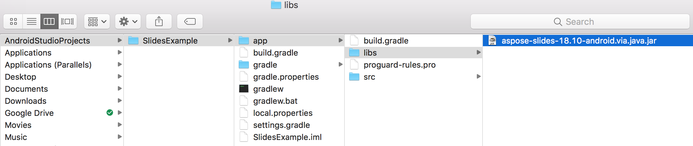

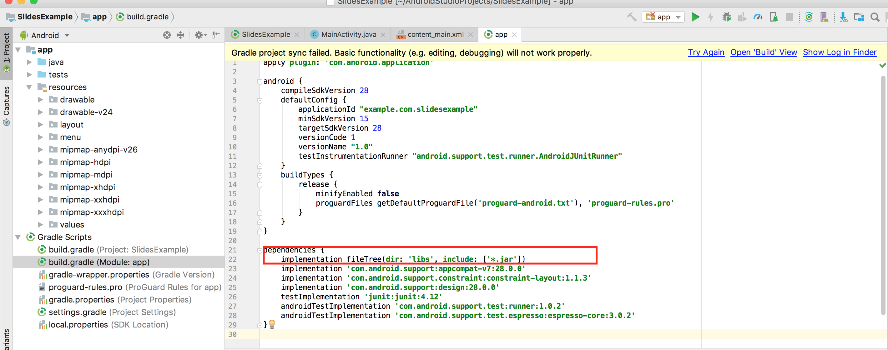
### **Install Aspose.Slides for Android via Java from Maven Repository**
1. Add maven repository into your build.gradle. 
1. Add '[Aspose.Slides for Android via Java](https://repository.aspose.com/webapp/#/artifacts/browse/tree/General/repo/com/aspose/aspose-slides/)' JAR as a dependency.

``` java

 // 1. Add maven repository into your build.gradle 

repositories {

    mavenCentral()

    maven { url "https://repository.aspose.com/repo/" }

}

// 2. Add 'Aspose.Slides for Android via Java' JAR as a dependency

dependencies {

    ...

    ...

    compile (group: 'com.aspose', name: 'aspose-slides', version: 'XX.XX', classifier: 'android.via.java')

}

```
## **Your First Application Using Aspose.Slides for Android via Java**
In this section, you will learn how to get started with Aspose.Slides for Android via Java. We intend to show you how to setup a new Android project from scratch, add a reference to the Aspose.Slides JAR, and create a new PowerPoint presentation which is saved to the disk in the PPTX format. The example here uses [Android Studio](https://developer.android.com/studio/index.html) for development and the application is run on the Android Emulator. To get started with Aspose.Slides for Android via Java, follow this step-by-step tutorial to create an app that uses Aspose.Slides for Android via Java:

1. Download and the [Android Studio](https://developer.android.com/studio/index.html) and install to any location.
1. Run the Android Studio.
1. Create a new Android Application Project.

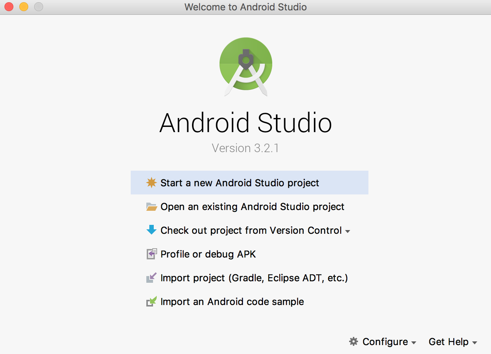

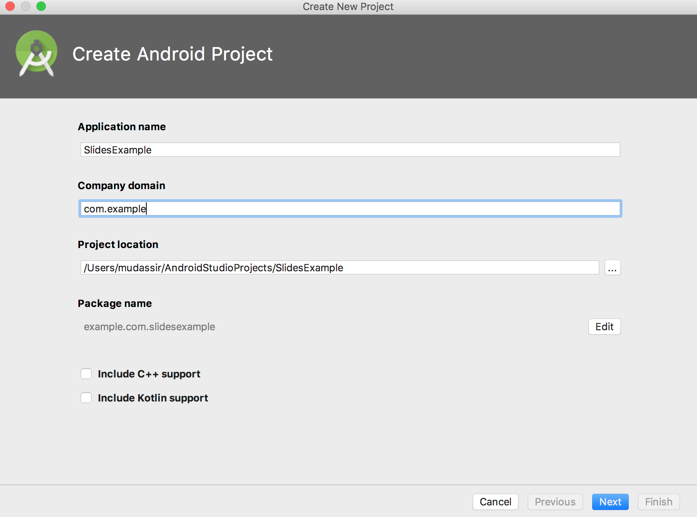

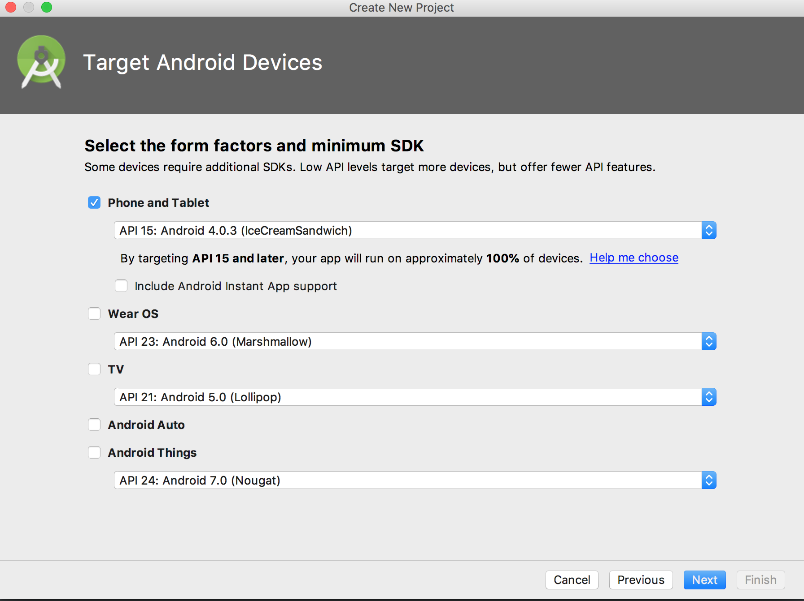

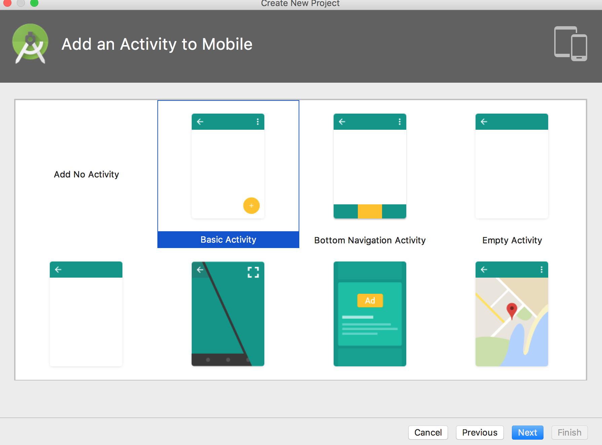

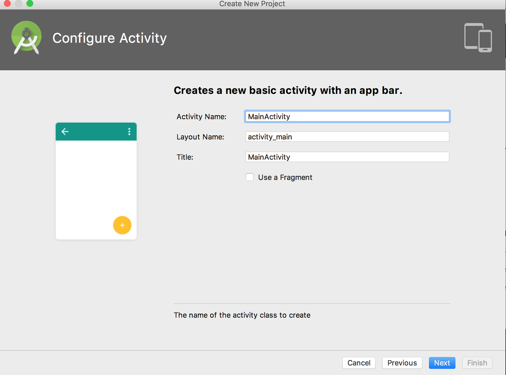


1. Copy aspose-slides-XX.XX-android.via.java.jar into your project’s libs/folder


1. Select Project Section (from the file menu) and click on the Dependencies tab.
   1. Click on "+" button. Select the file dependency option.
   1. Select Aspose.Slides library from libs folder and click on OK.

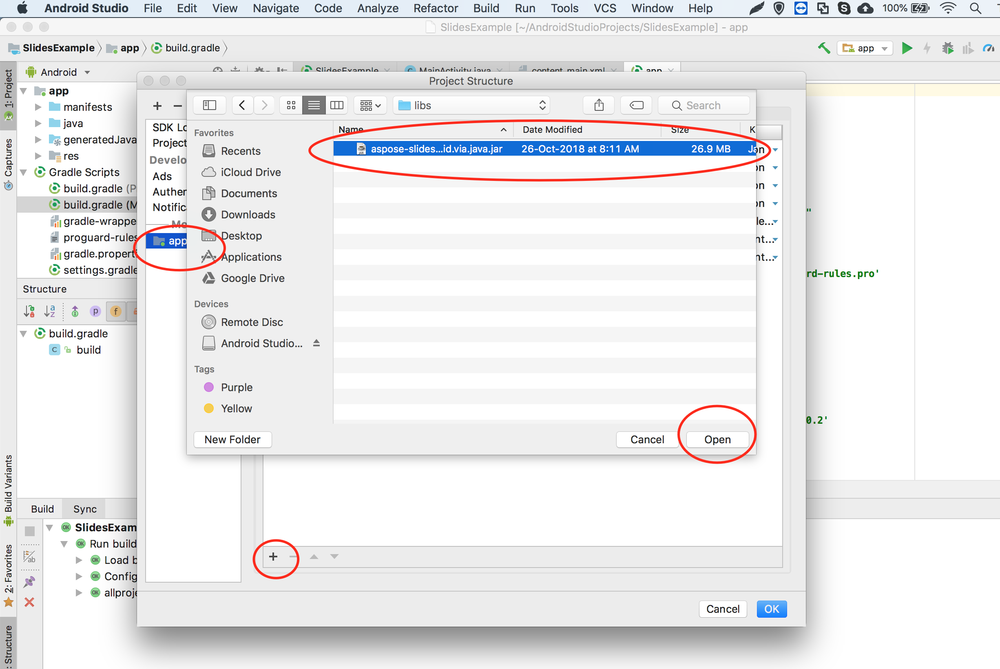


1. Sync the project with gradle files if necessary. 

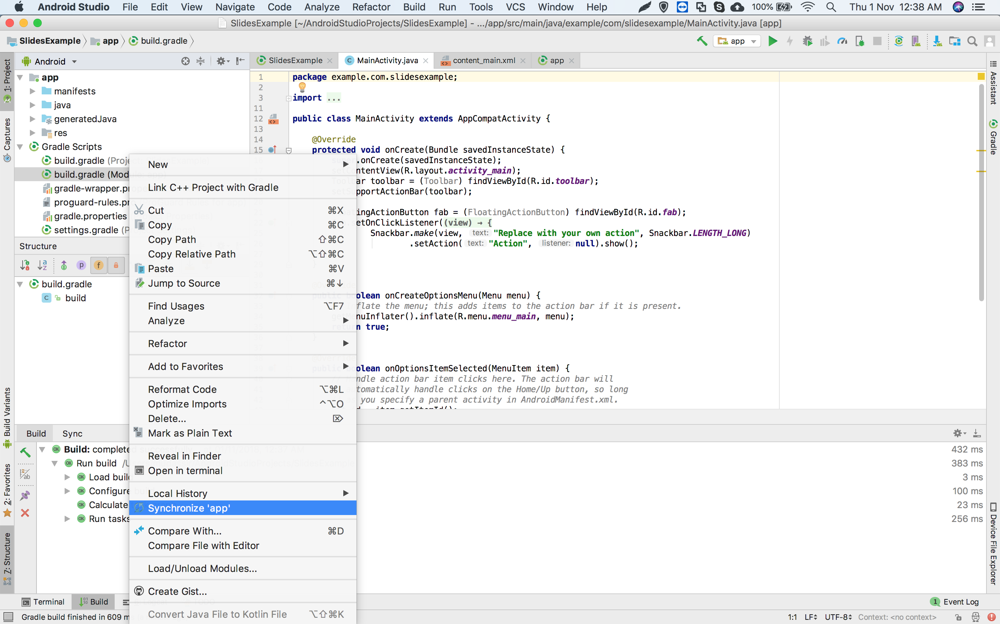


1. To access the SDcard, special permissions have to be added. Click on the AndroidManifest.xml file and choose XML view. Add this line to the file <uses-permission android:name="android.permission.WRITE_EXTERNAL_STORAGE" />


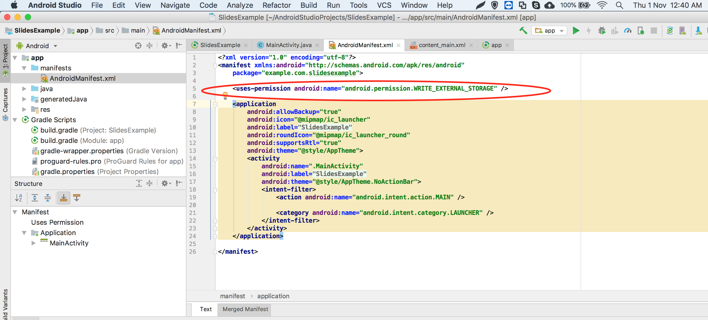


1. Navigate back to the code section of the app and add these imports: 

``` java

 import java.io.File;

import com.aspose.slides.IAutoShape;

import com.aspose.slides.IParagraph;

import com.aspose.slides.IPortion;

import com.aspose.slides.ISlide;

import com.aspose.slides.ITextFrame;

import com.aspose.slides.Presentation;

import com.aspose.slides.SaveFormat;

import com.aspose.slides.ShapeType;

import android.os.Environment; 

```

Now, insert this code in the body of the onCreate method to create a new Presentation from scratch using Aspose.Slides and save it to the SDCard in PPTX format.

``` java

 try

{

    // Instantiate Presentation class that represents PPTX

    Presentation pres = new Presentation();


    // Access first slide

    ISlide sld = pres.getSlides().get_Item(0);


    // Add an AutoShape of Rectangle type

    IAutoShape ashp = sld.getShapes().addAutoShape(ShapeType.Rectangle, 150, 75, 150, 50);


    // Add TextFrame to the Rectangle

    ashp.addTextFrame(" ");


    // Accessing the text frame

    ITextFrame txtFrame = ashp.getTextFrame();


    // Create the Paragraph object for text frame

    IParagraph para = txtFrame.getParagraphs().get_Item(0);


    // Create Portion object for paragraph

    IPortion portion = para.getPortions().get_Item(0);


    // Set Text

    portion.setText("Aspose TextBox");


    // Save the PPTX to card

    String sdCardPath = Environment.getExternalStorageDirectory().getPath() + File.separator;

    pres.save(sdCardPath + "Textbox.pptx",SaveFormat.Pptx);

}

catch (Exception e)

{

   e.printStackTrace();

}

```

The full code should look like this:

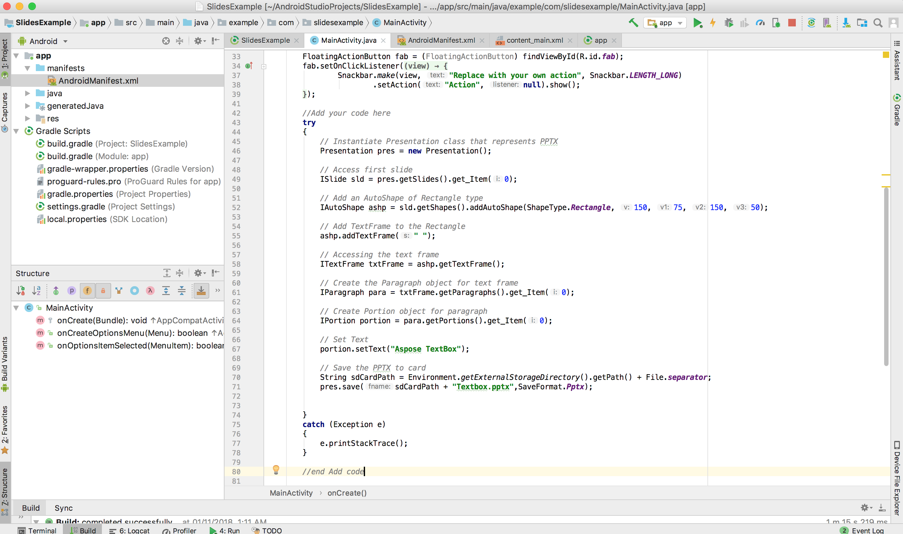


1. Now run the application again. This time, the Aspose.Slides code will run in the background and generate a document that is saved to the SDcard.

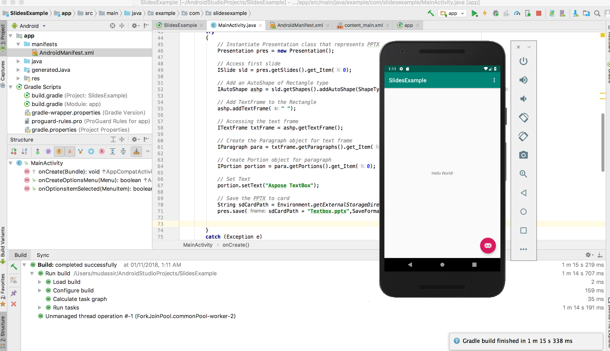

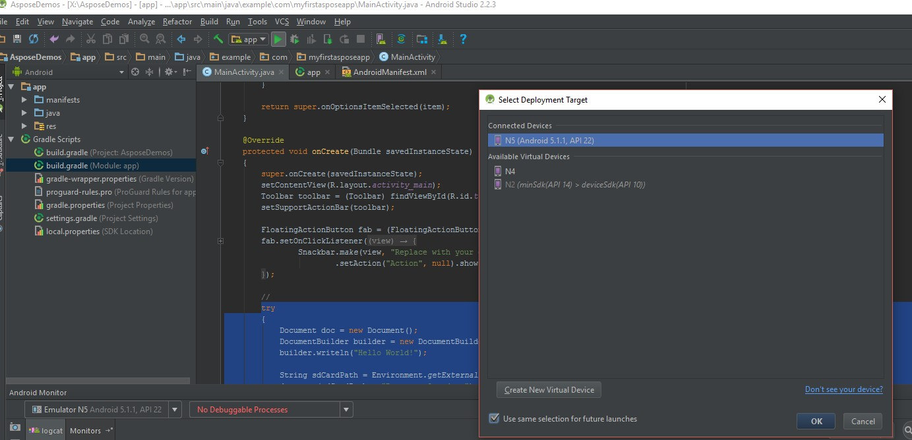

1. To view the created document, navigate to the Tools menu. Choose Android and then select Android Device Monitor


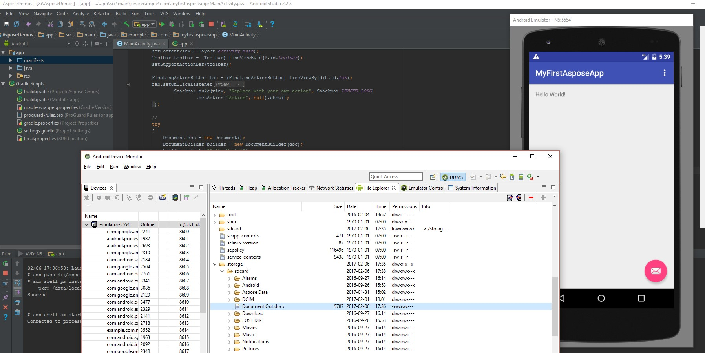
## **Versioning**
Since 2018, the versioning of Aspose.Slides for Android via Java complies with Aspose.Slides for Java. 

