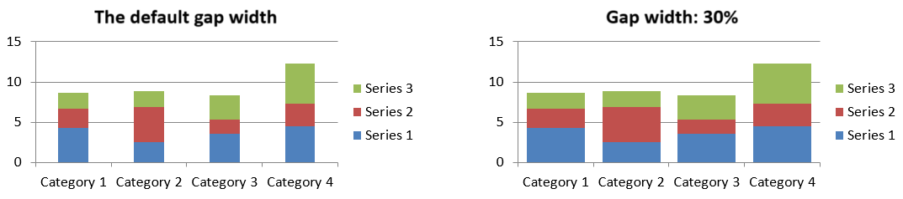

## **نظرة عامة**

يتم تخزين بيانات المخطط المرسومة في دفتر بيانات المخطط. يمثل [IChartSeries](https://reference.aspose.com/slides/androidjava/com.aspose.slides/ichartseries/) مجموعة واحدة من القيم المرتبطة، و كل [IChartDataPoint](https://reference.aspose.com/slides/androidjava/com.aspose.slides/ichartdatapoint/) في السلسلة يشير إلى خلية أو أكثر في دفتر العمل. توفر كائنات [IChartCategory](https://reference.aspose.com/slides/androidjava/com.aspose.slides/ichartcategory/) التسميات أو قيم التجميع المشتركة بين السلاسل. لذلك يتم ربط اسم السلسلة والفئات وقيم النقاط بـ [IChartDataCell](https://reference.aspose.com/slides/androidjava/com.aspose.slides/ichartdatacell/) بدلاً من تخزينها كنص عرض فقط.

بالنسبة إلى مخطط الفئات النمطي، يستخدم دفتر العمل الافتراضي الصف 0 لأسماء السلاسل، والعمود 0 لأسماء الفئات، وبقية الخلايا لقيم السلاسل. مؤشرات ورقة العمل والصف والعمود التي تُمرَّر إلى [IChartDataWorkbook.getCell](https://reference.aspose.com/slides/androidjava/com.aspose.slides/ichartdataworkbook/#getCell-int-int-int-) تبدأ من الصفر. هذا التنظيم مفيد عندما تنشئ مخططًا ببيانات افتراضية، ولكن لا تفترض أن كل مخطط موجود يستخدمه. بالنسبة إلى عرض تقديمي محمل، قم بفحص الخلايا المشار إليها من قبل السلاسل والفئات ونقاط البيانات قبل تعديل قيم دفتر العمل.

إعدادات المخطط لها ثلاث نطاقات مختلفة:

- إعدادات على مستوى السلسلة، مثل [IChartSeries.getFormat](https://reference.aspose.com/slides/androidjava/com.aspose.slides/ichartseries/#getFormat--)، توفر المظهر الافتراضي لجميع النقاط في سلسلة واحدة.
- إعدادات نقطة البيانات، مثل [IChartDataPoint.getFormat](https://reference.aspose.com/slides/androidjava/com.aspose.slides/ichartdatapoint/#getFormat--)، تتجاوز مظهر السلسلة لنقطة واحدة.
- إعدادات المجموعة تنطبق على السلاسل المتوافقة التي تنتمي إلى نفس [IChartSeriesGroup](https://reference.aspose.com/slides/androidjava/com.aspose.slides/ichartseriesgroup/). يمكن الوصول إلى المجموعة عبر [IChartSeries.getParentSeriesGroup](https://reference.aspose.com/slides/androidjava/com.aspose.slides/ichartseries/#getParentSeriesGroup--) عندما تحتاج إلى ضبط خيارات مثل التداخل أو عرض الفجوة.

عندما لا يتم تعيين تعبئة صريحة لنقطة أو سلسلة، يحدد نمط المخطط والموضوع المظهر التلقائي. عندما تكون كل من تنسيقات السلسلة والنقطة موجودة، تتفوق تنسيق النقطة لتلك النقطة.


## **ضبط تداخل سلسلة المخطط**

يُبلغ [IChartSeries.getOverlap](https://reference.aspose.com/slides/androidjava/com.aspose.slides/ichartseries/#getOverlap--) عن مقدار تداخل الأشرطة أو الأعمدة في مخطط ثنائي الأبعاد، من -100 إلى 100 بالمئة. وهو تمثيل للقراءة فقط للإعداد على مجموعة السلسلة الأصلية. استخدم [IChartSeriesGroup.setOverlap](https://reference.aspose.com/slides/androidjava/com.aspose.slides/ichartseriesgroup/#setOverlap-byte-) لتحديث كل السلاسل المتوافقة في تلك المجموعة. ينطبق هذا الخيار على أنواع المخططات التي تعرض أشرطة أو أعمدة مجمعة؛ ولا يؤثر على مجموعات السلاسل غير المتعلقة في مخطط مركب.

المثال التالي يحدد التداخل للمجموعة التي تحتوي على السلسلة الأولى:

```java
import com.aspose.slides.*;

final int firstSlideIndex = 0;
final int firstSeriesIndex = 0;
final byte overlapPercent = 30;

Presentation presentation = new Presentation();
try {
    ISlide slide = presentation.getSlides().get_Item(firstSlideIndex);

    // المخطط الجديد يحتوي على سلاسل وعينات وفئات وقيم.
    IChart chart = slide.getShapes().addChart(ChartType.ClusteredColumn, 20, 20, 500, 200);

    IChartSeries series = chart.getChartData().getSeries().get_Item(firstSeriesIndex);
    series.getParentSeriesGroup().setOverlap(overlapPercent);

    presentation.save("series_overlap.pptx", SaveFormat.Pptx);
} finally {
    presentation.dispose();
}
```

النتيجة:


## **تغيير لون تعبئة السلسلة**

استخدم [IChartSeries.getFormat](https://reference.aspose.com/slides/androidjava/com.aspose.slides/ichartseries/#getFormat--) لتعيين التعبئة الافتراضية لسلسلة كاملة. إذا كانت النقطة لديها بالفعل تعبئة صريحة، فإن إعداد [IChartDataPoint.getFormat](https://reference.aspose.com/slides/androidjava/com.aspose.slides/ichartdatapoint/#getFormat--) يتجاوز تعبئة السلسلة لتلك النقطة.

المثال التالي يطبق تعبئة صلبة زرقاء على السلسلة الأولى:

```java
import com.aspose.slides.*;
import android.graphics.Color;

final int firstSlideIndex = 0;
final int firstSeriesIndex = 0;

Presentation presentation = new Presentation();
try {
    ISlide slide = presentation.getSlides().get_Item(firstSlideIndex);

    IChart chart = slide.getShapes().addChart(ChartType.ClusteredColumn, 20, 20, 500, 200);

    IChartSeries series = chart.getChartData().getSeries().get_Item(firstSeriesIndex);
    series.getFormat().getFill().setFillType(FillType.Solid);
    series.getFormat().getFill().getSolidFillColor().setColor(Color.BLUE);

    presentation.save("series_color.pptx", SaveFormat.Pptx);
} finally {
    presentation.dispose();
}
```

النتيجة:


## **تغيير اسم السلسلة**

يتم تخزين اسم السلسلة في دفتر بيانات المخطط وعادةً ما يُعرض في وسيلة الإيضاح. في دفتر العمل الافتراضي المُنشأ لمخطط عمودي مجمّع، الخلية B1 تقع في الصف 0، العمود 1 وتحتوي على اسم السلسلة الأولى. الثوابت المسماة في المثال التالي تجعل هذا الهيكل واضحًا:

```java
import com.aspose.slides.*;

final int firstSlideIndex = 0;
final int worksheetIndex = 0;
final int seriesNameRowIndex = 0;
final int firstSeriesColumnIndex = 1;

Presentation presentation = new Presentation();
try {
    ISlide slide = presentation.getSlides().get_Item(firstSlideIndex);

    IChart chart = slide.getShapes().addChart(ChartType.ClusteredColumn, 20, 20, 500, 200);

    IChartDataWorkbook workbook = chart.getChartData().getChartDataWorkbook();
    IChartDataCell seriesNameCell = workbook.getCell(worksheetIndex, seriesNameRowIndex, firstSeriesColumnIndex);
    seriesNameCell.setValue("Revenue");

    presentation.save("series_name.pptx", SaveFormat.Pptx);
} finally {
    presentation.dispose();
}
```

يمكنك أيضًا تحديث الخلية المشار إليها بالفعل عبر [IChartSeries.getName](https://reference.aspose.com/slides/androidjava/com.aspose.slides/ichartseries/#getName--). هذا النهج يتجنب الافتراض بوجود صف وعمود معينين في مخطط موجود:

```java
import com.aspose.slides.*;

final int firstSlideIndex = 0;
final int firstSeriesIndex = 0;
final int firstNameCellIndex = 0;

Presentation presentation = new Presentation();
try {
    ISlide slide = presentation.getSlides().get_Item(firstSlideIndex);

    IChart chart = slide.getShapes().addChart(ChartType.ClusteredColumn, 20, 20, 500, 200);

    IChartSeries series = chart.getChartData().getSeries().get_Item(firstSeriesIndex);
    IChartDataCell seriesNameCell = series.getName().getAsCells().get_Item(firstNameCellIndex);
    seriesNameCell.setValue("Revenue");

    presentation.save("series_name.pptx", SaveFormat.Pptx);
} finally {
    presentation.dispose();
}
```

النتيجة:


### **إنشاء سلسلة باسم من خلايا متعددة**

اسم سلسلة مركبة مفيد عندما يتم تخزين اسم المنتج وفترة التقرير في خلايا دفتر عمل منفصلة. على سبيل المثال، يمكنك دمج `Product A` في B1 و `2026` في C1 في اسم سلسلة واحد مع الحفاظ على ربط كلا الجزأين بخلايا المصدر الخاصة بهما.

استخدم [IChartDataWorkbook.getCellCollection](https://reference.aspose.com/slides/androidjava/com.aspose.slides/ichartdataworkbook/#getCellCollection-java.lang.String-boolean-) لاسترداد نطاق الاسم، ثم مرّر هذا التجميع إلى [IChartSeriesCollection.add](https://reference.aspose.com/slides/androidjava/com.aspose.slides/ichartseriescollection/#add-com.aspose.slides.IChartCellCollection-int-). يتحكم معامل `skipHiddenCells` فيما إذا كانت الخلايا المخفية تُضمّن: `true` يستثنيها، بينما `false` يضمّنها. يستخدم هذا المثال `false` لتضمين كل خلية في نطاق الاسم.

المثال التالي يُنشئ عرضًا تقديميًا بسلسلة واحدة ونقطتي بيانات. الخلايا B1:C1 توفر فقط اسم السلسلة؛ A2:A3 توفر تسميات الفئات، و B2:B3 توفر القيم الرقمية.

```java
import com.aspose.slides.*;

Presentation presentation = new Presentation();
try {
    ISlide slide = presentation.getSlides().get_Item(0);

    IChart chart = slide.getShapes().addChart(ChartType.ClusteredColumn, 50, 50, 620, 180);

    chart.getChartData().getSeries().clear();
    chart.getChartData().getCategories().clear();
    chart.setLegend(true);

    IChartDataWorkbook workbook = chart.getChartData().getChartDataWorkbook();
    workbook.clear(0);

    // هاتان الخليتان تزودان اسم السلسلة.
    workbook.getCell(0, 0, 1, "Product A");
    workbook.getCell(0, 0, 2, "2026");
    IChartCellCollection nameCells = workbook.getCellCollection("Sheet1!$B$1:$C$1", false);
    IChartSeries series = chart.getChartData().getSeries().add(nameCells, ChartType.ClusteredColumn);

    // خلايا منفصلة تزود الفئات ونقاط البيانات الرقمية.
    IChartDataCell northCategory = workbook.getCell(0, 1, 0, "North");
    IChartDataCell southCategory = workbook.getCell(0, 2, 0, "South");
    chart.getChartData().getCategories().add(northCategory);
    chart.getChartData().getCategories().add(southCategory);
    IChartDataCell northValue = workbook.getCell(0, 1, 1, 120);
    IChartDataCell southValue = workbook.getCell(0, 2, 1, 150);
    series.getDataPoints().addDataPointForBarSeries(northValue);
    series.getDataPoints().addDataPointForBarSeries(southValue);

    presentation.save("composite_series_name.pptx", SaveFormat.Pptx);
} finally {
    presentation.dispose();
}
```

اسم السلسلة الناتج هو `Product A 2026`، مع مساحة بين قيمتي الخليتين. تُظهر وسيلة الإيضاح ذلك كإدخال واحد لكل العمودين. الصورة أدناه توضح النتيجة:


## **الحصول على لون تعبئة السلسلة التلقائي**

[IChartSeries.getAutomaticSeriesColor](https://reference.aspose.com/slides/androidjava/com.aspose.slides/ichartseries/#getAutomaticSeriesColor--) يُعيد اللون المحسوب من فهرس السلسلة ونمط المخطط كعدد صحيح للون ARGB على Android. هذا هو اللون المستخدم عندما لا يتم تعريف تعبئة السلسلة صراحةً. استدعاء الطريقة يقرأ اللون المُحسب؛ ولا يعيّن تعبئة جديدة.

المثال التالي يطبع عدد اللون التلقائي لكل سلسلة افتراضية:

```java
import com.aspose.slides.*;

final int firstSlideIndex = 0;

Presentation presentation = new Presentation();
try {
    ISlide slide = presentation.getSlides().get_Item(firstSlideIndex);

    IChart chart = slide.getShapes().addChart(ChartType.ClusteredColumn, 20, 20, 500, 200);

    int seriesCount = chart.getChartData().getSeries().size();
    for (int seriesIndex = 0; seriesIndex < seriesCount; seriesIndex++) {
        IChartSeries series = chart.getChartData().getSeries().get_Item(seriesIndex);
        int automaticColor = series.getAutomaticSeriesColor();
        System.out.println("Series " + seriesIndex + ": " + automaticColor);
    }
} finally {
    presentation.dispose();
}
```

القيم الصحيحة الدقيقة تعتمد على نمط المخطط والموضوع.

## **ضبط عكس لون التعبئة لسلسلة المخطط**

للإطارات، الأعمدة، وسلاسل الفقاعات، يمكن لـ [IChartSeries.setInvertIfNegative](https://reference.aspose.com/slides/androidjava/com.aspose.slides/ichartseries/#setInvertIfNegative-boolean-) عرض القيم السالبة بتعبئة مختلفة. قم بتعيين تعبئة السلسلة العادية إلى صلبة، فعّل العكس، وعيّن لون القيمة السالبة عبر [IChartSeries.getInvertedSolidFillColor](https://reference.aspose.com/slides/androidjava/com.aspose.slides/ichartseries/#getInvertedSolidFillColor--). تبقى الأرقام السالبة دون تغيير في دفتر العمل؛ فقط يتغير لون العرض.

المثال التالي يستبدل بيانات المخطط الافتراضية بسلسلة واحدة. الصف 0 في ورقة العمل يحتوي على اسم السلسلة، العمود 0 يحتوي على أسماء الفئات، والعمود 1 يحتوي على القيم:

```java
import com.aspose.slides.*;
import android.graphics.Color;

final int firstSlideIndex = 0;
final int worksheetIndex = 0;
final int headerRowIndex = 0;
final int categoryColumnIndex = 0;
final int firstSeriesColumnIndex = 1;
final int firstDataRowIndex = 1;

String[] categoryNames = { "Category 1", "Category 2", "Category 3" };
int[] seriesValues = { -20, 50, -30 };

Presentation presentation = new Presentation();
try {
    ISlide slide = presentation.getSlides().get_Item(firstSlideIndex);

    IChart chart = slide.getShapes().addChart(ChartType.ClusteredColumn, 20, 20, 500, 200);
    IChartData chartData = chart.getChartData();
    IChartDataWorkbook workbook = chartData.getChartDataWorkbook();

    chartData.getSeries().clear();
    chartData.getCategories().clear();

    IChartDataCell seriesNameCell = workbook.getCell(worksheetIndex, headerRowIndex, firstSeriesColumnIndex, "Series 1");
    int chartType = chart.getType();
    IChartSeries series = chartData.getSeries().add(seriesNameCell, chartType);

    for (int categoryIndex = 0; categoryIndex < categoryNames.length; categoryIndex++) {
        int dataRowIndex = firstDataRowIndex + categoryIndex;
        String categoryName = categoryNames[categoryIndex];
        int seriesValue = seriesValues[categoryIndex];

        IChartDataCell categoryCell = workbook.getCell(worksheetIndex, dataRowIndex, categoryColumnIndex, categoryName);
        chartData.getCategories().add(categoryCell);

        IChartDataCell valueCell = workbook.getCell(worksheetIndex, dataRowIndex, firstSeriesColumnIndex, seriesValue);
        series.getDataPoints().addDataPointForBarSeries(valueCell);
    }

    int automaticSeriesColor = series.getAutomaticSeriesColor();
    series.getFormat().getFill().setFillType(FillType.Solid);
    series.getFormat().getFill().getSolidFillColor().setColor(automaticSeriesColor);
    series.setInvertIfNegative(true);
    series.getInvertedSolidFillColor().setColor(Color.RED);

    presentation.save("inverted_solid_fill_color.pptx", SaveFormat.Pptx);
} finally {
    presentation.dispose();
}
```

النتيجة:


يمكنك تمكين العكس لنقطة واحدة عبر [IChartDataPoint.setInvertIfNegative](https://reference.aspose.com/slides/androidjava/com.aspose.slides/ichartdatapoint/#setInvertIfNegative-boolean-). في المثال التالي، يتم إبطال العكس للسلسلة وتفعيلها فقط للنقطة المحددة. تُعطى النقطة أيضًا قيمة سالبة لتظهر التأثير:

```java
import com.aspose.slides.*;
import android.graphics.Color;

final int firstSlideIndex = 0;
final int firstSeriesIndex = 0;
final int targetDataPointIndex = 2;
final int negativeValue = -30;

Presentation presentation = new Presentation();
try {
    ISlide slide = presentation.getSlides().get_Item(firstSlideIndex);

    IChart chart = slide.getShapes().addChart(ChartType.ClusteredColumn, 20, 20, 500, 200);

    IChartSeries series = chart.getChartData().getSeries().get_Item(firstSeriesIndex);
    int automaticSeriesColor = series.getAutomaticSeriesColor();
    series.getFormat().getFill().setFillType(FillType.Solid);
    series.getFormat().getFill().getSolidFillColor().setColor(automaticSeriesColor);
    series.getInvertedSolidFillColor().setColor(Color.RED);
    series.setInvertIfNegative(false);

    IChartDataPoint dataPoint = series.getDataPoints().get_Item(targetDataPointIndex);
    dataPoint.getValue().getAsCell().setValue(negativeValue);
    dataPoint.setInvertIfNegative(true);

    presentation.save("data_point_invert_color_if_negative.pptx", SaveFormat.Pptx);
} finally {
    presentation.dispose();
}
```

## **مسح قيمة نقطة بيانات محددة**

لجعل نقطة واحدة فارغة دون إزالة النقاط الأخرى، اضبط خلية دفتر العمل الداعمة لها إلى `null`. بالنسبة لمخطط عمودي، تكون القيمة المرسومة متاحة عبر [IChartDataPoint.getValue](https://reference.aspose.com/slides/androidjava/com.aspose.slides/ichartdatapoint/#getValue--). تبقى نقطة البيانات في نفس موضع الفئة، لكن المخطط يتعامل مع قيمتها كفارغة وفقًا لإعدادات قيمة الخلايا الفارغة للمخطط.

المثال التالي يمسح النقطة الثانية فقط في السلسلة الأولى:

```java
import com.aspose.slides.*;

final int firstSlideIndex = 0;
final int firstSeriesIndex = 0;
final int targetDataPointIndex = 1;

Presentation presentation = new Presentation();
try {
    ISlide slide = presentation.getSlides().get_Item(firstSlideIndex);

    IChart chart = slide.getShapes().addChart(ChartType.ClusteredColumn, 20, 20, 500, 200);

    IChartSeries series = chart.getChartData().getSeries().get_Item(firstSeriesIndex);
    IChartDataPoint dataPoint = series.getDataPoints().get_Item(targetDataPointIndex);
    dataPoint.getValue().getAsCell().setValue(null);

    presentation.save("clear_data_point_value.pptx", SaveFormat.Pptx);
} finally {
    presentation.dispose();
}
```

تستخدم مخططات scatter خلايا X و Y منفصلة، وتستخدم مخططات الفقاعات أيضًا خلية الحجم. امسح فقط الخلية التي تمثل القيمة التي تريد إزالتها. لا تستدعِ [IChartDataPointCollection.clear](https://reference.aspose.com/slides/androidjava/com.aspose.slides/ichartdatapointcollection/#clear--) عندما تريد الاحتفاظ بالنقاط الأخرى، لأن هذه الطريقة تزيل كل نقطة بيانات من التجميع.

## **التحكم في عرض الخلايا الفارغة**

الخلايا المخفية التي تحتوي على قيم هي حالة منفصلة عن الخلايا الفارغة. لتضمين أو استبعاد البيانات من الصفوف والأعمدة المخفية في ورقة العمل، راجع [Include Data from Hidden Rows and Columns](/slides/ar/androidjava/chart-workbook/#include-data-from-hidden-rows-and-columns).

الخلية الفارغة في دفتر العمل تمثل بيانات مفقودة؛ الخلية التي تحتوي على `0` تمثل قيمة عددية معروفة. استدعِ [IChartDataCell.setValue](https://reference.aspose.com/slides/androidjava/com.aspose.slides/ichartdatacell/#setValue-java.lang.Object-) مع `null` لجعل الخلية فارغة. الصفر الرقمي يبقى صفرًا بغض النظر عن إعداد الخلية الفارغة.

استخدم [IChart.setDisplayBlanksAs](https://reference.aspose.com/slides/androidjava/com.aspose.slides/ichart/#setDisplayBlanksAs-int-) لاختيار كيفية عرض المخطط للخلايا الفارغة. ينطبق هذا الإعداد على المخطط بأكمله. يغير طريقة رسم الفواصل الفارغة، دون ملء خلية دفتر العمل الفارغة بالصفر أو قيمة مُستنتجة.

المثال التالي المستقل يُنشئ مخططًا خطيًا بسلسلة واحدة، يمسح القيمة لليوم 3، ويحفظ المخطط نفسه بكل وضع. لا يلزم ملف إدخال. يستخدم [IChartDataWorkbook](https://reference.aspose.com/slides/androidjava/com.aspose.slides/ichartdataworkbook/) ورقة عمل 0، العمود 0 لتسميات الفئات، والعمود 1 للقيم؛ الصف 0 يحتوي على اسم السلسلة. البيانات النهائية هي `10, 20, empty, 30, 40`.

```java
import com.aspose.slides.*;

Presentation presentation = new Presentation();
try {
    ISlide slide = presentation.getSlides().get_Item(0);

    IChart chart = slide.getShapes().addChart(ChartType.LineWithMarkers, 40, 40, 640, 400);
    IChartData chartData = chart.getChartData();
    IChartDataWorkbook workbook = chartData.getChartDataWorkbook();

    chartData.getSeries().clear();
    chartData.getCategories().clear();

    IChartDataCell seriesNameCell = workbook.getCell(0, 0, 1, "Measurements");
    IChartSeries series = chartData.getSeries().add(seriesNameCell, chart.getType());
    int[] values = { 10, 20, 25, 30, 40 };

    for (int i = 0; i < values.length; i++) {
        IChartDataCell categoryCell = workbook.getCell(0, i + 1, 0, "Day " + (i + 1));
        chartData.getCategories().add(categoryCell);
        IChartDataCell valueCell = workbook.getCell(0, i + 1, 1, values[i]);
        series.getDataPoints().addDataPointForLineSeries(valueCell);
    }

    // اجعل اليوم 3 فارغًا تمامًا مع الاحتفاظ بفئته ونقطة البيانات الخاصة به.
    workbook.getCell(0, 3, 1).setValue(null);

    int[] modes = { DisplayBlanksAsType.Gap, DisplayBlanksAsType.Zero, DisplayBlanksAsType.Span };
    String[] modeNames = { "Gap", "Zero", "Span" };
    for (int i = 0; i < modes.length; i++) {
        chart.setDisplayBlanksAs(modes[i]);
        presentation.save("empty_cells_" + modeNames[i] + ".pptx", SaveFormat.Pptx);
    }
} finally {
    presentation.dispose();
}
```

كل ملف إخراج يخزن الوضع المحدد قبل الحفظ: `empty_cells_Gap.pptx`، `empty_cells_Zero.pptx`، و `empty_cells_Span.pptx`. لحفظ نسخة واحدة فقط، عيّن الوضع المطلوب واحفظ العرض مرة واحدة بدلاً من التكرار على الأوضاع.

المقارنة أدناه تُظهر نفس البيانات في جميع الملفات الثلاثة. اليوم 3 فارغ في دفتر العمل في كل حالة:


التأثير المرئي يعتمد على نوع المخطط. يجعل مخطط الخط الثلاثة أوضاع سهلة للمقارنة. المخططات الشريطية والعمودية لا تحتوي على خط للربط عبر فئة مفقودة، لذا لا يمكن لـ `Span` إنشاء الجزء المتصل المعروض أعلاه؛ كذلك قد يبدو العمود المفقود والعمود صفر الارتفاع متشابهين. بالمثل، مخطط scatter مع العلامات فقط لا يحتوي على خط ربط. لا تتوقع ثلاث نتائج متميزة لكل نوع مخطط؛ تحقق من الناتج للنوع الذي تستخدمه.

## **ضبط عرض فجوة السلسلة**

عرض الفجوة هو المسافة بين مجموعات الأشرطة أو الأعمدة المتجاورة، يُعبر عنه كنسبة مئوية من عرض الشريط أو العمود. مثل التداخل، ينتمي إلى مجموعة السلسلة الأصلية وليس إلى سلسلة واحدة. استدعِ [IChartSeriesGroup.setGapWidth](https://reference.aspose.com/slides/androidjava/com.aspose.slides/ichartseriesgroup/#setGapWidth-int-) مرة واحدة للمجموعة. قيمة أكبر تُنشئ مساحة أكبر بين المجموعات؛ قيمة أصغر تجعلها أكثر كثافة.

المثال التالي يغيّر عرض الفجوة ويحفظ العرض النهائي فقط:

```java
import com.aspose.slides.*;

final int firstSlideIndex = 0;
final int firstSeriesIndex = 0;
final int gapWidthPercent = 30;

Presentation presentation = new Presentation();
try {
    ISlide slide = presentation.getSlides().get_Item(firstSlideIndex);

    IChart chart = slide.getShapes().addChart(ChartType.StackedColumn, 20, 20, 500, 200);

    IChartSeries series = chart.getChartData().getSeries().get_Item(firstSeriesIndex);
    series.getParentSeriesGroup().setGapWidth(gapWidthPercent);

    presentation.save("gap_width_30.pptx", SaveFormat.Pptx);
} finally {
    presentation.dispose();
}
```

النتيجة:



## **الأسئلة المتكررة**

**ما هي أنواع المخططات التي تدعم سلاسل البيانات؟**

جميع أنواع المخططات التي يمثلها تعداد [ChartType](https://reference.aspose.com/slides/androidjava/com.aspose.slides/charttype/) تستخدم بيانات المخطط، لكن سلاسلها لا تشترك جميعًا في نفس بنية القيم أو الإعدادات. على سبيل المثال، تستخدم مخططات الفئات الفئات والقيم، ومخططات scatter تستخدم قيم X و Y، ومخططات الفقاعات تضيف أحجام الفقاعات. استخدم طريقة إنشاء نقاط البيانات التي تتطابق مع نوع السلسلة. الخيارات مثل التداخل وعرض الفجوة تنطبق فقط على مجموعات الأشرطة أو الأعمدة المتوافقة.

**ما هو مجموعة سلاسل المخطط؟**

مجموعة [IChartSeriesGroup](https://reference.aspose.com/slides/androidjava/com.aspose.slides/ichartseriesgroup/) تحتوي على سلاسل متوافقة تشترك في إعدادات الرسم على مستوى المجموعة. يمكن لمخطط مركب أن يحتوي على أكثر من مجموعة، لذا تعديل المجموعة التي يتم الوصول إليها عبر سلسلة معينة لا يغيّر بالضرورة كل السلاسل في المخطط.

**هل يحتوي المخطط المُنشأ حديثًا على بيانات افتراضية؟**

نعم. افتراضيًا، يقوم [IShapeCollection.addChart](https://reference.aspose.com/slides/androidjava/com.aspose.slides/ishapecollection/#addChart-int-float-float-float-float-) بإنشاء سلاسل وعينات وفئات وقيم. يمكنك تحرير تلك الخلايا أو مسح كل من مجموعات السلاسل والفئات قبل إضافة مجموعة بيانات مخصصة بالكامل. يمكن أيضًا أن يُنشئ نسخة مفرطة مخططًا بدون بيانات افتراضية.

**كيف يتم ربط كائنات المخطط بخلايا دفتر العمل؟**

أسماء السلسلة، تسميات الفئات، وقيم نقاط البيانات تشير إلى خلايا في [IChartDataWorkbook](https://reference.aspose.com/slides/androidjava/com.aspose.slides/ichartdataworkbook/). تعديل خلية مُشار إليها يحدث تحديثاً للعنصر المقابل في المخطط. عند بناء بيانات مخصصة، حافظ على محاذاة صفوف الفئات وصفوف قيم السلسلة بحيث يتم رسم كل نقطة تحت الفئة المقصودة.

**كيف أقوم بمسح نقطة واحدة بدلًا من السلسلة بالكامل؟**

اضبط خلية القيمة المعنية إلى `null` للاحتفاظ بموقع الفئة للنقطة كنقطة فارغة. استخدم [IChartDataPointCollection.clear](https://reference.aspose.com/slides/androidjava/com.aspose.slides/ichartdatapointcollection/#clear--) فقط عندما ترغب في إزالة جميع النقاط من تلك السلسلة. إذا قمت أيضًا بإزالة الفئات، فعلّج كل سلسلة بحيث تظل قيمها محاذية مع مجموعة الفئات.

**كيف يتم عرض النقاط الفارغة؟**

النتيجة تعتمد على نوع المخطط والقيمة المُكوَّنة عبر [IChart.setDisplayBlanksAs](https://reference.aspose.com/slides/androidjava/com.aspose.slides/ichart/#setDisplayBlanksAs-int-). يمكن للمخططات المدعومة عرض الفواصل كفجوات، أو كقيم صفرية، أو بربط النقاط المتجاورة. اختر الإعداد الذي يتطابق مع معنى البيانات المفقودة في عرضك. راجع [التحكم في عرض الخلايا الفارغة](#control-the-display-of-empty-cells) للحصول على مثال كامل ومقارنة بصرية.

**كيف يتم تنسيق القيم السالبة؟**

للشريط، العمود، وسلاسل الفقاعات المدعومة، استدعِ [IChartSeries.setInvertIfNegative](https://reference.aspose.com/slides/androidjava/com.aspose.slides/ichartseries/#setInvertIfNegative-boolean-) وعيّن اللون المرجع من [IChartSeries.getInvertedSolidFillColor](https://reference.aspose.com/slides/androidjava/com.aspose.slides/ichartseries/#getInvertedSolidFillColor--). يمكنك تجاوز السلوك لنقطة منفردة باستخدام [IChartDataPoint.setInvertIfNegative](https://reference.aspose.com/slides/androidjava/com.aspose.slides/ichartdatapoint/#setInvertIfNegative-boolean-). هذه الطرق تؤثر على التنسيق، وليس على القيم الرقمية المخزنة.

**أي تنسيق ينتصر عندما يتم تنسيق كل من السلسلة والنقطة؟**

يتفوق تنسيق نقطة البيانات الصريح لتلك النقطة. تستمر النقاط الأخرى في استخدام تنسيق السلسلة الصريح أو، إذا لم يُحدد تنسيق السلسلة، النمط والموضوع التلقائي للمخطط. إعدادات المجموعة مثل التداخل وعرض الفجوة تتحكم في التخطيط ولا تعتبر تجاوزات لتنسيق مستوى النقطة.

**هل هناك حد لعدد السلاسل التي يمكن أن يحتويها المخطط؟**

لا يفرض Aspose.Slides حدًا ثابتًا منفصلًا لعدد السلاسل. في الممارسة العملية، تحدد قيود ملف العرض، الذاكرة المتاحة، وقت التجسيد، وقابلية قراءة المخطط حدًا عمليًا.

**ماذا يجب أن أغير عندما تكون الأعمدة قريبة جدًا أو متباعدة جدًا؟**

استدعِ [IChartSeriesGroup.setGapWidth](https://reference.aspose.com/slides/androidjava/com.aspose.slides/ichartseriesgroup/#setGapWidth-int-) على مجموعة السلسلة الأصلية المناسبة. قم بزيادة القيمة لتوسيع المسافة بين المجموعات، أو قم بخفضها لجعل المجموعات أقرب إلى بعضها.