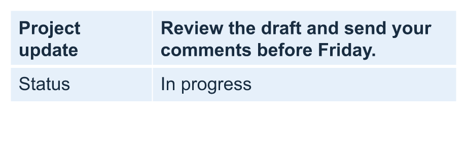

## **مقدمة**

Aspose.Slides for Node.js via Java يتيح لك إدارة بنية الجدول وتنسيقه في عروض PowerPoint من خلال الفئة [الجدول](https://reference.aspose.com/slides/nodejs-java/aspose.slides/table/). يمكنك تحديد صف عنوان، استنساخ أو إزالة الصفوف والأعمدة، وتطبيق تنسيق النص على صف أو عمود كامل.

تشرح هذه المقالة هذه العمليات مع أمثلة JavaScript. كما يوضح كيفية استرداد نمط الجدول المسبق لتتمكن من إعادة استخدامه. مؤشرات الصفوف والأعمدة في الجدول تبدأ من الصفر.

## **التحكم في ارتفاع الصف**

استخدم [Row.setMinimalHeight](https://reference.aspose.com/slides/nodejs-java/aspose.slides/row/#setMinimalHeight-double-) لتعيين الحد الأدنى لارتفاع الصف بالنقاط. إنه حد أدنى، ليس ارتفاعًا ثابتًا. [Row.getHeight](https://reference.aspose.com/slides/nodejs-java/aspose.slides/row/#getHeight--) يعيد الارتفاع الفعلي. يمكنك الوصول إلى الصف عبر [Table.getRows](https://reference.aspose.com/slides/nodejs-java/aspose.slides/table/#getRows--).

يقوم المثال بتحميل [row-height-input.pptx](row-height-input.pptx)، الذي يحتوي على جدول كأول شكل في الشريحة الأولى. يبدأ صفه الأول عند 70 نقطة. الخلايا تستخدم نص Arial بحجم 18 نقطة، مع التفاف، وهوامش علوية وسفلية 6 نقاط؛ النص الطويل في العمود الثاني يلتف إلى عدة أسطر. يزيد المثال الحد الأدنى إلى 100 نقطة، ثم يقلّصه إلى 20 نقطة، ويطبع الارتفاع الفعلي بعد كل تعديل، ويحفظ النتيجتين.

```javascript
const slides = require("aspose.slides.via.java");

const presentation = new slides.Presentation("row-height-input.pptx");
try {
    const slide = presentation.getSlides().get_Item(0);

    const table = slide.getShapes().get_Item(0);
    const row = table.getRows().get_Item(0);

    row.setMinimalHeight(100);
    console.log("Increased: minimum = " + row.getMinimalHeight().toFixed(1) + ", actual = " + row.getHeight().toFixed(1) + " pt");
    presentation.save("row-height-increased.pptx", slides.SaveFormat.Pptx);

    row.setMinimalHeight(20);
    console.log("Decreased: minimum = " + row.getMinimalHeight().toFixed(1) + ", actual = " + row.getHeight().toFixed(1) + " pt");
    presentation.save("row-height-decreased.pptx", slides.SaveFormat.Pptx);
} finally {
    presentation.dispose();
}
```

مع العرض المرفق، إضافة الحد الأدنى تزيد المسافة إلى الصف. تقليله يزيل تلك المسافة الإضافية، لكن الارتفاع الفعلي يظل أكبر من 20 نقطة لأن النص وهوامش الخلايا تحتاج إلى مساحة أكبر. لا يمكن لتقليل الحد الأدنى وحده ضغط الصف إلى أقل من المساحة المطلوبة لمحتوياته.

عدة عوامل تؤثر على الارتفاع الفعلي:

- **النص وحجم الخط:** النص الطويل، فواصل الأسطر الصريحة، أو حجم الخط الأكبر قد يتطلب مساحة رأسية أكبر.
- **الالتفاف وعرض العمود:** مع تمكين الالتفاف، تقليل عرض العمود عبر [Column.setWidth](https://reference.aspose.com/slides/nodejs-java/aspose.slides/column/#setWidth-double-) يمكن أن ينتج أسطرًا أكثر. العمود الأوسع قد يقلل المساحة المطلوبة رأسياً.
- **هوامش الخلية:** [Cell.setMarginTop](https://reference.aspose.com/slides/nodejs-java/aspose.slides/cell/#setMarginTop-double-) و[Cell.setMarginBottom](https://reference.aspose.com/slides/nodejs-java/aspose.slides/cell/#setMarginBottom-double-) تضيف مساحة رأسية. [Cell.setMarginLeft](https://reference.aspose.com/slides/nodejs-java/aspose.slides/cell/#setMarginLeft-double-) و[Cell.setMarginRight](https://reference.aspose.com/slides/nodejs-java/aspose.slides/cell/#setMarginRight-double-) تقلل العرض المتاح للنص ويمكن أن تسبب التفافًا إضافيًا.

في هذا الجدول بدون خلايا مدمجة، الخلية التي تحتاج إلى أكبر مساحة رأسية تحدد الحد الأدنى للمحتوى للصف بأكمله. لجعل الصف أقصر، قد تحتاج أيضًا إلى تقصير النص، تقليل حجم الخط أو الهوامش، أو توسيع عمود.

الصور أدناه توضح نفس الجدول بنفس المقياس. في النتائج الموضحة، كانت الارتفاعات الفعلية 70، 100، و55.2 نقطة: الصف الأخير ظل أطول من الحد الأدنى البالغ 20 نقطة. قد تختلف قياسات النص الدقيقة باختلاف الخطوط المتوفرة في بيئتك. حمّل النتائج المحفوظة: [الحد الأدنى المتزايد](row-height-increased.pptx) و[الحد الأدنى المخفض](row-height-decreased.pptx).

| الأصلي: الحد الأدنى 70 نقطة، الفعلي 70 نقطة | الزيادة: الحد الأدنى 100 نقطة، الفعلي 100 نقطة | التخفيض: الحد الأدنى 20 نقطة، الفعلي 55.2 نقطة |
| --- | --- | --- |
|  |  |  |

## **تعيين الصف الأول كعنوان**

استخدم الطريقة [setFirstRow](https://reference.aspose.com/slides/nodejs-java/aspose.slides/table/#setFirstRow-boolean-) لتحديد الصف الأول لتنسيق العنوان. مظهره يعتمد على نمط الجدول المطبق على الجدول.

1. حمّل العرض باستخدام الفئة [Presentation](https://reference.aspose.com/slides/nodejs-java/aspose.slides/presentation/).
2. وصول إلى الشريحة الأولى.
3. وصول إلى الجدول المخزن كأول شكل في الشريحة.
4. فعّل تنسيق العنوان للصف الأول.
5. احفظ العرض المعدل.

يتطلب المثال `table.pptx` يحتوي على جدول كأول شكل في الشريحة الأولى. يفعّل تنسيق العنوان للصف الأول ويحفظه كـ `First_row_header.pptx`.

```javascript
const slides = require("aspose.slides.via.java");

const presentation = new slides.Presentation("table.pptx");
try {
    const slide = presentation.getSlides().get_Item(0);

    const table = slide.getShapes().get_Item(0);
    table.setFirstRow(true);

    presentation.save("First_row_header.pptx", slides.SaveFormat.Pptx);
} finally {
    presentation.dispose();
}
```

## **استنساخ صف أو عمود في الجدول**

استنسخ الصفوف أو الأعمدة لإعادة استخدام المحتوى والتنسيق. يمكنك إلحاق نسخة في نهاية الجدول أو إدخالها في موضع محدد.

1. حمّل العرض باستخدام الفئة [Presentation](https://reference.aspose.com/slides/nodejs-java/aspose.slides/presentation/).
2. وصول إلى الشريحة الأولى.
3. حدّد عرض الأعمدة وارتفاع الصفوف.
4. أضف جدولًا باستخدام الطريقة [addTable](https://reference.aspose.com/slides/nodejs-java/aspose.slides/shapecollection/#addTable-float-float-double---double---).
5. استنسخ الصفوف المطلوبة.
6. استنسخ الأعمدة المطلوبة.
7. احفظ العرض المعدل.

يتطلب المثال `Test.pptx` يحتوي على شريحة واحدة على الأقل. ينشئ جدولًا بثلاثة أعمدة وخمس صفوف، بأبعاد محددة بالنقاط. يضيف نسخة من الصف والعمود الأوليين، ثم يُدرج نسخًا من الصف والعمود الثاني عند الفهرس 3 (الموضع الرابع). يصبح الجدول الناتج مكوّنًا من سبعة صفوف وخمسة أعمدة. الوسيط `false` يمنع الاستنساخ إلى صفوف أو أعمدة مدمجة مجاورة؛ هذا الجدول لا يحتوي على خلايا مدمجة.

```javascript
const slides = require("aspose.slides.via.java");
const java = require("java");

const presentation = new slides.Presentation("Test.pptx");
try {
    const slide = presentation.getSlides().get_Item(0);

    const columnWidths = java.newArray("double", [50, 50, 50]);
    const rowHeights = java.newArray("double", [50, 30, 30, 30, 30]);
    const table = slide.getShapes().addTable(100, 50, columnWidths, rowHeights);

    table.get_Item(0, 0).getTextFrame().setText("Row 1 Cell 1");
    table.get_Item(1, 0).getTextFrame().setText("Row 1 Cell 2");
    table.getRows().addClone(table.getRows().get_Item(0), false);

    table.get_Item(0, 1).getTextFrame().setText("Row 2 Cell 1");
    table.get_Item(1, 1).getTextFrame().setText("Row 2 Cell 2");
    table.getRows().insertClone(3, table.getRows().get_Item(1), false);

    table.getColumns().addClone(table.getColumns().get_Item(0), false);
    table.getColumns().insertClone(3, table.getColumns().get_Item(1), false);

    presentation.save("table_out.pptx", slides.SaveFormat.Pptx);
} finally {
    presentation.dispose();
}
```

## **إزالة صف أو عمود من جدول**

إزالة الصفوف أو الأعمدة التي لم تعد لازمة في جدول. إزالة عنصر تحرك مؤشرات الصفوف أو الأعمدة التي تليه.

1. أنشئ عرضًا باستخدام الفئة [Presentation](https://reference.aspose.com/slides/nodejs-java/aspose.slides/presentation/).
2. وصول إلى الشريحة الأولى.
3. حدّد عرض الأعمدة وارتفاع الصفوف.
4. أضف جدولًا باستخدام الطريقة [addTable](https://reference.aspose.com/slides/nodejs-java/aspose.slides/shapecollection/#addTable-float-float-double---double---).
5. أزل الصف الثاني والعمود الثاني.
6. احفظ العرض المعدل.

هذا المثال ينشئ جدولًا ثلاثيًا بثلاثة صفوف وثلاثة أعمدة ويزيل الصف والعمود عند الفهرس 1، لتبقى نتيجة جدولًا ثنائيًا في `TestTable_out.pptx`. الأبعاد بالنقاط. الوسيط `false` يمنع إزالة الصفوف أو الأعمدة المدمجة المجاورة؛ هذا الجدول لا يحتوي على خلايا مدمجة.

```javascript
const slides = require("aspose.slides.via.java");
const java = require("java");

const presentation = new slides.Presentation();
try {
    const slide = presentation.getSlides().get_Item(0);

    const columnWidths = java.newArray("double", [100, 50, 30]);
    const rowHeights = java.newArray("double", [30, 50, 30]);
    const table = slide.getShapes().addTable(100, 100, columnWidths, rowHeights);

    table.getRows().removeAt(1, false);
    table.getColumns().removeAt(1, false);

    presentation.save("TestTable_out.pptx", slides.SaveFormat.Pptx);
} finally {
    presentation.dispose();
}
```

## **تعيين تنسيق النص على مستوى صف الجدول**

طبق تنسيق النص على صف كامل للحفاظ على تناسق خلاياه. يمكنك ضبط خصائص الخط، تنسيق الفقرة، واتجاه النص دون تنسيق كل خلية على حدة.

1. حمّل العرض باستخدام الفئة [Presentation](https://reference.aspose.com/slides/nodejs-java/aspose.slides/presentation/).
2. وصول إلى الجدول في الشريحة الأولى.
3. استخدم [setFontHeight](https://reference.aspose.com/slides/nodejs-java/aspose.slides/baseportionformat/#setFontHeight-float-) للصف الأول.
4. استخدم [setAlignment](https://reference.aspose.com/slides/nodejs-java/aspose.slides/paragraphformat/#setAlignment-int-) و[setMarginRight](https://reference.aspose.com/slides/nodejs-java/aspose.slides/paragraphformat/#setMarginRight-float-) للصف الأول.
5. استخدم [setTextVerticalType](https://reference.aspose.com/slides/nodejs-java/aspose.slides/textframeformat/#setTextVerticalType-byte-) للصف الثاني.
6. احفظ العرض المعدل.

يتطلب المثال `table.pptx` يحتوي على جدول كأول شكل في الشريحة الأولى وعلى الأقل صفين. يطبق نصًا بحجم 25 نقطة، محاذاة يمين، وهوامش فقرة يمينية 20 نقطة على الصف الأول، ثم يعيّن نصًا رأسيًا للصف الثاني.

```javascript
const slides = require("aspose.slides.via.java");
const java = require("java");

const presentation = new slides.Presentation("table.pptx");
try {
    const slide = presentation.getSlides().get_Item(0);

    const table = slide.getShapes().get_Item(0);

    const portionFormat = new slides.PortionFormat();
    portionFormat.setFontHeight(25);
    table.getRows().get_Item(0).setTextFormat(portionFormat);

    const paragraphFormat = new slides.ParagraphFormat();
    paragraphFormat.setAlignment(slides.TextAlignment.Right);
    paragraphFormat.setMarginRight(20);
    table.getRows().get_Item(0).setTextFormat(paragraphFormat);

    const textFrameFormat = new slides.TextFrameFormat();
    textFrameFormat.setTextVerticalType(java.newByte(slides.TextVerticalType.Vertical));
    table.getRows().get_Item(1).setTextFormat(textFrameFormat);

    presentation.save("row_formatting.pptx", slides.SaveFormat.Pptx);
} finally {
    presentation.dispose();
}
```

## **تعيين تنسيق النص على مستوى عمود الجدول**

طبق تنسيق النص على عمود كامل للحفاظ على تناسق خلاياه. يمكنك ضبط خصائص الخط، تنسيق الفقرة، واتجاه النص دون تنسيق كل خلية على حدة.

1. حمّل العرض باستخدام الفئة [Presentation](https://reference.aspose.com/slides/nodejs-java/aspose.slides/presentation/).
2. وصول إلى الجدول في الشريحة الأولى.
3. استخدم [setFontHeight](https://reference.aspose.com/slides/nodejs-java/aspose.slides/baseportionformat/#setFontHeight-float-) للعمود الأول.
4. استخدم [setAlignment](https://reference.aspose.com/slides/nodejs-java/aspose.slides/paragraphformat/#setAlignment-int-) و[setMarginRight](https://reference.aspose.com/slides/nodejs-java/aspose.slides/paragraphformat/#setMarginRight-float-) للعمود الأول.
5. استخدم [setTextVerticalType](https://reference.aspose.com/slides/nodejs-java/aspose.slides/textframeformat/#setTextVerticalType-byte-) للعمود الثاني.
6. احفظ العرض المعدل.

يتطلب المثال `table.pptx` يحتوي على جدول كأول شكل في الشريحة الأولى وعلى الأقل عمودين. يطبق نصًا بحجم 25 نقطة، محاذاة يمين، وهوامش فقرة يمينية 20 نقطة على العمود الأول، ثم يعيّن نصًا رأسيًا للعمود الثاني.

```javascript
const slides = require("aspose.slides.via.java");
const java = require("java");

const presentation = new slides.Presentation("table.pptx");
try {
    const slide = presentation.getSlides().get_Item(0);

    const table = slide.getShapes().get_Item(0);

    const portionFormat = new slides.PortionFormat();
    portionFormat.setFontHeight(25);
    table.getColumns().get_Item(0).setTextFormat(portionFormat);

    const paragraphFormat = new slides.ParagraphFormat();
    paragraphFormat.setAlignment(slides.TextAlignment.Right);
    paragraphFormat.setMarginRight(20);
    table.getColumns().get_Item(0).setTextFormat(paragraphFormat);

    const textFrameFormat = new slides.TextFrameFormat();
    textFrameFormat.setTextVerticalType(java.newByte(slides.TextVerticalType.Vertical));
    table.getColumns().get_Item(1).setTextFormat(textFrameFormat);

    presentation.save("column_formatting.pptx", slides.SaveFormat.Pptx);
} finally {
    presentation.dispose();
}
```

## **الحصول على خصائص نمط الجدول**

استخدم الطريقة [getStylePreset](https://reference.aspose.com/slides/nodejs-java/aspose.slides/table/#getStylePreset--) لاسترداد النمط المسبق المطبق على جدول وإعادة استخدامه في جدول آخر. يحدد هذا النمط المسبق بدلاً من تجاوز تنسيقات الخلايا الفردية.

ينشئ المثال جدولًا، يطبق [TableStylePreset.DarkStyle1](https://reference.aspose.com/slides/nodejs-java/aspose.slides/tablestylepreset/#DarkStyle1)، ويقرأ النمط المسبق مرة أخرى. يطبع القيمة العددية المقابلة لـ `DarkStyle1` ويحفظ الجدول في `table.pptx`.

```javascript
const slides = require("aspose.slides.via.java");
const java = require("java");

const presentation = new slides.Presentation();
try {
    const slide = presentation.getSlides().get_Item(0);

    const columnWidths = java.newArray("double", [100, 150]);
    const rowHeights = java.newArray("double", [5, 5, 5]);
    const table = slide.getShapes().addTable(10, 10, columnWidths, rowHeights);
    table.setStylePreset(slides.TableStylePreset.DarkStyle1);

    const stylePreset = table.getStylePreset();
    console.log(stylePreset);

    presentation.save("table.pptx", slides.SaveFormat.Pptx);
} finally {
    presentation.dispose();
}
```

## **الأسئلة الشائعة**

**هل يمكنني تطبيق سمات/أنماط PowerPoint على جدول تم إنشاؤه مسبقًا؟**

نعم. يرث الجدول سمة الشريحة/التخطيط/القالب، ولا يزال بإمكانك تجاوز التعبئة، الحدود، وألوان النص فوق تلك السمة.

**هل يمكنني فرز صفوف الجدول كما في Excel؟**

ليس هناك فرز مدمج أو فلاتر في جداول Aspose.Slides. قم بفرز البيانات في الذاكرة أولًا، ثم أعد ملء صفوف الجدول بهذا الترتيب.

**هل يمكنني الحصول على أعمدة مخططة (مخططة) مع الحفاظ على ألوان مخصصة لخلايا معينة؟**

نعم. فعّل الأعمدة المخططة، ثم تجاوز خلايا معينة بالتنسيق المحلي؛ تنسيق الخلية يتفوّق على نمط الجدول.