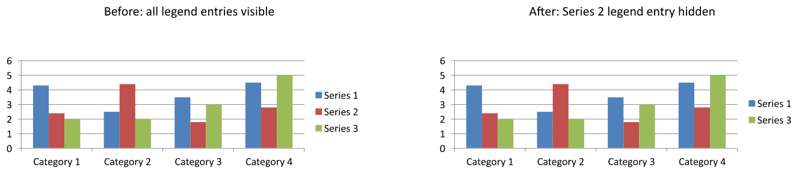

## **نظرة عامة**

يوفر Aspose.Slides for PHP via Java خيارات لتخصيص وسائط مخطط الرسم البياني في عروض PowerPoint. يوضح هذا المقال كيفية تحديد موضع وحجم وسيلة الإيضاح، وتعيين حجم الخط للوسيلة بأكملها، وتنسيق مدخل وسيلة إيضاح فردي، وإخفاء أو استعادة المدخلات المحددة.

يتضمن قسم الأسئلة الشائعة سلوكيات ذات صلة، بما في ذلك حجز مساحة لوسيلة الإيضاح، وعرض تسميات متعددة الأسطر، ووراثة التنسيق من سمة العرض التقديمي.

## **تحديد موضع وسيلة الإيضاح**

استخدم أساليب وسيلة الإيضاح [setX](https://reference.aspose.com/slides/php-java/aspose.slides/legend/setx/)، [setY](https://reference.aspose.com/slides/php-java/aspose.slides/legend/sety/)، [setWidth](https://reference.aspose.com/slides/php-java/aspose.slides/legend/setwidth/)، و[setHeight](https://reference.aspose.com/slides/php-java/aspose.slides/legend/setheight/) لتحديد موضعها وحجمها كنسب من أبعاد المخطط.

ينشئ هذا المثال عرضًا تقديميًا ويضيف مخطط عمود مكدس مع بيانات افتراضية إلى الشريحة الأولى. تحويل الإزاحات والأبعاد المطلوبة لوسيلة الإيضاح إلى قيم نسبية يتم بقسمة هذه القيم على عرض وارتفاع المخطط: يتم إزاحة وسيلة الإيضاح بمقدار 50 نقطة من الزاوية العليا اليسرى للمخطط وتصبح بحجم 100 × 100 نقطة. يستخدم المثال java_values لتحويل أبعاد المخطط المعادة من جسر PHP/Java إلى أرقام PHP قبل القسمة.

```php
use aspose\slides\ChartType;
use aspose\slides\Presentation;
use aspose\slides\SaveFormat;

$presentation = new Presentation();
try {
    $slide = $presentation->getSlides()->get_Item(0);

    $chart = $slide->getShapes()->addChart(ChartType::ClusteredColumn, 50, 50, 500, 500);

    $chartWidth = java_values($chart->getWidth());
    $chartHeight = java_values($chart->getHeight());

    // عبّر عن موضع وحجم وسيلة الإيضاح بالنسبة إلى المخطط.
    $chart->getLegend()->setX(50 / $chartWidth);
    $chart->getLegend()->setY(50 / $chartHeight);
    $chart->getLegend()->setWidth(100 / $chartWidth);
    $chart->getLegend()->setHeight(100 / $chartHeight);

    $presentation->save("legend_position.pptx", SaveFormat::Pptx);
} finally {
    $presentation->dispose();
}
```

## **تعيين حجم خط وسيلة الإيضاح**

استخدم [getTextFormat](https://reference.aspose.com/slides/php-java/aspose.slides/legend/gettextformat/) الخاص بوسيلة الإيضاح للوصول إلى تنسيق النص، واستخدم [setFontHeight](https://reference.aspose.com/slides/php-java/aspose.slides/baseportionformat/#setFontHeight) لتعيين حجم الخط بالنقاط.

ينشئ هذا المثال مخططًا ببيانات افتراضية ويضبط نص وسيلة الإيضاح إلى 20 نقطة. كما يقوم بتعطيل الحدود التلقائية للمحور الرأسي ويحدد نطاقه من -5 إلى 10.

```php
use aspose\slides\ChartType;
use aspose\slides\Presentation;
use aspose\slides\SaveFormat;

$presentation = new Presentation();
try {
    $slide = $presentation->getSlides()->get_Item(0);

    $chart = $slide->getShapes()->addChart(ChartType::ClusteredColumn, 50, 50, 600, 400);

    $chart->getLegend()->getTextFormat()->getPortionFormat()->setFontHeight(20);
    $chart->getAxes()->getVerticalAxis()->setAutomaticMinValue(false);
    $chart->getAxes()->getVerticalAxis()->setMinValue(-5);
    $chart->getAxes()->getVerticalAxis()->setAutomaticMaxValue(false);
    $chart->getAxes()->getVerticalAxis()->setMaxValue(10);

    $presentation->save("legend_font_size.pptx", SaveFormat::Pptx);
} finally {
    $presentation->dispose();
}
```

## **تعيين حجم خط مدخل وسيلة إيضاح فردي**

استخدم المجموعة التي تُرجعها طريقة [getEntries](https://reference.aspose.com/slides/php-java/aspose.slides/legend/getentries/) الخاصة بوسيلة الإيضاح للوصول إلى تنسيق مدخل محدد. المؤشرات تبدأ من الصفر، لذا فالمؤشر `1` يشير إلى المدخل الثاني.

ينشئ هذا المثال مخطط عمود مكدس يحتوي على بيانات افتراضية تشمل سلسلتين على الأقل. يقوم بتنسيق المدخل الثاني لوسيلة الإيضاح بخط عريض ومائل ونص أزرق بحجم 20 نقطة.

```php
use aspose\slides\ChartType;
use aspose\slides\FillType;
use aspose\slides\NullableBool;
use aspose\slides\Presentation;
use aspose\slides\SaveFormat;

$presentation = new Presentation();
try {
    $slide = $presentation->getSlides()->get_Item(0);

    $chart = $slide->getShapes()->addChart(ChartType::ClusteredColumn, 50, 50, 600, 400);
    $textFormat = $chart->getLegend()->getEntries()->get_Item(1)->getTextFormat();

    $textFormat->getPortionFormat()->setFontBold(NullableBool::True);
    $textFormat->getPortionFormat()->setFontHeight(20);
    $textFormat->getPortionFormat()->setFontItalic(NullableBool::True);
    $textFormat->getPortionFormat()->getFillFormat()->setFillType(FillType::Solid);
    $textFormat->getPortionFormat()->getFillFormat()->getSolidFillColor()->setColor(java("java.awt.Color")->BLUE);

    $presentation->save("legend_entry_format.pptx", SaveFormat::Pptx);
} finally {
    $presentation->dispose();
}
```

## **إخفاء مدخلات وسيلة إيضاح فردية**

لاستبعاد سلسلة مساعدة من وسيلة الإيضاح مع الحفاظ على ظهور بياناتها، استدعِ [LegendEntryProperties::setHide](https://reference.aspose.com/slides/php-java/aspose.slides/legendentryproperties/sethide/) مع `true` عبر [ChartSeries::getRelatedLegendEntry](https://reference.aspose.com/slides/php-java/aspose.slides/chartseries/getrelatedlegendentry/). هذا يخفي مدخل وسيلة الإيضاح المحدد فقط؛ ولا يزيل السلسلة أو نقاط بياناتها. بالمقابل، استدعاء [Chart::setLegend](https://reference.aspose.com/slides/php-java/aspose.slides/chart/setlegend/) مع `false` يخفى وسيلة الإيضاح بأكملها.

يُنشئ المثال أدناه مخطط عمود مكدس مع عدة سلاسل باستخدام البيانات الافتراضية. يخفى مدخل وسيلة إيضاح السلسلة الثانية (المؤشر `1`) ويحفظ العرض التقديمي. ثم يستعيد المدخل باستدعاء [setHide](https://reference.aspose.com/slides/php-java/aspose.slides/legendentryproperties/sethide/) مع `false` ويحفظ نسخة ثانية. تظل الأعمدة مرئية في كلا الملفين.

```php
use aspose\slides\ChartType;
use aspose\slides\Presentation;
use aspose\slides\SaveFormat;

$presentation = new Presentation();
try {
    $slide = $presentation->getSlides()->get_Item(0);

    $chart = $slide->getShapes()->addChart(ChartType::ClusteredColumn, 50, 50, 600, 400);
    $chart->setLegend(true);

    $legendEntry = $chart->getChartData()->getSeries()->get_Item(1)->getRelatedLegendEntry();

    $legendEntry->setHide(true);
    $presentation->save("hidden_legend_entry.pptx", SaveFormat::Pptx);

    // استعادة نفس المدخل دون تغيير بيانات المخطط.
    $legendEntry->setHide(false);
    $presentation->save("restored_legend_entry.pptx", SaveFormat::Pptx);
} finally {
    $presentation->dispose();
}
```

المقارنة أدناه تُظهر نفس المخطط مع جميع المدخلات مرئية ومع إخفاء المدخل الثاني. تظل أعمدة السلسلة الثانية دون تغيير.



في المخططات العمودية والشريطية والخطية، تُعرّف مدخلات وسيلة الإيضاح السلاسل. بالنسبة لمخططات الفطيرة، تُعرّف المدخلات نقاط البيانات الفردية (الشرائح)، لذا استخدم [ChartDataPoint::getRelatedLegendEntry](https://reference.aspose.com/slides/php-java/aspose.slides/chartdatapoint/getrelatedlegendentry/) على الشريحة المختارة بدلاً من ذلك. تُوثق الوثائق البرمجية هذه الطريقة الخاصة بنقطة البيانات لأنواع المخطط `Pie`، `Pie3D`، `ExplodedPie`، `ExplodedPie3D`، `PieOfPie`، و`BarOfPie`. لا تفترض أنها تنطبق على مخططات الدونات، التي لا تُدرج في تلك القائمة.

## **الأسئلة الشائعة**

**هل يمكنني جعل المخطط يحجز مساحة لوسيلة الإيضاح بدلاً من تراكبها؟**

نعم. استدعِ [setOverlay](https://reference.aspose.com/slides/php-java/aspose.slides/legend/setoverlay/) مع `false` لحجز مساحة لوسيلة الإيضاح بدلاً من السماح لها بالتراكب على منطقة الرسم.

**هل يمكنني إنشاء تسميات وسيلة إيضاح متعددة الأسطر؟**

نعم. يمكن أن تُكّسر التسميات الطويلة عندما يكون العرض المتاح غير كافٍ. يمكنك أيضًا استخدام أحرف السطر الجديد في أسماء السلاسل لطلب فواصل سطرية.

**كيف أجعل وسيلة الإيضاح تتبع نظام ألوان سمة العرض التقديمي؟**

اترك ألوان وسيلة الإيضاح، وتعبئاتها، وخطوطها غير محددة بحيث يمكنها وراثة تنسيق السمة. أي تنسيق صريح سيتجاوز الإعدادات الخاصة بالسمة.