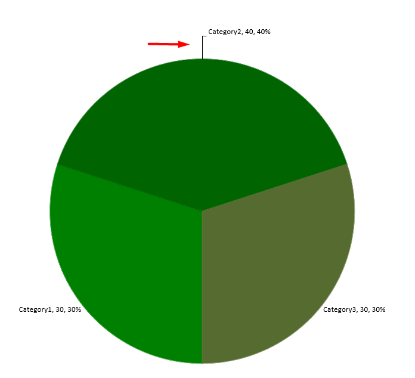

## **مقدمة**

تظهر تسميات البيانات معلومات حول سلاسل المخطط ونقاط البيانات الفردية، مما يساعد القراء على تحديد القيم وفهم المخطط. يشرح هذا المقال كيفية تنسيق القيم، عرض النسب المئوية، قراءة نص التسمية، التحكم في التسميات خارج الحد الأقصى للمحور، ضبط تباعد تسميات محور الفئة، وتحديد موضع تسميات المخطط الدائري.

## **تعيين دقة البيانات في تسميات بيانات المخطط**

استخدم [setNumberFormatOfValues](https://reference.aspose.com/slides/ar/python-java/aspose.slides/chartseries/#setNumberFormatOfValues) لتنسيق قيم السلسلة. يُنشئ هذا المثال مخططًا خطيًا ببيانات افتراضية، يعرض جدول البيانات الخاص به، ويفعل تسميات القيم للسلسلة الأولى. يُظهر التنسيق `#,##0.00` فاصل الآلاف ومكانين عشريين دون تغيير القيم الأساسية.

```python
import jpype
import asposeslides

if not jpype.isJVMStarted():
    jpype.startJVM()

from asposeslides.api import ChartType, Presentation, SaveFormat

presentation = Presentation()
try:
    slide = presentation.getSlides().get_Item(0)

    chart = slide.getShapes().addChart(ChartType.Line, 50, 50, 450, 300)
    chart.setDataTable(True)

    series = chart.getChartData().getSeries().get_Item(0)
    series.setNumberFormatOfValues("#,##0.00")
    series.getLabels().getDefaultDataLabelFormat().setShowValue(True)

    presentation.save("PrecisionOfDatalabels_out.pptx", SaveFormat.Pptx)
finally:
    presentation.dispose()
```

## **عرض النسبة المئوية كتسميات**

في مخطط عمودي مكدس، احسب كل قيمة كنسبة مئوية من إجمالي الفئة الخاصة بها وعيّن النص إلى إطار النص الذي يُرجعه [getTextFrameForOverriding](https://reference.aspose.com/slides/ar/python-java/aspose.slides/datalabel/#getTextFrameForOverriding). يستخدم هذا المثال بيانات المخطط الافتراضية ويعرض النسب المئوية بمكانين عشريين بخط بحجم 8 نقط. يتم تخطي الفئات التي إجماليها صفر لتجنب القسمة على الصفر. أعد حساب نص التسمية المخصص إذا تغيّرت بيانات المخطط.

```python
import jpype
import asposeslides

if not jpype.isJVMStarted():
    jpype.startJVM()

from asposeslides.api import ChartType, Portion, Presentation, SaveFormat

presentation = Presentation()
try:
    slide = presentation.getSlides().get_Item(0)

    chart = slide.getShapes().addChart(ChartType.StackedColumn, 20, 20, 400, 400)

    chart_series = chart.getChartData().getSeries()
    category_totals = [0.0] * chart.getChartData().getCategories().size()
    for category_index in range(len(category_totals)):
        for series_index in range(chart_series.size()):
            data_point = chart_series.get_Item(series_index).getDataPoints().get_Item(category_index)
            category_totals[category_index] += float(data_point.getValue().getData())

    for series_index in range(chart_series.size()):
        series = chart_series.get_Item(series_index)
        series.getLabels().getDefaultDataLabelFormat().setShowLegendKey(False)

        for point_index in range(series.getDataPoints().size()):
            data_point = series.getDataPoints().get_Item(point_index)
            label = data_point.getLabel()
            if category_totals[point_index] == 0:
                print(f"Cannot calculate a percentage for category {point_index}: the total is zero.")
                continue
            point_percentage = float(data_point.getValue().getData()) / category_totals[point_index] * 100

            portion = Portion()
            portion.setText(f"{point_percentage:.2f} %")
            portion.getPortionFormat().setFontHeight(8)
            label.getTextFrameForOverriding().setText("")
            paragraph = label.getTextFrameForOverriding().getParagraphs().get_Item(0)
            paragraph.getPortions().add(portion)

            label_format = label.getDataLabelFormat()
            label_format.setShowValue(True)
            label_format.setShowSeriesName(False)
            label_format.setShowPercentage(False)
            label_format.setShowLegendKey(False)
            label_format.setShowCategoryName(False)
            label_format.setShowBubbleSize(False)

    presentation.save("DisplayPercentageAsLabels_out.pptx", SaveFormat.Pptx)
finally:
    presentation.dispose()
```

## **تعيين علامة النسبة المئوية مع تسميات بيانات المخطط**

عند تخزين القيم ككسور، استخدم [setNumberFormat](https://reference.aspose.com/slides/ar/python-java/aspose.slides/datalabelformat/#setNumberFormat) لعرض النسب المئوية. مرّر `False` إلى [setNumberFormatLinkedToSource](https://reference.aspose.com/slides/ar/python-java/aspose.slides/datalabelformat/#setNumberFormatLinkedToSource) لتطبيق تنسيق التسمية بشكل مستقل عن الخلايا المصدر.

يُنشئ هذا المثال مخطط عمودي مكدس بنسبة 100% مع سلاسل حمراء وزرقاء عبر أربع فئات. كل زوج من القيم يساوي 1. يُظهر تنسيق التسمية `0.0%` القيمة 0.30 كـ 30.0%، بينما يستخدم المحور العمودي مكانين عشريين. كلتا السلسلتين تستخدم نص تسمية أبيض بحجم 10 نقاط.

```python
import jpype
import asposeslides

if not jpype.isJVMStarted():
    jpype.startJVM()

from asposeslides.api import ChartType, FillType, Presentation, SaveFormat

Color = jpype.JClass("java.awt.Color")

presentation = Presentation()
try:
    slide = presentation.getSlides().get_Item(0)

    chart = slide.getShapes().addChart(ChartType.PercentsStackedColumn, 20, 20, 500, 400)

    chart.getAxes().getVerticalAxis().setNumberFormatLinkedToSource(False)
    chart.getAxes().getVerticalAxis().setNumberFormat("0.00%")

    chart.getChartData().getSeries().clear()
    chart.getChartData().getCategories().clear()

    workbook = chart.getChartData().getChartDataWorkbook()
    worksheet_index = 0
    for i in range(4):
        category_cell = workbook.getCell(worksheet_index, i + 1, 0, f"Category {i + 1}")
        chart.getChartData().getCategories().add(category_cell)

    series_names = ["Reds", "Blues"]
    series_colors = [Color.RED, Color.BLUE]
    values = [[0.30, 0.50, 0.80, 0.65], [0.70, 0.50, 0.20, 0.35]]

    for i, series_name in enumerate(series_names):
        series_cell = workbook.getCell(worksheet_index, 0, i + 1, series_name)
        series = chart.getChartData().getSeries().add(series_cell, chart.getType())
        for j, value in enumerate(values[i]):
            value_cell = workbook.getCell(worksheet_index, j + 1, i + 1, jpype.JDouble(value))
            series.getDataPoints().addDataPointForBarSeries(value_cell)

        series.getFormat().getFill().setFillType(FillType.Solid)
        series.getFormat().getFill().getSolidFillColor().setColor(series_colors[i])

        label_format = series.getLabels().getDefaultDataLabelFormat()
        label_format.setShowValue(True)
        label_format.setNumberFormatLinkedToSource(False)
        label_format.setNumberFormat("0.0%")
        portion_format = label_format.getTextFormat().getPortionFormat()
        portion_format.setFontHeight(10)
        portion_format.getFillFormat().setFillType(FillType.Solid)
        portion_format.getFillFormat().getSolidFillColor().setColor(Color.WHITE)

    presentation.save("SetDataLabelsPercentageSign_out.pptx", SaveFormat.Pptx)
finally:
    presentation.dispose()
```

## **قراءة النص الفعلي لتسميات البيانات**

استخدم [getActualLabelText](https://reference.aspose.com/slides/ar/python-java/aspose.slides/datalabel/#getActualLabelText) لاسترجاع النص الناتج عن إعدادات تسمية البيانات. هذا مفيد عندما يتم استخراج التسميات للتقارير، البحث في محتوى العرض التقديمي، أو التحقق من صحة المخططات المُنشأة. في المثال أدناه، يجمع تنسيق [تسمية البيانات الافتراضي](https://reference.aspose.com/slides/ar/python-java/aspose.slides/datalabelformat/) كل اسم فئة، اسم سلسلة، والقيمة. يُنسق نقطة واحدة قيمتها كنسبة مئوية، وأخرى تستخدم نصًا مخصصًا من [getTextFrameForOverriding](https://reference.aspose.com/slides/ar/python-java/aspose.slides/datalabel/#getTextFrameForOverriding).

```python
import jpype
import asposeslides

if not jpype.isJVMStarted():
    jpype.startJVM()

from asposeslides.api import ChartType, Presentation

presentation = Presentation()
try:
    slide = presentation.getSlides().get_Item(0)

    chart = slide.getShapes().addChart(ChartType.ClusteredColumn, 20, 20, 500, 300)

    chart.getChartData().getSeries().clear()
    chart.getChartData().getCategories().clear()

    workbook = chart.getChartData().getChartDataWorkbook()
    first_category_cell = workbook.getCell(0, 1, 0, "Q1")
    chart.getChartData().getCategories().add(first_category_cell)
    second_category_cell = workbook.getCell(0, 2, 0, "Q2")
    chart.getChartData().getCategories().add(second_category_cell)

    north_series_cell = workbook.getCell(0, 0, 1, "North")
    north = chart.getChartData().getSeries().add(north_series_cell, chart.getType())
    north_first_value_cell = workbook.getCell(0, 1, 1, jpype.JDouble(0.25))
    north.getDataPoints().addDataPointForBarSeries(north_first_value_cell)
    north_second_value_cell = workbook.getCell(0, 2, 1, jpype.JDouble(0.75))
    north.getDataPoints().addDataPointForBarSeries(north_second_value_cell)

    south_series_cell = workbook.getCell(0, 0, 2, "South")
    south = chart.getChartData().getSeries().add(south_series_cell, chart.getType())
    south_first_value_cell = workbook.getCell(0, 1, 2, jpype.JDouble(0.40))
    south.getDataPoints().addDataPointForBarSeries(south_first_value_cell)
    south_second_value_cell = workbook.getCell(0, 2, 2, jpype.JDouble(0.60))
    south.getDataPoints().addDataPointForBarSeries(south_second_value_cell)

    for series in chart.getChartData().getSeries():
        label_format = series.getLabels().getDefaultDataLabelFormat()
        label_format.setShowCategoryName(True)
        label_format.setShowSeriesName(True)
        label_format.setShowValue(True)

    north.getLabels().get_Item(1).getDataLabelFormat().setNumberFormatLinkedToSource(False)
    north.getLabels().get_Item(1).getDataLabelFormat().setNumberFormat("0%")
    south.getLabels().get_Item(0).getTextFrameForOverriding().setText("Reviewed")

    for series in chart.getChartData().getSeries():
        for point in series.getDataPoints():
            label = point.getLabel()
            if not label.isVisible():
                continue

            print(f"Value: {point.getValue().getData()}; label: {label.getActualLabelText()}")
finally:
    presentation.dispose()
```

العدد المخزن في نقطة البيانات يبقى `0.75`، حتى عندما تُظهر تسميتها `75%` مع أسماء الفئة والسلسلة. النص المخصص يستبدل نص التسمية المُنشأ. تُرجع [getActualLabelText](https://reference.aspose.com/slides/ar/python-java/aspose.slides/datalabel/#getActualLabelText) سلسلة التسمية الناتجة في كلتا الحالتين. تحقق من [isVisible](https://reference.aspose.com/slides/ar/python-java/aspose.slides/datalabel/#isVisible) بشكل منفصل، كما هو موضح أعلاه، عندما تريد استخراج التسميات المرئية فقط.

## **التحكم في تسميات البيانات خارج الحد الأقصى للمحور**

عند تحديد نطاق المحور يدويًا، قد تتجاوز بعض نقاط البيانات قيمته القصوى. استخدم [setShowDataLabelsOverMaximum](https://reference.aspose.com/slides/ar/python-java/aspose.slides/chart/#setShowDataLabelsOverMaximum) للتحكم فيما إذا كانت تسميات بياناتها تُعرض. هذا الإعداد يغيّر رؤية التسمية؛ لا يغيّر نطاق المحور أو قيم البيانات الأساسية.

ينشئ المثال أدناه مخطط عمودي مجموعة ثنائي الأبعاد بقيم 60 و120. يمرّر `False` إلى [setAutomaticMaxValue](https://reference.aspose.com/slides/ar/python-java/aspose.slides/axis/#setAutomaticMaxValue) ويضبط الحد الأقصى إلى 100 باستخدام [setMaxValue](https://reference.aspose.com/slides/ar/python-java/aspose.slides/axis/#setMaxValue) على المحور العمودي. الشريحة الأولى تسمح بالتسميات خارج الحد الأقصى؛ نسخة تلك الشريحة تعطلها. تُحفظ كلتا الشريحتين في `DataLabelsOverMaximum.pptx`.

فعّل تسميات القيم باستخدام [setShowValue](https://reference.aspose.com/slides/ar/python-java/aspose.slides/datalabelformat/#setShowValue). لا يُفعّل إعداد مستوى المخطط عرض القيمة بمفرده ولا يتجاوز إلغاء تمكين عرض القيمة لتسمية فردية. يفعّل هذا المثال القيم للسلسلة بأكملها ويستخدم [setPosition](https://reference.aspose.com/slides/ar/python-java/aspose.slides/datalabelformat/#setPosition) لتضع التسميات عند الطرف الخارجي لكل عمود.

```python
import jpype
import asposeslides

if not jpype.isJVMStarted():
    jpype.startJVM()

from asposeslides.api import ChartType, LegendDataLabelPosition, Presentation, SaveFormat

presentation = Presentation()
try:
    slide = presentation.getSlides().get_Item(0)

    chart = slide.getShapes().addChart(ChartType.ClusteredColumn, 50, 50, 600, 400)
    chart.setLegend(False)

    chart.getChartData().getSeries().clear()
    chart.getChartData().getCategories().clear()

    workbook = chart.getChartData().getChartDataWorkbook()

    first_category = workbook.getCell(0, 1, 0, "Within range")
    second_category = workbook.getCell(0, 2, 0, "Above maximum")

    chart.getChartData().getCategories().add(first_category)
    chart.getChartData().getCategories().add(second_category)

    series_name = workbook.getCell(0, 0, 1, "Values")
    series = chart.getChartData().getSeries().add(series_name, chart.getType())

    first_value = workbook.getCell(0, 1, 1, jpype.JDouble(60))
    second_value = workbook.getCell(0, 2, 1, jpype.JDouble(120))

    series.getDataPoints().addDataPointForBarSeries(first_value)
    series.getDataPoints().addDataPointForBarSeries(second_value)

    series.getLabels().getDefaultDataLabelFormat().setShowValue(True)
    series.getLabels().getDefaultDataLabelFormat().setPosition(LegendDataLabelPosition.OutsideEnd)

    chart.getAxes().getVerticalAxis().setAutomaticMaxValue(False)
    chart.getAxes().getVerticalAxis().setMaxValue(100)
    chart.setShowDataLabelsOverMaximum(True)

    second_slide = presentation.getSlides().addClone(slide)
    second_chart = second_slide.getShapes().get_Item(0)
    second_chart.setShowDataLabelsOverMaximum(False)

    presentation.save("DataLabelsOverMaximum.pptx", SaveFormat.Pptx)
finally:
    presentation.dispose()
```

تظهر الصور التالية الشرائح المحفوظة التي تم عرضها بواسطة Microsoft PowerPoint. عند `True`، تكون التسمية **120** مرئية عند الحد العلوي؛ وعند `False` تكون مخفية. تظل التسمية **60** مرئية، يبقى الحد الأقصى للمحور **100**، وتظل نقطة البيانات الثانية **120** في كلتا الحالتين.

| setShowDataLabelsOverMaximum(True) | setShowDataLabelsOverMaximum(False) |
| --- | --- |
|  |  |

{}
يستخدم هذا المثال مخطط عمودي ثنائي الأبعاد مع محور قيم. المخططات التي لا تحتوي على محور قيم، مثل المخططات الدائرية ومخططات الدونات، لا تملك حدًا أقصى للمحور لتقييده بهذه الطريقة.
{}

## **تعيين مسافة التسمية من المحور**

استخدم [setLabelOffset](https://reference.aspose.com/slides/ar/python-java/aspose.slides/axis/#setLabelOffset) للتحكم في المسافة بين تسميات محور الفئة والمحور. القيمة هي نسبة مئوية من الحد الأقصى لحجم الخط لتسميات المحور. يُنشئ هذا المثال مخطط عمودي مجموعة ويضبط إزاحة تسمية المحور الأفقي إلى 500. يؤثر هذا الإعداد على تسميات محور الفئة بدلاً من التسميات المرتبطة بنقاط البيانات الفردية.

```python
import jpype
import asposeslides

if not jpype.isJVMStarted():
    jpype.startJVM()

from asposeslides.api import ChartType, Presentation, SaveFormat

presentation = Presentation()
try:
    slide = presentation.getSlides().get_Item(0)

    chart = slide.getShapes().addChart(ChartType.ClusteredColumn, 20, 20, 500, 300)
    chart.getAxes().getHorizontalAxis().setLabelOffset(500)

    presentation.save("SetCategoryAxisLabelDistance_out.pptx", SaveFormat.Pptx)
finally:
    presentation.dispose()
```

## **ضبط موضع التسمية**

في مخطط دائري، اضبط مواضع تسميات البيانات لتحسين التباعد وإتاحة مساحة لخطوط القادة.

يعرض هذا المثال قيمة نقطة البيانات الأولى، يضع تسميتها خارج الشريحة، ويضبط إزاحتها الأفقية والرأسية باستخدام [setX](https://reference.aspose.com/slides/ar/python-java/aspose.slides/datalabel/#setX) و[setY](https://reference.aspose.com/slides/ar/python-java/aspose.slides/datalabel/#setY). هذه الإزاحات نسبة إلى عرض وارتفاع المخطط على التوالي.

```python
import jpype
import asposeslides

if not jpype.isJVMStarted():
    jpype.startJVM()

from asposeslides.api import ChartType, LegendDataLabelPosition, Presentation, SaveFormat

presentation = Presentation()
try:
    slide = presentation.getSlides().get_Item(0)

    chart = slide.getShapes().addChart(ChartType.Pie, 50, 50, 200, 200)
    series = chart.getChartData().getSeries()
    
    label = series.get_Item(0).getLabels().get_Item(0)
    label.getDataLabelFormat().setShowValue(True)
    label.getDataLabelFormat().setPosition(LegendDataLabelPosition.OutsideEnd)
    label.setX(0.71)
    label.setY(0.04)

    presentation.save("presentation.pptx", SaveFormat.Pptx)
finally:
    presentation.dispose()
```



## **الأسئلة المتكررة**

**كيف يمكنني منع تداخل تسميات البيانات في المخططات الكثيفة؟**

اجمع بين وضع التسمية التلقائي، خطوط القادة، وتقليل حجم الخط؛ إذا لزم الأمر، أخفِ بعض الحقول (مثل الفئة) أو اعرض التسميات فقط للقيم المتطرفة أو النقاط الرئيسة.

**كيف يمكنني إيقاف تشغيل التسميات للقيم الصفرية أو السالبة أو الفارغة فقط؟**

قم بتصفية نقاط البيانات قبل تمكين التسميات وأوقف عرض القيم التي تساوي 0 أو القيم السالبة أو القيم المفقودة وفقًا لقاعدة محددة.

**كيف يمكنني ضمان نمط تسمية متسق عند التصدير إلى PDF/صور؟**

حدد عائلة الخط وحجمه صراحةً وتأكد من توفر الخط في بيئة العرض لتجنب الاستخدام الاحتياطي.