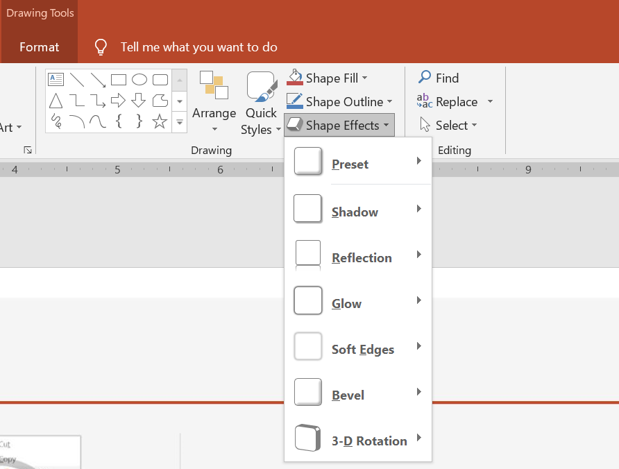

## **المقدمة**

في حين يمكن استخدام المؤثرات في PowerPoint لجعل الشكل يبرز، فإنها تختلف عن [التعبئة](/slides/ar/python-java/shape-formatting/#gradient-fill) أو الخطوط الخارجية. باستخدام مؤثرات PowerPoint، يمكنك إنشاء انعكاسات مقنعة على الشكل، أو إضاءة الشكل، وما إلى ذلك.



* يقدم PowerPoint ستة مؤثرات يمكن تطبيقها على الأشكال. يمكنك تطبيق مؤثر واحد أو أكثر على الشكل. 

* بعض تركيبات المؤثرات تبدو أفضل من غيرها. لهذا السبب يوفر PowerPoint خيارات تحت **Preset**. تمثل خيارات Preset في الأساس تركيبات من مؤثرين أو أكثر تُعرف بأنها تبدو جيدة. بهذه الطريقة، عند اختيار إعداد مسبق، لن تحتاج إلى إضاعة الوقت في اختبار أو دمج مؤثرات مختلفة للعثور على تركيبة مناسبة.

توفر Aspose.Slides خصائص وأساليب تحت فئة [EffectFormat](https://reference.aspose.com/slides/ar/python-java/aspose.slides/effectformat/) التي تسمح لك بتطبيق نفس المؤثرات على الأشكال في عروض PowerPoint.

## **تطبيق مؤثر الظل**

هذا الكود بلغة Python يوضح كيفية تطبيق مؤثر الظل الخارجي ([EffectFormat.getOuterShadowEffect](https://reference.aspose.com/slides/ar/python-java/aspose.slides/effectformat/#getOuterShadowEffect)) على مستطيل:

```python
import jpype
import asposeslides

if not jpype.isJVMStarted():
    jpype.startJVM()

from asposeslides.api import Presentation, SaveFormat, ShapeType
from java.awt import Color

presentation = Presentation()
try:
    shape = presentation.getSlides().get_Item(0).getShapes().addAutoShape(ShapeType.RoundCornerRectangle, 20, 20, 200, 150)

    shape.getEffectFormat().enableOuterShadowEffect()
    shape.getEffectFormat().getOuterShadowEffect().getShadowColor().setColor(Color.DARK_GRAY)
    shape.getEffectFormat().getOuterShadowEffect().setDistance(10)
    shape.getEffectFormat().getOuterShadowEffect().setDirection(45)

    presentation.save("output.pptx", SaveFormat.Pptx)
finally:
    presentation.dispose()
```

## **تطبيق مؤثر الانعكاس**

هذا الكود بلغة Python يوضح كيفية تطبيق مؤثر الانعكاس على شكل:

```python
import jpime
import asposeslides

if not jpime.isJVMStarted():
    jpime.startJVM()

from asposeslides.api import Presentation, RectangleAlignment, SaveFormat, ShapeType

presentation = Presentation()
try:
    shape = presentation.getSlides().get_Item(0).getShapes().addAutoShape(ShapeType.RoundCornerRectangle, 20, 20, 200, 150)

    shape.getEffectFormat().enableReflectionEffect()
    shape.getEffectFormat().getReflectionEffect().setRectangleAlign(RectangleAlignment.Bottom)
    shape.getEffectFormat().getReflectionEffect().setDirection(90)
    shape.getEffectFormat().getReflectionEffect().setDistance(55)
    shape.getEffectFormat().getReflectionEffect().setBlurRadius(4)

    presentation.save("reflection.pptx", SaveFormat.Pptx)
finally:
    presentation.dispose()
```

## **تطبيق مؤثر التوهج**

هذا الكود بلغة Python يوضح كيفية تطبيق مؤثر التوهج على شكل:

```python
import jpype
import asposeslides

if not jpype.isJVMStarted():
    jpype.startJVM()

from asposeslides.api import Presentation, SaveFormat, ShapeType
from java.awt import Color

presentation = Presentation()
try:
    shape = presentation.getSlides().get_Item(0).getShapes().addAutoShape(ShapeType.RoundCornerRectangle, 20, 20, 200, 150)

    shape.getEffectFormat().enableGlowEffect()
    shape.getEffectFormat().getGlowEffect().getColor().setColor(Color.MAGENTA)
    shape.getEffectFormat().getGlowEffect().setRadius(15)

    presentation.save("glow.pptx", SaveFormat.Pptx)
finally:
    presentation.dispose()
```

## **تطبيق مؤثر الحواف الناعمة**

هذا الكود بلغة Python يوضح كيفية تطبيق مؤثر الحواف الناعمة على شكل:

```python
import jpype
import asposeslides

if not jpype.isJVMStarted():
    jpype.startJVM()

from asposeslides.api import Presentation, SaveFormat, ShapeType

presentation = Presentation()
try:
    shape = presentation.getSlides().get_Item(0).getShapes().addAutoShape(ShapeType.RoundCornerRectangle, 20, 20, 200, 150)

    shape.getEffectFormat().enableSoftEdgeEffect()
    shape.getEffectFormat().getSoftEdgeEffect().setRadius(15)

    presentation.save("softEdges.pptx", SaveFormat.Pptx)
finally:
    presentation.dispose()
```

## **الأسئلة المتكررة**

**هل يمكنني تطبيق مؤثرات متعددة على نفس الشكل؟**

نعم، يمكنك دمج مؤثرات مختلفة، مثل الظل والانعكاس والتوهج، على شكل واحد لإنشاء مظهر أكثر ديناميكية.

**ما هي الأشكال التي يمكنني تطبيق المؤثرات عليها؟**

يمكنك تطبيق المؤثرات على مختلف الأشكال، بما في ذلك الأشكال التلقائية، المخططات، الجداول، الصور، كائنات SmartArt، كائنات OLE، والمزيد.

**هل يمكنني تطبيق المؤثرات على الأشكال المجمعة؟**

نعم، يمكنك تطبيق المؤثرات على الأشكال المجمعة. سيطبق المؤثر على المجموعة بأكملها.