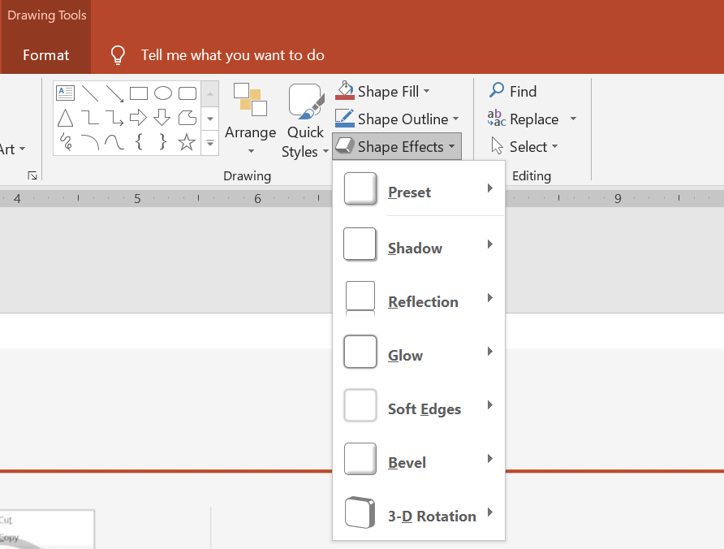

## **المقدمة**

في حين يمكن استخدام التأثيرات في PowerPoint لجعل الشكل يبرز، فإنها تختلف عن [الملء](/slides/ar/python-java/shape-formatting/#gradient-fill) أو المخططات. باستخدام تأثيرات PowerPoint، يمكنك إنشاء انعكاسات مقنعة على الشكل، ونشر توهج الشكل، إلخ.



يقدم PowerPoint ستة تأثيرات يمكن تطبيقها على الأشكال. يمكنك تطبيق تأثير واحد أو أكثر على الشكل.

بعض تركيبات التأثيرات تبدو أفضل من غيرها. لهذا السبب، يوفر PowerPoint خيارات تحت **الإعداد المسبق**. خيارات الإعداد المسبق هي تركيبات من اثنين أو أكثر من التأثيرات المعروفة بأنها تبدو جيدة. بهذه الطريقة، عند اختيار إعداد مسبق، لن تحتاج إلى إضاعة الوقت في اختبار أو دمج تأثيرات مختلفة لإيجاد تركيبة مناسبة.

توفر Aspose.Slides خصائص وأساليب تحت فئة [EffectFormat](https://reference.aspose.com/slides/python-java/aspose.slides/effectformat/) التي تتيح لك تطبيق نفس التأثيرات على الأشكال في عروض PowerPoint التقديمية.

## **تطبيق تأثير الظل**

يدعم Aspose.Slides للغة Python عبر Java الظلال الخارجية والداخلية للأشكال. يمكنك تخصيص اللون والاتجاه والمسافة ونصف قطر الضباب لتتناسب مع تصميم عرضك التقديمي.

### **تطبيق ظل خارجي**

استخدم الظل الخارجي لجعل بطاقة أو لوحة تبرز مقابل خلفية الشريحة. يمتد الظل خارج حدود الشكل، مما يخلق انطباعًا بأن الشكل مرتفع فوق الشريحة. اضبط لونه واتجاهه ومسافته ونصف قطر الضباب ليتناسب مع إضاءة وتصميم القالب الخاص بك.

يعرض هذا الكود Python كيفية تطبيق [تأثير الظل الخارجي](https://reference.aspose.com/slides/python-java/aspose.slides/effectformat/#getOuterShadowEffect) على مستطيل:

```python
import jpype
import asposeslides

if not jpype.isJVMStarted():
    jpype.startJVM()

from asposeslides.api import Presentation, SaveFormat, ShapeType
from java.awt import Color

presentation = Presentation()
try:
    slide = presentation.getSlides().get_Item(0)

    shape = slide.getShapes().addAutoShape(ShapeType.RoundCornerRectangle, 20, 20, 200, 100)
    shape.getEffectFormat().enableOuterShadowEffect()
    shape.getEffectFormat().getOuterShadowEffect().getShadowColor().setColor(Color(169, 169, 169))
    shape.getEffectFormat().getOuterShadowEffect().setDistance(10)
    shape.getEffectFormat().getOuterShadowEffect().setDirection(45)

    presentation.save("shadow_effect.pptx", SaveFormat.Pptx)
finally:
    presentation.dispose()
```


### **تطبيق ظل داخلي**

عند إعادة إنتاج النمط البصري للقالب، استخدم الظل الداخلي لمنح البطاقة أو اللوحة مظهرًا متراجعًا. الظل الخارجي يمتد خارج الشكل ويجعله يبدو مرتفعًا، بينما الظل الداخلي يظلل داخل حواف الشكل.

استدعِ [enableInnerShadowEffect](https://reference.aspose.com/slides/python-java/aspose.slides/effectformat/#enableInnerShadowEffect)، ثم قم بتكوين الظل الذي تُعيده الدالة [getInnerShadowEffect](https://reference.aspose.com/slides/python-java/aspose.slides/effectformat/#getInnerShadowEffect). القيم الأكبر لنصف قطر الضباب تنتج حوافًا أكثر نعومة.

يعرض هذا المثال Python إنشاء بطاقة زرقاء فاتحة مع ظل داخلي رمادي داكن ويحفظها كملف PPTX. اتجاه الظل هو 225 درجة، والمسافة 7 نقاط، ونصف قطر الضباب 6 نقاط:

```python
import jpype
import asposeslides

if not jpype.isJVMStarted():
    jpype.startJVM()

from asposeslides.api import FillType, Presentation, SaveFormat, ShapeType
from java.awt import Color

presentation = Presentation()
try:
    slide = presentation.getSlides().get_Item(0)

    shape = slide.getShapes().addAutoShape(ShapeType.Rectangle, 20, 20, 200, 100)
    shape.getFillFormat().setFillType(FillType.Solid)
    shape.getFillFormat().getSolidFillColor().setColor(Color(173, 216, 230))
    shape.getLineFormat().getFillFormat().setFillType(FillType.NoFill)

    shape.getEffectFormat().enableInnerShadowEffect()
    shadow = shape.getEffectFormat().getInnerShadowEffect()
    shadow.getShadowColor().setColor(Color(105, 105, 105))
    shadow.setDirection(225)
    shadow.setDistance(7)
    shadow.setBlurRadius(6)

    presentation.save("inner_shadow_effect.pptx", SaveFormat.Pptx)
finally:
    presentation.dispose()
```


لإزالة الظل الداخلي، استدعِ [disableInnerShadowEffect](https://reference.aspose.com/slides/python-java/aspose.slides/effectformat/#disableInnerShadowEffect) على تنسيق تأثير الشكل.

## **تطبيق تأثير الانعكاس**

لتطبيق تأثير الانعكاس في Aspose.Slides للغة Python عبر Java، يمكنك إضافة انعكاس يشبه المرآة إلى الأشكال، مع ضبط معلمات مثل المسافة والشفافية والحجم. يعزز هذا التأثير جمالية عروضك التقديمية من خلال إعطاء الأشكال مظهرًا أكثر صقلًا وتطورًا. من السهل تنفيذه باستخدام كود بسيط، مما يتيح تطبيقًا سريعًا عبر عناصر متعددة لتصميم متسق.

يعرض هذا الكود Python كيفية تطبيق [تأثير الانعكاس](https://reference.aspose.com/slides/python-java/aspose.slides/effectformat/#getReflectionEffect) على شكل:

```python
import jpype
import asposeslides

if not jpype.isJVMStarted():
    jpype.startJVM()

from asposeslides.api import Presentation, RectangleAlignment, SaveFormat, ShapeType

presentation = Presentation()
try:
    slide = presentation.getSlides().get_Item(0)

    shape = slide.getShapes().addAutoShape(ShapeType.RoundCornerRectangle, 20, 20, 200, 100)
    shape.getEffectFormat().enableReflectionEffect()
    shape.getEffectFormat().getReflectionEffect().setRectangleAlign(RectangleAlignment.Bottom)
    shape.getEffectFormat().getReflectionEffect().setDirection(90)
    shape.getEffectFormat().getReflectionEffect().setDistance(40)
    shape.getEffectFormat().getReflectionEffect().setBlurRadius(2)

    presentation.save("reflection_effect.pptx", SaveFormat.Pptx)
finally:
    presentation.dispose()
```


## **تطبيق تأثير التوهج**

لتطبيق تأثير التوهج على شكل في Aspose.Slides للغة Python عبر Java، يمكنك إضافة هالة ناعمة ومضيئة حول الأشكال، مع ضبط خصائص مثل اللون والحجم. يساعد هذا التأثير على إبراز الأشكال ويضيف عنصرًا بصريًا جذابًا إلى عرضك التقديمي. من السهل تنفيذه بكود قليل، مما يعزز المظهر العام للشرائح.

يعرض هذا الكود Python كيفية تطبيق [تأثير التوهج](https://reference.aspose.com/slides/python-java/aspose.slides/effectformat/#getGlowEffect) على شكل:

```python
import jpype
import asposeslides

if not jpype.isJVMStarted():
    jpype.startJVM()

from asposeslides.api import Presentation, SaveFormat, ShapeType
from java.awt import Color

presentation = Presentation()
try:
    slide = presentation.getSlides().get_Item(0)

    shape = slide.getShapes().addAutoShape(ShapeType.RoundCornerRectangle, 20, 20, 200, 100)
    shape.getEffectFormat().enableGlowEffect()
    shape.getEffectFormat().getGlowEffect().getColor().setColor(Color.MAGENTA)
    shape.getEffectFormat().getGlowEffect().setRadius(15)

    presentation.save("glow_effect.pptx", SaveFormat.Pptx)
finally:
    presentation.dispose()
```


## **تطبيق تأثير الحواف الناعمة**

لتطبيق تأثير الحواف الناعمة في Aspose.Slides للغة Python عبر Java، يمكنك إنشاء انتقال سلس ومحموم حول حواف الشكل. يضيف هذا التأثير مظهرًا أكثر رقة ودقة، مثاليًا للتصاميم التي تحتاج إلى مظهر ناعم. يمكنك بسهولة ضبط معلمات مثل نصف القطر لتحقيق التأثير المطلوب عبر أشكال مختلفة في عرضك التقديمي.

يعرض هذا الكود Python كيفية تطبيق [تأثير الحواف الناعمة](https://reference.aspose.com/slides/python-java/aspose.slides/effectformat/#getSoftEdgeEffect) على شكل:

```python
import jpype
import asposeslides

if not jpype.isJVMStarted():
    jpype.startJVM()

from asposeslides.api import Presentation, SaveFormat, ShapeType

presentation = Presentation()
try:
    slide = presentation.getSlides().get_Item(0)

    shape = slide.getShapes().addAutoShape(ShapeType.RoundCornerRectangle, 20, 20, 200, 150)
    shape.getEffectFormat().enableSoftEdgeEffect()
    shape.getEffectFormat().getSoftEdgeEffect().setRadius(8)

    presentation.save("soft_edges_effect.pptx", SaveFormat.Pptx)
finally:
    presentation.dispose()
```


## **الأسئلة المتكررة**

**هل يمكنني تطبيق تأثيرات متعددة على نفس الشكل؟**

نعم، يمكنك دمج تأثيرات مختلفة، مثل الظل والانعكاس والتوهج، على شكل واحد لإنشاء مظهر أكثر ديناميكية.

**ما هي الأشكال التي يمكنني تطبيق التأثيرات عليها؟**

يمكنك تطبيق التأثيرات على أشكال متعددة، بما في ذلك الأشكال التلقائية، والمخططات، والجداول، والصور، وكائنات SmartArt، وكائنات OLE، وغيرها.

**هل يمكنني تطبيق التأثيرات على الأشكال المجمعة؟**

نعم، يمكنك تطبيق التأثيرات على الأشكال المجمعة. سيُطبق التأثير على المجموعة بأكملها.