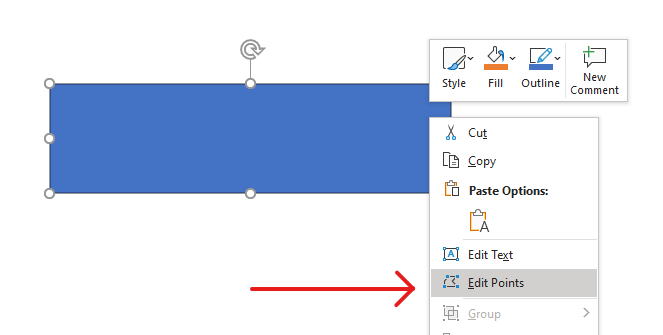

## **نظرة عامة**

توضح هذه المقالة طريقة تخصيص أشكال العرض في Aspose.Slides عن طريق تعديل هندسة الشكل عبر نقاط التحرير ومسارات الهندسة. تُظهر كيفية العمل مع [GeometryPath](https://reference.aspose.com/slides/ar/python-java/aspose.slides/geometrypath/) لتعديل الأشكال الحالية، وإجراء عمليات تحرير أساسية للمسار، وإضافة أو إزالة نقاط، وتطبيق الهندسة المحدثة على الشكل.

كما توضح كيفية إنشاء أشكال مخصصة ومركبة، وبناء أشكال بزاويا منحنية، وتحديد ما إذا كانت هندسة الشكل مغلقة، والتحويل بين [GeometryPath](https://reference.aspose.com/slides/ar/python-java/aspose.slides/geometrypath/) و [java.awt.Shape](https://docs.oracle.com/javase/7/docs/api/java/awt/Shape.html) لسيناريوهات تخصيص هندسة إضافية.

## **تغيير شكل باستخدام نقاط التحرير**

تخيل مربعًا. في PowerPoint، باستخدام **نقاط التحرير**، يمكنك  

* تحريك زاوية المربع إلى الداخل أو الخارج  
* تحديد انحناء الزاوية أو النقطة  
* إضافة نقاط جديدة إلى المربع  
* تعديل النقاط على المربع، وما إلى ذلك.  

بشكل أساسي، يمكنك تنفيذ هذه المهام على أي شكل. باستخدام نقاط التحرير، يمكنك تعديل شكل أو إنشاء شكل جديد من شكل موجود.

## **نصائح تحرير الشكل**



قبل البدء في تحرير أشكال PowerPoint عبر نقاط التحرير، قد ترغب في مراعاة النقاط التالية حول الأشكال:

* يمكن أن يكون الشكل (أو مساره) مغلقًا أو مفتوحًا.  
* عندما يكون الشكل مغلقًا، لا يحتوي على نقطة بداية أو نهاية. عندما يكون الشكل مفتوحًا، يكون له بداية ونهاية.  
* تتكون جميع الأشكال من نقطتي تثبيت على الأقل مرتبطتين ببعضهما عبر خطوط.  
* الخط إما مستقيم أو منحني. تحدد نقاط التثبيت طبيعة الخط.  
* توجد نقاط التثبيت كزوايا، أو نقاط مستقيمة، أو نقاط ناعمة:  
  * نقطة الزاوية هي نقطة يلتقي فيها خطان مستقطان بزاوية.  
  * النقطة الناعمة هي نقطة يتواجد فيها مقبضان على خط مستقيم وتلتقي مقاطع الخط في انحناء ناعم. في هذه الحالة، تكون جميع المقابض مفصولة عن نقطة التثبيت بمسافة متساوية.  
  * النقطة المستقيمة هي نقطة يتواجد فيها مقبضان على خط مستقيم وتلتقي مقاطع الخط في انحناء ناعم. في هذه الحالة، لا يلزم أن تكون المقابض مفصولة عن نقطة التثبيت بمسافة متساوية.  
* عن طريق تحريك أو تعديل نقاط التثبيت (مما يغير زاوية الخطوط)، يمكنك تغيير مظهر الشكل.

لتعديل أشكال PowerPoint عبر نقاط التحرير، توفر **Aspose.Slides** فئة [GeometryPath](https://reference.aspose.com/slides/ar/python-java/aspose.slides/geometrypath/).

* تمثّل نسخة [GeometryPath](https://reference.aspose.com/slides/ar/python-java/aspose.slides/geometrypath/) مسار هندسة كائن [GeometryShape](https://reference.aspose.com/slides/ar/python-java/aspose.slides/geometryshape/).  
* لاسترداد [GeometryPath](https://reference.aspose.com/slides/ar/python-java/aspose.slides/geometrypath/) من نسخة [GeometryShape](https://reference.aspose.com/slides/ar/python-java/aspose.slides/geometryshape/)، يمكنك استخدام طريقة [GeometryShape.getGeometryPaths](https://reference.aspose.com/slides/ar/python-java/aspose.slides/geometryshape/#getGeometryPaths).  
* لتعيين [GeometryPath](https://reference.aspose.com/slides/ar/python-java/aspose.slides/geometrypath/) لشكل، يمكنك استخدام هذه الطرق: [GeometryShape.setGeometryPath](https://reference.aspose.com/slides/ar/python-java/aspose.slides/geometryshape/#setGeometryPath) للأشكال **الصلبة** و[GeometryShape.setGeometryPaths](https://reference.aspose.com/slides/ar/python-java/aspose.slides/geometryshape/#setGeometryPaths) للأشكال **المركبة**.  
* لإضافة مقاطع، يمكنك استخدام الطرق الموجودة تحت فئة [GeometryPath](https://reference.aspose.com/slides/ar/python-java/aspose.slides/geometrypath/).  
* باستخدام الطريقتين [GeometryPath.setStroke](https://reference.aspose.com/slides/ar/python-java/aspose.slides/geometrypath/#setStroke) و[GeometryPath.setFillMode](https://reference.aspose.com/slides/ar/python-java/aspose.slides/geometrypath/#setFillMode)، يمكنك تحديد مظهر مسار الهندسة.  
* باستخدام طريقة [GeometryPath.getPathData](https://reference.aspose.com/slides/ar/python-java/aspose.slides/geometrypath/#getPathData)، يمكنك استرجاع مسار الهندسة لكائن [GeometryShape](https://reference.aspose.com/slides/ar/python-java/aspose.slides/geometryshape/) كمصفوفة من مقاطع المسار.  
* للوصول إلى خيارات تخصيص هندسة الشكل الإضافية، يمكنك تحويل [GeometryPath](https://reference.aspose.com/slides/ar/python-java/aspose.slides/geometrypath/) إلى [java.awt.Shape](https://docs.oracle.com/javase/7/docs/api/java/awt/Shape.html).  
* استخدم الطريقتين [geometryPathToGraphicsPath](https://reference.aspose.com/slides/ar/python-java/aspose.slides/shapeutil/) و[graphicsPathToGeometryPath](https://reference.aspose.com/slides/ar/python-java/aspose.slides/shapeutil/) (من فئة [ShapeUtil](https://reference.aspose.com/slides/ar/python-java/aspose.slides/shapeutil/)) لتحويل [GeometryPath](https://reference.aspose.com/slides/ar/python-java/aspose.slides/geometrypath/) إلى [java.awt.Shape](https://docs.oracle.com/javase/7/docs/api/java/awt/Shape.html) والعكس.

## **عمليات تحرير بسيطة**

تظهر التواقيع التالية عمليات التحرير الأساسية:

**إضافة خط** إلى نهاية المسار:

- `geometry_path.lineTo(point)`
- `geometry_path.lineTo(x, y)`

**إضافة خط** إلى موضع محدد على المسار:

- `geometry_path.lineTo(point, index)`
- `geometry_path.lineTo(x, y, index)`

**إضافة منحنى بيزيه مكعب** إلى نهاية المسار:

- `geometry_path.cubicBezierTo(point1, point2, point3)`
- `geometry_path.cubicBezierTo(x1, y1, x2, y2, x3, y3)`

**إضافة منحنى بيزيه مكعب** إلى موضع محدد على المسار:

- `geometry_path.cubicBezierTo(point1, point2, point3, index)`
- `geometry_path.cubicBezierTo(x1, y1, x2, y2, x3, y3, index)`

**إضافة منحنى بيزيه تربيعي** إلى نهاية المسار:

- `geometry_path.quadraticBezierTo(point1, point2)`
- `geometry_path.quadraticBezierTo(x1, y1, x2, y2)`

**إضافة منحنى بيزيه تربيعي** إلى موضع محدد على المسار:

- `geometry_path.quadraticBezierTo(point1, point2, index)`
- `geometry_path.quadraticBezierTo(x1, y1, x2, y2, index)`

**إلحاق قوس محدد** إلى مسار:

- `geometry_path.arcTo(width, height, start_angle, sweep_angle)`

**إغلاق الشكل الحالي** للمسار:

- `geometry_path.closeFigure()`

**تحديد موضع النقطة التالية**:

- `geometry_path.moveTo(point)`
- `geometry_path.moveTo(x, y)`

**إزالة مقطع المسار** عند فهرس معين:

- `geometry_path.removeAt(index)`

## **إضافة نقاط مخصصة إلى شكل**
1. أنشئ نسخة من فئة [GeometryShape](https://reference.aspose.com/slides/ar/python-java/aspose.slides/geometryshape/) وحدد النوع [ShapeType.Rectangle](https://reference.aspose.com/slides/ar/python-java/aspose.slides/shapetype/#Rectangle).  
2. احصل على نسخة من فئة [GeometryPath](https://reference.aspose.com/slides/ar/python-java/aspose.slides/geometrypath/) من الشكل.  
3. أضف نقطة جديدة بين النقطتين العلويتين على المسار.  
4. أضف نقطة جديدة بين النقطتين السفليتين على المسار.  
5. طبّق المسار على الشكل.

يظهر هذا الشيفرة Python كيفية إضافة نقاط مخصصة إلى شكل:

```python
import jpype
import asposeslides

if not jpype.isJVMStarted():
    jpype.startJVM()

from asposeslides.api import Presentation, ShapeType

presentation = Presentation()
try:
    shape = presentation.getSlides().get_Item(0).getShapes().addAutoShape(ShapeType.Rectangle, 100, 100, 200, 100)
    geometry_path = shape.getGeometryPaths()[0]
    geometry_path.lineTo(100, 50, 1)
    geometry_path.lineTo(100, 50, 4)
    shape.setGeometryPath(geometry_path)
finally:
    presentation.dispose()
```


## **إزالة نقاط من شكل**

1. أنشئ نسخة من فئة [GeometryShape](https://reference.aspose.com/slides/ar/python-java/aspose.slides/geometryshape/) وحدد النوع [ShapeType.Heart](https://reference.aspose.com/slides/ar/python-java/aspose.slides/shapetype/#Heart).  
2. احصل على نسخة من فئة [GeometryPath](https://reference.aspose.com/slides/ar/python-java/aspose.slides/geometrypath/) من الشكل.  
3. أزل المقطع من المسار.  
4. طبّق المسار على الشكل.

يظهر هذا الشيفرة Python كيفية إزالة نقاط من شكل:

```python
import jpype
import asposeslides

if not jpype.isJVMStarted():
    jpype.startJVM()

from asposeslides.api import Presentation, ShapeType

presentation = Presentation()
try:
    shape = presentation.getSlides().get_Item(0).getShapes().addAutoShape(ShapeType.Heart, 100, 100, 300, 300)
    geometry_path = shape.getGeometryPaths()[0]
    geometry_path.removeAt(2)
    shape.setGeometryPath(geometry_path)
finally:
    presentation.dispose()
```


## **إنشاء شكل مخصص**

1. احسب نقاط الشكل.  
2. أنشئ نسخة من فئة [GeometryPath](https://reference.aspose.com/slides/ar/python-java/aspose.slides/geometrypath/).  
3. املأ المسار بالنقاط.  
4. أنشئ نسخة من فئة [GeometryShape](https://reference.aspose.com/slides/ar/python-java/aspose.slides/geometryshape/).  
5. طبّق المسار على الشكل.

يظهر هذا الشيفرة Python كيفية إنشاء شكل مخصص:

```python
import jpype
import asposeslides

if not jpype.isJVMStarted():
    jpype.startJVM()

from asposeslides.api import Presentation, ShapeType, GeometryPath

import math

points = []
outer_radius = 100
inner_radius = 50
step = 72

for angle in range(-90, 270, step):
    radians = math.radians(angle)
    x = outer_radius * math.cos(radians)
    y = outer_radius * math.sin(radians)
    points.append((x + outer_radius, y + outer_radius))

    radians = math.radians(angle + step / 2)
    x = inner_radius * math.cos(radians)
    y = inner_radius * math.sin(radians)
    points.append((x + outer_radius, y + outer_radius))

star_path = GeometryPath()
star_path.moveTo(*points[0])
for point in points[1:]:
    star_path.lineTo(*point)
star_path.closeFigure()

presentation = Presentation()
try:
    shape = presentation.getSlides().get_Item(0).getShapes().addAutoShape(ShapeType.Rectangle, 100, 100, outer_radius * 2, outer_radius * 2)
    shape.setGeometryPath(star_path)
finally:
    presentation.dispose()
```


## **إنشاء شكل مركب مخصص**

1. أنشئ نسخة من فئة [GeometryShape](https://reference.aspose.com/slides/ar/python-java/aspose.slides/geometryshape/).  
2. أنشئ النسخة الأولى من فئة [GeometryPath](https://reference.aspose.com/slides/ar/python-java/aspose.slides/geometrypath/).  
3. أنشئ النسخة الثانية من فئة [GeometryPath](https://reference.aspose.com/slides/ar/python-java/aspose.slides/geometrypath/).  
4. طبّق المسارات على الشكل.

يظهر هذا الشيفرة Python كيفية إنشاء شكل مركب مخصص:

```python
import jpype
import asposeslides

if not jpype.isJVMStarted():
    jpype.startJVM()

from asposeslides.api import Presentation, ShapeType, GeometryPath

presentation = Presentation()
try:
    shape = presentation.getSlides().get_Item(0).getShapes().addAutoShape(ShapeType.Rectangle, 100, 100, 200, 100)

    top_path = GeometryPath()
    top_path.moveTo(0, 0)
    top_path.lineTo(shape.getWidth(), 0)
    top_path.lineTo(shape.getWidth(), shape.getHeight() / 3)
    top_path.lineTo(0, shape.getHeight() / 3)
    top_path.closeFigure()

    bottom_path = GeometryPath()
    bottom_path.moveTo(0, shape.getHeight() / 3 * 2)
    bottom_path.lineTo(shape.getWidth(), shape.getHeight() / 3 * 2)
    bottom_path.lineTo(shape.getWidth(), shape.getHeight())
    bottom_path.lineTo(0, shape.getHeight())
    bottom_path.closeFigure()

    shape.setGeometryPaths([top_path, bottom_path])
finally:
    presentation.dispose()
```


## **إنشاء شكل مخصص بزاويا منحنية**

يظهر هذا الشيفرة Python كيفية إنشاء شكل مخصص بزاويا منحنية (متجهة للداخل):

```python
import jpype
import asposeslides

if not jpype.isJVMStarted():
    jpype.startJVM()

from asposeslides.api import Presentation, ShapeType, GeometryPath, SaveFormat

shape_x = 20
shape_y = 20
shape_width = 300
shape_height = 200

left_top_size = 50
right_top_size = 20
right_bottom_size = 40
left_bottom_size = 10

presentation = Presentation()
try:
    shape = presentation.getSlides().get_Item(0).getShapes().addAutoShape(ShapeType.Custom, shape_x, shape_y, shape_width, shape_height)
    geometry_path = GeometryPath()
    geometry_path.moveTo(left_top_size, 0)
    geometry_path.lineTo(shape_width - right_top_size, 0)
    geometry_path.arcTo(right_top_size, right_top_size, 180, -90)
    geometry_path.lineTo(shape_width, shape_height - right_bottom_size)
    geometry_path.arcTo(right_bottom_size, right_bottom_size, -90, -90)
    geometry_path.lineTo(left_bottom_size, shape_height)
    geometry_path.arcTo(left_bottom_size, left_bottom_size, 0, -90)
    geometry_path.lineTo(0, left_top_size)
    geometry_path.arcTo(left_top_size, left_top_size, 90, -90)
    geometry_path.closeFigure()
    shape.setGeometryPath(geometry_path)
    presentation.save("output.pptx", SaveFormat.Pptx)
finally:
    presentation.dispose()
```

## **معرفة ما إذا كانت هندسة الشكل مغلقة**

يُعرّف الشكل المغلق بأنه الشكل الذي تتصل جميع جوانبه، مُشكّلةً حدًا واحدًا دون فراغات. يمكن أن يكون هذا الشكل شكلاً هندسيًا بسيطًا أو مخططًا مخصصًا معقدًا. يُظهر المثال البرمجي التالي كيفية التحقق مما إذا كانت هندسة الشكل مغلقة:

```python
import jpype
import asposeslides

if not jpype.isJVMStarted():
    jpype.startJVM()

from asposeslides.api import PathCommandType

def is_geometry_closed(geometry_shape):
    is_closed = False
    for geometry_path in geometry_shape.getGeometryPaths():
        path_data = geometry_path.getPathData()
        if len(path_data) == 0:
            continue
        last_segment = path_data[-1]
        is_closed = last_segment.getPathCommand() == PathCommandType.Close
        if not is_closed:
            return False
    return is_closed
```

## **تحويل GeometryPath إلى java.awt.Shape**

1. أنشئ نسخة من فئة [GeometryShape](https://reference.aspose.com/slides/ar/python-java/aspose.slides/geometryshape/).  
2. أنشئ نسخة من فئة [java.awt.Shape](https://docs.oracle.com/javase/7/docs/api/java/awt/Shape.html).  
3. حول نسخة [java.awt.Shape](https://docs.oracle.com/javase/7/docs/api/java/awt/Shape.html) إلى نسخة [GeometryPath](https://reference.aspose.com/slides/ar/python-java/aspose.slides/geometrypath/) عبر المرور على [PathIterator](https://docs.oracle.com/javase/8/docs/api/java/awt/geom/PathIterator.html) وإعادة تشغيل كل مقطع على المسار.  
4. طبّق المسارات على الشكل.

يُظهر هذا الشيفرة Python تطبيق الخطوات السابقة لتحويل مسار رسومي إلى مسار هندسي:

```python
import jpype
import asposeslides

if not jpace.isJVMStarted():
    jpype.startJVM()

from asposeslides.api import Presentation, ShapeType, GeometryPath, PathFillModeType

from java.awt import Font
from java.awt.geom import PathIterator
from java.awt.image import BufferedImage

presentation = Presentation()
try:
    # إنشاء شكل جديد.
    shape = presentation.getSlides().get_Item(0).getShapes().addAutoShape(ShapeType.Rectangle, 100, 100, 300, 100)

    # الحصول على مسار الهندسة للشكل.
    original_path = shape.getGeometryPaths()[0]
    original_path.setFillMode(PathFillModeType.None_)

    # إنشاء مسار رسومي جديد مع النص.
    font = Font("Arial", Font.PLAIN, 40)
    text = "Text in shape"
    image = BufferedImage(100, 100, BufferedImage.TYPE_INT_ARGB)
    graphics = image.createGraphics()
    try:
        glyph_vector = font.createGlyphVector(graphics.getFontRenderContext(), text)
        graphics_path = glyph_vector.getOutline(20.0, -glyph_vector.getVisualBounds().getY() + 10)
    finally:
        graphics.dispose()

    # تحويل المسار الرسومي إلى مسار هندسي.
    text_path = GeometryPath()
    path_iterator = graphics_path.getPathIterator(None)
    points = jpype.JArray(jpype.JFloat)(6)
    while not path_iterator.isDone():
        segment_type = path_iterator.currentSegment(points)
        if segment_type == PathIterator.SEG_MOVETO:
            text_path.moveTo(points[0], points[1])
        elif segment_type == PathIterator.SEG_LINETO:
            text_path.lineTo(points[0], points[1])
        elif segment_type == PathIterator.SEG_QUADTO:
            text_path.quadraticBezierTo(points[0], points[1], points[2], points[3])
        elif segment_type == PathIterator.SEG_CUBICTO:
            text_path.cubicBezierTo(points[0], points[1], points[2], points[3], points[4], points[5])
        elif segment_type == PathIterator.SEG_CLOSE:
            text_path.closeFigure()
        path_iterator.next()
    text_path.setFillMode(PathFillModeType.Normal)

    # تطبيق مسار النص مع مسار الهندسة الأصلي.
    shape.setGeometryPaths([original_path, text_path])
finally:
    presentation.dispose()
```


## **الأسئلة الشائعة**

**ماذا سيحدث للملء والمخطط بعد استبدال الهندسة؟**

يبقى النمط مرتبطًا بالشكل؛ فقط يَتَغيَّر الحد. يتم تطبيق الملء والمخطط تلقائيًا على الهندسة الجديدة.

**كيف يمكن تدوير الشكل المخصص مع هندسته بشكل صحيح؟**

استخدم طريقة [setRotation](https://reference.aspose.com/slides/ar/python-java/aspose.slides/shape/#setRotation) الخاصة بالشكل؛ حيث تدور الهندسة مع الشكل لأنه مرتبط بنظام إحداثيات الشكل نفسه.

**هل يمكن تحويل الشكل المخصص إلى صورة لتثبيت النتيجة؟**

نعم. صدِّر المنطقة المطلوبة من [شريحة](/slides/ar/python-java/convert-powerpoint-to-png/) أو الـ[شكل](/slides/ar/python-java/create-shape-thumbnails/) نفسه إلى تنسيق نقطي؛ هذا يبسط العمل الإضافي مع الهندسات الثقيلة.