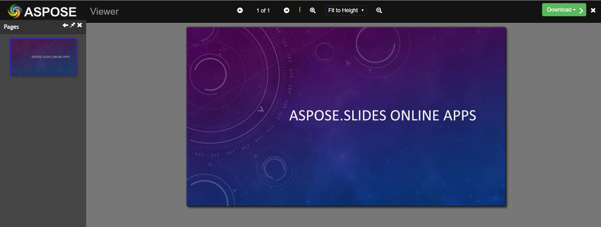
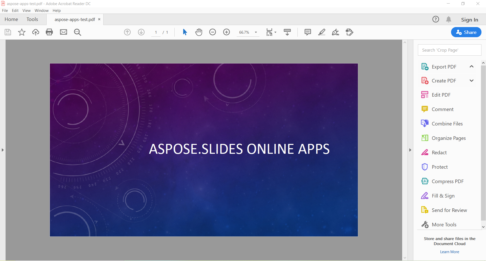

## **How to Convert PPT to PDF Online**
You can use our [free PowerPoint Online Converter](https://products.aspose.app/slides/conversion/ppt-to-pdf) to convert PPT or PPTX files to PDF quickly.

Go through these steps:

1. Go to our [PowerPoint Online Converter page](https://products.aspose.app/slides/conversion/powerpoint-to-pdf). 
2. Click **Drop or upload your files**. 
3. Select the PPT or PPTX file you want to convert on your computer. 
4. Click **Convert**. 
5. Click **DOWNLOAD NOW**. 

Your browser now saves the converted file. 

{} 

You may want to check out our free [**PPT to PDF**](https://products.aspose.app/slides/conversion/ppt-to-pdf), [**PPTX to PDF**](https://products.aspose.app/slides/conversion/pptx-to-pdf), [**ODP to PDF**](https://products.aspose.app/slides/conversion/odp-to-pdf) converters.

{} 

## **PowerPoint to PDF Conversion in C++**

[**Aspose.Slides for C++** ](https://products.aspose.com/slides/cpp/)allows you to convert files in PowerPoint PPT, PPTX, and OpenOffice ODP formats to PDF. 

To convert a presentation to PDF, simply pass the file name and save format to the [**Presentation.Save**](https://apireference.aspose.com/slides/cpp/class/aspose.slides.presentation#afcd59ec697bf05c10f78c3869de2ec9e) method. The [**Presentation**](https://apireference.aspose.com/slides/cpp/class/aspose.slides.presentation) class exposes the [**Save**](https://apireference.aspose.com/slides/cpp/class/aspose.slides.presentation#afcd59ec697bf05c10f78c3869de2ec9e) method that can be called to convert the whole PPT, PPTX, or ODP presentation into a PDF document. The [**PdfOptions**](https://apireference.aspose.com/slides/cpp/class/aspose.slides.export.pdf_options) class provides options for creating the PDF such as **JpegQuality**, **TextCompression**, **Compliance**, and others. These options can be used to get the desired standard in a PDF.

{} 

Aspose.Slides for C++ directly writes the information about API and Version Number in output documents. For example, when rendering Document to PDF, Aspose.Slides for C++ populates the Application field with the value 'Aspose.Slides' and the PDF Producer field with a value, e.g. 'Aspose.Slides v 17.10'. Please note that you cannot instruct Aspose.Slides for C++ to change or remove this information from output Documents.

{}

## **Accessibility and Compliance Standards for PDF**

With Aspose.Slides, you can use a conversion procedure that complies with [Web Content Accessibility Guidelines (**WCAG**)](https://www.w3.org/TR/WCAG-TECHS/pdf.html).

When converting a PPT document to PDF, Aspose.Slides allows you to export a PPT document to the PDF format using any of these compliance standards: **PDF/A1a**, **PDF/A1b**, and **PDF/UA**. 

This sample code shows you how to specify your preferred PDF compliance standard when converting PPT to PDF:

``` cpp
auto pres = System::MakeObject<Presentation>(u"pres.pptx");

auto pdfOptionsA1a = System::MakeObject<PdfOptions>();
pdfOptionsA1a->set_Compliance(PdfCompliance::PdfA1a);
pres->Save(u"pres-a1a-compliance.pdf", SaveFormat::Pdf, pdfOptionsA1a);

auto pdfOptionsA1b = System::MakeObject<PdfOptions>();
pdfOptionsA1b->set_Compliance(PdfCompliance::PdfA1b);
pres->Save(u"pres-a1b-compliance.pdf", SaveFormat::Pdf, pdfOptionsA1b);

auto pdfOptionsUa = System::MakeObject<PdfOptions>();
pdfOptionsUa->set_Compliance(PdfCompliance::PdfUa);
pres->Save(u"pres-ua-compliance.pdf", SaveFormat::Pdf, pdfOptionsUa);
```

Aspose.Slides for C++ typically exports the presentation documents to PDF and makes it as similar as possible to the original presentation document. Aspose.Slides renders most elements in a presentation when converting it to PDF:

- Images, Text Boxes, and other Shapes
- Text and Formatting
- Paragraphs and Formatting
- Hyperlinks
- Headers and Footers
- Bullets
- Tables

## **PPT to PDF Conversion Process Options**

Aspose.Slides for C++ allows you to customize the presentation to PDF export with different options explained in this topic.

With Aspose.Slides, you can use these options for PPT(X) to PDF conversion in a flexible way:

- Convert the whole PPT(X) presentation to PDF.
- Convert separate slides of PPT(X) to PDF.
- Convert PPT(X) to PDF with default settings. To help you simplify PPT(X) to PDF conversion process, Aspose.Slides chooses the optimal conversion settings required to define them all.
- Convert PPT(X) to PDF with custom settings. Change PDF file standard, set text compression level, choose the quality of JPEG images inside PDF document.
- Convert PPT(X) to PDF with hidden slides included.
- Set access permissions of the resulting PDF document. For example, you may convert PPT(X) to a password-protected PDF. This way, you can easily protect the resulting PDF document to prevent people from copying and editing it. 
- Convert PPT(X) to PDF with speaker notes included. Additionally, you can define how speaker notes must be rendered into PDF.
- Convert PPT(X) to PDF with comments included. You can also define comments rendering rules.
- Export presentation metafiles to PNGs, while converting PPT(X) to PDF.
- Choose font settings of PPT(X) to PDF conversion process. The API allows you to save the original fonts of the presentation during conversion. Otherwise, you can opt to define substitution fonts and rules. 


Aspose.Slides allows you to convert PPT(X) presentations to PDF document without loss in quality:

|<p>**Input PPT:**</p><p>****</p><p>** </p><p>** </p>|<p>**Output PDF:</p><p>****</p>|
| :- | :- |

## **Convert PowerPoint to PDF with Default Options**
The following example shows you how to convert a PowerPoint PPT, PPTX, and OpenOffice ODP document into a PDF document using the default options. The default options create a PDF document at the maximum quality levels

``` cpp
// Instantiate a Presentation object that represents a PPT file
auto presentation = System::MakeObject<Presentation>(u"PowerPoint.ppt");

// Save the presentation as PDF
presentation->Save(u"PPT-to-PDF.pdf", SaveFormat::Pdf);
```

## **Convert PowerPoint to PDF with Custom Options**
The following example shows you how to convert PowerPoint PPT, PPTX and OpenOffice ODP into a PDF document with customized options provided by the [**PdfOptions**](https://apireference.aspose.com/slides/cpp/class/aspose.slides.export.pdf_options) class. It sets the JPEG quality, saves metafiles to PNG, sets text compression level with [**PdfTextCompression** ](https://apireference.aspose.com/slides/cpp/namespace/aspose.slides.export#aeca6b27c8c207f9b0fe317689b25568e)enumeration and sets PDF standard.

``` cpp
// Instantiate a Presentation object that represents a PPTX file
auto presentation = System::MakeObject<Presentation>(u"PowerPoint.pptx");

// Instantiate the PdfOptions class
auto pdfOptions = System::MakeObject<PdfOptions>();

// Set Jpeg quality
pdfOptions->set_JpegQuality(90);

// Set behavior for metafiles
pdfOptions->set_SaveMetafilesAsPng(true);

// Set text compression level
pdfOptions->set_TextCompression(PdfTextCompression::Flate);

// Define the PDF standard
pdfOptions->set_Compliance(PdfCompliance::Pdf15);

// Save the presentation as PDF
presentation->Save(u"PowerPoint-to-PDF.pdf", SaveFormat::Pdf, pdfOptions);
```


## **Convert PowerPoint to PDF with Hidden Slides Included**
The following example shows how to convert a PowerPoint PPT, PPTX and OpenOffice ODP file into a PDF document with hidden slides included as provided by the [**PdfOptions**](https://apireference.aspose.com/slides/cpp/class/aspose.slides.export.pdf_options) class. You can also include comments in generated HTML by using [**PdfOptions**](https://apireference.aspose.com/slides/cpp/class/aspose.slides.export.pdf_options) class. 
It calls the set_ShowHiddenSlides() method to generate PDF with hidden slides. 
Method **set_ShowHiddenSlides()** has been added to **IHtmlOptions**, **IPdfOption**, **ISwfOptions**, 
**ITiffOptions**, **IXpsOption** interfaces and **HtmlOptions**, 
**PdfOption**, **SwfOptions**, **TiffOptions**, **XpsOption** classes. 
This method specifies whether the exported document should include hidden slides or not. 
Default value is **"false"**.

``` cpp
// Instantiate a Presentation object that represents a PPTX file
auto presentation = System::MakeObject<Presentation>(u"PowerPoint.pptx");

// Instantiate the PdfOptions class
auto pdfOptions = System::MakeObject<PdfOptions>();

// Include hidden slides
pdfOptions->set_ShowHiddenSlides(true);

// Save the presentation as PDF
presentation->Save(u"PowerPoint-to-PDF.pdf", SaveFormat::Pdf, pdfOptions);
```


## **Convert PowerPoint to Password Protected PDF**
The following example shows you how to convert a presentation to a password-protected PDF document with customized options provided by the [**PdfOptions**](https://apireference.aspose.com/slides/cpp/class/aspose.slides.export.pdf_options) class.


``` cpp
// Instantiate a Presentation object that represents a PPTX file
auto presentation = System::MakeObject<Presentation>(u"PowerPoint.pptx");

/// Instantiate the PdfOptions class
auto pdfOptions = System::MakeObject<PdfOptions>();

// Setting PDF password and access permissions
pdfOptions->set_Password(u"password");
pdfOptions->set_AccessPermissions(PdfAccessPermissions::PrintDocument | PdfAccessPermissions::HighQualityPrint);

// Save the presentation as PDF
presentation->Save(u"PPTX-to-PDF.pdf", SaveFormat::Pdf, pdfOptions);
```

## **Convert Selected Slides of PowerPoint to PDF**
The following example shows you how to convert a specific presentation slide to a PDF document with custom options.

``` cpp
// Instantiate a Presentation object that represents a PPTX file
auto presentation = System::MakeObject<Presentation>(u"PowerPoint.pptx");

// Setting array of slides positions
auto slides = System::MakeArray<int32_t>({1, 3});

// Save the presentation as PDF
presentation->Save(u"PPTX-to-PDF.pdf", slides, SaveFormat::Pdf);
```

## **Convert PowerPoint to PDF with Custom Slide Size**
The following example shows you how to convert a presentation to a PDF notes document with custom slide size. Here, each inch equals 72.

``` cpp
// The path to the documents directory.
String dataDir = GetDataPath()

// Instantiate a Presentation object that represents a presentation file 
auto presentation = System::MakeObject<Presentation>(dataDir + u"SelectedSlides.pptx");
auto auxPresentation = System::MakeObject<Presentation>();

auto slide = presentation->get_Slides()->idx_get(0);

auxPresentation->get_Slides()->InsertClone(0, slide);

// Setting Slide Type and Size 
auxPresentation->get_SlideSize()->SetSize(612.F, 792.F, SlideSizeScaleType::EnsureFit);

auto pdfOptions = System::MakeObject<PdfOptions>();
auto options = pdfOptions->get_NotesCommentsLayouting();
options->set_NotesPosition(NotesPositions::BottomFull);

auxPresentation->Save(dataDir + u"PDFnotes_out.pdf", SaveFormat::Pdf, pdfOptions);
```

## **Convert PowerPoint to PDF in Notes Slide View**
The [**Save**](https://apireference.aspose.com/slides/cpp/class/aspose.slides.presentation#afcd59ec697bf05c10f78c3869de2ec9e) method exposed by [**Presentation**](https://apireference.aspose.com/slides/cpp/class/aspose.slides.presentation) class can be used to convert the whole presentation in Notes Slide view to PDF. Saving a Microsoft PowerPoint presentation to PDF notes with Aspose.Slides for C++ is a two-line process. First, you open the presentation. Second, you save it out to PDF notes. The code snippet below updates the sample presentation to PDF in Notes Slide view.

``` cpp
// The path to the documents directory.
System::String dataDir = u"";

// Instantiate a Presentation object that represents a presentation file
auto presentation = System::MakeObject<Presentation>(dataDir + u"NotesFile.pptx");

auto pdfOptions = System::MakeObject<PdfOptions>();
auto options = pdfOptions->get_NotesCommentsLayouting();
options->set_NotesPosition(NotesPositions::BottomFull);

// Save the presentation to PDF notes
presentation->Save(dataDir + u"Pdf_Notes_out.tiff", SaveFormat::Pdf, pdfOptions);
```