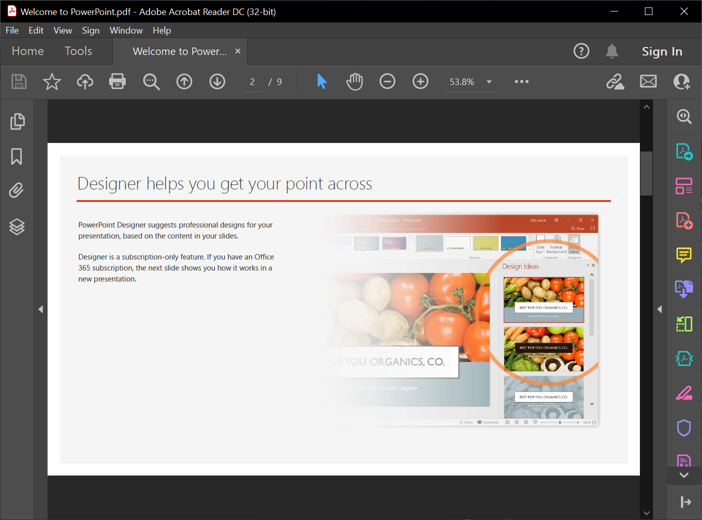

Aspose.Slides for C++ allows you to import presentations from PDFs. Essentially, you get to convert a PDF to a PowerPoint presentation.



Go through these steps:

1. Instantiate an object of the presentation class. 
2. Call the [AddFromPdf](https://apireference.aspose.com/slides/cpp/class/aspose.slides.slide_collection#a966c00d26b741a6c56e424d2f0d689a5) method and pass the PDF file. 
3. Use the [Save](https://apireference.aspose.com/slides/cpp/class/aspose.slides.presentation#afcd59ec697bf05c10f78c3869de2ec9e) method to save the file in the PowerPoint format.

This C++ code demonstrates the PDF to PowerPoint process:

```cpp
auto pres = System::MakeObject<Presentation>();
    
pres->get_Slides()->AddFromPdf(u"InputPDF.pdf");
pres->Save(u"OutputPresentation.pptx", SaveFormat::Pptx);
```

{} 

You may want to check out **Aspose free** [PDF to PowerPoint](https://products.aspose.app/slides/import/pdf-to-powerpoint) web app because it is a live implementation of the process described here. 

{} 

