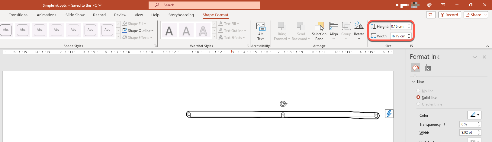
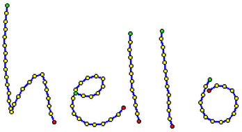
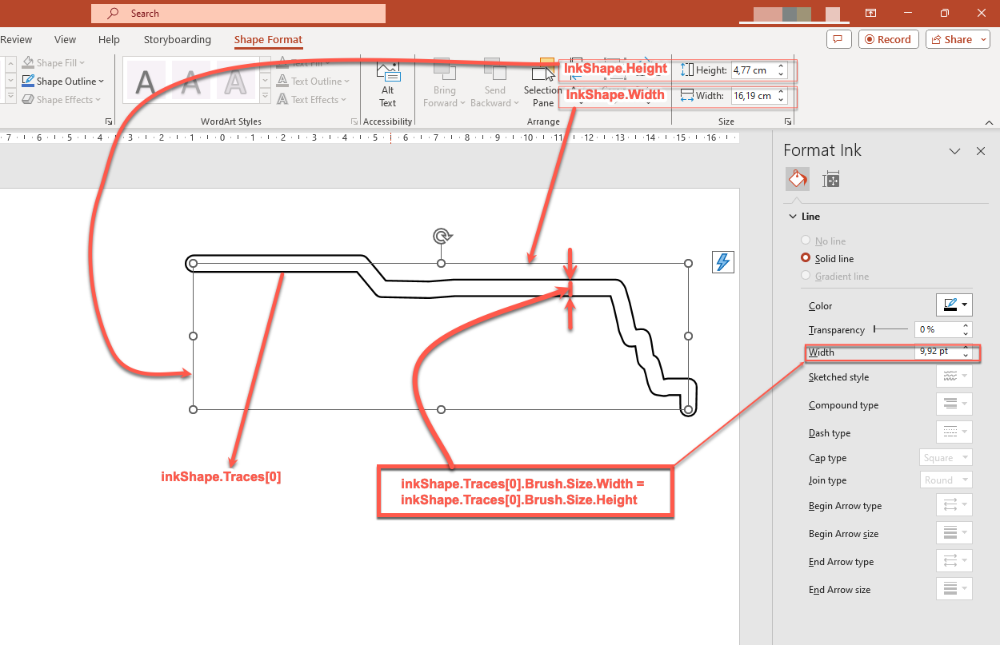
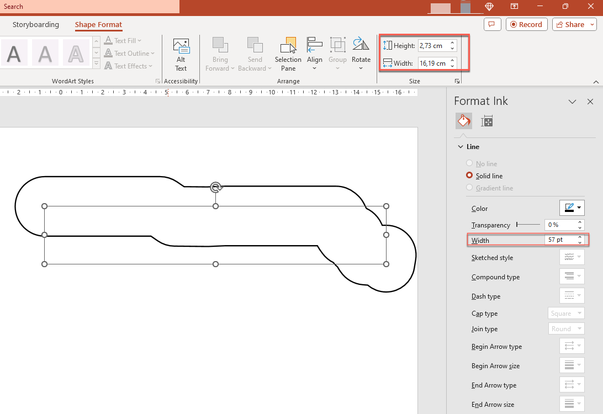
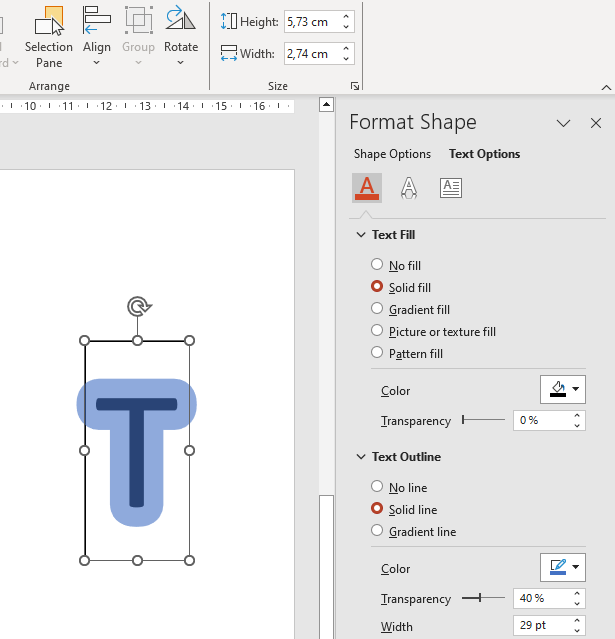

PowerPoint provides the ink function to allow you to draw non-standard figures, which can be used to highlight other objects, show connections and processes, and draw attention to specific items on a slide. 

Aspose.Slides provides the [Aspose.Slides.Ink](https://reference.aspose.com/slides/cpp/aspose.slides.ink/) interface, which contains the types you need to create and manage ink objects. 

## **Differences between Regular Object and Ink Objects**

Objects on a PowerPoint slide are typically represented by shape objects. A shape object, in its simplest form, is a container that defines the area of the object itself (its frame) alongside its properties. The latter includes the container area size, the shape of the container, the container's background, etc. For information, see [Shape Layout Format](https://docs.aspose.com/slides/cpp/shape-manipulations/#access-layout-formats-for-shape).

However, when PowerPoint is dealing with an ink object, it ignores all properties of the object frame (container) except its size. The size of the container area is determined by the standard `width` and `height` values:



## **Inkshape Traces**

Trace is a basic element or standard used to record the trajectory of a pen as a user writes digital ink. Traces are recordings that describe sequences of connected points. 

The simplest form of encoding specifies the X and Y coordinates of each sample point. When all the connected points are rendered, they produce an image like this:



## Brush Properties For Drawing 

You can use a brush to draw lines connecting trace elements' points. The brush has its own color and size, corresponding to the `Brush.Color` and `Brush.Size` properties. 

### **Set Ink Brush Color**

This C++ code shows you how to set the color for a brush: xxx

```c++

```

### **Set Ink Brush Size** 

This C++ code shows you how to set the size for a brush: xxx

```c++

```

Generally, a brush's width and height don't match, so PowerPoint does not display the brush size (the data section is grayed out). But when the brush width and height match, PowerPoint displays its size this way:


For clarity, let's increase the height of the ink object and review the important dimensions: 



The container (frame) does not consider the size of the brushes--it always assumes that the thickness of the line is zero (see the last image). 

Therefore, to determine the visible area of the entire ink object, we must consider the trace objects' brush size. Here, the target object (the handwritten text trace object) has been scaled to the container (frame) size. When the size of the container (frame) changes, the brush size remains constant and vice versa. 



PowerPoint exhibits the same behavior when dealing with texts:



**Further reading**

* To read about shapes in general, see the [PowerPoint Shapes](https://docs.aspose.com/slides/cpp/powerpoint-shapes/) section. 
* For more information on effective values, see [Shape Effective Properties](https://docs.aspose.com/slides/cpp/shape-effective-properties/#get-effective-font-height-value). 

