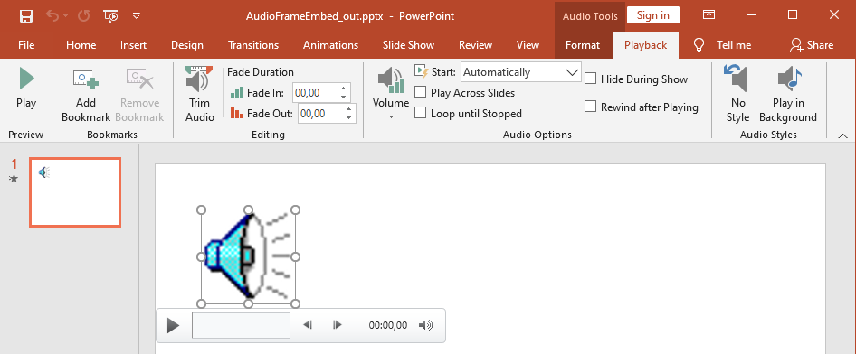

## **Creating Audio Frame**
Aspose.Slides for C++ allows you to add audio files to slides. The audio files are embedded in slides as audio frames. 

1. Create an instance of the [Presentation](https://reference.aspose.com/slides/cpp/class/aspose.slides.presentation) class.
2. Get a slide's reference through its index.
3. Load the audio file stream you want to embed in the slide.
4. Add the embedded audio frame (containing the audio file) to the slide.
5. Set [PlayMode](https://reference.aspose.com/slides/cpp/namespace/aspose.slides#a1e0dfa632c5498e693145d42f3cf8e4c) and `Volume` exposed by the [IAudioFrame](https://reference.aspose.com/slides/cpp/class/aspose.slides.i_audio_frame) object.
6. Save the modified presentation.

This C++ code shows you how to add an embedded audio frame to a slide:

``` cpp
// Instantiates a Presentation class that represents a presentation file
auto pres = System::MakeObject<Presentation>();

// Gets the first slide
auto sld = pres->get_Slides()->idx_get(0);

// Loads the wav sound file to stream
auto fstr = System::MakeObject<FileStream>(u"sampleaudio.wav", FileMode::Open, FileAccess::Read);

// Adds the Audio Frame
auto audioFrame = sld->get_Shapes()->AddAudioFrameEmbedded(50.0f, 150.0f, 100.0f, 100.0f, fstr);

// Sets the Play Mode and Volume of the Audio
audioFrame->set_PlayMode(AudioPlayModePreset::Auto);
audioFrame->set_Volume(AudioVolumeMode::Loud);

// Writes the PowerPoint file to disk
pres->Save(u"AudioFrameEmbed_out.pptx", SaveFormat::Pptx);
```

## **Change Audio Frame Thumbnail**

When you add an audio file to a presentation, the audio appears as a frame with a standard default image (see the image in the section below). You change the audio frame's thumbnail (set your preferred image).

This C++ code shows you how to change an audio frame's thumbnail or preview image:

```cpp
auto presentation = System::MakeObject<Presentation>();
        
auto slide = presentation->get_Slides()->idx_get(0);
        
// Adds an audio frame to the slide with a specified position and size.
auto audioStream = System::MakeObject<System::IO::FileStream>(u"sample2.mp3", 
    System::IO::FileMode::Open, System::IO::FileAccess::Read);
    
auto audioFrame = slide->get_Shapes()->AddAudioFrameEmbedded(150.0f, 100.0f, 50.0f, 50.0f, audioStream);
            
// Adds an image to presentation resources.
auto imageStream = System::IO::File::OpenRead(u"eagle.jpeg");
auto audioImage = presentation->get_Images()->AddImage(imageStream);
            
// Sets the image for the audio frame.
audioFrame->get_PictureFormat()->get_Picture()->set_Image(audioImage); // <-----
        
//Saves the modified presentation to disk
presentation->Save(u"example_out.pptx", Aspose::Slides::Export::SaveFormat::Pptx);
```

## **Change Audio Play Options**

Aspose.Slides for C++ allows you to change options that control an audio's playback or properties. For example, you can adjust an audio's volume, set the audio to play looped, or even hide the audio icon.

The **Audio Options** pane in Microsoft PowerPoint:



PowerPoint Audio options that correspond to Aspose.Slides [AudioFrame](https://reference.aspose.com/slides/cpp/class/aspose.slides.audio_frame) methods:
- Audio Options **Start** drop-down list matches the [AudioFrame::get_PlayMode()](https://reference.aspose.com/slides/cpp/class/aspose.slides.audio_frame#a5379c1a9c1166234d674b32413215a2b) method 
- Audio Options **Volume** matches the [AudioFrame::get_Volume()](https://reference.aspose.com/slides/cpp/class/aspose.slides.audio_frame#af06a3176684b6a13326bc8526747d9f3)  method 
- Audio Options **Play Across Slides** matches the [AudioFrame::get_PlayAcrossSlides()](https://reference.aspose.com/slides/cpp/class/aspose.slides.audio_frame#a3c6ffc45b319ce127384fc37e188f7b0)  method 
- Audio Options **Loop until Stopped** matches the [AudioFrame::get_PlayLoopMode()](https://reference.aspose.com/slides/cpp/class/aspose.slides.audio_frame#a99b5b9cc650e93eba813bd8b2371315b)  method 
- Audio Options **Hide During Show** matches the  [AudioFrame::get_HideAtShowing() ](https://reference.aspose.com/slides/cpp/class/aspose.slides.audio_frame#abd008322e6a3d7d06bed527e329a9082)  method 
- Audio Options **Rewind after Playing** matches the [AudioFrame::get_RewindAudio() ](https://reference.aspose.com/slides/cpp/class/aspose.slides.audio_frame#a4900e1df6477db16e8cdd859ad54e637) method 

This is how you change the Audio Play options:

1. [Сreate](#creating-audio-frame) or get the Audio Frame.
2. Set new values for the Audio Frame properties you want to adjust.
3. Save the modified PowerPoint file.

This C++ code demonstrates an operation in which an audio's options are adjusted:

``` cpp 
auto pres = System::MakeObject<Presentation>(u"AudioFrameEmbed_out.pptx");

// GetS a shape
auto shape = pres->get_Slides()->idx_get(0)->get_Shapes()->idx_get(0);

// Casts the shape to an AudioFrame shape
auto audioFrame = System::DynamicCast<AudioFrame>(shape);

// Sets the Play mode to play on click
audioFrame->set_PlayMode(AudioPlayModePreset::OnClick);

// Sets the Volume to Low
audioFrame->set_Volume(AudioVolumeMode::Low);

// Sets the audio to play across slides
audioFrame->set_PlayAcrossSlides(true);

// Disables loop for the audio
audioFrame->set_PlayLoopMode(false);

// Hides the AudioFrame during the slide show
audioFrame->set_HideAtShowing(true);

// Rewinds the audio to start after playing
audioFrame->set_RewindAudio(true);

// Saves the PowerPoint file to disk
pres->Save(u"AudioFrameEmbed_changed.pptx", SaveFormat::Pptx);
```

## **Extract Audio**
Aspose.Slides for .NET allows you to extract the sound used in slide show transitions. For example, you can extract the sound used in a specific slide.

1. Create an instance of the [Presentation](https://reference.aspose.com/slides/cpp/class/aspose.slides.presentation) class and load the presentation containing the audio.
2. Get the relevant slide's reference through its index.
3. Access the slideshow transitions for the slide.
4. Extract the sound in byte data.

This C++ code shows you how to extract the audio used in a slide:

``` cpp
String presName = u"AudioSlide.pptx";

// Instantiates a Presentation class that represents a presentation file
auto pres = System::MakeObject<Presentation>(presName);

// Accesses the desired slide
auto slide = pres->get_Slides()->idx_get(0);

// Gets the slideshow transition effects for the slide
auto transition = slide->get_SlideShowTransition();

// Extracts the sound in byte array
auto audio = transition->get_Sound()->get_BinaryData();

Console::WriteLine(String(u"Length: ") + audio->get_Length());
```
