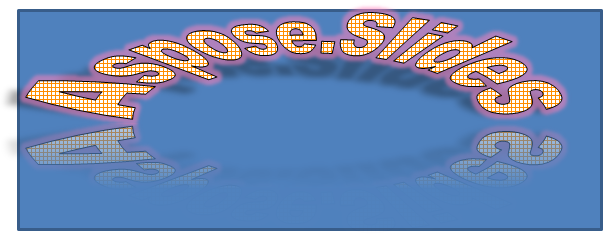
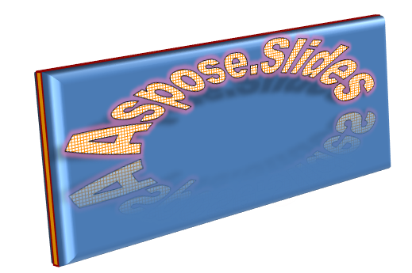
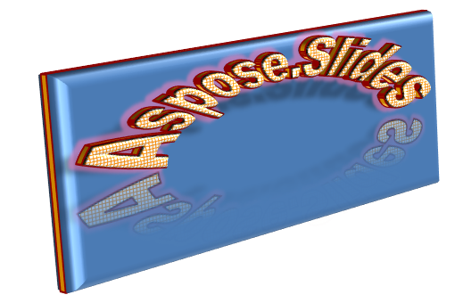

## **About WordArt?**
WordArt or Word Art is a feature that allows you to apply effects to texts to make them stand out. With WordArt, for example, you can outline a text or fill it with a color (or gradient), add 3D effects to it, etc. You also get to skew, bend, and stretch the shape of a text. 

{} 

WordArt allows you to treat a text as you would a graphical object. In general, WordArt consists of effects or special modifications made to texts to make them more attractive or noticeable. 

{} 

**WordArt in Microsoft PowerPoint**

To use WordArt in Microsoft PowerPoint, you have to select one of the predefined WordArt templates. A WordArt template is a set of effects that gets applied to a text or its shape. 

**WordArt in Aspose.Slides**

In Aspose.Slides for C++ 20.10, we implemented support for WordArt and made improvements to the feature in subsequent Aspose.Slides for C++ releases. 

With Aspose.Slides for C++, you can easily create your own WordArt template (one effect or combination of effects) in C++ and apply it to texts. 

## Creating a Simple WordArt Template and Applying It to a Text

**Using Aspose.Slides** 

First, we create a simple text using this C++ code: 

``` cpp 
auto pres = System::MakeObject<Presentation>();
auto slide = pres->get_Slides()->idx_get(0);
auto autoShape = slide->get_Shapes()->AddAutoShape(ShapeType::Rectangle, 200.0f, 200.0f, 400.0f, 200.0f);
auto textFrame = autoShape->get_TextFrame();

auto portion = textFrame->get_Paragraphs()->idx_get(0)->get_Portions()->idx_get(0);
portion->set_Text(u"Aspose.Slides");
```

Now, we set the text’s font height to a bigger value to make the effect more noticeable through this code:

``` cpp 
auto fontData = System::MakeObject<FontData>(u"Arial Black");
portion->get_PortionFormat()->set_LatinFont(fontData);
portion->get_PortionFormat()->set_FontHeight(36.0f);
```

**Using Microsoft PowerPoint**

Go to the WordArt effects menu in Microsoft PowerPoint:


From the menu on the right, you can choose a predefined WordArt effect. From the menu on the left, you can specify the settings for a new WordArt. 

These are some of the available parameters or options:


**Using Aspose.Slides**

Here, we apply the SmallGrid pattern color to the text and add a 1-width black text border using this code:

``` cpp 
auto fillFormat = portion->get_PortionFormat()->get_FillFormat();
fillFormat->set_FillType(FillType::Pattern);
fillFormat->get_PatternFormat()->get_ForeColor()->set_Color(Color::get_DarkOrange());
fillFormat->get_PatternFormat()->get_BackColor()->set_Color(Color::get_White());
fillFormat->get_PatternFormat()->set_PatternStyle(PatternStyle::SmallGrid);

auto lineFillFormat = portion->get_PortionFormat()->get_LineFormat()->get_FillFormat();
lineFillFormat->set_FillType(FillType::Solid);
lineFillFormat->get_SolidFillColor()->set_Color(Color::get_Black());
```

The resulting text:


## Applying Other WordArt Effects

**Using Microsoft PowerPoint**

From the program’s interface, you can apply these effects to a text, text block, shape, or similar element:


For example, Shadow, Reflection, and Glow effects can be applied to a text; 3D Format and 3D Rotation effects can be applied to a text block; Soft Edges property can be applied to a Shape Object (it still has an effect when no 3D Format property is set). 

### Applying Shadow Effects

Here, we intend to set the properties relating to a text only. We apply the shadow effect to a text using this code in C++:

``` cpp 
auto effectFormat = portion->get_PortionFormat()->get_EffectFormat();
effectFormat->EnableOuterShadowEffect();

auto outerShadowEffect = effectFormat->get_OuterShadowEffect();
outerShadowEffect->get_ShadowColor()->set_Color(Color::get_Black());
outerShadowEffect->set_ScaleHorizontal(100);
outerShadowEffect->set_ScaleVertical(65);
outerShadowEffect->set_BlurRadius(4.73);
outerShadowEffect->set_Direction(230.0f);
outerShadowEffect->set_Distance(2);
outerShadowEffect->set_SkewHorizontal(30);
outerShadowEffect->set_SkewVertical(0);
outerShadowEffect->get_ShadowColor()->get_ColorTransform()->Add(ColorTransformOperation::SetAlpha, 0.32f);
```

Aspose.Slides API supports three types of shadows: OuterShadow, InnerShadow, and PresetShadow. 

 With PresetShadow, you can apply a shadow for a text (using preset values). 

**Using Microsoft PowerPoint**

In PowerPoint, you can use one type of shadow. Here’s an example:


**Using Aspose.Slides**

Aspose.Slides actually allows you to apply two types of shadows at once: InnerShadow and PresetShadow.

**Notes:**

- When OuterShadow and PresetShadow are used together, only the OuterShadow effect gets applied. 
- If OuterShadow and InnerShadow get used simultaneously, the resulting or applied effect depends on the PowerPoint version. For instance, in PowerPoint 2013, the effect gets doubled. But in PowerPoint 2007, the OuterShadow effect gets applied. 

### Applying Display to Texts

We add display to the text through this code sample in C++:

``` cpp 
auto effectFormat = portion->get_PortionFormat()->get_EffectFormat();
effectFormat->EnableReflectionEffect();

auto reflectionEffect = effectFormat->get_ReflectionEffect();
reflectionEffect->set_BlurRadius(0.5);
reflectionEffect->set_Distance(4.72);
reflectionEffect->set_StartPosAlpha(0.f);
reflectionEffect->set_EndPosAlpha(60.f);
reflectionEffect->set_Direction(90.0f);
reflectionEffect->set_ScaleHorizontal(100);
reflectionEffect->set_ScaleVertical(-100);
reflectionEffect->set_StartReflectionOpacity(60.f);
reflectionEffect->set_EndReflectionOpacity(0.9f);
reflectionEffect->set_RectangleAlign(RectangleAlignment::BottomLeft);
```

### Applying Glow Effect to Texts

We apply the glow effect to the text to make it shine or stand out using this code:

``` cpp 
auto effectFormat = portion->get_PortionFormat()->get_EffectFormat();
effectFormat->EnableGlowEffect();

auto glowEffect = effectFormat->get_GlowEffect();
glowEffect->get_Color()->set_R(255);
glowEffect->get_Color()->get_ColorTransform()->Add(ColorTransformOperation::SetAlpha, 0.54f);
glowEffect->set_Radius(7);
```

The result of the operation:


{} 

You can change the parameters for shadow, display, and glow. The effects’ properties get set on each portion of the text separately. 

{} 

### Using Transformations in WordArt

We use the set_Transform method (inherent in the entire block of text) through this code:

``` cpp 
textFrame->get_TextFrameFormat()->set_Transform(TextShapeType::ArchUpPour);
```

The result:



{} 

Both Microsoft PowerPoint and Aspose.Slides for C++ provide a certain number of predefined transformation types. 

{} 

**Using PowerPoint**

To access predefined transformation types, go through: **Format** -> **TextEffect** -> **Transform**

**Using Aspose.Slides**

To select a transformation type, use the TextShapeType enum. 

### Applying 3D effects to Texts and Shapes

We set a 3D effect to a text shape using this sample code:

``` cpp 
auto threeDFormat = autoShape->get_ThreeDFormat();

threeDFormat->get_BevelBottom()->set_BevelType(BevelPresetType::Circle);
threeDFormat->get_BevelBottom()->set_Height(10.5);
threeDFormat->get_BevelBottom()->set_Width(10.5);

threeDFormat->get_BevelTop()->set_BevelType(BevelPresetType::Circle);
threeDFormat->get_BevelTop()->set_Height(12.5);
threeDFormat->get_BevelTop()->set_Width(11);

threeDFormat->get_ExtrusionColor()->set_Color(Color::get_Orange());
threeDFormat->set_ExtrusionHeight(6);

threeDFormat->get_ContourColor()->set_Color(Color::get_DarkRed());
threeDFormat->set_ContourWidth(1.5);

threeDFormat->set_Depth(3);

threeDFormat->set_Material(MaterialPresetType::Plastic);

threeDFormat->get_LightRig()->set_Direction(LightingDirection::Top);
threeDFormat->get_LightRig()->set_LightType(LightRigPresetType::Balanced);
threeDFormat->get_LightRig()->SetRotation(0.0f, 0.0f, 40.0f);

threeDFormat->get_Camera()->set_CameraType(CameraPresetType::PerspectiveContrastingRightFacing);
```

The resulting text and its shape:



We apply a 3D effect to the text with this C++ code:

``` cpp 
auto threeDFormat = textFrame->get_TextFrameFormat()->get_ThreeDFormat();

threeDFormat->get_BevelBottom()->set_BevelType(BevelPresetType::Circle);
threeDFormat->get_BevelBottom()->set_Height(3.5);
threeDFormat->get_BevelBottom()->set_Width(3.5);

threeDFormat->get_BevelTop()->set_BevelType(BevelPresetType::Circle);
threeDFormat->get_BevelTop()->set_Height(4);
threeDFormat->get_BevelTop()->set_Width(4);

threeDFormat->get_ExtrusionColor()->set_Color(Color::get_Orange());
threeDFormat->set_ExtrusionHeight(6);

threeDFormat->get_ContourColor()->set_Color(Color::get_DarkRed());
threeDFormat->set_ContourWidth(1.5);

threeDFormat->set_Depth(3);

threeDFormat->set_Material(MaterialPresetType::Plastic);

threeDFormat->get_LightRig()->set_Direction(LightingDirection::Top);
threeDFormat->get_LightRig()->set_LightType(LightRigPresetType::Balanced);
threeDFormat->get_LightRig()->SetRotation(0.0f, 0.0f, 40.0f);

threeDFormat->get_Camera()->set_CameraType(CameraPresetType::PerspectiveContrastingRightFacing);
```

The result of the operation:



{} 

The application of 3D effects to texts or their shapes and interactions between effects are based on certain rules. 

Consider a scene for a text and the shape containing that text. The 3D effect contains 3D object representation and the scene on which the object got placed. 

- When the scene is set for both the figure and the text, the figure scene gets the higher priority—the text scene is ignored. 
- When the figure lacks its own scene but has 3D representation, the text scene is used. 
- Otherwise—when the shape originally has no 3D effect—the shape is flat and the 3D effect only gets applied to the text. 

 These descriptions are connected to the ThreeDFormat.getLightRig() and ThreeDFormat.getCamera() methods.

{} 

## **Apply Outer Shadow Effects to Texts**
Aspose.Slides for C++ provides the [**IOuterShadow**](https://apireference.aspose.com/slides/cpp/class/aspose.slides.effects.i_outer_shadow) and [**IInnerShadow**](https://apireference.aspose.com/slides/cpp/class/aspose.slides.effects.i_inner_shadow) classes that allow you to apply shadow effects to a text carried by TextFrame. Go through these steps:

1. Create an instance of the [Presentation](https://apireference.aspose.com/slides/cpp/class/aspose.slides.presentation) class.
2. Obtain the reference of a slide by using its index.
3. Add an AutoShape of Rectangle type to the slide.
4. Access the TextFrame associated with the AutoShape.
5. Set the FillType of the AutoShape to NoFill.
6. Instantiate OuterShadow class
7. Set the BlurRadius of the shadow.
8. Set the Direction of the shadow
9. Set the Distance of the shadow.
10. Set the RectanglelAlign to TopLeft.
11. Set the PresetColor of the shadow to Black.
12. Write the presentation as a PPTX file.

This sample code in C++—an implementation of the steps above—shows you how to apply the outer shadow effect to a text:

``` cpp
auto pres = System::MakeObject<Presentation>();
// Get reference of the slide
auto sld = pres->get_Slides()->idx_get(0);

// Add an AutoShape of Rectangle type
auto ashp = sld->get_Shapes()->AddAutoShape(ShapeType::Rectangle, 150.0f, 75.0f, 150.0f, 50.0f);

// Add TextFrame to the Rectangle
ashp->AddTextFrame(u"Aspose TextBox");

// Disable shape fill in case we want to get shadow of text
ashp->get_FillFormat()->set_FillType(FillType::NoFill);

// Add outer shadow and set all necessary parameters
ashp->get_EffectFormat()->EnableOuterShadowEffect();
auto shadow = ashp->get_EffectFormat()->get_OuterShadowEffect();
shadow->set_BlurRadius(4.0);
shadow->set_Direction(45.0f);
shadow->set_Distance(3);
shadow->set_RectangleAlign(RectangleAlignment::TopLeft);
shadow->get_ShadowColor()->set_PresetColor(PresetColor::Black);

// Write the presentation to disk
pres->Save(u"pres_out.pptx", SaveFormat::Pptx);
```


## **Apply Inner Shadow Effect to Shapes**
Go through these steps:

1. Create an instance of the [Presentation](https://apireference.aspose.com/slides/cpp/class/aspose.slides.presentation) class.
2. Get a reference of the slide.
3. Add an AutoShape of the Rectangle type.
4. Enable InnerShadowEffect.
5. Set all the necessary parameters.
6. Set the ColorType as Scheme.
7. Set the Scheme Color.
8. Write the presentation as a [PPTX](https://docs.fileformat.com/presentation/pptx/) file.

This sample code (based on the steps above) shows you how to add a connector between two shapes in C++:

``` cpp
auto presentation = System::MakeObject<Presentation>();
// Get reference of a slide
auto slide = presentation->get_Slides()->idx_get(0);

// Add an AutoShape of Rectangle type
auto ashp = slide->get_Shapes()->AddAutoShape(ShapeType::Rectangle, 150.0f, 75.0f, 400.0f, 300.0f);
ashp->get_FillFormat()->set_FillType(FillType::NoFill);

// Add TextFrame to the Rectangle
ashp->AddTextFrame(u"Aspose TextBox");
auto port = ashp->get_TextFrame()->get_Paragraphs()->idx_get(0)->get_Portions()->idx_get(0);
auto pf = port->get_PortionFormat();
pf->set_FontHeight(50.0f);

// Enable InnerShadowEffect    
auto ef = pf->get_EffectFormat();
ef->EnableInnerShadowEffect();

// Set all necessary parameters
auto shadow = ef->get_InnerShadowEffect();
shadow->set_BlurRadius(8.0);
shadow->set_Direction(90.0F);
shadow->set_Distance(6.0);
shadow->get_ShadowColor()->set_B(189);

// Set ColorType as Scheme
shadow->get_ShadowColor()->set_ColorType(ColorType::Scheme);

// Set Scheme Color
shadow->get_ShadowColor()->set_SchemeColor(SchemeColor::Accent1);

// Save Presentation
presentation->Save(u"WordArt_out.pptx", SaveFormat::Pptx);
```

