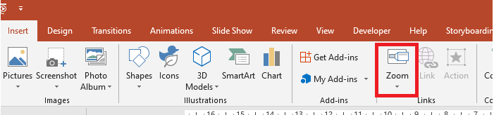
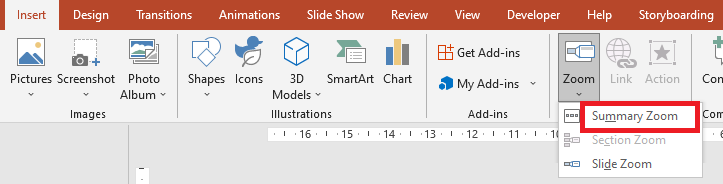

## **Overview**
A slide zoom can help you make your presentation more dynamic. It allows you to navigate freely between slides in any order without interruptions to the flow of your presentation. 

With a slide zoom, you get to deeply examine several information parts while feeling like you were on a single canvas. 



To allow you use zoom objects, Aspose.Slides provides the [ZoomImageType](https://apireference.aspose.com/slides/cpp/namespace/aspose.slides#ac0802a52a7f14a457b62e9761a77e8e2) enumeration, the [IZoomFrame](https://apireference.aspose.com/slides/cpp/class/aspose.slides.i_zoom_frame) interface, and some methods in the [IShapeCollection](https://apireference.aspose.com/slides/cpp/class/aspose.slides.i_shape_collection) interface.

## **Creating Zoom Frames**
Zoom frame is one of the shapes offered by Aspose.Slides for C++. We intend to provide simple steps and examples to show you how to add zoom frames to slides. 

You can add a zoom frame in a slide using Aspose.Slides for C++ this way:

1.	Create an instance of the [Presentation](https://apireference.aspose.com/slides/cpp/class/aspose.slides.presentation) class.
2.	Create new slides to which you intend to link. 
3.	Add an identification text and background to the created slides.
4.  Add zoom frames (containing the references to created slides) into the first slide.
5.	Write the modified presentation as a PPTX file.

This sample code shows you how to create a zoom frame in a slide:
``` cpp 
System::SharedPtr<Presentation> pres = System::MakeObject<Presentation>();

// Add new slides to the presentation
System::SharedPtr<ISlide> slide2 = pres->get_Slides()->AddEmptySlide(pres->get_Slides()->idx_get(0)->get_LayoutSlide());
System::SharedPtr<ISlide> slide3 = pres->get_Slides()->AddEmptySlide(pres->get_Slides()->idx_get(0)->get_LayoutSlide());

// Create a background for the second slide
slide2->get_Background()->set_Type(BackgroundType::OwnBackground);
slide2->get_Background()->get_FillFormat()->set_FillType(FillType::Solid);
slide2->get_Background()->get_FillFormat()->get_SolidFillColor()->set_Color(Color::get_Cyan());

// Create a text box for the second slide
System::SharedPtr<IAutoShape> autoshape = slide2->get_Shapes()->AddAutoShape(ShapeType::Rectangle, 100.0f, 200.0f, 500.0f, 200.0f);
autoshape->get_TextFrame()->set_Text(u"Second Slide");

// Create a background for the third slide
slide3->get_Background()->set_Type(BackgroundType::OwnBackground);
slide3->get_Background()->get_FillFormat()->set_FillType(FillType::Solid);
slide3->get_Background()->get_FillFormat()->get_SolidFillColor()->set_Color(Color::get_DarkKhaki());

// Create a text box for the third slide
autoshape = slide3->get_Shapes()->AddAutoShape(ShapeType::Rectangle, 100.0f, 200.0f, 500.0f, 200.0f);
autoshape->get_TextFrame()->set_Text(u"Trird Slide");

// Add ZoomFrame objects
pres->get_Slides()->idx_get(0)->get_Shapes()->AddZoomFrame(20.0f, 20.0f, 250.0f, 200.0f, slide2);
pres->get_Slides()->idx_get(0)->get_Shapes()->AddZoomFrame(200.0f, 250.0f, 250.0f, 200.0f, slide3);

// Save the presentation
pres->Save(u"presentation.pptx", SaveFormat::Pptx);
```
## **Creating Zoom Frames with Custom Images**
With Aspose.Slides for C++, you can create a zoom frame with an image other than the slide preview image this way: 
1.	Create an instance of the [Presentation](https://apireference.aspose.com/slides/cpp/class/aspose.slides.presentation) class.
2.	Create a new slide to which you intend to link. 
3.	Add an identification text and background to created slide.
4.  Create an [IPPImage](https://apireference.aspose.com/slides/cpp/class/aspose.slides.i_p_p_image) object by adding an image to the Images collection associated with the Presentation object that will be used to fill the frame.
5.  Add zoom frames (containing the reference to created slide) into the first slide.
6.	Write the modified presentation as a PPTX file.

This sample code shows you how to create a zoom frame with a different image:

``` cpp 
System::SharedPtr<Presentation> pres = System::MakeObject<Presentation>();

// Add a new slide to the presentation
System::SharedPtr<ISlide> slide = pres->get_Slides()->AddEmptySlide(pres->get_Slides()->idx_get(0)->get_LayoutSlide());

// Create a background for the second slide
slide->get_Background()->set_Type(BackgroundType::OwnBackground);
slide->get_Background()->get_FillFormat()->set_FillType(FillType::Solid);
slide->get_Background()->get_FillFormat()->get_SolidFillColor()->set_Color(Color::get_Cyan());

// Create a text box for the third slide
System::SharedPtr<IAutoShape> autoshape = slide->get_Shapes()->AddAutoShape(ShapeType::Rectangle, 100.0f, 200.0f, 500.0f, 200.0f);
autoshape->get_TextFrame()->set_Text(u"Second Slide");

// Create a new image for the zoom object
System::SharedPtr<IPPImage> image = pres->get_Images()->AddImage(Image::FromFile(u"image.png"));

// Add the ZoomFrame object
pres->get_Slides()->idx_get(0)->get_Shapes()->AddZoomFrame(20.0f, 20.0f, 300.0f, 200.0f, slide, image);

// Save the presentation
pres->Save(u"presentation.pptx", SaveFormat::Pptx);
```

## **Formatting Zoom Frames**
In the previous sections (above), we showed you how to create simple zoom frames. To create more complicated zoom frames, you have to alter the frames' formatting. There are several formatting settings you can apply on a zoom frame. 

You can control the formatting of a zoom frame in a slide this way:

1.	Create an instance of the [Presentation](https://apireference.aspose.com/slides/cpp/class/aspose.slides.presentation) class.
2.	Create new slides to link to.
3.	Add identification text and background to created slides.
4.  Add zoom frames (containing the references to created slides) into the first slide.
5.  Create an [IPPImage](https://apireference.aspose.com/slides/cpp/class/aspose.slides.i_p_p_image) object by adding an image to the Images collection associated with the Presentation object that will be used to fill the frame.
6.  Set a custom image for the first zoom frame object.
7.  Change the line format for the second zoom frame object.
8.  Remove the background from an image of the second zoom frame object.
5.	Write the modified presentation as a PPTX file.

This sample code shows you how to change the formatting of a zoom frame: 

``` cpp 
System::SharedPtr<Presentation> pres = System::MakeObject<Presentation>();

// Add new slides to presentation
System::SharedPtr<ISlide> slide2 = pres->get_Slides()->AddEmptySlide(pres->get_Slides()->idx_get(0)->get_LayoutSlide());
System::SharedPtr<ISlide> slide3 = pres->get_Slides()->AddEmptySlide(pres->get_Slides()->idx_get(0)->get_LayoutSlide());

// Create a background for the second slide
slide2->get_Background()->set_Type(BackgroundType::OwnBackground);
slide2->get_Background()->get_FillFormat()->set_FillType(FillType::Solid);
slide2->get_Background()->get_FillFormat()->get_SolidFillColor()->set_Color(Color::get_Cyan());

// Create a text box for the second slide
System::SharedPtr<IAutoShape> autoshape = slide2->get_Shapes()->AddAutoShape(ShapeType::Rectangle, 100.0f, 200.0f, 500.0f, 200.0f);
autoshape->get_TextFrame()->set_Text(u"Second Slide");

// Create a background for the third slide
slide3->get_Background()->set_Type(BackgroundType::OwnBackground);
slide3->get_Background()->get_FillFormat()->set_FillType(FillType::Solid);
slide3->get_Background()->get_FillFormat()->get_SolidFillColor()->set_Color(Color::get_DarkKhaki());

// Create a text box for the third slide
autoshape = slide3->get_Shapes()->AddAutoShape(ShapeType::Rectangle, 100.0f, 200.0f, 500.0f, 200.0f);
autoshape->get_TextFrame()->set_Text(u"Trird Slide");

// Add ZoomFrame objects
System::SharedPtr<IZoomFrame> zoomFrame1 = pres->get_Slides()->idx_get(0)->get_Shapes()->AddZoomFrame(20.0f, 20.0f, 250.0f, 200.0f, slide2);
System::SharedPtr<IZoomFrame> zoomFrame2 = pres->get_Slides()->idx_get(0)->get_Shapes()->AddZoomFrame(200.0f, 250.0f, 250.0f, 200.0f, slide3);

// Create a new image for the zoom object
System::SharedPtr<IPPImage> image = pres->get_Images()->AddImage(Image::FromFile(u"image.png"));
// Set custom image for zoomFrame1 object
zoomFrame1->set_Image(image);

// Set a zoom frame format for the zoomFrame2 object
zoomFrame2->get_LineFormat()->set_Width(5);
zoomFrame2->get_LineFormat()->get_FillFormat()->set_FillType(FillType::Solid);
zoomFrame2->get_LineFormat()->get_FillFormat()->get_SolidFillColor()->set_Color(Color::get_HotPink());
zoomFrame2->get_LineFormat()->set_DashStyle(LineDashStyle::DashDot);

// Do not show background for zoomFrame2 object
zoomFrame2->set_ShowBackground(false);

// Save the presentation
pres->Save(u"presentation.pptx", SaveFormat::Pptx);
```

## **Creating a Summary Zoom**
A summary zoom is like a landing page that allows you to see all the parts of your presentation at once. By adding a summary zoom to your presentation, you get to jump in and out of different slides or move between them in any order. 



Aspose.Slides for C++ has no methods for creating a summary zoom, but it has an API that allows you to achieve the same effect and do even more. 

You can create a summary zoom in a slide this way:

1.	Create an instance of the [Presentation](https://apireference.aspose.com/slides/cpp/class/aspose.slides.presentation) class.
2.	Create new slides to which you intend to link. 
3.	Add an identification text and background to the created slides.
6.  Add zoom frames (containing the references to created slides) into the first slide.
5.  Pass `true` to the [set_ReturnToParent](https://apireference.aspose.com/slides/cpp/class/aspose.slides.i_zoom_frame#a8aed83f47c55e3af54b67fd294fb2c59) method of every zoom frame object.

**Note**: If you have your own custom algorithm for placing zoom frame objects on a slide, you can use it. 

This sample code shows you how to create a summary zoom using Aspose.Slides for C++:

``` cpp 
System::SharedPtr<Presentation> pres = System::MakeObject<Presentation>();
        
// Create slides array
for (int32_t slideNumber = 0; slideNumber < 5; slideNumber++)
{
    // Add new slides to presentation
    System::SharedPtr<ISlide> slide = pres->get_Slides()->AddEmptySlide(pres->get_Slides()->idx_get(0)->get_LayoutSlide());
    
    // Create a background for the slide
    slide->get_Background()->set_Type(BackgroundType::OwnBackground);
    slide->get_Background()->get_FillFormat()->set_FillType(FillType::Solid);
    slide->get_Background()->get_FillFormat()->get_SolidFillColor()->set_Color(Color::get_DarkKhaki());
    
    // Create a text box for the slide
    System::SharedPtr<IAutoShape> autoshape = slide->get_Shapes()->AddAutoShape(ShapeType::Rectangle, 100.0f, 200.0f, 500.0f, 200.0f);
    autoshape->get_TextFrame()->set_Text(String::Format(u"Slide - {0}", slideNumber + 2));
}

// Create zoom objects for all slides in the first slide
for (int32_t slideNumber = 1; slideNumber < pres->get_Slides()->get_Count(); slideNumber++)
{
    int32_t x = (slideNumber - 1) * 100;
    int32_t y = (slideNumber - 1) * 100;
    System::SharedPtr<IZoomFrame> zoomFrame = pres->get_Slides()->idx_get(0)->get_Shapes()->AddZoomFrame(static_cast<float>(x), static_cast<float>(y), 150.0f, 120.0f, pres->get_Slides()->idx_get(slideNumber));
    
    // Pass 'true' to the set_ReturnToParent method to return to the first slide
    zoomFrame->set_ReturnToParent(true);
}

// Save the presentation
pres->Save(u"presentation.pptx", SaveFormat::Pptx);
```
