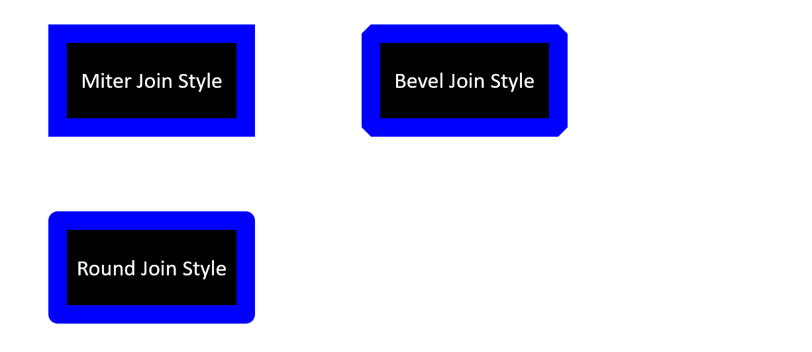

In PowerPoint, you can add shapes to slides. Since shapes are made of up lines, you can format shapes by modifying or applying certain effects to their constituent lines. Additionally, you can format shapes by specifying settings that determine how they (the area in them) are filled. 


**Aspose.Slides for C++** provides interfaces and properties that allow you to format shapes based on known options in PowerPoint. 

## **Format Lines**

Using Aspose.Slides, you can specify your preferred line style for a shape. These steps outline such a procedure:

1. Create an instance of the [Presentation](https://reference.aspose.com/slides/cpp/class/aspose.slides.presentation) class.
2. Get a slide's reference through its index. 
3. Add an [IShape](https://reference.aspose.com/slides/cpp/class/aspose.slides.i_shape) to the slide.
4. Set a color for the shape lines.
5. Set the width for the shape lines.
6. Set the [line style](https://reference.aspose.com/slides/cpp/namespace/aspose.slides#a837c78839bf6ebb16979455cd1de59e4) for the shape line
7. Set the [dash style](https://reference.aspose.com/slides/cpp/namespace/aspose.slides#a7eaad354a35a3b567a7327d625be3c6e) for the shape line. 
8. Write the modified presentation as a PPTX file.

This C++ code demonstrates an operation where we formatted a rectangle `AutoShape`:

```cpp
// Instantiates a presentation class that represents a presentation file
auto pres = MakeObject<Presentation>();

// Gets the first slide
auto slide = pres->get_Slides()->idx_get(0);

// Adds autoshape of rectangle type
auto shape = slide->get_Shapes()->AddAutoShape(ShapeType::Rectangle, 50, 150, 150, 75);

// Sets the fill color for the rectangle shape
shape->get_FillFormat()->set_FillType(FillType::Solid);
shape->get_FillFormat()->get_SolidFillColor()->set_Color(Color::get_White());

// Applies some formatting on the rectangle's lines
shape->get_LineFormat()->set_Style(LineStyle::ThickThin);
shape->get_LineFormat()->set_Width(7);
shape->get_LineFormat()->set_DashStyle(LineDashStyle::Dash);

// Sets the color for the rectangle's line
shape->get_LineFormat()->get_FillFormat()->set_FillType(FillType::Solid);
shape->get_LineFormat()->get_FillFormat()->get_SolidFillColor()->set_Color(Color::get_Blue());

// Writes the PPTX file to disk
pres->Save(u"RectShpLn_out.pptx", Aspose::Slides::Export::SaveFormat::Pptx);
```

## **Format Join Styles**
These are the 3 join type options:

* Round
* Miter
* Bevel

By default, when PowerPoint joins two lines at an angle (or a shape's corner), it uses the **Round** setting. However, if you are looking to draw a shape with very sharp angles, you may want to select **Miter**.



This C++  code demonstrates an operation where 3 rectangles (the image above) were created with the Miter, Bevel, and Round join type settings:

```cpp
// Instantiates a presentation class that represents a presentation file
auto pres = MakeObject<Presentation>();

// Gets the first slide
auto slide = pres->get_Slides()->idx_get(0);

// Adds 3 rectangle autoshapes
SharedPtr<IAutoShape> shape1 = slide->get_Shapes()->AddAutoShape(ShapeType::Rectangle, 50, 150, 150, 75);
SharedPtr<IAutoShape> shape2 = slide->get_Shapes()->AddAutoShape(ShapeType::Rectangle, 300, 100, 150, 75);
SharedPtr<IAutoShape> shape3 = slide->get_Shapes()->AddAutoShape(ShapeType::Rectangle, 50, 250, 150, 75);

// Sets the fill color for the rectangle shape
shape1->get_FillFormat()->set_FillType(FillType::Solid);
shape1->get_FillFormat()->get_SolidFillColor()->set_Color(Color::get_Black());
shape2->get_FillFormat()->set_FillType(FillType::Solid);
shape2->get_FillFormat()->get_SolidFillColor()->set_Color(Color::get_Black());
shape3->get_FillFormat()->set_FillType(FillType::Solid);
shape3->get_FillFormat()->get_SolidFillColor()->set_Color(Color::get_Black());

// Sets the line's width
shape1->get_LineFormat()->set_Width(15);
shape2->get_LineFormat()->set_Width(15);
shape3->get_LineFormat()->set_Width(15);

// Sets the color for the rectangle's line
shape1->get_LineFormat()->get_FillFormat()->set_FillType(FillType::Solid);
shape1->get_LineFormat()->get_FillFormat()->get_SolidFillColor()->set_Color(Color::get_Blue());
shape2->get_LineFormat()->get_FillFormat()->set_FillType(FillType::Solid);
shape2->get_LineFormat()->get_FillFormat()->get_SolidFillColor()->set_Color(Color::get_Blue());
shape3->get_LineFormat()->get_FillFormat()->set_FillType(FillType::Solid);
shape3->get_LineFormat()->get_FillFormat()->get_SolidFillColor()->set_Color(Color::get_Blue());

// Sets the Join Style
shape1->get_LineFormat()->set_JoinStyle(LineJoinStyle::Miter);
shape2->get_LineFormat()->set_JoinStyle(LineJoinStyle::Bevel);
shape3->get_LineFormat()->set_JoinStyle(LineJoinStyle::Round);

// Adds text to each rectangle
shape1->get_TextFrame()->set_Text(u"Miter Join Style");
shape2->get_TextFrame()->set_Text(u"Bevel Join Style");
shape3->get_TextFrame()->set_Text(u"Round Join Style");

// Writes the PPTX file to Disk
pres->Save(u"RectShpLnJoin_out.pptx", Export::SaveFormat::Pptx);
```

## **Gradient Fill**
In PowerPoint, Gradient Fill is a formatting option that allows you to apply a continuous blend of colors to a shape. For example, you can apply a two or more colors in a setup where one color gradually fades and changes into another color. 

This is how you use Aspose.Slides to apply a gradient fill to a shape:

1. Create an instance of the [Presentation](https://reference.aspose.com/slides/cpp/class/aspose.slides.presentation) class.
2. Get a slide's reference through its index. 
3. Add an [IShape](https://reference.aspose.com/slides/cpp/class/aspose.slides.i_shape) to the slide.
4. Set the Shape's [FillType](https://reference.aspose.com/slides/cpp/namespace/aspose.slides#a73f3a585b379b3df191d07931378e40a) to `Gradient`.
5. Add your 2 preferred colors with defined positions using the `Add` methods exposed by the `GradientStops` collection associated with `GradientFormat` class.
6. Write the modified presentation as a PPTX file.

This C++ demonstrates an operation where the gradient fill effect was used on an ellipse:

```cpp
// Instantiates a presentation class that represents a presentation file
auto pres = MakeObject<Presentation>();

// Gets the first slide
auto slide = pres->get_Slides()->idx_get(0);
    
// Adds an ellipse autoshape
auto autoShape = slide->get_Shapes()->AddAutoShape(ShapeType::Ellipse, 50, 150, 75, 150);

// Applies the gradient formatting to the ellipse
autoShape->get_FillFormat()->set_FillType(FillType::Gradient);
autoShape->get_FillFormat()->get_GradientFormat()->set_GradientShape(GradientShape::Linear);

// Sets the direction of the gradient
autoShape->get_FillFormat()->get_GradientFormat()->set_GradientDirection(GradientDirection::FromCorner2);

// Add 2 gradient stops
autoShape->get_FillFormat()->get_GradientFormat()->get_GradientStops()->Add(1.0f, PresetColor::Purple);
autoShape->get_FillFormat()->get_GradientFormat()->get_GradientStops()->Add(0.0f, PresetColor::Red);

//Writes the PPTX file to disk
pres->Save(u"FillShapesGradient_out.pptx", Export::SaveFormat::Pptx);
```

## **Pattern Fill**
In PowerPoint, Pattern Fill is a formatting option that allows you to apply a two-color design comprising of dots, stripes, cross-hatches, or checks to a shape. Additionally, you get to select your preferred colors for your pattern's foreground and background. 

Aspose.Slides provides over 45 predefined styles that can be used to format shapes and enrich presentations. Even after you choose a predefined pattern, you can still specify the colors the pattern must contain.

This is how you use Aspose.Slides to apply a pattern fill to a shape:

1. Create an instance of the [Presentation](https://reference.aspose.com/slides/cpp/class/aspose.slides.presentation) class.
2. Get a slide's reference through its index. 
3. Add an [IShape](https://reference.aspose.com/slides/cpp/class/aspose.slides.i_shape) to the slide.
4. Set the Shape's [FillType](https://reference.aspose.com/slides/cpp/namespace/aspose.slides#a73f3a585b379b3df191d07931378e40a) to `Pattern`.
5. Set your preferred pattern style for the shape. 
6. Set the [Background Color](https://reference.aspose.com/slides/cpp/class/aspose.slides.i_pattern_format#af55b6343b7bd80d0ad95070e96b8766e) for the [PatternFormat](https://reference.aspose.com/slides/cpp/class/aspose.slides.pattern_format).
7. Set the [Foreground Color](https://reference.aspose.com/slides/cpp/class/aspose.slides.i_pattern_format#a4121d8c2233df4b90cbfd6ea4c312cbe) for the [PatternFormat](https://reference.aspose.com/slides/cpp/class/aspose.slides.pattern_format).
8. Write the modified presentation as a PPTX file.

This C++ code demonstrates an operation where a pattern fill was used to beautify a rectangle: 

```cpp
// Instantiates a presentation class that represents a presentation file
auto pres = MakeObject<Presentation>();

// Gets the first slide
auto slide = pres->get_Slides()->idx_get(0);

// Adds a rectangle autoshape
auto autoShape = slide->get_Shapes()->AddAutoShape(ShapeType::Rectangle, 50, 150, 75, 150);

// Sets the fill type to Pattern
autoShape->get_FillFormat()->set_FillType(FillType::Pattern);

// Sets the pattern style
autoShape->get_FillFormat()->get_PatternFormat()->set_PatternStyle(PatternStyle::Trellis);

// Sets the pattern back and fore colors
autoShape->get_FillFormat()->get_PatternFormat()->get_BackColor()->set_Color ( Color::get_LightGray());
autoShape->get_FillFormat()->get_PatternFormat()->get_ForeColor()->set_Color(Color::get_Yellow());

// Writes the PPTX file to disk
pres->Save(u"RectShpPatt_out.pptx", Export::SaveFormat::Pptx);
```

## **Picture Fill**
In PowerPoint, Picture Fill is a formatting option that allows you to place a picture inside a shape. Essentially, you get to use a picture as a shape's background. 

This is how you use Aspose.Slides to fill a shape with a picture:

1. Create an instance of the [Presentation](https://reference.aspose.com/slides/cpp/class/aspose.slides.presentation) class.
2. Get a slide's reference through its index. 
3. Add an [IShape](https://reference.aspose.com/slides/cpp/class/aspose.slides.i_shape) to the slide.
4. Set the Shape's [FillType](https://reference.aspose.com/slides/cpp/namespace/aspose.slides#a73f3a585b379b3df191d07931378e40a) to `Picture`.
5. Set the Picture Fill Mode to Tile.
6. Create an `IPPImage` object using the image that will be used to fill the shape.
7. Set the `Picture.Image` property of the `PictureFillFormat` object to the recently created `IPPImage`.
8. Write the modified presentation as a PPTX file.

This C++ code shows you how to fill a shape with a picture:

```cpp
// Instantiates a presentation class that represents a presentation file
auto pres = MakeObject<Presentation>();

// Gets the first slide
auto slide = pres->get_Slides()->idx_get(0);

// Add a rectangle autoshape
auto autoShape = slide->get_Shapes()->AddAutoShape(ShapeType::Rectangle, 50, 150, 75, 150);

// Sets the fill type to Picture
autoShape->get_FillFormat()->set_FillType(FillType::Picture);

// Sets the picture fill mode
autoShape->get_FillFormat()->get_PictureFillFormat()->set_PictureFillMode(PictureFillMode::Tile);

// Sets the picture
auto bitmap = MakeObject<System::Drawing::Bitmap>(u"Tulips.jpg");
auto imgx = pres->get_Images()->AddImage(bitmap);
autoShape->get_FillFormat()->get_PictureFillFormat()->get_Picture()->set_Image(imgx);

// Writes the PPTX file to disk
pres->Save(u"RectShpPic_out.pptx", Export::SaveFormat::Pptx);
```

## **Solid Color Fill**
In PowerPoint, Solid Color Fill is a formatting option that allows you to fill a shape with a single color. The chosen color is typically a plain color. The color gets applied to the shape background with any special effects or modifications. 

This is how you use Aspose.Slides to apply solid color fill to a shape:

1. Create an instance of the [Presentation](https://reference.aspose.com/slides/cpp/class/aspose.slides.presentation) class.
2. Get a slide's reference through its index. 
3. Add an [IShape](https://reference.aspose.com/slides/cpp/class/aspose.slides.i_shape) to the slide.
4. Set the Shape's [FillType](https://reference.aspose.com/slides/cpp/namespace/aspose.slides#a73f3a585b379b3df191d07931378e40a) to `Solid`.
5. Set your preferred color for the Shape.
6. Write the modified presentation as a PPTX file.

The above steps are implemented in the example given below.

```cpp
// Instantiates a presentation class that represents a presentation file
auto pres = MakeObject<Presentation>();

// Gets the first slide
auto slide = pres->get_Slides()->idx_get(0);

// Add a rectangle autoshape
auto autoShape = slide->get_Shapes()->AddAutoShape(ShapeType::Rectangle, 50, 150, 75, 150);

// Sets the fill type to Picture
autoShape->get_FillFormat()->set_FillType(FillType::Solid);

// Sets the color for the rectangle
autoShape->get_FillFormat()->get_SolidFillColor()->set_Color(Color::get_Yellow());

// Writes the PPTX file to disk
pres->Save(u"RectShpSolid_out.pptx", Export::SaveFormat::Pptx);
```

## **Set Transparency**

In PowerPoint, when you fill shapes with solid colors, gradients, pictures, or textures, you can specify the transparency level that determines the opacity of a fill. This way, for example, if you set a low transparency level, the slide object or background behind (the shape) shows through. 

Aspose.Slides allows you to set the transparency level for a shape this way:

1. Create an instance of the [Presentation](https://reference.aspose.com/slides/cpp/class/aspose.slides.presentation) class.
2. Get a slide's reference through its index. 
3. Add an [IShape](https://reference.aspose.com/slides/cpp/class/aspose.slides.i_shape) to the slide.
4. Use `Color.FromArgb` with the alpha component set.
5. Save the object as a PowerPoint file. 

This C++ code demonstrates the process:

```cpp
// Instantiates a presentation class that represents a presentation file
auto pres = MakeObject<Presentation>();

// Gets the first slide
auto slide = pres->get_Slides()->idx_get(0);

// Adds a solid shape
auto solidShape = slide->get_Shapes()->AddAutoShape(ShapeType::Rectangle, 75, 175, 75, 150);

// Adds a transparent shape over the solid shape
auto shape = slide->get_Shapes()->AddAutoShape(ShapeType::Rectangle, 50, 150, 75, 150);
shape->get_FillFormat()->set_FillType(FillType::Solid);
shape->get_FillFormat()->get_SolidFillColor()->set_Color(Color::FromArgb(128, 204, 102, 0));
   
// Writes the PPTX file to disk
pres->Save(u"ShapeTransparentOverSolid_out.pptx", Export::SaveFormat::Pptx);
```

## **Rotate Shapes**
Aspose.Slides allows you to rotate a shape added to a slide this way: 

1. Create an instance of the [Presentation](https://reference.aspose.com/slides/cpp/class/aspose.slides.presentation) class.
2. Get a slide's reference through its index. 
3. Add an [IShape](https://reference.aspose.com/slides/cpp/class/aspose.slides.i_shape) to the slide.
4. Rotate the shape by the needed degrees. 
5. Write the modified presentation as a PPTX file.

This C++ code shows you how to rotate a shape by 90 degrees:

```cpp
// Instantiates a presentation class that represents a presentation file
auto pres = MakeObject<Presentation>();

// Gets the first slide
auto slide = pres->get_Slides()->idx_get(0);

// Adds a rectangle autoshape
auto autoShape = slide->get_Shapes()->AddAutoShape(ShapeType::Rectangle, 50, 150, 75, 150);

// Rotates the shape by 90 degrees
autoShape->set_Rotation(90.f);

// Writes the PPTX file to disk
pres->Save(u"RectShpRot_out.pptx", Export::SaveFormat::Pptx);
```

## **Add 3D Bevel Effects**
Aspose.Slides allows you to 3D bevel effects to a shape by modifying its [ThreeDFormat](https://reference.aspose.com/slides/cpp/class/aspose.slides.three_d_format) properties this way:

1. Create an instance of the [Presentation](https://reference.aspose.com/slides/cpp/class/aspose.slides.presentation) class.
2. Get a slide's reference through its index. 
3. Add an [IShape](https://reference.aspose.com/slides/cpp/class/aspose.slides.i_shape) to the slide.
3. Set your preferred parameters for the shape's [ThreeDFormat](https://reference.aspose.com/slides/cpp/class/aspose.slides.three_d_format) properties. 
4. Write the presentation to disk.

This C++ code shows you how to add 3D bevel effects to a shape:

```cpp
// Instantiates a presentation class that represents a presentation file
auto pres = MakeObject<Presentation>();

// Gets the first slide
auto slide = pres->get_Slides()->idx_get(0);

// Adds a shape to the slide
auto shape = slide->get_Shapes()->AddAutoShape(ShapeType::Rectangle, 30, 30, 200, 200);
shape->get_FillFormat()->set_FillType(FillType::Solid);
shape->get_FillFormat()->get_SolidFillColor()->set_Color(Color::get_Green());
auto format = shape->get_LineFormat()->get_FillFormat();
format->set_FillType(FillType::Solid);
format->get_SolidFillColor()->set_Color(Color::get_Orange());
shape->get_LineFormat()->set_Width(2.0);

// Sets the shape's ThreeDFormat properties
shape->get_ThreeDFormat()->set_Depth(4.0);
shape->get_ThreeDFormat()->get_BevelTop()->set_BevelType(BevelPresetType::Circle);
shape->get_ThreeDFormat()->get_BevelTop()->set_Height(6);
shape->get_ThreeDFormat()->get_BevelTop()->set_Width(6);
shape->get_ThreeDFormat()->get_Camera()->set_CameraType(CameraPresetType::OrthographicFront);
shape->get_ThreeDFormat()->get_LightRig()->set_LightType(LightRigPresetType::ThreePt);
shape->get_ThreeDFormat()->get_LightRig()->set_Direction(LightingDirection::Top);

// Writes the presentation as a PPTX file
pres->Save(u"Bavel_out.pptx", Aspose::Slides::Export::SaveFormat::Pptx);
```

## **Add 3D Rotation Effect**
Aspose.Slides allows you to apply 3D rotation effects to a shape by modifying its [ThreeDFormat](https://reference.aspose.com/slides/cpp/class/aspose.slides.three_d_format) properties this way:

1. Create an instance of the [Presentation](https://reference.aspose.com/slides/cpp/class/aspose.slides.presentation) class.
2. Get a slide's reference through its index. 
3. Add an [IShape](https://reference.aspose.com/slides/cpp/class/aspose.slides.i_shape) to the slide.
3. Specify your preferred figures for [CameraType](https://reference.aspose.com/slides/cpp/class/aspose.slides.i_camera#aea0717e8ef5f3199df99ed2cb2ea2dcb) and [LightType](https://reference.aspose.com/slides/cpp/class/aspose.slides.i_light_rig#a2cd12029664967d0e2f93eee25a4963f).
4. Write the presentation to disk. 

This C++ code shows you how to apply 3D rotation effects to a shape:

```cpp
// Instantiates a presentation class that represents a presentation file
auto pres = MakeObject<Presentation>();

// Gets the first slide
auto slide = pres->get_Slides()->idx_get(0);
    
// Adds a shape to the slide
auto shape = slide->get_Shapes()->AddAutoShape(ShapeType::Rectangle, 30, 30, 200, 200);

// Sets the shape's ThreeDFormat properties
shape->get_ThreeDFormat()->set_Depth(6);
shape->get_ThreeDFormat()->get_Camera()->SetRotation(40, 35, 20);
shape->get_ThreeDFormat()->get_Camera()->set_CameraType(CameraPresetType::IsometricLeftUp);
shape->get_ThreeDFormat()->get_LightRig()->set_LightType(LightRigPresetType::Balanced);

// Adds a shape to the slide
shape = slide->get_Shapes()->AddAutoShape(ShapeType::Line, 30, 300, 200, 200);

// Sets the shape's ThreeDFormat properties
shape->get_ThreeDFormat()->set_Depth(6);
shape->get_ThreeDFormat()->get_Camera()->SetRotation(0, 35, 20);
shape->get_ThreeDFormat()->get_Camera()->set_CameraType(CameraPresetType::IsometricLeftUp);
shape->get_ThreeDFormat()->get_LightRig()->set_LightType(LightRigPresetType::Balanced);

// Writes the presentation as a PPTX file
pres->Save(u"Rotation_out.pptx", Aspose::Slides::Export::SaveFormat::Pptx);
```

