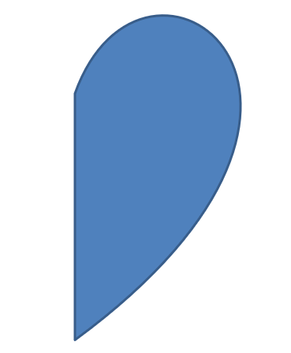

# Change a Shape Using Edit Points
Consider a square. In PowerPoint, using **edit points**, you can 

* move the square's corner in or out
* specify the curvature for a corner or point
* add new points to the square
* manipulate points on the square, etc. 

Essentially, you can perform the described tasks on any shape. Using edit points, you get to change a shape or create a new shape from an existing shape. 

## **Shape Editing Tips**


Before you start editing PowerPoint shapes through edit points, you might want to consider these points about shapes:

* A shape (or its path) can either be closed or open.
* When a shape is closed, it lacks a start or end point. When a shape is open, it has a beginning and end. 
* All shapes consist of at least 2 anchor points linked to each other by lines
* A line is either straight or curved. Anchor points determine the nature of the line. 
* Anchor points exist as corner points, straight points, or smooth points:
  * A corner point is a point where 2 straight lines join at an angle. 
  * A smooth point is a point where 2 handles exist in a straight line and the line's segments join in a smooth curve. In this case, all handles are separated from the anchor point by an equal distance. 
  * A straight point is a point where 2 handles exist in a straight line and that line's line segments joins in a smooth curve. In this case, the handles don't have to be separated from the anchor point by an equal distance. 
* By moving or editing anchor points (which changes the angle of lines), you can change the way a shape looks. 

To edit PowerPoint shapes through edit points, **Aspose.Slides** provides the [**GeometryPath**](https://reference.aspose.com/slides/cpp/class/aspose.slides.geometry_path) class and [**IGeometryPath**](https://reference.aspose.com/slides/cpp/class/aspose.slides.i_geometry_path) interface. 

* A [GeometryPath](https://reference.aspose.com/slides/cpp/class/aspose.slides.geometry_path) instance represents a geometry path of the [IGeometryShape](https://reference.aspose.com/slides/cpp/class/aspose.slides.i_geometry_shape) object. 
* To retrieve the`GeometryPath` from the `IGeometryShape` instance, you can use the [IGeometryShape::GetGeometryPaths](https://reference.aspose.com/slides/cpp/class/aspose.slides.i_geometry_shape#a91c25d805702d632c17db86ca3b279c1) method. 
* To set the `GeometryPath` for a shape, you can use these methods: [IGeometryShape::SetGeometryPath()](https://reference.aspose.com/slides/cpp/class/aspose.slides.i_geometry_shape#a350a80e5544519f5f840318f13ad7986) for *solid shapes* and [IGeometryShape::SetGeometryPaths()](https://reference.aspose.com/slides/cpp/class/aspose.slides.i_geometry_shape#a4b3837a4e393693b3ceaa0928181b750) for *composite shapes*.
* To add segments, you can use the methods under [IGeometryPath](https://reference.aspose.com/slides/cpp/class/aspose.slides.i_geometry_path). 
* Using the [IGeometryPath::set_Stroke()](https://reference.aspose.com/slides/cpp/class/aspose.slides.i_geometry_path#aa819370fbd22ef49387672b8fe2ed147) and [IGeometryPath::set_FillMode()](https://reference.aspose.com/slides/cpp/class/aspose.slides.i_geometry_path#adf7a4e1a1a28b52a97bff0d5cad6f3d7) methods, you can set the appearance for a geometry path.
* Using the [IGeometryPath::get_PathData()](https://reference.aspose.com/slides/cpp/class/aspose.slides.i_geometry_path#a9b1e40e8db9d4dd95fa4784e95d73fca) method, you can retrieve the geometry path of a `GeometryShape` as an array of path segments. 
* To access additional shape geometry customization options, you can convert [GeometryPath](https://reference.aspose.com/slides/cpp/class/aspose.slides.geometry_path) to [GraphicsPath](https://reference.aspose.com/slides/cpp/class/system.drawing.drawing2_d.graphics_path)
* Use [GeometryPathToGraphicsPath](https://reference.aspose.com/slides/cpp/class/aspose.slides.util.shape_util#ab319f6b9578de90a4863c883690f7daf) and [GraphicsPathToGeometryPath](https://reference.aspose.com/slides/cpp/class/aspose.slides.util.shape_util#ab319f6b9578de90a4863c883690f7daf) methods (from the [ShapeUtil](https://reference.aspose.com/slides/cpp/class/aspose.slides.util.shape_util) class) to convert [GeometryPath](https://reference.aspose.com/slides/cpp/class/aspose.slides.geometry_path) to [GraphicsPath](https://reference.aspose.com/slides/cpp/class/system.drawing.drawing2_d.graphics_path) back and forth. 

## **Simple Editing Operations**

This C++ code shows you how to

**Add a line** to the end of a path

``` cpp
void LineTo(PointF point);
void LineTo(float x, float y);
```
**Add a line** to a specified position on a path:

``` cpp    
void LineTo(PointF point, uint32_t index);
void LineTo(float x, float y, uint32_t index);
```
**Add a cubic Bezier curve** at the end of a path:

``` cpp
void CubicBezierTo(PointF point1, PointF point2, PointF point3);
void CubicBezierTo(float x1, float y1, float x2, float y2, float x3, float y3);
```
**Add a cubic Bezier curve** to the specified position on a path:

``` cpp
void CubicBezierTo(PointF point1, PointF point2, PointF point3, uint32_t index);
void CubicBezierTo(float x1, float y1, float x2, float y2, float x3, float y3, uint32_t index);
```
**Add a quadratic Bezier curve** at the end of a path:

``` cpp
void QuadraticBezierTo(PointF point1, PointF point2);
void QuadraticBezierTo(float x1, float y1, float x2, float y2);
```
**Add quadratic Bezier curve** to a specified position on a path:

``` cpp
void QuadraticBezierTo(PointF point1, PointF point2, uint32_t index);
void QuadraticBezierTo(float x1, float y1, float x2, float y2, uint32_t index);
```
**Append a given arc** to a path:

``` cpp
void ArcTo(float width, float heigth, float startAngle, float sweepAngle);
```
**Close the current figure** of a path:

``` cpp
void CloseFigure();
```
**Set the position for the next point**:

``` cpp
void MoveTo(PointF point);
void MoveTo(float x, float y);
```
**Remove the path segment** at a given index:

``` cpp
void RemoveAt(int32_t index);
```
## **Add Custom Points to Shape**
1. Create an instance of the [GeometryShape](https://reference.aspose.com/slides/cpp/class/aspose.slides.geometry_shape) class and set the [ShapeType.Rectangle](https://reference.aspose.com/slides/cpp/namespace/aspose.slides#abe1c0baea327186bde49ad44636bb8c5) type.
2. Get an instance of the [GeometryPath](https://reference.aspose.com/slides/cpp/class/aspose.slides.geometry_path) class from the shape.
3. Add a new point between the two top points on the path.
4. Add a new point between the two bottom points on the path.
5. Apply the path to the shape.

This C++ code shows you how to add custom points to a shape:

``` cpp
SharedPtr<Presentation> pres = System::MakeObject<Presentation>();

SharedPtr<IShapeCollection> shapes = pres->get_Slides()->idx_get(0)->get_Shapes();
SharedPtr<GeometryShape> shape = System::ExplicitCast<GeometryShape>(shapes->AddAutoShape(ShapeType::Rectangle, 100.0f, 100.0f, 200.0f, 100.0f));

SharedPtr<IGeometryPath> geometryPath = shape->GetGeometryPaths()->idx_get(0);

geometryPath->LineTo(100.0f, 50.0f, 1);
geometryPath->LineTo(100.0f, 50.0f, 4);
shape->SetGeometryPath(geometryPath);
```


##  Remove Points From Shape

1. Create an instance of [GeometryShape](https://reference.aspose.com/slides/cpp/class/aspose.slides.geometry_shape) class and set the [ShapeType.Heart](https://reference.aspose.com/slides/cpp/namespace/aspose.slides#abe1c0baea327186bde49ad44636bb8c5) type. 
2. Get an instance of the [GeometryPath](https://reference.aspose.com/slides/cpp/class/aspose.slides.geometry_path) class from the shape.
3. Remove the segment for the path.
4. Apply the path to the shape.

This C++ code shows you how to remove points from a shape:

``` cpp
SharedPtr<Presentation> pres = System::MakeObject<Presentation>();

SharedPtr<IShapeCollection> shapes = pres->get_Slides()->idx_get(0)->get_Shapes();
SharedPtr<GeometryShape> shape = System::ExplicitCast<GeometryShape>(shapes->AddAutoShape(ShapeType::Heart, 100.0f, 100.0f, 300.0f, 300.0f));

SharedPtr<IGeometryPath> path = shape->GetGeometryPaths()->idx_get(0);
path->RemoveAt(2);
shape->SetGeometryPath(path);
```


##  **Create Custom Shape**

1. Calculate the points for the shape.
2. Create an instance of the [GeometryPath](https://reference.aspose.com/slides/cpp/class/aspose.slides.geometry_path) class. 
3. Fill the path with the points.
4. Create an instance of the [GeometryShape](https://reference.aspose.com/slides/cpp/class/aspose.slides.geometry_shape) class. 
5. Apply the path to the shape.

This C++ code shows you how to create a custom shape:

``` cpp
SharedPtr<List<PointF>> points = System::MakeObject<List<PointF>>();

float R = 100.0f, r = 50.0f;
int32_t step = 72;

for (int32_t angle = -90; angle < 270; angle += step)
{
    double radians = angle * (Math::PI / 180.f);
    double x = outerRadius * Math::Cos(radians);
    double y = outerRadius * Math::Sin(radians);
    points->Add(PointF((float)x + outerRadius, (float)y + outerRadius));

    radians = Math::PI * (angle + step / 2) / 180.0;
    x = innerRadiusr * Math::Cos(radians);
    y = innerRadiusr * Math::Sin(radians);
    points->Add(PointF((float)x + outerRadius, (float)y + outerRadius));
}

SharedPtr<GeometryPath> starPath = System::MakeObject<GeometryPath>();
starPath->MoveTo(points->idx_get(0));

for (int32_t i = 1; i < points->get_Count(); i++)
{
    starPath->LineTo(points->idx_get(i));
}

starPath->CloseFigure();

SharedPtr<Presentation> pres = System::MakeObject<Presentation>();

SharedPtr<IShapeCollection> shapes = pres->get_Slides()->idx_get(0)->get_Shapes();
SharedPtr<GeometryShape> shape = System::ExplicitCast<GeometryShape>(shapes->AddAutoShape(ShapeType::Rectangle, 100.0f, 100.0f, R * 2, R * 2));

shape->SetGeometryPath(starPath);
```


## **Create Composite Custom Shape**

  1. Create an instance of the [GeometryShape](https://reference.aspose.com/slides/cpp/class/aspose.slides.geometry_shape) class.
  2. Create a first instance of the [GeometryPath](https://reference.aspose.com/slides/cpp/class/aspose.slides.geometry_path) class.
  3. Create a second instance of the [GeometryPath](https://reference.aspose.com/slides/cpp/class/aspose.slides.geometry_path) class.
  4. Apply the paths to the shape.

This C++ code shows you to create a composite custom shape:

``` cpp
SharedPtr<Presentation> pres = System::MakeObject<Presentation>();

SharedPtr<IShapeCollection> shapes = pres->get_Slides()->idx_get(0)->get_Shapes();
SharedPtr<GeometryShape> shape = System::ExplicitCast<GeometryShape>(shapes->AddAutoShape(ShapeType::Rectangle, 100.0f, 100.0f, 200.0f, 100.0f));

SharedPtr<IGeometryPath> geometryPath0 = System::MakeObject<GeometryPath>();
geometryPath0->MoveTo(0.0f, 0.0f);
geometryPath0->LineTo(shape->get_Width(), 0.0f);
geometryPath0->LineTo(shape->get_Width(), shape->get_Height() / 3);
geometryPath0->LineTo(0.0f, shape->get_Height() / 3);
geometryPath0->CloseFigure();

SharedPtr<IGeometryPath> geometryPath1 = System::MakeObject<GeometryPath>();
geometryPath1->MoveTo(0.0f, shape->get_Height() / 3 * 2);
geometryPath1->LineTo(shape->get_Width(), shape->get_Height() / 3 * 2);
geometryPath1->LineTo(shape->get_Width(), shape->get_Height());
geometryPath1->LineTo(0.0f, shape->get_Height());
geometryPath1->CloseFigure();

shape->SetGeometryPaths(System::MakeArray<SharedPtr<IGeometryPath>>({ geometryPath0, geometryPath1 }));
```


## **Create Custom Shape With Curved Corners**

This C++ code shows you how to create a custom shape with curved corners (inwards);

```cpp
float shapeX = 20.f;
float shapeY = 20.f;
float shapeWidth = 300.f;
float shapeHeight = 200.f;

float leftTopSize = 50.f;
float rightTopSize = 20.f;
float rightBottomSize = 40.f;
float leftBottomSize = 10.f;

auto presentation = System::MakeObject<Presentation>();

auto childShape = presentation->get_Slides()->idx_get(0)->get_Shapes()->AddAutoShape(ShapeType::Custom, shapeX, shapeY, shapeWidth, shapeHeight);

auto geometryPath = System::MakeObject<GeometryPath>();

PointF point1(leftTopSize, 0.0f);
PointF point2(shapeWidth - rightTopSize, 0.0f);
PointF point3(shapeWidth, shapeHeight - rightBottomSize);
PointF point4(leftBottomSize, shapeHeight);
PointF point5(0.0f, leftTopSize);

geometryPath->MoveTo(point1);
geometryPath->LineTo(point2);
geometryPath->ArcTo(rightTopSize, rightTopSize, 180.0f, -90.0f);
geometryPath->LineTo(point3);
geometryPath->ArcTo(rightBottomSize, rightBottomSize, -90.0f, -90.0f);
geometryPath->LineTo(point4);
geometryPath->ArcTo(leftBottomSize, leftBottomSize, 0.0f, -90.0f);
geometryPath->LineTo(point5);
geometryPath->ArcTo(leftTopSize, leftTopSize, 90.0f, -90.0f);

geometryPath->CloseFigure();

childShape->SetGeometryPath(geometryPath);

presentation->Save(u"output.pptx", SaveFormat::Pptx);
```

## **Check Whether a Shape Geometry is Closed**

A geometric shape in PowerPoint may comprise several geometric paths. Each of those geometric paths may be open or [closed](https://reference.aspose.com/slides/cpp/aspose.slides/geometrypath/closefigure/). 

This C++ code shows you how to check if a geometric shape contains a closed path: xxx

```c++

```

## **Convert GeometryPath to GraphicsPath** 

1. Create an instance of the [GeometryShape](https://reference.aspose.com/slides/cpp/class/aspose.slides.geometry_shape) class.
2. Create an instance of the [GraphicsPath](https://reference.aspose.com/slides/cpp/class/system.drawing.drawing2_d.graphics_path) class of the [System.Drawing.Drawing2D](https://reference.aspose.com/slides/cpp/namespace/system.drawing.drawing2_d) namespace.
3. Convert the [GraphicsPath](https://reference.aspose.com/slides/cpp/class/system.drawing.drawing2_d.graphics_path) instance to the [GeometryPath](https://reference.aspose.com/slides/cpp/class/aspose.slides.geometry_path) instance using [ShapeUtil](https://reference.aspose.com/slides/cpp/class/aspose.slides.util.shape_util).
4. Apply the paths to the shape.

This C++ code—an implementation of the steps above—demonstrates the **GeometryPath** to **GraphicsPath** conversion process:

``` cpp
SharedPtr<Presentation> pres = System::MakeObject<Presentation>();

SharedPtr<IShapeCollection> shapes = pres->get_Slides()->idx_get(0)->get_Shapes();
SharedPtr<GeometryShape> shape = System::ExplicitCast<GeometryShape>(shapes->AddAutoShape(ShapeType::Rectangle, 100.0f, 100.0f, 300.0f, 100.0f));

SharedPtr<IGeometryPath> originalPath = shape->GetGeometryPaths()->idx_get(0);
originalPath->set_FillMode(PathFillModeType::None);

SharedPtr<Drawing2D::GraphicsPath> graphicsPath = System::MakeObject<Drawing2D::GraphicsPath>();
graphicsPath->AddString(u"Text in shape", System::MakeObject<FontFamily>(u"Arial"), 1, 40.0f, PointF(10.0f, 10.0f), StringFormat::get_GenericDefault());

SharedPtr<IGeometryPath> textPath = ShapeUtil::GraphicsPathToGeometryPath(graphicsPath);
textPath->set_FillMode(PathFillModeType::Normal);

shape->SetGeometryPaths(System::MakeArray<SharedPtr<IGeometryPath>>({ originalPath, textPath }));
```
