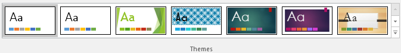
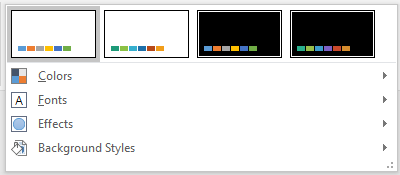
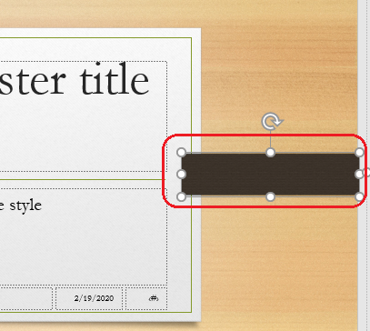
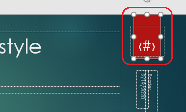
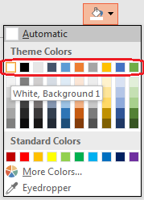
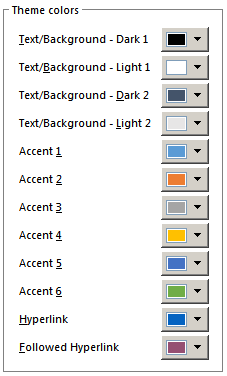
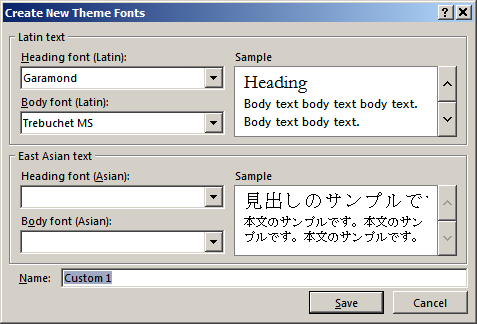
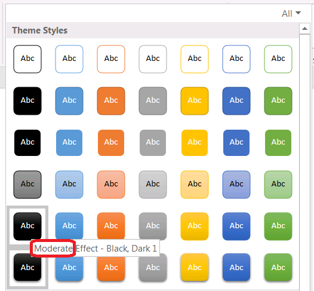

## **About Presentation Design**

In the **presentation design**, there are two types of elements:

- Data elements. Used to add an informational content into the presentation: text, titles, lists, charts, tables, videos, etc.
- Design elements. Used to create a visual appearance of all presentation elements - the presentation design.

**Design elements** are the following:

- Data elements layout. It depends on the type of the element. Elements of non-placeholder type have a fixed position. While elements of placeholder type (or a combination of elements with placeholder type, like: header and body) have a flexible position, which can be changed. They can be placed on different Slide Layouts, Slide Masters, that are applied to a slide.
- Template elements. Which are only dedicated to quickly create the style of presentation. 
- Colors. Used to paint elements and their parts. Usually, elements are designed with many colors, having one fill color and border color, etc.
- Fonts. Used for the data elements, containing text.
- Effects. Which are applied to various elements: shadow, glow, reflection, 3D-effects, ect.
- Background. Fills the background of the slide or presentation, and can be used on Slide Master, Slide Layout or a certain slide. The background can be: solid, gradient, texture, etc.

All the design elements of presentation create the **presentation design**. The major properties of design elements are defined by the **presentation theme**. When you choose a certain presentation theme, you actually choose a set of visual elements and their properties, to build the presentation design.


In PowerPoint it is possible to change the whole presentation theme in one click:




It is also available to change a certain part of the presentation theme (colors, fonts, effects, background styles):



Through "*Design - ->View"* menu user can change a set of stylistic properties of visual elements. Apart from that, it's possible to add new elements into the presentation (e.g. into Slide Master), based on a certain template. However, newly added elements will be removed in case the presentation theme will be changed.

For example, if you choose "Organic" template in PowerPoint, the following shape will be added into Slide Master:



After changing the presentation theme on "*Ion*", the abovementioned element will be removed. While that, a new element of "*Ion*" presentation theme will be added on the slide (see on the image). As you can see, this element is binded to a placeholder, which will show the slide number (in case, its switched on in "*Insert --> Header & Footer --> Slide Number"*):



However, if you will change the presentation theme on "*Office Theme*", the placeholder will be removed from the slide. This happens because presentation theme actually includes a **presentation template** as well. So, while we change the presentation theme, this action may also cause presentation template to be changed (e.g. add elements to Slide Master, change placeholders positions).


## **Change Theme Colors**
When a certain theme is chosen for presentation, the colors to apply on presentation are calculated based on the presentation theme. Each presentation theme has an ordered set of colors, where every color is destinated to different elements or parts of the slide. The actual value of the color is not used in theme color set. Instead, the color order number and color name are used. Colors for presentation elements are calculated based on default theme settings or chosen according to the pointer referring to a color from the theme colors set.

In PowerPoint theme colors set looks this way on a color picker:





It is a set of theme colors, containing 10 main colors of the theme. A popup window shows the name of one color from this theme. 

Here is the same theme color set, with all its color names, available in "*Design -> Variants -> Customize Colors -> “Theme Colors”* PowerPoint menu:




Here is possible to add new colors not defined in presentation theme, or change existing ones. For example, "Hyperlink” and ”Followed Hyperlink” colors were added manually. 
## **Change Theme Colors with Aspose.Slides**
In [**Aspose.Slides**](https://products.aspose.com/slides/cpp) to choose the appropriate color from the theme color set and set it to the element, use [**IFillFormat::get_SolidFillColor()::set_SchemeColor()**](https://apireference.aspose.com/slides/cpp/class/aspose.slides.i_color_format#aad82c1d2daf9d92e4d44a5a9b3bbcf28) method:


``` cpp
auto pres = System::MakeObject<Presentation>();

auto shape = pres->get_Slides()->idx_get(0)->get_Shapes()->AddAutoShape(ShapeType::Rectangle, 10.0f, 10.0f, 100.0f, 100.0f);

shape->get_FillFormat()->set_FillType(FillType::Solid);
shape->get_FillFormat()->get_SolidFillColor()->set_SchemeColor(SchemeColor::Accent4);
``` 


In the example above, we have set a reference on *Accent4* color, taken from the **scheme color** (theme colors). If we want to know the real value of this color, it is necessary to calculate its effective value - the value of the element color, which user sees after all the styles applied to this element:


``` cpp
auto fillEffective = shape->get_FillFormat()->GetEffective();
    
Console::WriteLine(u"{0} ({1})", fillEffective->get_SolidFillColor().get_Name(), fillEffective->get_SolidFillColor());
// ff8064a2 (Color [A=255, R=128, G=100, B=162])
``` 


We can check that color matches the one defined as *Accent4* for the presentation theme:


``` cpp
Color themeAccent4 = pres->get_MasterTheme()->get_ColorScheme()->get_Accent4()->get_Color();
Console::WriteLine(u"{0} - from theme", themeAccent4.get_Name());
``` 


Lets us create one more element and assign it the same *Accent4* color from the scheme. Then we will change this color in the scheme:


``` cpp
auto otherShape = pres->get_Slides()->idx_get(0)->get_Shapes()->AddAutoShape(ShapeType::Rectangle, 10.0f, 120.0f, 100.0f, 100.0f);
    
otherShape->get_FillFormat()->set_FillType(FillType::Solid);
otherShape->get_FillFormat()->get_SolidFillColor()->set_SchemeColor(SchemeColor::Accent4);

pres->get_MasterTheme()->get_ColorScheme()->get_Accent4()->set_Color(Color::get_Red());
``` 


The color will change on both elements after we have changed it in the color theme. 


## **Change Theme Fonts**
The presentation theme defines two main fonts, which will be used for presentation Heading and Body. It is possible to set Latin, Asian or Complex option for each presentation theme font. In PowerPoint it's done the following way:




## **Change Theme Fonts with Aspose.Slides**
In [**Aspose.Slides**](https://products.aspose.com/slides/cpp) (the same as in PowerPoint) to choose the font from the **font scheme**, the special identifier is used:

- "**+mn-lt**": Body Font Latin (Minor Latin Font)
- "**+mj-lt**": Heading Font Latin (Major Latin Font)
- "**+mn-ea**": Body Font East Asian (Minor East Asian Font)
- "**+mj-ea**": Body Font East Asian (Minor East Asian Font)


Let us create an element with the text, and assign the Latin font from the font scheme to it: 


``` cpp
auto shape = pres->get_Slides()->idx_get(0)->get_Shapes()->AddAutoShape(ShapeType::Rectangle, 10.0f, 10.0f, 100.0f, 100.0f);

auto paragraph = System::MakeObject<Paragraph>();
auto portion = System::MakeObject<Portion>(u"Theme text format");

paragraph->get_Portions()->Add(portion);
shape->get_TextFrame()->get_Paragraphs()->Add(paragraph);

portion->get_PortionFormat()->set_LatinFont(System::MakeObject<FontData>(u"+mn-lt"));
``` 


Now lets check that the same font is set for Body Latin:

``` cpp
Console::WriteLine(u"Portion Body Latin font is: {0}", portion->get_PortionFormat()->GetEffective()->get_LatinFont()->get_FontName());
    
Console::WriteLine(u"Theme Body Latin font is: {0}", pres->get_MasterTheme()->get_FontScheme()->get_Minor()->get_LatinFont());
``` 


It is possible to change the presentation theme font, which will be updated for all presentation text accordingly:

``` cpp
pres->get_MasterTheme()->get_FontScheme()->get_Minor()->set_LatinFont(MakeObject<FontData>(u"Arial"));
``` 


{} 
- [Working with Presentation Fonts](/slides/cpp/powerpoint-fonts/)
{}

## **Change Theme Background Style**
Presentation theme may also contain a set of background styles, which can be changed via "*Design -> Variants -> Background Styles*" menu:


## **Change Theme Background Style with Aspose.Slides**
In [**Aspose.Slides**](https://products.aspose.com/slides/cpp) its possible to access Background Style with [**IPresentation::get_MasterTheme()->get_FormatScheme()->get_BackgroundFillStyles()**](https://apireference.aspose.com/slides/cpp/class/aspose.slides.theme.format_scheme#a57cdf506f7f5a5bc6e91829c1f524be6) method. There is a difference in the way Background Style is represented in presentation with Aspose.Slides comparing to PowerPoint. The logic difference affects the slide effects too. We will consider the Background Style logic difference below.

On the images above you can see, that to design the Background Style in PowerPoint, there are 12 predefined backgrounds available. However, if we upload the presentation, saved in PowerPoint through Aspose.Slides, then execute the following code - we will see only 3 predefined backgrounds in the resulting presentation:

``` cpp
auto pres = MakeObject<Presentation>(u"pres.pptx");
        
int32_t numberOfBackgroundFills = pres->get_MasterTheme()->get_FormatScheme()->get_BackgroundFillStyles()->get_Count();

Console::WriteLine(u"Number of background fill styles for theme is {0}", numberOfBackgroundFills);
``` 

The reason is that,12 predefined backgrounds are used to design Background Style only, but they are not actually saved into the resulting presentation. However, its possible to add additional backgrounds to [IPresentation::get_MasterTheme()->get_FormatScheme()->get_BackgroundFillStyles()](https://apireference.aspose.com/slides/cpp/class/aspose.slides.theme.format_scheme#a57cdf506f7f5a5bc6e91829c1f524be6) method.

To define which background should be used for presentation, set the needed presentation index (**Note**: the index starts from 1, not from 0. 0 is used to define "*no fill*" value):


``` cpp
pres->get_Masters()->idx_get(0)->get_Background()->set_StyleIndex(2);
``` 


{} 
- [Working with Presentation Background](/slides/cpp/presentation-background/)
{}

## **Change Theme Effects with Aspose.Slides**


An important difference in [**Aspose.Slides**](https://products.aspose.com/slides/cpp) to PowerPoint is in grouping theme properties into a [**FormatScheme** ](https://apireference.aspose.com/slides/cpp/class/aspose.slides.theme.format_scheme)type. In PowerPoint, *Theme Effect* and *Backgrounds* are represented as two separate lists in "*Design --> Variant"* menu. In Aspose.Slides they are both encapsulated into [FormatScheme ](https://apireference.aspose.com/slides/cpp/class/aspose.slides.theme.format_scheme)type. [FormatScheme ](https://apireference.aspose.com/slides/cpp/class/aspose.slides.theme.format_scheme)type is the core type to define the presentation theme properties, it is a "style matrix" containing style arrays of types:

- fill styles
- line styles
- effect styles
- background fill styles


PowerPoint theme usually contains 3 values for each style array, which are combined into "*Subtle*", "*Moderate*" and "*Intense*” effects. Let's demonstrate it on the example of formatting shapes. The themes of individual shapes can be edited with "*PowerPoint's Format -> Shape Styles*" menu:




For example, 3 shapes will look this way after we apply 3 different effects on them:


In [**Aspose.Slides**](https://products.aspose.com/slides/cpp) there are no "*Subtle*", "*Moderate*" and "*Intense*” effects. Instead, you can operate the [FormatScheme](https://apireference.aspose.com/slides/cpp/class/aspose.slides.theme.format_scheme) style matrix, having 3 elements in each array (FillStyles, LineStyles, EffectStyles) to change the outlook of presentation elements. There is also the [IPresentation::get_MasterTheme()->get_FormatScheme()->get_BackgroundFillStyles()](https://apireference.aspose.com/slides/cpp/class/aspose.slides.theme.format_scheme#a57cdf506f7f5a5bc6e91829c1f524be6)method available, but it can only change the background fill style.


So, the effects you can use in PowerPoint are strictly limited. While, in Aspose.Slides it is possible to change them in a flexible way by changing their composite parts. In the following example, we will change the outlook of the abovementioned elements with Aspose.Slides:


``` cpp
auto pres = System::MakeObject<Presentation>(u"Subtle_Moderate_Intense.pptx");
        
pres->get_MasterTheme()->get_FormatScheme()->get_LineStyles()->idx_get(0)->get_FillFormat()->get_SolidFillColor()->set_Color(Color::get_Red());

pres->get_MasterTheme()->get_FormatScheme()->get_FillStyles()->idx_get(2)->set_FillType(FillType::Solid);

pres->get_MasterTheme()->get_FormatScheme()->get_FillStyles()->idx_get(2)->get_SolidFillColor()->set_Color(Color::get_ForestGreen());

pres->get_MasterTheme()->get_FormatScheme()->get_EffectStyles()->idx_get(2)->get_EffectFormat()->get_OuterShadowEffect()->set_Distance(10.f);

pres->Save(u"Design_04_Subtle_Moderate_Intense-out.pptx", SaveFormat::Pptx);
``` 


As you can see, we have changed the fill color, the fill type, shadow effect, etc of the elements:


