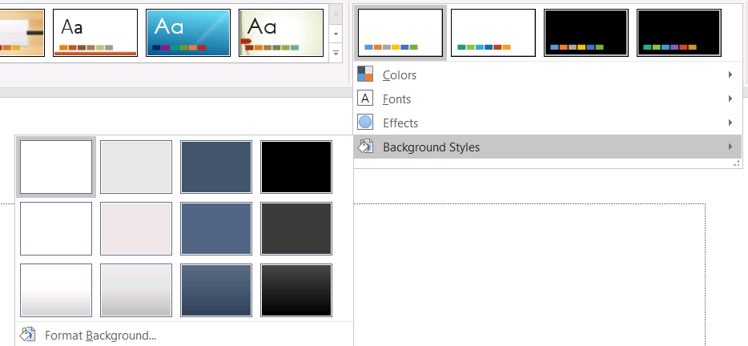

A presentation theme defines the properties of design elements. When you select a presentation theme, you are essentially choosing a specific set of visual elements and their properties.

In PowerPoint, a theme comprises colors, [fonts](/slides/cpp/powerpoint-fonts/), [background styles](/slides/cpp/presentation-background/), and effects.


## **Change Theme Color**

A PowerPoint theme uses a specific set of colors for different elements on a slide. If you don't like the colors, you change them colors by applying new colors for the theme. To allow you select a new theme color, Aspose.Slides provides values under the [SchemeColor](https://reference.aspose.com/slides/cpp/class/aspose.slides.i_color_format#aad82c1d2daf9d92e4d44a5a9b3bbcf28) enumeration.

This C++ code shows you how to change the accent color for a theme:

```c++
auto pres = System::MakeObject<Presentation>();

auto shape = pres->get_Slides()->idx_get(0)->get_Shapes()->AddAutoShape(ShapeType::Rectangle, 10.0f, 10.0f, 100.0f, 100.0f);

shape->get_FillFormat()->set_FillType(FillType::Solid);
shape->get_FillFormat()->get_SolidFillColor()->set_SchemeColor(SchemeColor::Accent4);
```

You can determine the resulting color's effective value this way:

```c++
auto fillEffective = shape->get_FillFormat()->GetEffective();
    
Console::WriteLine(u"{0} ({1})", fillEffective->get_SolidFillColor().get_Name(), fillEffective->get_SolidFillColor());
// ff8064a2 (Color [A=255, R=128, G=100, B=162])
```

To further demonstrate the color change operation, we create another element and assign the accent color (from the initial operation) to it. Then we change the color in the theme:

```c++
auto otherShape = pres->get_Slides()->idx_get(0)->get_Shapes()->AddAutoShape(ShapeType::Rectangle, 10.0f, 120.0f, 100.0f, 100.0f);
    
otherShape->get_FillFormat()->set_FillType(FillType::Solid);
otherShape->get_FillFormat()->get_SolidFillColor()->set_SchemeColor(SchemeColor::Accent4);

pres->get_MasterTheme()->get_ColorScheme()->get_Accent4()->set_Color(Color::get_Red());
```

The new color is applied automatically on both elements.

### **Set Theme Color from Additional Palette - Luminance transformation**

Using colors from the additional palette, you can apply luminance transformations to the main color. This C++ code demonstrates the operation: xxx

```c++

```

## **Change Theme Font**

To allow you select fonts for themes and other purposes, Aspose.Slides uses these special identifiers (similar to those used in PowerPoint):

* **+mn-lt** - Body Font Latin (Minor Latin Font)
* **+mj-lt** -Heading Font Latin (Major Latin Font)
* **+mn-ea** - Body Font East Asian (Minor East Asian Font)
* **+mj-ea** - Body Font East Asian (Major East Asian Font)

This C++ code shows you how to assign the Latin font to a theme element:

```c++
auto shape = pres->get_Slides()->idx_get(0)->get_Shapes()->AddAutoShape(ShapeType::Rectangle, 10.0f, 10.0f, 100.0f, 100.0f);

auto paragraph = System::MakeObject<Paragraph>();
auto portion = System::MakeObject<Portion>(u"Theme text format");

paragraph->get_Portions()->Add(portion);
shape->get_TextFrame()->get_Paragraphs()->Add(paragraph);

portion->get_PortionFormat()->set_LatinFont(System::MakeObject<FontData>(u"+mn-lt"));
```

This C++ code shows you how to change the presentation theme font:

```c++
pres->get_MasterTheme()->get_FontScheme()->get_Minor()->set_LatinFont(MakeObject<FontData>(u"Arial"));
```

The font in all text boxes will be updated.

{} 

You may want to see [PowerPoint fonts](/slides/cpp/powerpoint-fonts/).

{}

## **Change Theme Background Style**

By default, the PowerPoint app provides 12 predefined backgrounds but only 3 from those 12 backgrounds are saved in a typical presentation. 



For example, after you save a presentation in the PowerPoint app, you can run this C++ code to find out the number of predefined backgrounds in the presentation:

```c++
auto pres = MakeObject<Presentation>(u"pres.pptx");
        
int32_t numberOfBackgroundFills = pres->get_MasterTheme()->get_FormatScheme()->get_BackgroundFillStyles()->get_Count();

Console::WriteLine(u"Number of background fill styles for theme is {0}", numberOfBackgroundFills);
```

{} 

Using the [BackgroundFillStyles](https://reference.aspose.com/slides/cpp/class/aspose.slides.theme.format_scheme#aec29b94bc65619519a86a8d4607f5f7d) property from the [FormatScheme](https://reference.aspose.com/slides/cpp/class/aspose.slides.theme.i_format_scheme/) class, you can add or access the background style in a PowerPoint theme. 

{}

This C++ code shows you how to set the background for a presentation:

```c++
pres->get_Masters()->idx_get(0)->get_Background()->set_StyleIndex(2);
```

**Index guide**: 0 is used for no fill. The index starts from 1.

{} 

You may want to see [PowerPoint Background](/slides/cpp/presentation-background/).

{}

## **Change Theme Effect**

A PowerPoint theme usually contains 3 values for each style array. Those arrays are combined into these 3 effects: subtle, moderate, and intense. For example, this is the outcome when the effects are applied to a specific shape:


Using 3 properties ([FillStyles](https://reference.aspose.com/slides/cpp/class/aspose.slides.theme.i_format_scheme#ab80b867174104e26e4824dc8585a1563), [LineStyles](https://reference.aspose.com/slides/cpp/class/aspose.slides.theme.i_format_scheme#ae68a6d0a27dd2ada86a857ebde695ecd), [EffectStyles](https://reference.aspose.com/slides/cpp/class/aspose.slides.theme.i_format_scheme#aba41300412c5c755fe82cf735bcf0f58)) from the [FormatScheme](https://reference.aspose.com/slides/cpp/class/aspose.slides.theme.i_format_scheme/) class you can change the elements in a theme (even more flexibly than the options in PowerPoint).

This C++ code shows you how to change a theme effect by altering parts of elements:

```c++
auto pres = System::MakeObject<Presentation>(u"Subtle_Moderate_Intense.pptx");
        
pres->get_MasterTheme()->get_FormatScheme()->get_LineStyles()->idx_get(0)->get_FillFormat()->get_SolidFillColor()->set_Color(Color::get_Red());

pres->get_MasterTheme()->get_FormatScheme()->get_FillStyles()->idx_get(2)->set_FillType(FillType::Solid);

pres->get_MasterTheme()->get_FormatScheme()->get_FillStyles()->idx_get(2)->get_SolidFillColor()->set_Color(Color::get_ForestGreen());

pres->get_MasterTheme()->get_FormatScheme()->get_EffectStyles()->idx_get(2)->get_EffectFormat()->get_OuterShadowEffect()->set_Distance(10.f);

pres->Save(u"Design_04_Subtle_Moderate_Intense-out.pptx", SaveFormat::Pptx);
```

The resulting changes in fill color, fill type, shadow effect, etc:


