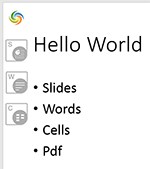
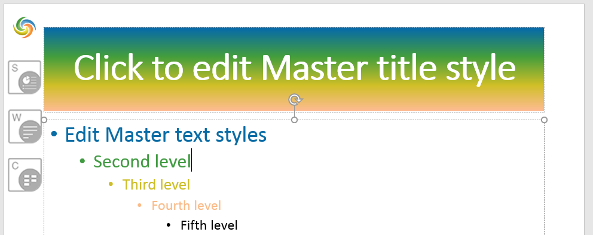

## **What is a Slide Master in PowerPoint**

A **Slide Master** is a slide template that defines the layout, styles, theme, fonts, background, and other properties for slides in a presentation. If you want to create a presentation (or series of presentations) with the same style and template for your company, you can use a slide master. 

A Slide Master is useful because it allows you to set and change the look of all presentation slides at once. Aspose.Slides supports the Slide Master mechanism from PowerPoint. 

VBA also allows you to manipulate a Slide Master and execute the same operations supported in PowerPoint: change backgrounds, add shapes, customize the layout, etc. Aspose.Slides provides flexible mechanisms to allow you to use Slide Masters and perform basic tasks with them. 

These are basic Slide Master operations:

- Create or Slide Master.
- Apply Slides Master to presentation slides.
- Change Slide Master background. 
- Add an image, placeholder, Smart Art, etc. to Slide Master.

These are more advanced operations involving Slide Master: 

- Compare Slide Masters.
- Merge Slide Masters.
- Apply several Slide Masters.
- Copy slide with Slide Master to another presentation.
- Find out duplicate Slide Masters in presentations.
- Set Slide Master as the presentation default view.

{} 

You may want to check out Aspose [**Online PowerPoint Viewer**](https://products.aspose.app/slides/viewer) because it is a live implementation of some of the core processes described here.

{} 

## **How is Slide Master applied**

Before you work with a slide master, you may want to understand how they are used in presentations and applied to slides. 

* Every presentation has at least one Slide Master by default. 
* A presentation can contain several Slide Masters. You can add several Slide Masters and use them to style different parts of a presentation in different ways. 

In **Aspose.Slides**, a Slide Master is represented by [**IMasterSlide**](https://reference.aspose.com/slides/cpp/class/aspose.slides.i_master_slide) type. 

Aspose.Slides' [Presentation](https://reference.aspose.com/slides/cpp/class/aspose.slides.presentation
) object contains the [**get_Masters()** ](https://reference.aspose.com/slides/cpp/class/aspose.slides.presentation#a8fda502eacdf2fe4ccfc1ab0bf185d29) list of [**IMasterSlideCollection**](https://reference.aspose.com/slides/cpp/class/aspose.slides.i_master_slide_collection) type, which contains a list of all master slides that are defined in a presentation. 

Besides CRUD operations, the [IMasterSlideCollection](https://reference.aspose.com/slides/cpp/class/aspose.slides.i_master_slide_collection) interface contains these useful methods: [**AddClone()**](https://reference.aspose.com/slides/cpp/class/aspose.slides.i_master_slide_collection#aaf86ba9a1c55969e7d5f4dbc8cb233a1) and [**InsertClone()**](https://reference.aspose.com/slides/cpp/class/aspose.slides.i_master_slide_collection#af297b1c8e31fbcef821f1554b1fbc311) methods. Those methods are inherited from the basic slide cloning function. But when dealing with Slide Masters, those methods allow you to implement complicated setups. 

When a new slide is added to a presentation, a Slide Master is applied to it automatically. The Slide Master of the previous slide is selected by default. 

**Note**: Presentation slides are stored in [get_Slides()](https://reference.aspose.com/slides/cpp/class/aspose.slides.presentation#a9981b38f5a01d9fa5482f05b0a75974c) list, and every new slide is added to the end of the collection by default. If a presentation contains a single Slide Master, that slide master is selected for all new slides. This is the reason you do not have to define the Slide Master for every new slide you create.

The principle is the same for PowerPoint and Aspose.Slides. For example, in PowerPoint, when you add a new presentation, you can just press on the bottom line under the last slide and then a new slide (with the last presentation's Slide Master) will be created:


In Aspose.Slides, you can perform the equivalent task with the [AddClone()](https://reference.aspose.com/slides/cpp/class/aspose.slides.slide_collection#a4c03a2193e89401782bf690bc5e22b48) method under the [Presentation](https://reference.aspose.com/slides/cpp/class/aspose.slides.presentation) class.

## **Slide Master in Slides hierarchy**

Using Slide Layouts with Slide Master allows for maximum flexibility. A Slide Layout allows you to set all the same styles as Slide Master (background, fonts, shapes, etc.). However, when several Slide Layouts are combined on a Slide Master, a new style is created. When you apply a Slide Layout to a single slide, you can change its style from the one applied by the Slide Master.

Slide Master outranks all setups items: Slide Master -> Slide Layout -> Slide:


Each [IMasterSlide](https://reference.aspose.com/slides/cpp/class/aspose.slides.i_master_slide) object has a [**get_LayoutSlides()**](https://reference.aspose.com/slides/cpp/class/aspose.slides.i_master_slide#a200db12188121c969627e4c4c0253a37) property with a list of Slide Layouts. A [Slide](https://reference.aspose.com/slides/cpp/class/aspose.slides.slide) type has a [**get_LayoutSlide()**](https://reference.aspose.com/slides/cpp/class/aspose.slides.slide#a56b36c32cb9e5db97cdbc7e8248f6fa8) property with a link on a Slide Layout applied to the slide. The interaction between a slide and Slide Master occurs through a Slide Layout.

{}

* In Aspose.Slides, all the slide setups (Slide Master, Slide Layout, and the slide itself) are actually slide objects implementing the [**IBaseSlide**](https://reference.aspose.com/slides/cpp/class/aspose.slides.i_base_slide) interface.
* Therefore, Slide Master and Slide Layout may implement the same properties and you need to know how their values will be applied to a  [Slide](https://reference.aspose.com/slides/cpp/class/aspose.slides.slide) object. The Slide Master is applied first to a slide and then the Slide Layout is applied. For example, if the Slide Master and Slide Layout both have a background value, the Slide will end up with the background from the Slide Layout.

{}

## **What A Slide Master Comprises**

To understand how a Slide Master can be changed, you need to know its constituents. These are [MasterSlide](https://reference.aspose.com/slides/cpp/aspose.slides/masterslide/) core properties. 

- [get(set)_Background()](https://reference.aspose.com/slides/cpp/class/aspose.slides.i_base_slide#aeac7142751858f0a68de92f259eb8d35) - get/set slide background.
- [get(set)_BodyStyle](https://reference.aspose.com/slides/cpp/class/aspose.slides.i_master_slide#a51b96aee050a04e6d36b9d08b85dcf55) - get/set text styles of the slide’s body.
- [get(set)_Shapes](https://reference.aspose.com/slides/cpp/class/aspose.slides.i_base_slide#aa6b93a3863b7516d4a1a751a0ca885c7) - get/set all the shapes of the Slide Master (placeholders, picture frames, etc).
- [get(set)_Controls](https://reference.aspose.com/slides/cpp/class/aspose.slides.i_base_slide#ae05f1e1b686a52728ae94e47f308ff08) - get/set ActiveX controls.
- [get_ThemeManager()](https://reference.aspose.com/slides/cpp/class/aspose.slides.theme.i_master_themeable#a70c68d34412e96f3cc24273fde826ecf) - get theme manager.
- [get_HeaderFooterManager()](https://reference.aspose.com/slides/cpp/class/aspose.slides.i_master_slide#a755d0d7cc3c677e746499f2a4e33a5cc) - get header and footer manager.

Slide Master methods:

- [GetDependingSlides](https://reference.aspose.com/slides/cpp/class/aspose.slides.i_master_slide#a9026e22b68087238cc73348e303c6d90) - get all Slides depending on the Slide Master.
- [ApplyExternalThemeToDependingSlides](https://reference.aspose.com/slides/cpp/class/aspose.slides.i_master_slide#a8d519dd31014fcbb2be0ab72061f94dc) - allows you to create a new Slide Master based on the current Slide Master and a new theme. The new Slide Master will then be applied to all dependent slides.

## **Get Slide Master**

In PowerPoint, Slide Master can be accessed from the View -> Slide Master menu:


Using Aspose.Slides, you can access a Slide Master this way:

```c++
System::SharedPtr<IMasterSlide> master = pres->get_Masters()->idx_get(0);
```

The [IMasterSlide](https://reference.aspose.com/slides/cpp/class/aspose.slides.i_master_slide) interface represents a Slide Master. The [get_Masters()](https://reference.aspose.com/slides/cpp/class/aspose.slides.presentation#a8fda502eacdf2fe4ccfc1ab0bf185d29) property (related to [IMasterSlideCollection](https://reference.aspose.com/slides/cpp/class/aspose.slides.i_master_slide_collection) type) contains a list of all Slide Masters that are defined in the presentation. 

## **Add Image to Slide Master**

When you add an image to a Slide Master, that image will appear on all slides dependent on that slide master. 

For example, you can place your company's logo and a few images on the Slide Master and then switch back to slide editing mode. You should see the image on every slide. 


You can add images to a slide master with Aspose.Slides: xxx - add code for images

```c++
auto pres = System::MakeObject<Presentation>();
for (auto& master : pres->get_Masters())
{
    // Do some work with each master slide in the presentation
}
```

{} 

For more information on adding images to a slide, see the [Picture Frame](/slides/cpp/picture-frame/#create-picture-frame) article.
{}

## **Add Placeholder to Slide Master**

These text fields are standard placeholders on a Slide Master: 

* Click to edit Master title style

* Edit Master text styles

* Second level

* Third level 

  They also appear on the slides based on Slide Master. You can edit those placeholders on a Slide Master and the changes are applied automatically to the slides. 

In PowerPoint, you can add a placeholder through the Slide Master -> Insert Placeholder path:


Let's examine a more complicated example for placeholders with Aspose.Slides. Consider a slide with placeholders templated from the Slide Master:





We want to change the Title and Subtitle formatting on the Slide Master this way:




First, we retrieve the title placeholder content from the Slide Master object and then use the`PlaceHolder.FillFormat` field: 

```c++
System::SharedPtr<IAutoShape> FindPlaceholder(System::SharedPtr<IMasterSlide> master, PlaceholderType type)
{
    for (auto& shape : master->get_Shapes())
    {
        System::SharedPtr<IAutoShape> autoShape = System::AsCast<Aspose::Slides::IAutoShape>(shape);
        if (autoShape != nullptr)
        {
            if (autoShape->get_Placeholder()->get_Type() == type)
            {
                return autoShape;
            }
        }
    }
    return nullptr;
}

void Main()
{
    auto pres = System::MakeObject<Presentation>();
    System::SharedPtr<IMasterSlide> master = pres->get_Masters()->idx_get(0);
    System::SharedPtr<IAutoShape> placeHolder = FindPlaceholder(master, Aspose::Slides::PlaceholderType::Title);
    auto fillFormat = placeHolder->get_FillFormat();
    fillFormat->set_FillType(Aspose::Slides::FillType::Gradient);
    auto gradientFormat = fillFormat->get_GradientFormat();
    gradientFormat->set_GradientShape(Aspose::Slides::GradientShape::Linear);
    gradientFormat->get_GradientStops()->Add(0.0f, System::Drawing::Color::FromArgb(255, 0, 0));
    gradientFormat->get_GradientStops()->Add(255.0f, System::Drawing::Color::FromArgb(128, 0, 128));
    
    pres->Save(u"pres.pptx", Aspose::Slides::Export::SaveFormat::Pptx);
}
```

The title style and formatting will change for all slides based on the slide master:


{} 

* [Set Prompt Text in Placeholder](https://docs.aspose.com/slides/cpp/manage-placeholder/)
* [Text Formatting](https://docs.aspose.com/slides/cpp/text-formatting/)

{}

## **Change Background on Slide Master**

When you change a master slide's background color, all the normal slides in the presentation will get the new color. This C++ code demonstrates the operation:

```c++
auto pres = System::MakeObject<Presentation>();

auto master = pres->get_Masters()->idx_get(0);
auto background = master->get_Background();
background->set_Type(Aspose::Slides::BackgroundType::OwnBackground);
background->get_FillFormat()->set_FillType(Aspose::Slides::FillType::Solid);
background->get_FillFormat()->get_SolidFillColor()->set_Color(System::Drawing::Color::get_Green());
    
pres->Save(u"pres.pptx", Aspose::Slides::Export::SaveFormat::Pptx);
```

{} 

- [Presentation Background](https://docs.aspose.com/slides/cpp/presentation-background/)

- [Presentation Theme](https://docs.aspose.com/slides/cpp/presentation-theme/)

  {}

## **Clone Slide Master to Another Presentation**

To clone a Slide Master to another presentation, call the [**AddClone()**](https://reference.aspose.com/slides/cpp/class/aspose.slides.slide_collection#a4c03a2193e89401782bf690bc5e22b48) method from the destination presentation alongside a Slide Master passed into it. This C++ code shows you how to clone a Slide Master to another presentation:

```c++
auto presSource = System::MakeObject<Presentation>();
auto presTarget = System::MakeObject<Presentation>();
    
auto master = presTarget->get_Masters()->AddClone(presSource->get_Masters()->idx_get(0));
```

## **Add Multiple Slide Masters to Presentation**

Aspose.Slides allows you to add several Slide Masters and Slide Layouts to any given presentation. This allows you to set up styles, layouts, and formatting options for presentation slides in many ways. 

In PowerPoint, you can add new Slide Masters and Layouts (from the "Slide Master menu) this way:


Using Aspose.Slides, you can add a new Slide Master by calling the  [AddClone()](https://reference.aspose.com/slides/cpp/class/aspose.slides.slide_collection#a4c03a2193e89401782bf690bc5e22b48) method:

```c++
pres->get_Masters()->AddClone(pres->get_Masters()->idx_get(0));
```

## **Compare Slide Masters**

A Master Slide implements the [IBaseSlide](https://reference.aspose.com/slides/cpp/class/aspose.slides.i_base_slide) interface containing the  [**Equals()**](https://reference.aspose.com/slides/cpp/class/aspose.slides.i_base_slide#afb1febe7cf3991c06f4d96e017c22b6f) method, which can then be used to compare slides. It returns `true` for Master Slides identical in structure and static content. 

Two Master Slides are equal if their shapes, styles, texts, animation and other settings, etc are equal. The comparison does not take unique identifier values (e.g. SlideId) and dynamic content (e.g. current date value in Date Placeholder) into account. 

## **Set Slide Master as Presentation Default View**

Aspose.Slides allows you to set a Slide Master as the default view for a presentation. The default view is what you see first when you open a presentation. 

This code shows you how to set a Slide Master as a presentation's default view in C++:

```c++
pres->get_ViewProperties()->set_LastView(Aspose::Slides::ViewType::SlideMasterView);
```

## **Remove Unused Master Slide**

Aspose.Slides provides the [RemoveUnusedMasterSlides()](https://reference.aspose.com/slides/cpp/aspose.slides.lowcode/compress/removeunusedmasterslides/) method (from the  [Compress](https://reference.aspose.com/slides/cpp/aspose.slides.lowcode/compress/) class) to allow you to delete unwanted and unused master slides. This C++ code shows you how to remove a master slide from a PowerPoint presentation:

```c++
auto pres = System::MakeObject<Presentation>(u"pres.pptx");

LowCode::Compress::RemoveUnusedMasterSlides(pres);

pres->Save(u"pres-out.pptx", SaveFormat::Pptx);
```

