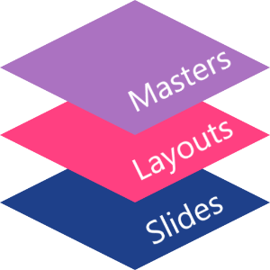
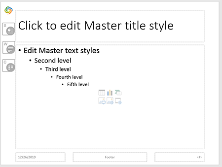

## **About Slide Master**
## **What is Slide Master**
**Slide Master** - is a slide template, which defines the layout, styles, theme, fonts, background to be applied to presentation slides. If there is a need to create a presentation for your company, having slides based on the same style template - Slide Master is used. Slide Master can be used to set and change the look of all presentation slides at once.

Slide Master mechanism came to us from PowerPoint presentations and is fully supported by **Aspose.Slides API**. VBA also allows to manipulate Slide Master with all the operations supported by PowerPoint, like: change background, add shapes, customize the layout, etc. However, it is very limited to implement any nontrivial scenarios with Slide Masters, when you have hundreds of presentations and need to apply multiple Slides Masters here and there, combine, compare, merge and move them in any way you want.

Aspose.Slides proposes flexible mechanisms to use Slide Masters, as well as supports all basic operations over them.

Basic operations with Slide Master can be:

- Open or create Slide Master.
- Apply Slides Master to presentation slides.
- Change background of Slide Master.
- Add image, placeholder, Smart Art, etc to Slide Master.

Extended operations with Slide Master can be:

- Compare Slide Masters.
- Merge Slide Masters.
- Apply several Slide Masters.
- Copy slide with Slide Master to another presentation.
- Find out duplicate Slide Masters in presentations.
- Set Slide Master as presentation default view.
- ... and many others.

{} 

You may want to check out Aspose [**Online PowerPoint Viewer**](https://products.aspose.app/slides/viewer) because it is a live implementation of some of the core processes described here.

{} 


## **How is Slide Master applied**
While working with Slide Masters, its important to understand how they are used in presentations and applied to slides.

By default, each presentation has at least one Slide Master. However, its possible to add several Slide Masters into one presentation. Several Slide Masters can be used to make different parts of presentations to be stylized in different ways. 

In **Aspose.Slides** Slide Master is represented by 
[**IMasterSlide**](https://reference.aspose.com/slides/cpp/class/aspose.slides.i_master_slide) type. 
[Presentation](https://reference.aspose.com/slides/cpp/class/aspose.slides.presentation
) object has 
[**get_Masters()** ](https://reference.aspose.com/slides/cpp/class/aspose.slides.presentation#a8fda502eacdf2fe4ccfc1ab0bf185d29) method that returns [**IMasterSlideCollection**](https://reference.aspose.com/slides/cpp/class/aspose.slides.i_master_slide_collection) type, 
which contains a list of all master slides that are defined in this presentation. Appart from 
CRUD operations, 
[IMasterSlideCollection](https://reference.aspose.com/slides/cpp/class/aspose.slides.i_master_slide_collection) type is interesting with 
[**AddClone()**](https://reference.aspose.com/slides/cpp/class/aspose.slides.i_master_slide_collection#aaf86ba9a1c55969e7d5f4dbc8cb233a1) 
and [**InsertClone()**](https://reference.aspose.com/slides/cpp/class/aspose.slides.i_master_slide_collection#af297b1c8e31fbcef821f1554b1fbc311) methods. 
These methods are inherited from basic slides clone functionality. 
But, in case of Slide Masters, the methods allow to implement complicated abovementioned scenarios.


When a new slide is added into presentation, Slide Master is applied to it automatically. By default, the Slide Master of previous slide is choosed for that. (*Note: you can get presentation slides by calling [get_Slides()](https://reference.aspose.com/slides/cpp/class/aspose.slides.presentation#a9981b38f5a01d9fa5482f05b0a75974c) method, and each new slide is added to the end of collection, by default.*)  In case, there is only one Slide Master in presentation - it is choosed for all new slides. So, there is no need to define the Slide Master for each new slide created.

This logic is the same for both Aspose.Slides and PowerPoint. For example, in PowerPoint when you add a new presentation, you can just press on a bottom line under the last slide. In this case, a new slide, with a Slide Master of last presentation, will be created:


In Aspose.Slides, the same is achieved with [AddClone()](https://reference.aspose.com/slides/cpp/class/aspose.slides.slide_collection#a4c03a2193e89401782bf690bc5e22b48) method of [Presentation ](https://reference.aspose.com/slides/cpp/class/aspose.slides.presentation)object.


## **Slide Master in Slides hierarchy**
For maximum flexibility, it is possible to use Slide Layouts with Slide Master. Slide Layout allows to set all the same styles as Slide Master (background, fonts, shapes, etc.). However, if we combine several Slide Layouts on a Slide Master, they will create a new style. With one Slide Layout applied to a single Slide, you can change its style from the one applied by Slide Master.

Slide Master stands over all, which can be illustrated as "Slide Master -> Slide Layout -> Slide":




Each [IMasterSlide](https://reference.aspose.com/slides/cpp/class/aspose.slides.i_master_slide) 
object has [**get_LayoutSlides()**](https://reference.aspose.com/slides/cpp/class/aspose.slides.i_master_slide#a200db12188121c969627e4c4c0253a37) method 
with a list of Slide Layouts. [Slide](https://reference.aspose.com/slides/cpp/class/aspose.slides.slide) type has 
[**get_LayoutSlide()**](https://reference.aspose.com/slides/cpp/class/aspose.slides.slide#a56b36c32cb9e5db97cdbc7e8248f6fa8) method with a link on a 
Slide Layout applied to this slide. The relation between Slide and Slide Master occurs through Slide Layout.


{} 
In Aspose.Slides all Slide Masters, Slide Layouts and Slides - are actually Slide objects, 
implementing [**IBaseSlide**](https://reference.aspose.com/slides/cpp/class/aspose.slides.i_base_slide) interface.
{}

Therefore, Slide Master and Slide Layout may implement the same methods, and its important to know how their value will be applied to Slide. First, Slide Master is applied to Slide, then Slide Layouts are applied. For example, if Slide Master and Slide Layout both have background value, the Slide will get background from Slide Layout.


## **What Slide Master consists from**
To understand how Slide Master can be changed, we should know what it consists from. Following are the core methods of ISlideMaster, that worth to know:

- [get(set)_Background()](https://reference.aspose.com/slides/cpp/class/aspose.slides.i_base_slide#aeac7142751858f0a68de92f259eb8d35) - get/set slide background.
- [get(set)_BodyStyle](https://reference.aspose.com/slides/cpp/class/aspose.slides.i_master_slide#a51b96aee050a04e6d36b9d08b85dcf55) - get/set text styles of the slide’s body.
- [get(set)_Shapes](https://reference.aspose.com/slides/cpp/class/aspose.slides.i_base_slide#aa6b93a3863b7516d4a1a751a0ca885c7) - get/set all the shapes of the Slide Master (placeholders, picture frames, etc).
- [get(set)_Controls](https://reference.aspose.com/slides/cpp/class/aspose.slides.i_base_slide#ae05f1e1b686a52728ae94e47f308ff08) - get/set ActiveX controls.
- [get_ThemeManager()](https://reference.aspose.com/slides/cpp/class/aspose.slides.theme.i_master_themeable#a70c68d34412e96f3cc24273fde826ecf) - get theme manager.
- [get_HeaderFooterManager()](https://reference.aspose.com/slides/cpp/class/aspose.slides.i_master_slide#a755d0d7cc3c677e746499f2a4e33a5cc) - get header and footer manager.
- [GetDependingSlides](https://reference.aspose.com/slides/cpp/class/aspose.slides.i_master_slide#a9026e22b68087238cc73348e303c6d90) - get all Slides depending on Slide Master.
- [ApplyExternalThemeToDependingSlides](https://reference.aspose.com/slides/cpp/class/aspose.slides.i_master_slide#a8d519dd31014fcbb2be0ab72061f94dc) - allows to create a new Slide Master based on current Slide Master and a new theme. New Slide Master is being applied to all dependent slides.


## **Get Slide Master**
In PowerPoint, Slide Master can be found in "View -> Slide Master" menu:


With Aspose.Slides its possible to access Slide Master this way:

```c++
System::SharedPtr<IMasterSlide> master = pres->get_Masters()->idx_get(0);
```

Slide Master is represented by [IMasterSlide](https://reference.aspose.com/slides/cpp/class/aspose.slides.i_master_slide) type. What you need is to call [get_Masters()](https://reference.aspose.com/slides/cpp/class/aspose.slides.presentation#a8fda502eacdf2fe4ccfc1ab0bf185d29) method to get Masters list from [Presentation](https://reference.aspose.com/slides/cpp/class/aspose.slides.presentation) object. Masters list has a type of [IMasterSlideCollection](https://reference.aspose.com/slides/cpp/class/aspose.slides.i_master_slide_collection) and contains a list of all Slide Masters that are defined in the presentation. 


## **Add Image to Slide Master**
Lets add an image to Slide Master to see it on all the slides dependent on this Slide Master.

Place your company logo and few images to Slide Master, then switch back to slide editing mode and you will see them on each slide:



The same can be achieved with Aspose.Slides for C++:

```c++
auto pres = System::MakeObject<Presentation>();
for (auto& master : pres->get_Masters())
{
    // work with each master slide in the presentation
}
```

First, we add images into the image collection of presentation. Now these images can be used in shapes, so we create a picture frame on Slide Master with [AddPictureFrame() ](https://reference.aspose.com/slides/cpp/class/aspose.slides.shape_collection#a4d76d3fc1f3a719b44bb5f45b72ed6e0)method. After that, we add new slides, which are based on this Slide Master with [AddEmptySlide() ](https://reference.aspose.com/slides/cpp/class/aspose.slides.slide_collection#acf62d1550db1688caeef1eaf23e124ef)method. Info AddEmptySlide method we pass the layout of the Slide Master, so the new slides will be created with same master slide template.

{} 
- [Add Picture Frame to Slide](/slides/cpp/picture-frame/#create-picture-frame)
{}


## **Add Placeholder to Slide Master**
Text fields “Click to edit Master title style”, “Edit Master text styles”, “Second level”, “Third level” - are placeholders on the Slide Master. They will appear on the slides, that are based on this Slide Master. It is possible to edit these placeholders on Slide Master, and the changements will apply on the dependent slides.

In PowerPoint its possible to add Placeholder to presentation via "Slide Master -> Insert Placeholder" menu:


But let's examine a more complicated example for placeholders with Aspose.Slides. For example, there is a slide with placeholders templated from the Slide Master:


We are going to change the formatting of Title and Subtitle on Slides Master this way:


With Aspose.Slides to change the formatting of title placeholder, we first retrieve it from Slide Master object, and then use PlaceHolder.FillFormat field:

```c++
System::SharedPtr<IAutoShape> FindPlaceholder(System::SharedPtr<IMasterSlide> master, PlaceholderType type)
{
    for (auto& shape : master->get_Shapes())
    {
        System::SharedPtr<IAutoShape> autoShape = System::AsCast<Aspose::Slides::IAutoShape>(shape);
        if (autoShape != nullptr)
        {
            if (autoShape->get_Placeholder()->get_Type() == type)
            {
                return autoShape;
            }
        }
    }
    return nullptr;
}

void Main()
{
    auto pres = System::MakeObject<Presentation>();
    System::SharedPtr<IMasterSlide> master = pres->get_Masters()->idx_get(0);
    System::SharedPtr<IAutoShape> placeHolder = FindPlaceholder(master, Aspose::Slides::PlaceholderType::Title);
    auto fillFormat = placeHolder->get_FillFormat();
    fillFormat->set_FillType(Aspose::Slides::FillType::Gradient);
    auto gradientFormat = fillFormat->get_GradientFormat();
    gradientFormat->set_GradientShape(Aspose::Slides::GradientShape::Linear);
    gradientFormat->get_GradientStops()->Add(0.0f, System::Drawing::Color::FromArgb(255, 0, 0));
    gradientFormat->get_GradientStops()->Add(255.0f, System::Drawing::Color::FromArgb(128, 0, 128));
    
    pres->Save(u"pres.pptx", Aspose::Slides::Export::SaveFormat::Pptx);
}
```

The style and formatting of the title will change for all slides, based on this Slide Master:


{} 
- [Set Text to Placeholder](/slides/cpp/adding-and-formatting-text/#addingandformattingtext-setprompttextinaplaceholder)
{}


## **Change Background on Slide Master**
It is possible to change the background of Slide Master and make it apply to all presentation slides this way. If you change the background color of the master slide, all normal slides in the presentation will receive the same background color settings. Follow the steps below to change the background color of the master slide:

```c++
auto pres = System::MakeObject<Presentation>();

auto master = pres->get_Masters()->idx_get(0);
auto background = master->get_Background();
background->set_Type(Aspose::Slides::BackgroundType::OwnBackground);
background->get_FillFormat()->set_FillType(Aspose::Slides::FillType::Solid);
background->get_FillFormat()->get_SolidFillColor()->set_Color(System::Drawing::Color::get_Green());
    
pres->Save(u"pres.pptx", Aspose::Slides::Export::SaveFormat::Pptx);
```

{} 
- [Presentation Background](/slides/cpp/presentation-background/)
{}

## **Clone Slide Master to Another Presentation**
To clone Slide Master to another presentation, 
[**AddClone()**](https://reference.aspose.com/slides/cpp/class/aspose.slides.slide_collection#a4c03a2193e89401782bf690bc5e22b48) method is called from destination presentation with a Slide Master passed into it:

```c++
auto presSource = System::MakeObject<Presentation>();
auto presTarget = System::MakeObject<Presentation>();
    
auto master = presTarget->get_Masters()->AddClone(presSource->get_Masters()->idx_get(0));
```


## **Add Multiple Slide Masters to Presentation**
It is possible to add any amount of Slide Masters and Layouts to presentation. Its useful, if you need maximum flexibility to set up the styles, layouts and formatting of presentation slides in multiple ways.

In PowerPoint you can add new Slide Masters and Layouts in "Slide Master menu" this way:


With Aspose.Slides you can add new Slide Master by calling presentation->get_Masters()->AddClone() method:

```c++
pres->get_Masters()->AddClone(pres->get_Masters()->idx_get(0));
```


## **Compare Slide Masters**
Master Slide implements [IBaseSlide](https://reference.aspose.com/slides/cpp/class/aspose.slides.i_base_slide) interface, containing [**Equals()** ](https://reference.aspose.com/slides/cpp/class/aspose.slides.i_base_slide#afb1febe7cf3991c06f4d96e017c22b6f)method, which can be used to compare slides. It returns true for Master Slides, that are identical by the structure and static content. Two Master Slides are equal if their shapes, styles, texts, animation and other settings, etc are equal. The comparison doesn't take into account unique identifier values, e.g. SlideId and dynamic content, e.g. current date value in Date Placeholder.


## **Set Slide Master as Presentation Default View**
Its possible to set Slide Master as a default view, when you open the Aspose.Slides generated saved presentation:

```c++
pres->get_ViewProperties()->set_LastView(Aspose::Slides::ViewType::SlideMasterView);
```

## **Remove Unused Master Slide**

Aspose.Slides provides the [RemoveUnusedMasterSlides()](https://reference.aspose.com/slides/cpp/aspose.slides.lowcode/compress/removeunusedmasterslides/) method (from the [Compress](https://reference.aspose.com/slides/cpp/aspose.slides.lowcode/compress/) class) to allow you to delete unwanted and unused master slides. This C++ code shows you how to remove a master slide from a PowerPoint presentation:

```c++
auto pres = System::MakeObject<Presentation>(u"pres.pptx");

LowCode::Compress::RemoveUnusedMasterSlides(pres);

pres->Save(u"pres-out.pptx", SaveFormat::Pptx);
```

