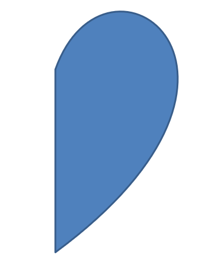

# Shape Geometry Customization (Shape Points Editing)
## Overview
Customization of the shape geometry assumes editing points of an existing shape. 


To provide the mentioned functionality [GeometryPath](https://apireference.aspose.com/slides/cpp/class/aspose.slides.geometry_path) class and [IGeometryPath](https://apireference.aspose.com/slides/cpp/class/aspose.slides.i_geometry_path) interface have been added. [GeometryPath](https://apireference.aspose.com/slides/cpp/class/aspose.slides.geometry_path) instance represents a geometry path of the [IGeometryShape](https://apireference.aspose.com/slides/cpp/class/aspose.slides.i_geometry_path) object. 

To retrieve [GeometryPath](https://apireference.aspose.com/slides/cpp/class/aspose.slides.geometry_path) from the [IGeometryShape](https://apireference.aspose.com/slides/cpp/class/aspose.slides.i_geometry_shape) instance IGeometryShape::GetGeometryPaths method has been added. Shapes may be built from a few smaller shapes (e.g. an "equal" sign) so this method returns an array of [GeometryPath](https://apireference.aspose.com/slides/cpp/class/aspose.slides.geometry_path) objects. 

To set [GeometryPath](https://apireference.aspose.com/slides/cpp/class/aspose.slides.geometry_path) to the shape two methods have been added: 
IGeometryShape::SetGeometryPath for solid shapes and IGeometryShape::SetGeometryPaths for composite shapes.

[IGeometryPath](https://apireference.aspose.com/slides/cpp/class/aspose.slides.i_geometry_path) provides methods for adding segments of various types:

**Adds line** to the end of the path
``` cpp
void LineTo(PointF point);
void LineTo(float x, float y);
```
**Adds line** to the specified place of the path:
``` cpp    
void LineTo(PointF point, uint32_t index);
void LineTo(float x, float y, uint32_t index);
```
**Adds cubic Bezier curve** at the end the path:
``` cpp
void CubicBezierTo(PointF point1, PointF point2, PointF point3);
void CubicBezierTo(float x1, float y1, float x2, float y2, float x3, float y3);
```
**Adds cubic Bezier curve** to the specified place of the path:
``` cpp
void CubicBezierTo(PointF point1, PointF point2, PointF point3, uint32_t index);
void CubicBezierTo(float x1, float y1, float x2, float y2, float x3, float y3, uint32_t index);
```
**Adds quadratic Bezier curve** at the end the path:
``` cpp
void QuadraticBezierTo(PointF point1, PointF point2);
void QuadraticBezierTo(float x1, float y1, float x2, float y2);
```
**Adds quadratic Bezier curve** to the specified place of the path:
``` cpp
void QuadraticBezierTo(PointF point1, PointF point2, uint32_t index);
void QuadraticBezierTo(float x1, float y1, float x2, float y2, uint32_t index);
```
**Appends the specified arc** to the path:
``` cpp
void ArcTo(float width, float heigth, float startAngle, float sweepAngle);
```
**Closes the current figure** of this path:
``` cpp
void CloseFigure();
```
**Sets next point position**:
``` cpp
void MoveTo(PointF point);
void MoveTo(float x, float y);
```
**Removes path segment** at the specified index:
``` cpp
void RemoveAt(int32_t index);
```
Methods IGeometryPath::set_Stroke and IGeometryPath::set_FillMode set an appearance of the geometry path.

Method IGeometryPath::get_PathData returns the geometry path of [GeometryShape](https://apireference.aspose.com/slides/cpp/class/aspose.slides.geometry_shape) as an array of path segments.


*To provide more options of shape geometry customization [ShapeUtil](https://apireference.aspose.com/slides/cpp/class/aspose.slides.util.shape_util) class has been added. Methods of this class allow to convert [GeometryPath](https://apireference.aspose.com/slides/cpp/class/aspose.slides.geometry_path) to [GraphicsPath](https://apireference.aspose.com/slides/cpp/class/system.drawing.drawing2_d.graphics_path) back and forth.*

# Examples and Use Cases
## Add Custom Points to Shape
- Create an instance of the [GeometryShape](https://apireference.aspose.com/slides/cpp/class/aspose.slides.geometry_shape) class of type ShapeType::Rectangle
- Retrieve an instance of the [GeometryPath](https://apireference.aspose.com/slides/cpp/class/aspose.slides.geometry_path) class from the shape.
- Add a new point between two top points of the path.
- Add a new point between two bottom points of the path.
- Apply the path to the shape.
  
``` cpp
SharedPtr<Presentation> pres = System::MakeObject<Presentation>();

SharedPtr<IShapeCollection> shapes = pres->get_Slides()->idx_get(0)->get_Shapes();
SharedPtr<GeometryShape> shape = System::DynamicCast<GeometryShape>(shapes->AddAutoShape(ShapeType::Rectangle, 100.0f, 100.0f, 200.0f, 100.0f));

SharedPtr<IGeometryPath> geometryPath = shape->GetGeometryPaths()->idx_get(0);

geometryPath->LineTo(100.0f, 50.0f, 1);
geometryPath->LineTo(100.0f, 50.0f, 4);
shape->SetGeometryPath(geometryPath);
```


##  Remove Points from Shape

- Create an instance of [GeometryShape](https://apireference.aspose.com/slides/cpp/class/aspose.slides.geometry_shape) class of type ShapeType::Heart.
- Retrieve an instance of the [GeometryPath](https://apireference.aspose.com/slides/cpp/class/aspose.slides.geometry_path) class from the shape.
- Remove segment of the path.
- Apply the path to the shape.
  
``` cpp
SharedPtr<Presentation> pres = System::MakeObject<Presentation>();

SharedPtr<IShapeCollection> shapes = pres->get_Slides()->idx_get(0)->get_Shapes();
SharedPtr<GeometryShape> shape = System::DynamicCast<GeometryShape>(shapes->AddAutoShape(ShapeType::Heart, 100.0f, 100.0f, 300.0f, 300.0f));

SharedPtr<IGeometryPath> path = shape->GetGeometryPaths()->idx_get(0);
path->RemoveAt(2);
shape->SetGeometryPath(path);
```


##  Create Custom Shape

- Calculate points of the shape.
- Create an instance of the [GeometryPath](https://apireference.aspose.com/slides/cpp/class/aspose.slides.geometry_path) class. 
- Fill the path with the points.
- Create an instance of the [GeometryShape](https://apireference.aspose.com/slides/cpp/class/aspose.slides.geometry_shape) class. 
- Apply the path to the shape.

``` cpp
SharedPtr<List<PointF>> points = System::MakeObject<List<PointF>>();

float R = 100.0f, r = 50.0f;
int32_t step = 72;

for (int32_t angle = -90; angle < 270; angle += step)
{
    double radians = angle * (Math::PI / 180.f);
    double x = outerRadius * Math::Cos(radians);
    double y = outerRadius * Math::Sin(radians);
    points->Add(PointF((float)x + outerRadius, (float)y + outerRadius));

    radians = Math::PI * (angle + step / 2) / 180.0;
    x = innerRadiusr * Math::Cos(radians);
    y = innerRadiusr * Math::Sin(radians);
    points->Add(PointF((float)x + outerRadius, (float)y + outerRadius));
}

SharedPtr<GeometryPath> starPath = System::MakeObject<GeometryPath>();
starPath->MoveTo(points->idx_get(0));

for (int32_t i = 1; i < points->get_Count(); i++)
{
    starPath->LineTo(points->idx_get(i));
}

starPath->CloseFigure();

SharedPtr<Presentation> pres = System::MakeObject<Presentation>();

SharedPtr<IShapeCollection> shapes = pres->get_Slides()->idx_get(0)->get_Shapes();
SharedPtr<GeometryShape> shape = System::DynamicCast<GeometryShape>(shapes->AddAutoShape(ShapeType::Rectangle, 100.0f, 100.0f, R * 2, R * 2));

shape->SetGeometryPath(starPath);
```


## Create Composite Custom Shape

  - Create an instance of the [GeometryShape](https://apireference.aspose.com/slides/cpp/class/aspose.slides.geometry_shape) class.
  - Create first instance of the [GeometryPath](https://apireference.aspose.com/slides/cpp/class/aspose.slides.geometry_path) class.
  - Create second instance of the [GeometryPath](https://apireference.aspose.com/slides/cpp/class/aspose.slides.geometry_path) class.
  - Apply the paths to the shape.

``` cpp
SharedPtr<Presentation> pres = System::MakeObject<Presentation>();

SharedPtr<IShapeCollection> shapes = pres->get_Slides()->idx_get(0)->get_Shapes();
SharedPtr<GeometryShape> shape = System::DynamicCast<GeometryShape>(shapes->AddAutoShape(ShapeType::Rectangle, 100.0f, 100.0f, 200.0f, 100.0f));

SharedPtr<IGeometryPath> geometryPath0 = System::MakeObject<GeometryPath>();
geometryPath0->MoveTo(0.0f, 0.0f);
geometryPath0->LineTo(shape->get_Width(), 0.0f);
geometryPath0->LineTo(shape->get_Width(), shape->get_Height() / 3);
geometryPath0->LineTo(0.0f, shape->get_Height() / 3);
geometryPath0->CloseFigure();

SharedPtr<IGeometryPath> geometryPath1 = System::MakeObject<GeometryPath>();
geometryPath1->MoveTo(0.0f, shape->get_Height() / 3 * 2);
geometryPath1->LineTo(shape->get_Width(), shape->get_Height() / 3 * 2);
geometryPath1->LineTo(shape->get_Width(), shape->get_Height());
geometryPath1->LineTo(0.0f, shape->get_Height());
geometryPath1->CloseFigure();

shape->SetGeometryPaths(System::MakeArray<SharedPtr<IGeometryPath>>({ geometryPath0, geometryPath1 }));
```


## Conversion of GeometryPath to GraphicsPath (System.Drawing.Drawing2D) 

- Create an instance of the [GeometryShape](https://apireference.aspose.com/slides/cpp/class/aspose.slides.geometry_shape) class.
- Create an instance of the [GraphicsPath](https://apireference.aspose.com/slides/cpp/class/system.drawing.drawing2_d.graphics_path) class  of the [System::Drawing::Drawing2D](https://apireference.aspose.com/slides/cpp/namespace/system.drawing.drawing2_d) namespace.
- Convert the [GraphicsPath](https://apireference.aspose.com/slides/cpp/class/system.drawing.drawing2_d.graphics_path) instance to the  [GeometryPath](https://apireference.aspose.com/slides/net/aspose.slides/geometrypath) instance using [ShapeUtil](https://apireference.aspose.com/slides/cpp/class/aspose.slides.util.shape_util).
- Apply the paths to the shape.
  
``` cpp
SharedPtr<Presentation> pres = System::MakeObject<Presentation>();

SharedPtr<IShapeCollection> shapes = pres->get_Slides()->idx_get(0)->get_Shapes();
SharedPtr<GeometryShape> shape = System::DynamicCast<GeometryShape>(shapes->AddAutoShape(ShapeType::Rectangle, 100.0f, 100.0f, 300.0f, 100.0f));

SharedPtr<IGeometryPath> originalPath = shape->GetGeometryPaths()->idx_get(0);
originalPath->set_FillMode(PathFillModeType::None);

SharedPtr<Drawing2D::GraphicsPath> graphicsPath = System::MakeObject<Drawing2D::GraphicsPath>();
graphicsPath->AddString(u"Text in shape", System::MakeObject<FontFamily>(u"Arial"), 1, 40.0f, PointF(10.0f, 10.0f), StringFormat::get_GenericDefault());

SharedPtr<IGeometryPath> textPath = ShapeUtil::GraphicsPathToGeometryPath(graphicsPath);
textPath->set_FillMode(PathFillModeType::Normal);

shape->SetGeometryPaths(System::MakeArray<SharedPtr<IGeometryPath>>({ originalPath, textPath }));
```

