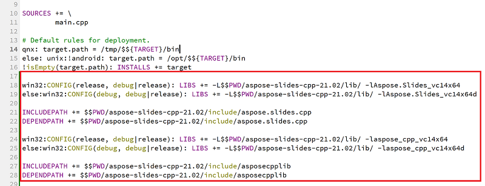

Qt is a C++ based cross-platform application development framework which is widely used to develop a variety of desktop, mobile, and embedded system applications. Aspose.Slides for C++ can be integrated within Qt in order to create and manipulate PowerPoint documents in your Qt applications.

## Using Aspose.Slides for C++ within Qt Creator

In order to use Aspose.Slides for C++ in your Qt application download the latest version of the API from the [downloads](https://downloads.aspose.com/slides/cpp) section. Once the API is downloaded, you can integrate the C++ library within Qt Creator or Visual Studio.

In order to integrate and use Aspose.Slides for C++ library within a Qt Console Application developed in Qt Creator, please follow the steps given below:

- Open Qt Creator and create a new *Qt Console Application*.

- Select the QMake option from the *Build System* dropdown list.

- Select the appropriate kit and finish the wizard.
- Copy aspose-slides-cpp-21.02 folder from the extracted package of Aspose.Slides for C++ into the root of the project.

- In order to add paths to lib and include folders, right-click on the project in the LHS panel and select *Add Library*.

- Select the External Library option and browse paths to include lib folders one by one.

- Once done, your .pro project file will contain the following entries:

- Build the application and you are done with the integration.  

{}

Note: See the [full demo project](https://github.com/aspose-slides/Aspose.Slides-for-C/tree/master/QtDemos/QtCreator/Qt_AsposeSlides_QMake) for more information.

{}

## Using Aspose.Slides for C++ in Qt Applications within Visual Studio

In order to develop a Qt application using Visual Studio, you need to install [Qt Visual Studio Tools](https://marketplace.visualstudio.com/items?itemName=TheQtCompany.QtVisualStudioTools-19123). Once you have the installation, download the latest version of the API from the [downloads](https://downloads.aspose.com/slides/cpp) section and follow the steps given below:

- Open Microsoft Visual Studio and create a new *Qt Console Application*.

- Select the appropriate kit and finish the wizard.
- In order to integrate and use Aspose.Slides for C++ library, right-click on the project and select *Manage NuGet Packages...*.

- Find and install the required *Aspose.Slides.Cpp* package.

- Build the project and you are done with the integration.  

{}

Note: See the [full demo project](https://github.com/aspose-slides/Aspose.Slides-for-C/tree/master/QtDemos/Visual%20Studio/Qt_AsposeSlides_VS) for more information.

{}
