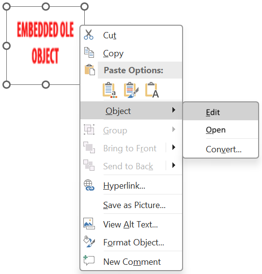

## **Úvod**

Při použití Aspose.Slides pro Android přes Java, když do snímku přidáte [OleObjectFrame](https://reference.aspose.com/slides/cs/androidjava/com.aspose.slides/oleobjectframe/), zobrazí se na výstupním snímku zpráva „EMBEDDED OLE OBJECT“. Tato zpráva je úmyslná a NEJDE o chybu.

Další informace o práci s OLE objekty najdete v článku [Spravovat OLE](/slides/cs/androidjava/manage-ole/). 

## **Vysvětlení a řešení**

Aspose.Slides zobrazuje zprávu „EMBEDDED OLE OBJECT“, aby vás upozornil, že OLE objekt byl změněn a musí se aktualizovat náhledový obrázek. 

Například když přidáte Microsoft Excel graf jako [OleObjectFrame](https://reference.aspose.com/slides/cs/androidjava/com.aspose.slides/oleobjectframe/) do snímku (více podrobností viz článek „Spravovat OLE“) a poté otevřete prezentaci v Microsoft PowerPoint, uvidíte na snímku tento obrázek:


Pokud chcete ověřit a potvrdit, že byl OLE objekt přidán do snímku, musíte dvakrát kliknout na zprávu „EMBEDDED OLE OBJECT“, nebo na ni kliknout pravým tlačítkem myši a zvolit **Objekt > Upravit**.



PowerPoint pak otevře vložený OLE objekt.


Snímek může zprávu „EMBEDDED OLE OBJECT“ zachovat. Jakmile na OLE objekt kliknete, náhled snímku se aktualizuje a zpráva „EMBEDDED OLE OBJECT“ je nahrazena skutečným obrázkem OLE objektu. 


Nyní můžete prezentaci uložit, aby se obrázek OLE objektu správně aktualizoval. Tímto způsobem, po uložení a opětovném otevření prezentace, už nebudete vidět zprávu „EMBEDDED OLE OBJECT“. 

## **Další řešení**

### **Řešení 1: Nahrazení zprávy „Embedded OLE Object“ obrázkem**

Pokud nechcete odstraňovat zprávu „EMBEDDED OLE OBJECT“ otevřením prezentace v PowerPointu a následným uložením, můžete zprávu nahradit preferovaným náhledovým obrázkem. Následující řádky kódu ukazují proces:

```java
Presentation presentation = new Presentation("embeddedOLE.pptx");
try {
    ISlide slide = presentation.getSlides().get_Item(0);
    IOleObjectFrame oleFrame = (IOleObjectFrame) slide.getShapes().get_Item(0);

    // Přidejte obrázek do prostředků prezentace.
    IImage image = Images.fromFile("myImage.png");
    IPPImage oleImage = presentation.getImages().addImage(image);

    // Nastavte nadpis a obrázek pro náhled OLE objektu.
    oleFrame.setSubstitutePictureTitle("My title");
    oleFrame.getSubstitutePictureFormat().getPicture().setImage(oleImage);
    oleFrame.setObjectIcon(false);

    presentation.save("embeddedOLE-newImage.pptx", SaveFormat.Pptx);
} finally {
    if (presentation != null) presentation.dispose();    
}
```

Snímek obsahující `OleObjectFrame` pak vypadá takto:


### **Řešení 2: Vytvoření doplňku pro PowerPoint**

Můžete také vytvořit doplněk pro Microsoft PowerPoint, který při otevření prezentací v programu aktualizuje všechny OLE objekty.