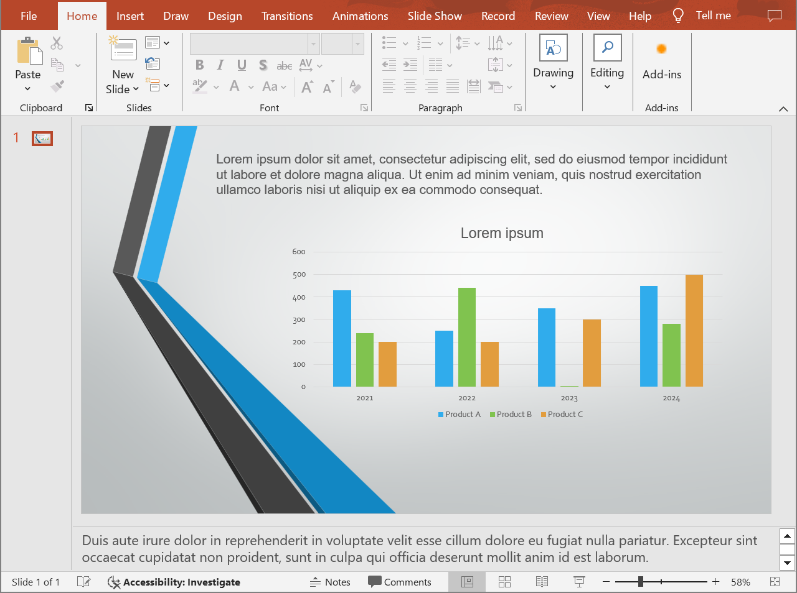

## **Úvod**

Aspose.Slides pro Android via Java poskytuje jednoduché řešení pro převod prezentací PowerPoint a OpenDocument (PPT, PPTX a ODP) s poznámkami do formátu TIFF. Tento formát se široce používá pro ukládání vysoce kvalitních obrázků, tisk a archivaci dokumentů. S Aspose.Slides můžete nejen exportovat celé prezentace s poznámkami řečníka, ale také generovat miniatury snímků v zobrazení poznámkových snímků. Proces převodu je jednoduchý a efektivní, využívá metodu `save` třídy [Presentation](https://reference.aspose.com/slides/cs/androidjava/com.aspose.slides/presentation/) k transformaci celé prezentace na sérii TIFF obrázků při zachování poznámek a rozvržení.

## **Převést prezentaci do TIFF s poznámkami**

Uložení prezentace PowerPoint nebo OpenDocument do TIFF s poznámkami pomocí Aspose.Slides pro Android via Java zahrnuje následující kroky:

1. Vytvořte instanci třídy [Presentation](https://reference.aspose.com/slides/cs/androidjava/com.aspose.slides/presentation/): načtěte soubor PowerPoint nebo OpenDocument.  
2. Nakonfigurujte možnosti výstupního rozvržení: použijte třídu [NotesCommentsLayoutingOptions](https://reference.aspose.com/slides/cs/androidjava/com.aspose.slides/notescommentslayoutingoptions/) k určení, jak mají být zobrazovány poznámky a komentáře.  
3. Uložte prezentaci do TIFF: předávejte nakonfigurované možnosti metodě [save](https://reference.aspose.com/slides/cs/androidjava/com.aspose.slides/presentation/#save-java.lang.String-int-com.aspose.slides.ISaveOptions-).

Předpokládejme, že máme soubor "speaker_notes.pptx" s následujícím snímkem:



Ukázka kódu níže demonstruje, jak převést prezentaci na TIFF obrázek v zobrazení poznámkových snímků pomocí metody [setSlidesLayoutOptions](https://reference.aspose.com/slides/cs/androidjava/com.aspose.slides/tiffoptions/#setSlidesLayoutOptions-com.aspose.slides.ISlidesLayoutOptions-) .

```java
// Vytvořte instanci třídy Presentation, která představuje soubor prezentace.
Presentation presentation = new Presentation("speaker_notes.pptx");
try {
    NotesCommentsLayoutingOptions notesOptions = new NotesCommentsLayoutingOptions();
    notesOptions.setNotesPosition(NotesPositions.BottomFull); // Zobrazí poznámky pod snímkem.

    // Nakonfigurujte možnosti TIFF s rozvržením poznámek.
    TiffOptions tiffOptions = new TiffOptions();
    tiffOptions.setDpiX(300);
    tiffOptions.setDpiY(300);
    tiffOptions.setSlidesLayoutOptions(notesOptions);

    // Uložte prezentaci do TIFF s poznámkami řečníka.
    presentation.save("TIFF_with_notes.tiff", SaveFormat.Tiff, tiffOptions);
} finally {
    presentation.dispose();
}
```

Výsledek:


{}
Vyzkoušejte Aspose [Free PowerPoint to Poster Converter](https://products.aspose.app/slides/cs/conversion/convert-ppt-to-poster-online).
{}

## **Často kladené otázky**

**Mohu ovládat pozici oblasti poznámek ve výsledném TIFF?**

Ano. Použijte [nastavení rozvržení poznámek](https://reference.aspose.com/slides/cs/androidjava/com.aspose.slides/tiffoptions/#setSlidesLayoutOptions-com.aspose.slides.ISlidesLayoutOptions-) a vyberte mezi možnostmi `None`, `BottomTruncated` nebo `BottomFull`, které příslušně skryjí poznámky, umístí je na jednu stránku nebo umožní jejich rozložení na další stránky.

**Jak mohu snížit velikost TIFF souboru s poznámkami bez viditelné ztráty kvality?**

Zvolte [efektivní kompresi](https://reference.aspose.com/slides/cs/androidjava/com.aspose.slides/tiffoptions/#setCompressionType-int-) (např. `LZW` nebo `RLE`), nastavte rozumné DPI a pokud to je přijatelné, použijte nižší [formát pixelů](https://reference.aspose.com/slides/cs/androidjava/com.aspose.slides/tiffoptions/#setPixelFormat-int-) (např. 8 bpp nebo 1 bpp pro monochrom). Mírné zmenšení [rozměrů obrázku](https://reference.aspose.com/slides/cs/androidjava/com.aspose.slides/tiffoptions/#setImageSize-java.awt.Dimension-) také může pomoci, aniž by výrazně snížilo čitelnost.

**Ovlivňuje písmo v poznámkách výsledek, pokud původní písma chybí v systému?**

Ano. Chybějící písma spouští [náhradu](/slides/cs/androidjava/font-selection-sequence/), což může změnit měřítko textu a jeho vzhled. Abyste tomu předešli, [poskytněte požadovaná písma](/slides/cs/androidjava/custom-font/) nebo nastavte výchozí [záložní písmo](/slides/cs/androidjava/fallback-font/), aby byla použita zamýšlená typografie.