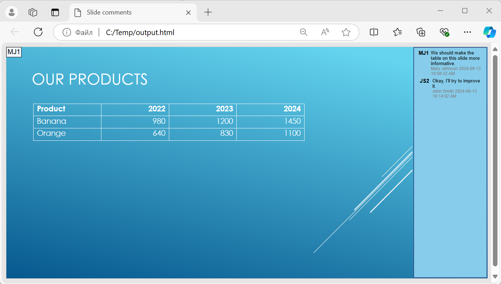

## **Přehled**

Tento článek vysvětluje, jak převést prezentace PowerPoint do formátu HTML5 pomocí Aspose.Slides pro Android prostřednictvím Javy. Popisuje základní export, ovládání animací tvarů a přechodů snímků a rozložení komentářů. Také porovnává výstup HTML5 s výstupem založeným na SVG při standardním exportu HTML.

## **Export PowerPoint do HTML5**

Následující příklad načte prezentaci z pracovního adresáře a uloží ji ve formátu HTML5. Používá výchozí nastavení exportu; další příklad ukazuje, jak explicitně ovládat přehrávání animací. Nahraďte vstupní cestu cestou k vaší prezentaci.

```java
import com.aspose.slides.*;

Presentation presentation = new Presentation("pres.pptx");
try {
    presentation.save("pres.html", SaveFormat.Html5);
} finally {
    presentation.dispose();
}
```

{}
Kromě HTML dokumentu export zapisuje také podporující soubory CSS a JavaScript pro stylování snímků, animace, efekty a navigaci. Uchovávejte tyto soubory spolu s HTML dokumentem při přesunu nebo publikaci výstupu. Generovaná stránka také načítá jQuery a Anime.js z veřejných CDN; bez nich nefunguje navigace mezi snímky ani animace.
{}

Pro export bez přehrávání animací tvarů nebo přechodů snímků předávejte `false` metodě [setAnimateShapes](https://reference.aspose.com/slides/androidjava/com.aspose.slides/html5options/#setAnimateShapes-boolean-) a [setAnimateTransitions](https://reference.aspose.com/slides/androidjava/com.aspose.slides/html5options/#setAnimateTransitions-boolean-) v [Html5Options](https://reference.aspose.com/slides/androidjava/com.aspose.slides/html5options/). Tato nastavení jsou nezávislá, takže můžete povolit jedno a zakázat druhé. Příklad exportuje prezentaci s oběma typy animací zakázanými v generované stránce.

```java
import com.aspose.slides.*;

Html5Options html5Options = new Html5Options();
html5Options.setAnimateShapes(false);
html5Options.setAnimateTransitions(false);

Presentation presentation = new Presentation("pres.pptx");
try {
    presentation.save("pres5.html", SaveFormat.Html5, html5Options);
} finally {
    presentation.dispose();
}
```

## **Export PowerPoint do HTML**

Standardní export do HTML používá odlišný renderovací přístup: obsah snímku je reprezentován jako SVG uvnitř HTML stránky. Následující příklad převádí prezentaci do HTML dokumentu pomocí tohoto renderovacího přístupu.

```java
import com.aspose.slides.*;

Presentation presentation = new Presentation("pres.pptx");
try {
    presentation.save("pres.html", SaveFormat.Html);
} finally {
    presentation.dispose();
}
```

Níže uvedený zjednodušený značkovací kód ilustruje strukturu vygenerované stránky. Prvek SVG obsahuje vykreslený obsah snímku; text zástupného symbolu představuje tento obsah a není doslovným výstupem exportu.

```html
<body>
<div class="slide" name="slide" id="slideslideIface1">
     <svg version="1.1">
         <g> THE SLIDE CONTENT GOES HERE </g>
     </svg>
</div>
</body>
```

{}
Export založený na SVG neexponuje tvary PowerPoint jako jednotlivé HTML elementy. Použijte export do HTML5, pokud potřebujete možnosti animace tvarů a přechodů snímků, které jsou v tomto článku předvedeny.
{}

## **Export PowerPoint do HTML5 zobrazení snímků**

Export do HTML5 vytvoří stránku pro prohlížení a navigaci snímky prezentace v prohlížeči. Tento příklad povoluje jak [setAnimateShapes](https://reference.aspose.com/slides/androidjava/com.aspose.slides/html5options/#setAnimateShapes-boolean-), tak [setAnimateTransitions](https://reference.aspose.com/slides/androidjava/com.aspose.slides/html5options/#setAnimateTransitions-boolean-), aby exportované zobrazení snímků mohlo přehrávat efekty ze zdrojové prezentace.

Použijte prezentaci, která již obsahuje animace tvarů a přechody snímků, abyste viděli účinek těchto nastavení. Povolení nepřidá nové efekty ke snímkům, které žádné nemají. Po exportu otevřete vygenerovaný HTML5 dokument v prohlížeči s dostupnými podporujícími soubory.

```java
import com.aspose.slides.*;

Html5Options html5Options = new Html5Options();
html5Options.setAnimateShapes(true);
html5Options.setAnimateTransitions(true);

Presentation presentation = new Presentation("pres.pptx");
try {
    presentation.save("HTML5-slide-view.html", SaveFormat.Html5, html5Options);
} finally {
    presentation.dispose();
}
```

## **Převod prezentace do HTML5 dokumentu s komentáři**

Můžete zahrnout existující komentáře ke snímkům do výstupu HTML5, aby čtenáři viděli zpětnou vazbu vedle obsahu snímku. Příklad v této sekci očekává, že zdrojová prezentace obsahuje komentáře, jak je znázorněno níže. Exportuje tyto komentáře; nevytváří žádné nové.


Přeneste objekt [NotesCommentsLayoutingOptions](https://reference.aspose.com/slides/androidjava/com.aspose.slides/notescommentslayoutingoptions/) do metody [setSlidesLayoutOptions](https://reference.aspose.com/slides/androidjava/com.aspose.slides/html5options/#setSlidesLayoutOptions-com.aspose.slides.ISlidesLayoutOptions-) třídy [Html5Options](https://reference.aspose.com/slides/androidjava/com.aspose.slides/html5options/). Použijte [setCommentsPosition](https://reference.aspose.com/slides/androidjava/com.aspose.slides/notescommentslayoutingoptions/#setCommentsPosition-int-) pro výběr `Right` z výčtu [CommentsPositions](https://reference.aspose.com/slides/androidjava/com.aspose.slides/commentspositions/), aby se komentáře umístily napravo od každého snímku.

Následující příklad exportuje prezentaci do HTML5 s tímto rozložením komentářů. Prezentace bez komentářů nebude mít žádný text komentáře k zobrazení.

```java
import com.aspose.slides.*;

NotesCommentsLayoutingOptions layoutOptions = new NotesCommentsLayoutingOptions();
layoutOptions.setCommentsPosition(CommentsPositions.Right);

Html5Options html5Options = new Html5Options();
html5Options.setSlidesLayoutOptions(layoutOptions);

Presentation presentation = new Presentation("sample.pptx");
try {
    presentation.save("output.html", SaveFormat.Html5, html5Options);
} finally {
    presentation.dispose();
}
```



## **Vyloučení JavaScript odkazů během exportu**

Předpokládejme, že `hyperlinks.pptx` obsahuje propojený text s cílem `javascript:alert('Hello')` a běžný odkaz `https://example.com/`. Pro vyloučení JavaScript odkazu během exportu předávejte `true` metodě [SaveOptions.setSkipJavaScriptLinks](https://reference.aspose.com/slides/androidjava/com.aspose.slides/saveoptions/#setSkipJavaScriptLinks-boolean-). Výchozí hodnota je `false`, takže tyto odkazy nejsou filtrovány, pokud možnost nepovolíte.

Následující příklad načte prezentaci z pracovního adresáře a exportuje ji pomocí [Html5Options](https://reference.aspose.com/slides/androidjava/com.aspose.slides/html5options/):

```java
import com.aspose.slides.*;

Html5Options html5Options = new Html5Options();
html5Options.setSkipJavaScriptLinks(true);

Presentation presentation = new Presentation("hyperlinks.pptx");
try {
    presentation.save("filtered-html5.html", SaveFormat.Html5, html5Options);
} finally {
    presentation.dispose();
}
```

Exportovaný soubor vynechává JavaScript odkaz, přičemž zachovává jeho text a běžný HTTPS odkaz. Zdrojová prezentace zůstává beze změny.

Tato možnost filtruje JavaScript odkazy; neodstraňuje všechny skripty ani jiný aktivní obsah a také nezaručuje shodu s CSP. Například výstup HTML5 stále obsahuje skripty pro navigaci snímky a animace.

## **Často kladené otázky**

**Mohu ovládat, zda se animace objektů a přechody snímků přehrávají v HTML5?**

Ano, export do HTML5 poskytuje samostatné možnosti pro povolení nebo zakázání [animace tvarů](https://reference.aspose.com/slides/androidjava/com.aspose.slides/html5options/#setAnimateShapes-boolean-) a [přechody snímků](https://reference.aspose.com/slides/androidjava/com.aspose.slides/html5options/#setAnimateTransitions-boolean-).

**Jsou komentáře podporovány a kde mohou být umístěny vzhledem ke snímku?**

Ano, existující komentáře mohou být zahrnuty do výstupu HTML5 a umístěny (například napravo od snímku) pomocí [nastavení rozložení](https://reference.aspose.com/slides/androidjava/com.aspose.slides/html5options/#setSlidesLayoutOptions-com.aspose.slides.ISlidesLayoutOptions-) pro poznámky a komentáře.

**Mohu vynechat odkazy, které spouštějí JavaScript z bezpečnostních nebo CSP důvodů?**

Ano, nastavení [setSkipJavaScriptLinks](https://reference.aspose.com/slides/androidjava/com.aspose.slides/saveoptions/#setSkipJavaScriptLinks-boolean-) vám umožňuje během ukládání vynechat hypertextové odkazy s voláním JavaScriptu. Výchozí hodnota je `false`. Viz [Vyloučení JavaScript odkazů během exportu](/slides/cs/androidjava/export-to-html5/#exclude-javascript-hyperlinks-during-export) pro příklad exportu do HTML5 a rozsah filtru. Toto nastavení neodstraňuje JavaScript používaný HTML5 prohlížečem pro navigaci a animace.