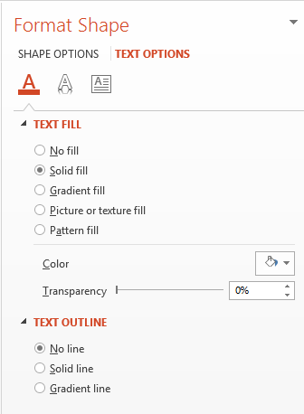

## **Přehled**

Efekty WordArt vám umožňují přidávat vizuálně atraktivní, stylizovaný text do vašich prezentací PowerPoint. S Aspose.Slides mohou vývojáři programově vytvářet, přizpůsobovat a spravovat WordArt stejně jako v Microsoft PowerPoint — bez nutnosti instalovaného Office. Tento článek poskytuje přehled práce s WordArt, včetně aplikace textových transformací, výplní, obrysů, stínů a dalších možností formátování, které učiní obsah vaší prezentace výražnější a poutavější. WordArt vám umožňuje zacházet s textem jako s grafickým objektem. Jedná se o efekty nebo speciální úpravy aplikované na text, aby byl atraktivnější nebo výraznější.

## **Vytvořte jednoduchou šablonu WordArt a použijte ji na text**

**Použití Aspose.Slides** 

Nejprve vytvoříme jednoduchý text pomocí tohoto Java kódu: 

``` java
Presentation pres = new Presentation();
try {
    ISlide slide = pres.getSlides().get_Item(0);
    IAutoShape autoShape = slide.getShapes().addAutoShape(ShapeType.Rectangle, 200, 200, 400, 200);
    ITextFrame textFrame = autoShape.getTextFrame();

    Portion portion = (Portion)textFrame.getParagraphs().get_Item(0).getPortions().get_Item(0);
    portion.setText("Aspose.Slides");
} finally {
    if (pres != null) pres.dispose();
}
```
Nyní nastavíme výšku písma textu na vyšší hodnotu, aby byl efekt výraznější, pomocí tohoto kódu:

``` java 
FontData fontData = new FontData("Arial Black");
portion.getPortionFormat().setLatinFont(fontData);
portion.getPortionFormat().setFontHeight(36);
```

**Použití Microsoft PowerPoint**

Přejděte do nabídky efektů WordArt v Microsoft PowerPoint:


V pravém panelu můžete vybrat předdefinovaný efekt WordArt. V levém panelu můžete zadat nastavení pro nový WordArt. 

Níže jsou některé dostupné parametry nebo možnosti:



**Použití Aspose.Slides**

Zde aplikujeme barvu vzoru [SmallGrid](https://reference.aspose.com/slides/cs/androidjava/com.aspose.slides/PatternStyle#SmallGrid) na text a přidáme černý okraj textu šířky 1 pomocí tohoto kódu:

``` java 
portion.getPortionFormat().getFillFormat().setFillType(FillType.Pattern);
portion.getPortionFormat().getFillFormat().getPatternFormat().getForeColor().setColor(Color.ORANGE);
portion.getPortionFormat().getFillFormat().getPatternFormat().getBackColor().setColor(Color.WHITE);
portion.getPortionFormat().getFillFormat().getPatternFormat().setPatternStyle(PatternStyle.SmallGrid);

portion.getPortionFormat().getLineFormat().getFillFormat().setFillType(FillType.Solid);
portion.getPortionFormat().getLineFormat().getFillFormat().getSolidFillColor().setColor(Color.BLACK);
```

Výsledný text:


## **Aplikace dalších efektů WordArt**

**Použití Microsoft PowerPoint**

Z rozhraní programu můžete tyto efekty použít na text, blok textu, tvar nebo podobný prvek:


Například efekty Stín, Reflexe a Záře lze aplikovat na text; efekty 3D formát a 3D rotace lze aplikovat na blok textu; vlastnost Měkké hrany lze aplikovat na objekt tvaru (stále má efekt, i když není nastavena vlastnost 3D formátu). 

### **Aplikace stínových efektů**

Zde chceme nastavit vlastnosti vztahující se pouze k textu. Stínový efekt na text aplikujeme pomocí tohoto Java kódu:

``` java
portion.getPortionFormat().getEffectFormat().enableOuterShadowEffect();
portion.getPortionFormat().getEffectFormat().getOuterShadowEffect().getShadowColor().setColor(Color.BLACK);
portion.getPortionFormat().getEffectFormat().getOuterShadowEffect().setScaleHorizontal(100);
portion.getPortionFormat().getEffectFormat().getOuterShadowEffect().setScaleVertical(65);
portion.getPortionFormat().getEffectFormat().getOuterShadowEffect().setBlurRadius(4.73);
portion.getPortionFormat().getEffectFormat().getOuterShadowEffect().setDirection(230);
portion.getPortionFormat().getEffectFormat().getOuterShadowEffect().setDistance(2);
portion.getPortionFormat().getEffectFormat().getOuterShadowEffect().setSkewHorizontal(30);
portion.getPortionFormat().getEffectFormat().getOuterShadowEffect().setSkewVertical(0);
portion.getPortionFormat().getEffectFormat().getOuterShadowEffect().getShadowColor().getColorTransform().add(ColorTransformOperation.SetAlpha, 0.32f);
```

API Aspose.Slides podporuje tři typy stínů: OuterShadow, InnerShadow a PresetShadow. 

S PresetShadow můžete použít předdefinovaný stín na text. 

**Použití Microsoft PowerPoint**

V PowerPoint můžete použít jeden typ stínu. Zde je příklad:


**Použití Aspose.Slides**

Aspose.Slides ve skutečnosti umožňuje aplikovat dva typy stínů najednou: InnerShadow a PresetShadow.

**Poznámky:**

- Když jsou použity OuterShadow a PresetShadow zároveň, použije se pouze efekt OuterShadow. 
- Pokud jsou použity OuterShadow a InnerShadow současně, výsledný nebo aplikovaný efekt závisí na verzi PowerPointu. Například v PowerPoint 2013 se efekt zdvojnásobí. V PowerPoint 2007 se použije efekt OuterShadow. 

### **Aplikace reflexních efektů na text**

Do textu přidáme reflex pomocí tohoto ukázkového kódu v Java:

``` java
portion.getPortionFormat().getEffectFormat().enableReflectionEffect();
portion.getPortionFormat().getEffectFormat().getReflectionEffect().setBlurRadius(0.5);
portion.getPortionFormat().getEffectFormat().getReflectionEffect().setDistance(4.72);
portion.getPortionFormat().getEffectFormat().getReflectionEffect().setStartPosAlpha(0f);
portion.getPortionFormat().getEffectFormat().getReflectionEffect().setEndPosAlpha(60f);
portion.getPortionFormat().getEffectFormat().getReflectionEffect().setDirection(90);
portion.getPortionFormat().getEffectFormat().getReflectionEffect().setScaleHorizontal(100);
portion.getPortionFormat().getEffectFormat().getReflectionEffect().setScaleVertical(-100);
portion.getPortionFormat().getEffectFormat().getReflectionEffect().setStartReflectionOpacity(60f);
portion.getPortionFormat().getEffectFormat().getReflectionEffect().setEndReflectionOpacity(0.9f);
portion.getPortionFormat().getEffectFormat().getReflectionEffect().setRectangleAlign(RectangleAlignment.BottomLeft);   
```

### **Aplikace zářivých efektů na text**

Zářivý efekt na text aplikujeme pomocí tohoto kódu:

``` java
portion.getPortionFormat().getEffectFormat().enableGlowEffect();
portion.getPortionFormat().getEffectFormat().getGlowEffect().getColor().setR((byte)255);
portion.getPortionFormat().getEffectFormat().getGlowEffect().getColor().getColorTransform().add(ColorTransformOperation.SetAlpha, 0.54f);
portion.getPortionFormat().getEffectFormat().getGlowEffect().setRadius(7);
```

Výsledek operace:


{} 

Můžete měnit parametry pro stín, reflex a záři. Vlastnosti efektů se nastavují na každou část textu samostatně. 

{} 

### **Použití transformací ve WordArt**

Využijeme vlastnost Transform (platnou pro celý blok textu) pomocí tohoto kódu:
``` java 
textFrame.getTextFrameFormat().setTransform(TextShapeType.ArchUpPour);
```

Výsledek:


{} 

Jak Microsoft PowerPoint, tak Aspose.Slides pro Android pomocí Java poskytují určité množství předdefinovaných typů transformací.

{} 

**Použití PowerPoint**

Pro přístup k předdefinovaným typům transformací přejděte přes: **Formát** -> **TextEffect** -> **Transform**

**Použití Aspose.Slides**

Pro výběr typu transformace použijte výčet TextShapeType. 

### **Aplikace 3D efektů na text a tvary**

Nastavíme 3D efekt na textový tvar pomocí této ukázky kódu:

``` java
autoShape.getThreeDFormat().getBevelBottom().setBevelType(BevelPresetType.Circle);
autoShape.getThreeDFormat().getBevelBottom().setHeight(10.5);
autoShape.getThreeDFormat().getBevelBottom().setWidth(10.5);

autoShape.getThreeDFormat().getBevelTop().setBevelType(BevelPresetType.Circle);
autoShape.getThreeDFormat().getBevelTop().setHeight(12.5);
autoShape.getThreeDFormat().getBevelTop().setWidth(11);

autoShape.getThreeDFormat().getExtrusionColor().setColor(Color.ORANGE);
autoShape.getThreeDFormat().setExtrusionHeight(6);

autoShape.getThreeDFormat().getContourColor().setColor(Color.RED);
autoShape.getThreeDFormat().setContourWidth(1.5);

autoShape.getThreeDFormat().setDepth(3);

autoShape.getThreeDFormat().setMaterial(MaterialPresetType.Plastic);

autoShape.getThreeDFormat().getLightRig().setDirection(LightingDirection.Top);
autoShape.getThreeDFormat().getLightRig().setLightType(LightRigPresetType.Balanced);
autoShape.getThreeDFormat().getLightRig().setRotation(0, 0, 40);

autoShape.getThreeDFormat().getCamera().setCameraType(CameraPresetType.PerspectiveContrastingRightFacing);
```

Výsledný text a jeho tvar:


Na text aplikujeme 3D efekt pomocí tohoto Java kódu:

``` java
textFrame.getTextFrameFormat().getThreeDFormat().getBevelBottom().setBevelType(BevelPresetType.Circle);
textFrame.getTextFrameFormat().getThreeDFormat().getBevelBottom().setHeight(3.5);
textFrame.getTextFrameFormat().getThreeDFormat().getBevelBottom().setWidth(3.5);

textFrame.getTextFrameFormat().getThreeDFormat().getBevelTop().setBevelType(BevelPresetType.Circle);
textFrame.getTextFrameFormat().getThreeDFormat().getBevelTop().setHeight(4);
textFrame.getTextFrameFormat().getThreeDFormat().getBevelTop().setWidth(4);

textFrame.getTextFrameFormat().getThreeDFormat().getExtrusionColor().setColor(Color.ORANGE);
textFrame.getTextFrameFormat().getThreeDFormat().setExtrusionHeight(6);

textFrame.getTextFrameFormat().getThreeDFormat().getContourColor().setColor(Color.RED);
textFrame.getTextFrameFormat().getThreeDFormat().setContourWidth(1.5);

textFrame.getTextFrameFormat().getThreeDFormat().setDepth(3);

textFrame.getTextFrameFormat().getThreeDFormat().setMaterial(MaterialPresetType.Plastic);

textFrame.getTextFrameFormat().getThreeDFormat().getLightRig().setDirection(LightingDirection.Top);
textFrame.getTextFrameFormat().getThreeDFormat().getLightRig().setLightType(LightRigPresetType.Balanced);
textFrame.getTextFrameFormat().getThreeDFormat().getLightRig().setRotation(0, 0, 40);

textFrame.getTextFrameFormat().getThreeDFormat().getCamera().setCameraType(CameraPresetType.PerspectiveContrastingRightFacing);
```

Výsledek operace:


{} 

Aplikace 3D efektů na texty nebo jejich tvary a interakce mezi efekty se řídí určitými pravidly. 

Uvažujte scénu pro text a tvar, který text obsahuje. 3D efekt zahrnuje 3D reprezentaci objektu a scénu, do které byl objekt umístěn. 

- Když je scéna nastavena pro jak pro tvar, tak pro text, má scéna tvaru vyšší prioritu — scéna textu je ignorována. 
- Když tvar nemá vlastní scénu, ale má 3D reprezentaci, použije se scéna textu. 
- V opačném případě — když tvar původně nemá 3D efekt — tvar zůstane plochý a 3D efekt se aplikuje pouze na text. 

Tyto popisy souvisejí s metodami ThreeDFormat.getLightRig() a ThreeDFormat.getCamera().

{} 

## **Aplikace vnějšího stínu na text**
Aspose.Slides pro Android pomocí Java poskytuje třídy [**IOuterShadow**](https://reference.aspose.com/slides/cs/androidjava/com.aspose.slides/ioutershadow/) a [**IInnerShadow**](https://reference.aspose.com/slides/cs/androidjava/com.aspose.slides/iinnershadow/), které umožňují aplikovat stínové efekty na text v rámci [TextFrame](https://reference.aspose.com/slides/cs/androidjava/com.aspose.slides/textframe/). Proveďte následující kroky:

1. Vytvořte instanci třídy [Presentation](https://reference.aspose.com/slides/cs/androidjava/com.aspose.slides/presentation).  
2. Získejte referenci na snímek pomocí jeho indexu.  
3. Přidejte na snímek AutoShape typu Rectangle.  
4. Přistupte k TextFrame přidruženému k AutoShape.  
5. Nastavte FillType AutoShape na NoFill.  
6. Vytvořte instanci třídy OuterShadow.  
7. Nastavte BlurRadius stínu.  
8. Nastavte Direction stínu.  
9. Nastavte Distance stínu.  
10. Nastavte RectanglelAlign na TopLeft.  
11. Nastavte PresetColor stínu na Black.  
12. Uložte prezentaci jako soubor [PPTX](https://docs.fileformat.com/presentation/pptx/).

Tento ukázkový kód v Java — implementace výše uvedených kroků — ukazuje, jak aplikovat efekt vnějšího stínu na text:

```java
Presentation pres = new Presentation();
try {
    // Získání reference na snímek
    ISlide sld = pres.getSlides().get_Item(0);

    // Přidání AutoShape typu Rectangle
    IAutoShape ashp = sld.getShapes().addAutoShape(ShapeType.Rectangle, 150, 75, 150, 50);

    // Přidání TextFrame do obdélníku
    ashp.addTextFrame("Aspose TextBox");

    // Zakázání výplně tvaru v případě, že chceme získat stín textu
    ashp.getFillFormat().setFillType(FillType.NoFill);

    // Přidání vnějšího stínu a nastavení všech potřebných parametrů
    ashp.getEffectFormat().enableOuterShadowEffect();
    IOuterShadow shadow = ashp.getEffectFormat().getOuterShadowEffect();
    shadow.setBlurRadius(4.0);
    shadow.setDirection(45);
    shadow.setDistance(3);
    shadow.setRectangleAlign(RectangleAlignment.TopLeft);
    shadow.getShadowColor().setPresetColor(PresetColor.Black);

    //Zapsání prezentace na disk
    pres.save("pres_out.pptx", SaveFormat.Pptx);
} finally {
    if (pres != null) pres.dispose();
}
```

## **Aplikace vnitřního stínu na tvary**
Postupujte podle těchto kroků:

1. Vytvořte instanci třídy [Presentation](https://reference.aspose.com/slides/cs/androidjava/com.aspose.slides/presentation).  
2. Získejte referenci na snímek.  
3. Přidejte AutoShape typu Rectangle.  
4. Povolení InnerShadowEffect.  
5. Nastavte všechny potřebné parametry.  
6. Nastavte ColorType na Scheme.  
7. Nastavte Scheme Color.  
8. Uložte prezentaci jako soubor [PPTX](https://docs.fileformat.com/presentation/pptx/).

Tento ukázkový kód (na základě výše uvedených kroků) ukazuje, jak v Java přidat spojku mezi dvěma tvary:

```java
Presentation pres = new Presentation();
try {
    // Získání reference na snímek
    ISlide slide = pres.getSlides().get_Item(0);

    // Přidání AutoShape typu Rectangle
    IAutoShape ashp = slide.getShapes().addAutoShape(ShapeType.Rectangle, 150, 75, 400, 300);
    ashp.getFillFormat().setFillType(FillType.NoFill);

    // Přidání TextFrame do obdélníku
    ashp.addTextFrame("Aspose TextBox");
    IPortion port = ashp.getTextFrame().getParagraphs().get_Item(0).getPortions().get_Item(0);
    IPortionFormat pf = port.getPortionFormat();
    pf.setFontHeight(50);

    // Povolení InnerShadowEffect
    IEffectFormat ef = pf.getEffectFormat();
    ef.enableInnerShadowEffect();

    // Nastavení všech potřebných parametrů
    ef.getInnerShadowEffect().setBlurRadius(8.0);
    ef.getInnerShadowEffect().setDirection(90.0F);
    ef.getInnerShadowEffect().setDistance(6.0);
    ef.getInnerShadowEffect().getShadowColor().setB((byte)189);

    // Nastavení ColorType na Scheme
    ef.getInnerShadowEffect().getShadowColor().setColorType(ColorType.Scheme);

    // Nastavení Scheme barvy
    ef.getInnerShadowEffect().getShadowColor().setSchemeColor(SchemeColor.Accent1);

    // Uložení prezentace
    pres.save("WordArt_out.pptx", SaveFormat.Pptx);
} finally {
    if (pres != null) pres.dispose();
}
```

## **Často kladené otázky**

**Mohu používat efekty WordArt s různými písmy nebo skripty (např. arabština, čínština)?**

Ano, Aspose.Slides podporuje Unicode a funguje se všemi hlavními písmy a skripty. Efekty WordArt, jako stín, výplň a obrys, lze aplikovat bez ohledu na jazyk, ačkoli dostupnost písma a vykreslování mohou záviset na systémových fontech.

**Mohu aplikovat efekty WordArt na prvky master slide?**

Ano, můžete aplikovat efekty WordArt na tvary v master slide, včetně zástupců titulku, zápatí nebo textu na pozadí. Změny provedené v rozložení masteru se projeví ve všech přidružených snímcích.

**Ovlivňují efekty WordArt velikost souboru prezentace?**

Mírně. Efekty WordArt, jako stíny, záře a gradientové výplně, mohou mírně zvětšit velikost souboru kvůli přidaným metadatům formátování, ale rozdíl je obvykle zanedbatelný.

**Mohu zobrazit náhled výsledku efektů WordArt bez uložení prezentace?**

Ano, můžete vykreslovat snímky obsahující WordArt do obrázků (např. PNG, JPEG) pomocí metody `getImage` z rozhraní [IShape](https://reference.aspose.com/slides/cs/androidjava/com.aspose.slides/ishape/) nebo [ISlide](https://reference.aspose.com/slides/cs/androidjava/com.aspose.slides/islide/). To vám umožní zobrazit výsledek v paměti nebo na obrazovce před uložením či exportem celé prezentace.