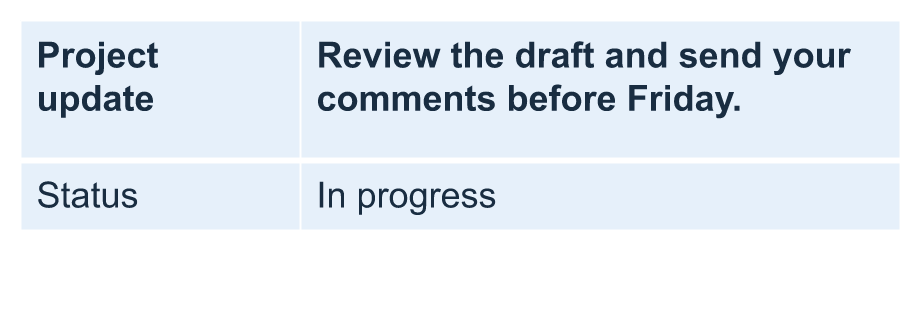

## **Úvod**

Aspose.Slides for Android via Java vám umožňuje spravovat strukturu tabulky a formátování v prezentacích PowerPoint prostřednictvím třídy [Table](https://reference.aspose.com/slides/androidjava/com.aspose.slides/table/) a rozhraní [ITable](https://reference.aspose.com/slides/androidjava/com.aspose.slides/itable/). Můžete označit řádek jako záhlaví, klonovat nebo odstraňovat řádky a sloupce a použít formátování textu na celý řádek nebo sloupec.

Tento článek popisuje tyto operace s příklady v jazyce Java. Také ukazuje, jak získat přednastavený styl tabulky, aby bylo možné jej znovu použít. Indexy řádků a sloupců tabulky jsou nulové.

## **Řízení výšky řádku**

Použijte [IRow.setMinimalHeight](https://reference.aspose.com/slides/androidjava/com.aspose.slides/irow/#setMinimalHeight-double-) k nastavení minimální výšky řádku v bodech. Jedná se o dolní mez, nikoli o pevnou výšku. [IRow.getHeight](https://reference.aspose.com/slides/androidjava/com.aspose.slides/irow/#getHeight--) vrací skutečnou výšku. Přístup k řádku získáte přes [ITable.getRows](https://reference.aspose.com/slides/androidjava/com.aspose.slides/itable/#getRows--).

Příklad načte [row-height-input.pptx](row-height-input.pptx), který obsahuje tabulku jako první tvar na první snímku. Jeho první řádek začíná ve výšce 70 bodů. Buňky používají text Arial 18 bodů, zalamování a okraje nahoře i dole po 6 bodů; delší text ve druhém sloupci se zalamuje do více řádků. Příklad zvýší minimum na 100 bodů, poté jej sníží na 20 bodů, vypíše skutečnou výšku po každé změně a uloží oba výsledky.

```java
import com.aspose.slides.*;

Presentation presentation = new Presentation("row-height-input.pptx");
try {
    ISlide slide = presentation.getSlides().get_Item(0);

    ITable table = (ITable)slide.getShapes().get_Item(0);
    IRow row = table.getRows().get_Item(0);

    row.setMinimalHeight(100);
    System.out.printf("Increased: minimum = %.1f, actual = %.1f pt%n", row.getMinimalHeight(), row.getHeight());
    presentation.save("row-height-increased.pptx", SaveFormat.Pptx);

    row.setMinimalHeight(20);
    System.out.printf("Decreased: minimum = %.1f, actual = %.1f pt%n", row.getMinimalHeight(), row.getHeight());
    presentation.save("row-height-decreased.pptx", SaveFormat.Pptx);
} finally {
    presentation.dispose();
}
```

U poskytnuté prezentace zvýšení minima přidá řádku prostor. Snížení ho odstraní ten přebytečný prostor, ale skutečná výška zůstane větší než 20 bodů, protože text a okraje buněk potřebují více místa. Pouhé snížení minima nemůže řádek donutit pod úroveň prostoru vyžadovaného jeho obsahem.

Na skutečnou výšku má vliv několik faktorů:

- **Text a velikost písma:** delší text, explicitní konce řádků nebo větší písmo mohou vyžadovat více svislého prostoru.
- **Zalamování a šířka sloupce:** při povoleném zalamování může snížení šířky sloupce pomocí [IColumn.setWidth](https://reference.aspose.com/slides/androidjava/com.aspose.slides/icolumn/#setWidth-double-) vytvořit více řádků. Širší sloupec může snížit potřebný vertikální prostor.
- **Okraje buněk:** [ICell.setMarginTop](https://reference.aspose.com/slides/androidjava/com.aspose.slides/icell/#setMarginTop-double-) a [ICell.setMarginBottom](https://reference.aspose.com/slides/androidjava/com.aspose.slides/icell/#setMarginBottom-double-) přidávají svislý prostor. [ICell.setMarginLeft](https://reference.aspose.com/slides/androidjava/com.aspose.slides/icell/#setMarginLeft-double-) a [ICell.setMarginRight](https://reference.aspose.com/slides/androidjava/com.aspose.slides/icell/#setMarginRight-double-) zmenšují šířku dostupnou pro text a mohou způsobit další zalamování.

Pro tuto tabulku bez sloučených buněk určuje buňka, která potřebuje nejvíce svislého prostoru, spodní limit pro celý řádek. Chcete‑li řádek zkrátit, může být také nutné zkrátit text, zmenšit velikost písma nebo okraje, případně sloupec rozšířit.

Obrázky níže ukazují stejnou tabulku ve stejném měřítku. Ve znázorněných výsledcích byly skutečné výšky 70, 100 a 55,2 bodu: poslední řádek zůstal vyšší než jeho minimální výška 20 bodů. Přesná měření textu se mohou lišit podle dostupných písem ve vašem prostředí. Stáhněte si uložené výsledky: [zvýšené minimum](row-height-increased.pptx) a [snížené minimum](row-height-decreased.pptx).

| Originál: minimum 70 pt, skutečná 70 pt | Zvýšeno: minimum 100 pt, skutečná 100 pt | Sníženo: minimum 20 pt, skutečná 55,2 pt |
| --- | --- | --- |
|  |  |  |

## **Nastavit první řádek jako záhlaví**

Použijte metodu [setFirstRow](https://reference.aspose.com/slides/androidjava/com.aspose.slides/itable/#setFirstRow-boolean-) k označení prvního řádku pro formátování záhlaví. Jeho vzhled závisí na stylu tabulky aplikovaném na tabulku.

1. Načtěte prezentaci pomocí třídy [Presentation](https://reference.aspose.com/slides/androidjava/com.aspose.slides/presentation/).
2. Získejte první snímek.
3. Získejte tabulku uloženou jako první tvar na snímku.
4. Povolit formátování záhlaví pro její první řádek.
5. Uložte upravenou prezentaci.

Příklad vyžaduje `table.pptx` s tabulkou jako první tvar na první snímku. Povolit formátování záhlaví pro první řádek a uloží `First_row_header.pptx`.

```java
import com.aspose.slides.*;

Presentation presentation = new Presentation("table.pptx");
try {
    ISlide slide = presentation.getSlides().get_Item(0);

    ITable table = (ITable)slide.getShapes().get_Item(0);
    table.setFirstRow(true);

    presentation.save("First_row_header.pptx", SaveFormat.Pptx);
} finally {
    presentation.dispose();
}
```

## **Klonovat řádek nebo sloupec tabulky**

Klonovat řádky nebo sloupce pro opakované použití jejich obsahu a formátování. Kopii můžete připojit na konec tabulky nebo ji vložit na konkrétní pozici.

1. Načtěte prezentaci pomocí třídy [Presentation](https://reference.aspose.com/slides/androidjava/com.aspose.slides/presentation/).
2. Získejte první snímek.
3. Definujte šířky sloupců a výšky řádků.
4. Přidejte tabulku pomocí metody [addTable](https://reference.aspose.com/slides/androidjava/com.aspose.slides/ishapecollection/#addTable-float-float-double---double---).
5. Klonujte požadované řádky.
6. Klonujte požadované sloupce.
7. Uložte upravenou prezentaci.

Příklad vyžaduje `Test.pptx` s alespoň jedním snímkem. Vytvoří tabulku se třemi sloupci a pěti řádky, rozměry jsou zadány v bodech. Připojí kopie prvního řádku a sloupce, poté vloží kopie druhého řádku a sloupce na index 3 (čtvrtá pozice). Výsledná tabulka má sedm řádků a pět sloupců. Argument `false` zakazuje klonování do sousedních sloučených řádků nebo sloupců; tato tabulka nemá sloučené buňky.

```java
import com.aspose.slides.*;

Presentation presentation = new Presentation("Test.pptx");
try {
    ISlide slide = presentation.getSlides().get_Item(0);

    double[] columnWidths = new double[] { 50, 50, 50 };
    double[] rowHeights = new double[] { 50, 30, 30, 30, 30 };
    ITable table = slide.getShapes().addTable(100, 50, columnWidths, rowHeights);

    table.get_Item(0, 0).getTextFrame().setText("Row 1 Cell 1");
    table.get_Item(1, 0).getTextFrame().setText("Row 1 Cell 2");
    table.getRows().addClone(table.getRows().get_Item(0), false);

    table.get_Item(0, 1).getTextFrame().setText("Row 2 Cell 1");
    table.get_Item(1, 1).getTextFrame().setText("Row 2 Cell 2");
    table.getRows().insertClone(3, table.getRows().get_Item(1), false);

    table.getColumns().addClone(table.getColumns().get_Item(0), false);
    table.getColumns().insertClone(3, table.getColumns().get_Item(1), false);

    presentation.save("table_out.pptx", SaveFormat.Pptx);
} finally {
    presentation.dispose();
}
```

## **Odstranit řádek nebo sloupec z tabulky**

Odstranit řádky nebo sloupce, které již v tabulce nejsou potřeba. Odstranění položky posune indexy řádků nebo sloupců, které následují.

1. Vytvořte prezentaci pomocí třídy [Presentation](https://reference.aspose.com/slides/androidjava/com.aspose.slides/presentation/).
2. Získejte první snímek.
3. Definujte šířky sloupců a výšky řádků.
4. Přidejte tabulku pomocí metody [addTable](https://reference.aspose.com/slides/androidjava/com.aspose.slides/ishapecollection/#addTable-float-float-double---double---).
5. Odstraňte druhý řádek a druhý sloupec.
6. Uložte upravenou prezentaci.

Tento příklad vytvoří tabulku tři × tři a odstraní řádek a sloupec s indexem 1, zůstane tabulka dva × dva v souboru `TestTable_out.pptx`. Rozměry jsou v bodech. Argument `false` zakazuje odstraňování sousedních sloučených řádků nebo sloupců; tato tabulka nemá sloučené buňky.

```java
import com.aspose.slides.*;

Presentation presentation = new Presentation();
try {
    ISlide slide = presentation.getSlides().get_Item(0);

    double[] columnWidths = new double[] { 100, 50, 30 };
    double[] rowHeights = new double[] { 30, 50, 30 };
    ITable table = slide.getShapes().addTable(100, 100, columnWidths, rowHeights);

    table.getRows().removeAt(1, false);
    table.getColumns().removeAt(1, false);

    presentation.save("TestTable_out.pptx", SaveFormat.Pptx);
} finally {
    presentation.dispose();
}
```

## **Nastavit formátování textu na úrovni řádku tabulky**

Aplikovat formátování textu na celý řádek, aby buňky zůstaly jednotné. Můžete nastavit vlastnosti písma, formát odstavce a směr textu, aniž byste formátovali každou buňku zvlášť.

1. Načtěte prezentaci pomocí třídy [Presentation](https://reference.aspose.com/slides/androidjava/com.aspose.slides/presentation/).
2. Získejte tabulku na prvním snímku.
3. Použijte [setFontHeight](https://reference.aspose.com/slides/androidjava/com.aspose.slides/baseportionformat/#setFontHeight-float-) pro první řádek.
4. Použijte [setAlignment](https://reference.aspose.com/slides/androidjava/com.aspose.slides/iparagraphformat/#setAlignment-int-) a [setMarginRight](https://reference.aspose.com/slides/androidjava/com.aspose.slides/iparagraphformat/#setMarginRight-float-) pro první řádek.
5. Použijte [setTextVerticalType](https://reference.aspose.com/slides/androidjava/com.aspose.slides/textframeformat/#setTextVerticalType-byte-) pro druhý řádek.
6. Uložte upravenou prezentaci.

Příklad vyžaduje `table.pptx` s tabulkou jako první tvar na první snímku a alespoň dvěma řádky. Použije 25‑bodový text, pravé zarovnání a pravý okraj odstavce 20 bodů pro první řádek, poté nastaví svislý text ve druhém řádku.

```java
import com.aspose.slides.*;

Presentation presentation = new Presentation("table.pptx");
try {
    ISlide slide = presentation.getSlides().get_Item(0);

    ITable table = (ITable)slide.getShapes().get_Item(0);

    PortionFormat portionFormat = new PortionFormat();
    portionFormat.setFontHeight(25);
    table.getRows().get_Item(0).setTextFormat(portionFormat);

    ParagraphFormat paragraphFormat = new ParagraphFormat();
    paragraphFormat.setAlignment(TextAlignment.Right);
    paragraphFormat.setMarginRight(20);
    table.getRows().get_Item(0).setTextFormat(paragraphFormat);

    TextFrameFormat textFrameFormat = new TextFrameFormat();
    textFrameFormat.setTextVerticalType(TextVerticalType.Vertical);
    table.getRows().get_Item(1).setTextFormat(textFrameFormat);

    presentation.save("row_formatting.pptx", SaveFormat.Pptx);
} finally {
    presentation.dispose();
}
```

## **Nastavit formátování textu na úrovni sloupce tabulky**

Aplikovat formátování textu na celý sloupec, aby buňky zůstaly jednotné. Můžete nastavit vlastnosti písma, formát odstavce a směr textu, aniž byste formátovali každou buňku zvlášť.

1. Načtěte prezentaci pomocí třídy [Presentation](https://reference.aspose.com/slides/androidjava/com.aspose.slides/presentation/).
2. Získejte tabulku na prvním snímku.
3. Použijte [setFontHeight](https://reference.aspose.com/slides/androidjava/com.aspose.slides/baseportionformat/#setFontHeight-float-) pro první sloupec.
4. Použijte [setAlignment](https://reference.aspose.com/slides/androidjava/com.aspose.slides/iparagraphformat/#setAlignment-int-) a [setMarginRight](https://reference.aspose.com/slides/androidjava/com.aspose.slides/iparagraphformat/#setMarginRight-float-) pro první sloupec.
5. Použijte [setTextVerticalType](https://reference.aspose.com/slides/androidjava/com.aspose.slides/textframeformat/#setTextVerticalType-byte-) pro druhý sloupec.
6. Uložte upravenou prezentaci.

Příklad vyžaduje `table.pptx` s tabulkou jako první tvar na první snímku a alespoň dvěma sloupci. Použije 25‑bodový text, pravé zarovnání a pravý okraj odstavce 20 bodů pro první sloupec, poté nastaví svislý text ve druhém sloupci.

```java
import com.aspose.slides.*;

Presentation presentation = new Presentation("table.pptx");
try {
    ISlide slide = presentation.getSlides().get_Item(0);

    ITable table = (ITable)slide.getShapes().get_Item(0);

    PortionFormat portionFormat = new PortionFormat();
    portionFormat.setFontHeight(25);
    table.getColumns().get_Item(0).setTextFormat(portionFormat);

    ParagraphFormat paragraphFormat = new ParagraphFormat();
    paragraphFormat.setAlignment(TextAlignment.Right);
    paragraphFormat.setMarginRight(20);
    table.getColumns().get_Item(0).setTextFormat(paragraphFormat);

    TextFrameFormat textFrameFormat = new TextFrameFormat();
    textFrameFormat.setTextVerticalType(TextVerticalType.Vertical);
    table.getColumns().get_Item(1).setTextFormat(textFrameFormat);

    presentation.save("column_formatting.pptx", SaveFormat.Pptx);
} finally {
    presentation.dispose();
}
```

## **Získat vlastnosti stylu tabulky**

Použijte metodu [getStylePreset](https://reference.aspose.com/slides/androidjava/com.aspose.slides/itable/#getStylePreset--) k načtení přednastaveného stylu aplikovaného na tabulku a jeho opětovnému použití na jiné tabulce. Identifikuje přednastavení namísto jednotlivých přepisů formátování buněk.

Příklad vytvoří tabulku, použije [TableStylePreset.DarkStyle1](https://reference.aspose.com/slides/androidjava/com.aspose.slides/tablestylepreset/#DarkStyle1) a načte zpět přednastavení. Vytiskne celočíselnou hodnotu odpovídající `DarkStyle1` a uloží tabulku do `table.pptx`.

```java
import com.aspose.slides.*;

Presentation presentation = new Presentation();
try {
    ISlide slide = presentation.getSlides().get_Item(0);

    double[] columnWidths = new double[] { 100, 150 };
    double[] rowHeights = new double[] { 5, 5, 5 };
    ITable table = slide.getShapes().addTable(10, 10, columnWidths, rowHeights);
    table.setStylePreset(TableStylePreset.DarkStyle1);

    int stylePreset = table.getStylePreset();
    System.out.println(stylePreset);

    presentation.save("table.pptx", SaveFormat.Pptx);
} finally {
    presentation.dispose();
}
```

## **Často kladené otázky**

**Mohu na již vytvořenou tabulku použít motivy/styly PowerPoint?**

Ano. Tabulka dědí motiv snímku/layoutu/master a nad ním můžete stále přepsat výplně, ohraničení a barvy textu.

**Mohu řadit řádky tabulky jako v Excelu?**

Ne, tabulky Aspose.Slides nemají vestavěné řazení ani filtry. Seřaďte data v paměti nejprve a poté znovu naplňte řádky tabulky v požadovaném pořadí.

**Mohu mít proužkované (pruhované) sloupce a zároveň zachovat vlastní barvy konkrétních buněk?**

Ano. Zapněte proužkované sloupce a poté přepište konkrétní buňky lokálním formátováním; formátování na úrovni buňky má přednost před stylem tabulky.