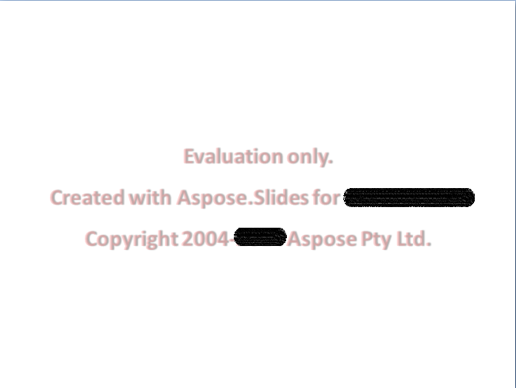

## **Aspose.Slides – zkušební verze**

Můžete snadno stáhnout Aspose.Slides k vyzkoušení. Balíček pro vyzkoušení je stejný jako zakoupený balíček. Vyzkoušejte verzi, která se po přidání několika řádků kódu pro aktivaci licence automaticky stane licencovanou.

Vyzkoušejte verze Aspose.Slides (bez specifikované licence) poskytuje plnou funkčnost produktu, ale při otevření a uložení vkládá do horní části dokumentu vodoznak „evaluation“. Při extrahování textu z prezentací jste také omezeni na jeden snímek.

{}
Pokud chcete testovat Aspose.Slides bez omezení zkušební verze, můžete požádat o 30‑denní dočasnou licenci. Viz [Jak získat dočasnou licenci?](https://purchase.aspose.com/temporary-license)
{}

## **Často kladené otázky**

**Mohu v režimu vyzkoušení testovat více prezentací paralelně v různých vláknech?**

Ano. Můžete zpracovávat různé dokumenty paralelně; neměli byste sdílet stejný objekt prezentace [napříč vlákny](/slides/cs/androidjava/multithreading/). Režim vyzkoušení na to nemá vliv.

**Musím instalovat Microsoft PowerPoint, abych mohl knihovnu vyzkoušet na serveru nebo v CI?**

Ne. Aspose.Slides je samostatný engine a nevyžaduje instalaci PowerPointu ani pro vyzkoušení, ani pro produkci.

**Mohu v režimu vyzkoušení plně otestovat konverzi PPT/PPTX do PDF a obrázků?**

Ano. [Konvertory](/slides/cs/androidjava/convert-presentation/) fungují; výstup bude obsahovat vodoznak.

**Mohu použít dočasnou licenci pro zátěžové testy bez vodoznaku?**

Ano. 30‑denní dočasná licence odstraňuje omezení režimu vyzkoušení a umožňuje testovat bez vodoznaku.