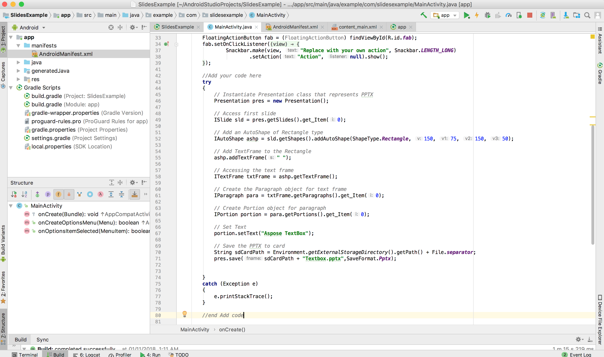

## **Přehled**

Tento článek vysvětluje, jak nainstalovat Aspose.Slides for Android via Java a přidat jej do projektu Android. Popisuje dvě možnosti instalace: ruční přidání souboru JAR Aspose.Slides do projektu a instalaci knihovny z repozitáře Maven.

Článek také poskytuje krok‑za‑krokem příklad, který ukazuje, jak vytvořit novou Android aplikaci v Android Studio, odkázat knihovnu Aspose.Slides, programově vytvořit PowerPoint prezentaci a uložit ji ve formátu PPTX. Obsahuje také poznámky o verzování a odpovědi na časté otázky o ověření integrace, správě využití paměti a zmenšení konečné velikosti JAR.

## **Instalace**
Dříve byla Aspose.Slides for Android via Java distribuována jako jediný ZIP soubor obsahující JAR soubor, demopublikace a dokumentaci produktu.

1. Pokud chcete použít verzi starší než Aspose.Words for Android via Java 18.9, musíte rozbalit verzi Aspose.Slides.Android.zip do vámi preferovaného adresáře.  
1. Přidejte extrahovaný soubor Jar do své aplikace pomocí konfigurace Build Path.  

### **Přidání reference na Aspose.Slides for Android via Java Jar**
1. Stáhněte nejnovější verzi [Aspose.Slides for Android via Java](https://downloads.aspose.com/slides/cs/androidjava)  
1. Zkopírujte aspose‑slides‑18.9‑android.via.java.jar do složky *libs/* vašeho projektu  


### **Instalace Aspose.Slides for Android via Java z Maven repozitáře**
1. Přidejte Maven repozitář do souboru build.gradle.  
1. Přidejte [Aspose.Slides for Android via Java](https://releases.aspose.com/java/repo/com/aspose/aspose-slides/) JAR jako závislost.  

``` java

 // 1. Přidejte Maven repozitář do souboru build.gradle 

repositories {

    mavenCentral()

    maven { url "https://releases.aspose.com/java/repo/" }

}

// 2. Přidejte JAR 'Aspose.Slides for Android via Java' jako závislost

dependencies {

    ...

    ...

    compile (group: 'com.aspose', name: 'aspose-slides', version: 'XX.XX', classifier: 'android.via.java')

}
```
## **Vaše první aplikace používající Aspose.Slides for Android via Java**
V této sekci se naučíte, jak začít s Aspose.Slides for Android via Java. Ukážeme vám, jak od nuly nastavit nový Android projekt, přidat reference na Aspose.Slides JAR a vytvořit novou PowerPoint prezentaci, která se uloží na disk ve formátu PPTX. Příklad používá [Android Studio](https://developer.android.com/studio/index.html) pro vývoj a aplikace běží v Android Emulatoru. Pro zahájení práce s Aspose.Slides for Android via Java postupujte podle tohoto podrobného návodu a vytvořte aplikaci využívající Aspose.Slides for Android via Java:

1. Stáhněte a nainstalujte [Android Studio](https://developer.android.com/studio/index.html) do libovolného umístění.  
1. Spusťte Android Studio.  
1. Vytvořte nový Android Application Project.  


1. Zkopírujte aspose‑slides‑XX.XX‑android.via.java.jar do složky libs vašeho projektu  


1. Vyberte **Project Section** (z nabídky File) a přejděte na kartu **Dependencies**.  
   1. Klikněte na tlačítko „+“. Vyberte možnost **File Dependency**.  
   1. Vyberte knihovnu Aspose.Slides ze složky libs a klikněte na **OK**.  


1. Synchronizujte projekt se soubory Gradle, pokud je to nutné.  


1. Pro přístup k SD kartě je potřeba přidat speciální oprávnění. Otevřete soubor AndroidManifest.xml a přepněte do XML zobrazení. Přidejte tuto řádku do souboru `<uses-permission android:name="android.permission.WRITE_EXTERNAL_STORAGE" />`  


1. Vraťte se do části kódu aplikace a přidejte následující importy:  

``` java

 import java.io.File;

import com.aspose.slides.IAutoShape;

import com.aspose.slides.IParagraph;

import com.aspose.slides.IPortion;

import com.aspose.slides.ISlide;

import com.aspose.slides.ITextFrame;

import com.aspose.slides.Presentation;

import com.aspose.slides.SaveFormat;

import com.aspose.slides.ShapeType;

import android.os.Environment; 

```

Nyní vložte tento kód do těla metody **onCreate**, aby se vytvořila nová **Presentation** od nuly pomocí Aspose.Slides a uložila se na SD kartu ve formátu PPTX.  

``` java

 try

{

    // Vytvořte instanci třídy Presentation, která představuje PPTX
    Presentation pres = new Presentation();


    // Přístup k prvnímu snímku
    ISlide sld = pres.getSlides().get_Item(0);


    // Přidejte AutoShape typu Obdélník
    IAutoShape ashp = sld.getShapes().addAutoShape(ShapeType.Rectangle, 150, 75, 150, 50);


    // Přidejte TextFrame do Obdélníku
    ashp.addTextFrame(" ");


    // Přístup k textovému rámci
    ITextFrame txtFrame = ashp.getTextFrame();


    // Vytvořte objekt Paragraph pro textový rámec
    IParagraph para = txtFrame.getParagraphs().get_Item(0);


    // Vytvořte objekt Portion pro odstavec
    IPortion portion = para.getPortions().get_Item(0);


    // Nastavte text
    portion.setText("Aspose TextBox");


    // Uložte PPTX na kartu
    String sdCardPath = Environment.getExternalStorageDirectory().getPath() + File.separator;
    pres.save(sdCardPath + "Textbox.pptx",SaveFormat.Pptx);
}

catch (Exception e)

{

   e.printStackTrace();

}
```

Celý kód by měl vypadat následovně:  



1. Spusťte aplikaci znovu. Tentokrát kód Aspose.Slides poběží na pozadí a vygeneruje dokument, který se uloží na SD kartu.  


1. Pro zobrazení vytvořeného dokumentu přejděte do nabídky **Tools**, vyberte **Android** a poté **Android Device Monitor**  


## **Verze**
Od roku 2018 se versioning Aspose.Slides for Android via Java řídí stejným schématem jako Aspose.Slides for Java.  

## **Často kladené otázky**

**Jak mohu ověřit, že je Aspose.Slides správně integrován?**

Postavte svůj projekt, vytvořte prázdnou [Presentation](https://reference.aspose.com/slides/cs/androidjava/com.aspose.slides/presentation/) a uložte ji pod novým názvem. Pokud se soubor vytvoří bez vyhození výjimek, knihovna byla úspěšně integrována.

**Jak mohu omezit spotřebu paměti při zpracování velkých prezentací?**

Zvyšte limity paměti JVM jen na nezbytně potřebnou úroveň a každou instanci [Presentation](https://reference.aspose.com/slides/cs/androidjava/com.aspose.slides/presentation/) uzavřete v `finally` bloku, aby se cache okamžitě uvolnila. Tím se zabrání chybám z nedostatku paměti a celkové využití paměti zůstane předvídatelné během hromadných operací.

**Mohu vyloučit nechtěné exportní formáty, aby se zmenšila konečná velikost JAR?**

Aktuální vydání Aspose.Slides jsou dodávána jako jedna monolitická knihovna, takže konkrétní exportéry, jako PDF nebo SVG, nelze při sestavování zakázat.