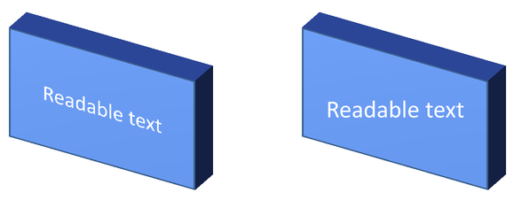

## **Přehled**

Aspose.Slides pro C++ může vytvářet, upravovat, zachovávat a vykreslovat 3D formátování ve stylu PowerPointu pro tvary a text. Tento článek se zabývá 3D efekty, jako jsou otáčení, extruze, zkosení, osvětlení, materiál, gradientové nebo obrázkové výplně a 3D text.

{}
Tento článek se týká 3D formátovacích efektů na tvarech a textu v PowerPointu. Nejedná se o vkládání nebo úpravu samostatných souborů 3D modelů. Když exportujete snímek jako obrázek, PDF nebo HTML, Aspose.Slides vykreslí tyto 3D efekty do exportovaného 2D výstupu.
{}

## **Koncepty 3D formátování**

Použijte metodu [IShape::get_ThreeDFormat](https://reference.aspose.com/slides/cs/cpp/aspose.slides/ishape/get_threedformat/) k aplikaci 3D formátování na tvar. Metoda vrací [IThreeDFormat](https://reference.aspose.com/slides/cs/cpp/aspose.slides/ithreedformat/), který řídí 3D scénu pro tento tvar.

Pro text použijte metodu [ITextFrameFormat::get_ThreeDFormat](https://reference.aspose.com/slides/cs/cpp/aspose.slides/itextframeformat/get_threedformat/). Tím se aplikuje 3D formátování na textový rámec místo těla tvaru.

Nejdůležitější metody jsou:

| Method | What it controls | When to use it |
|---|---|---|
| [get_Camera](https://reference.aspose.com/slides/cs/cpp/aspose.slides/ithreedformat/get_camera/) | Bod pohledu, přednastavený typ kamery, rotace, zoom a perspektiva. | Otáčení objektu ve 3D prostoru nebo sladění s přednastaveným 3D otáčením v PowerPointu. |
| [get_LightRig](https://reference.aspose.com/slides/cs/cpp/aspose.slides/ithreedformat/get_lightrig/) | Přednastavení světla, směr a rotace světla. | Změna vzhledu zvýraznění a stínů na 3D povrchu. |
| [set_Material](https://reference.aspose.com/slides/cs/cpp/aspose.slides/ithreedformat/set_material/) | Materiál povrchu, např. plochý, matný, plastový nebo kovový. | Způsobí, že stejná geometrie vypadá ploše, měkče, leskle nebo kovově. |
| [set_ExtrusionHeight](https://reference.aspose.com/slides/cs/cpp/aspose.slides/ithreedformat/set_extrusionheight/) | Jak daleko se tvar rozšiřuje dozadu od své přední strany. | Promění plochý tvar na viditelně silný 3D objekt. |
| [get_ExtrusionColor](https://reference.aspose.com/slides/cs/cpp/aspose.slides/ithreedformat/get_extrusioncolor/) | Barva extrudovaných stran. | Zobrazí hloubku nebo koordinuje barvu stran s výplní přední strany. |
| [set_Depth](https://reference.aspose.com/slides/cs/cpp/aspose.slides/ithreedformat/set_depth/) | Dodatečná 3D hloubka používaná formátováním 3D v PowerPointu. | Doladí hloubku pro tvary nebo text, zejména spolu s nastavením zkosení a materiálu. |
| [get_BevelTop](https://reference.aspose.com/slides/cs/cpp/aspose.slides/ithreedformat/get_beveltop/) and [get_BevelBottom](https://reference.aspose.com/slides/cs/cpp/aspose.slides/ithreedformat/get_bevelbottom/) | Vyvýšené nebo zaoblené hrany na přední a zadní straně. | Přidá měkkější nebo tvarovaný okraj místo ostré ploché plochy. |
| [get_ContourColor](https://reference.aspose.com/slides/cs/cpp/aspose.slides/ithreedformat/get_contourcolor/) and [set_ContourWidth](https://reference.aspose.com/slides/cs/cpp/aspose.slides/ithreedformat/set_contourwidth/) | Obrys kolem 3D objektu. | Zdůrazní hranici objektu ve vykresleném výstupu. |

## **Vytvoření 3D tvaru**

Tvar obvykle potřebuje čtyři druhy nastavení, než vypadá přesvědčivě 3D:

- Nastavení kamery, protože výchozí přední pohled může skrýt extruzi.
- Nastavení světla, protože osvětlení činí plochy a strany čitelné.
- Nastavení materiálu, protože povrch ovlivňuje, jak je světlo vykresleno.
- Nastavení extruze nebo hloubky, protože plochý tvar potřebuje tloušťku.

Následující příklad vytvoří obdélník, přidá text na jeho přední stranu a aplikuje 3D formátování. Hodnoty rotace kamery jsou ve stupních a výška extruze je 100 bodů. Příklad vykreslí snímek do PNG obrázku dvakrát většího než výchozí rozměry a uloží prezentaci jako PPTX.

```cpp
#include <DOM/CameraPresetType.h>
#include <DOM/FillType.h>
#include <DOM/IAutoShape.h>
#include <DOM/ICamera.h>
#include <DOM/IColorFormat.h>
#include <DOM/IFillFormat.h>
#include <DOM/ILightRig.h>
#include <DOM/IParagraph.h>
#include <DOM/IParagraphFormat.h>
#include <DOM/IPortionFormat.h>
#include <DOM/IShapeCollection.h>
#include <DOM/ISlide.h>
#include <DOM/ITextFrame.h>
#include <DOM/IThreeDFormat.h>
#include <DOM/LightRigPresetType.h>
#include <DOM/LightingDirection.h>
#include <DOM/MaterialPresetType.h>
#include <DOM/Presentation.h>
#include <DOM/ShapeType.h>
#include <Export/SaveFormat.h>
#include <IImage.h>
#include <drawing/color.h>

using namespace Aspose::Slides;
using namespace Aspose::Slides::Export;
using namespace System::Drawing;

const auto imageScale = 2.0f;

auto presentation = System::MakeObject<Presentation>();
auto slide = presentation->get_Slide(0);

auto shape = slide->get_Shapes()->AddAutoShape(ShapeType::Rectangle, 200.0f, 150.0f, 200.0f, 200.0f);

shape->get_TextFrame()->set_Text(u"3D");
shape->get_TextFrame()->get_Paragraph(0)->get_ParagraphFormat()->get_DefaultPortionFormat()->set_FontHeight(64.0f);

auto frontColor = Color::get_CornflowerBlue();
shape->get_FillFormat()->set_FillType(FillType::Solid);
shape->get_FillFormat()->get_SolidFillColor()->set_Color(frontColor);

auto extrusionColor = Color::get_Blue();
shape->get_ThreeDFormat()->get_Camera()->set_CameraType(CameraPresetType::OrthographicFront);
shape->get_ThreeDFormat()->get_Camera()->SetRotation(20.0f, 30.0f, 40.0f);
shape->get_ThreeDFormat()->get_LightRig()->set_LightType(LightRigPresetType::Flat);
shape->get_ThreeDFormat()->get_LightRig()->set_Direction(LightingDirection::Top);
shape->get_ThreeDFormat()->set_Material(MaterialPresetType::Flat);
shape->get_ThreeDFormat()->set_ExtrusionHeight(100.0);
shape->get_ThreeDFormat()->get_ExtrusionColor()->set_Color(extrusionColor);

auto thumbnail = slide->GetImage(imageScale, imageScale);
thumbnail->Save(u"shape_3d.png");
thumbnail->Dispose();

presentation->Save(u"shape_3d.pptx", SaveFormat::Pptx);
presentation->Dispose();
```

Vykreslený obrázek snímku ukazuje obdélník jako silný 3D blok:


## **Otočení tvaru pomocí kamery**

V PowerPointu se 3‑D rotace nastavuje v panelu 3‑D rotace. Hodnoty rotace X, Y a Z odpovídají rotaci nastavené pomocí API kamery.


V Aspose.Slides přistupujte ke kameře pomocí [IThreeDFormat::get_Camera](https://reference.aspose.com/slides/cs/cpp/aspose.slides/ithreedformat/get_camera/). Tento příklad vytvoří obdélník, vybere ortografický přední pohled a nastaví rotace X, Y a Z na 20, 30 a 40 stupňů. Konfigurace tvaru proběhne v paměti bez uložení souboru:

```cpp
#include <DOM/CameraPresetType.h>
#include <DOM/IAutoShape.h>
#include <DOM/ICamera.h>
#include <DOM/IShapeCollection.h>
#include <DOM/ISlide.h>
#include <DOM/IThreeDFormat.h>
#include <DOM/Presentation.h>
#include <DOM/ShapeType.h>

using namespace Aspose::Slides;

auto presentation = System::MakeObject<Presentation>();
auto slide = presentation->get_Slide(0);

auto shape = slide->get_Shapes()->AddAutoShape(ShapeType::Rectangle, 200.0f, 150.0f, 200.0f, 200.0f);

shape->get_ThreeDFormat()->get_Camera()->set_CameraType(CameraPresetType::OrthographicFront);
shape->get_ThreeDFormat()->get_Camera()->SetRotation(20.0f, 30.0f, 40.0f);

presentation->Dispose();
```

Použijte kameru, když potřebujete změnit, jak divák vidí objekt. Nemění 2D geometrie tvaru na snímku. Mění 3D pohled, který používá PowerPoint a Aspose.Slides při vykreslování.

## **Přidání extruze a hloubky**

Extruze způsobí, že tvar vypadá silně tím, že se rozšiřuje za přední plochu. V PowerPointu řízení hloubky nastavuje tuto viditelnou tloušťku a řízení barvy nastavuje barvu bočních ploch.


Nastavte [IThreeDFormat::set_ExtrusionHeight](https://reference.aspose.com/slides/cs/cpp/aspose.slides/ithreedformat/set_extrusionheight/) pro tloušťku a [IThreeDFormat::get_ExtrusionColor](https://reference.aspose.com/slides/cs/cpp/aspose.slides/ithreedformat/get_extrusioncolor/) pro barvu stran. Tento příklad přidá obdélníku extruzi 100 bodů s fialovými stranami a otočí kameru, aby odhalila jeho tloušťku. Konfigurace tvaru proběhne v paměti bez uložení souboru:

```cpp
#include <DOM/CameraPresetType.h>
#include <DOM/ILightRig.h>
#include <DOM/LightRigPresetType.h>
#include <DOM/LightingDirection.h>
#include <DOM/MaterialPresetType.h>
#include <DOM/IAutoShape.h>
#include <DOM/ICamera.h>
#include <DOM/IColorFormat.h>
#include <DOM/IShapeCollection.h>
#include <DOM/ISlide.h>
#include <DOM/IThreeDFormat.h>
#include <DOM/Presentation.h>
#include <DOM/ShapeType.h>
#include <drawing/color.h>

using namespace Aspose::Slides;
using namespace System::Drawing;

auto presentation = System::MakeObject<Presentation>();
auto slide = presentation->get_Slide(0);

auto shape = slide->get_Shapes()->AddAutoShape(ShapeType::Rectangle, 200.0f, 150.0f, 200.0f, 200.0f);

shape->get_ThreeDFormat()->get_Camera()->set_CameraType(CameraPresetType::OrthographicFront);
shape->get_ThreeDFormat()->get_Camera()->SetRotation(20.0f, 30.0f, 40.0f);
shape->get_ThreeDFormat()->get_LightRig()->set_LightType(LightRigPresetType::Flat);
shape->get_ThreeDFormat()->get_LightRig()->set_Direction(LightingDirection::Top);
shape->get_ThreeDFormat()->set_Material(MaterialPresetType::Flat);
shape->get_ThreeDFormat()->set_ExtrusionHeight(100.0);

auto extrusionColor = Color::get_Purple();
shape->get_ThreeDFormat()->get_ExtrusionColor()->set_Color(extrusionColor);

presentation->Dispose();
```

Metoda [IThreeDFormat::set_Depth](https://reference.aspose.com/slides/cs/cpp/aspose.slides/ithreedformat/set_depth/) nastavuje hloubku 3D tvaru. Metoda [set_ExtrusionHeight](https://reference.aspose.com/slides/cs/cpp/aspose.slides/ithreedformat/set_extrusionheight/) řídí výšku efektu extruze, jak je ukázáno v tomto příkladu.

## **Použití gradientových nebo obrázkových výplní s 3D efekty**

3D formátování je nezávislé na výplni tvaru. Můžete použít jednotnou barvu, gradient, vzor nebo obrázkovou výplň na přední stranu a stále použít stejná nastavení kamery, světla, materiálu a extruze.

Tento příklad aplikuje gradient od modré po oranžovou na přední stranu a tmavě oranžovou barvu na extruzi 150 bodů. Gradientové zastavení na 0 a 100 označují začátek a konec gradientu. Hodnoty rotace kamery jsou ve stupních. Snímek je vykreslen do PNG obrázku dvakrát většího než výchozí rozměry:

```cpp
#include <DOM/CameraPresetType.h>
#include <DOM/FillType.h>
#include <DOM/IAutoShape.h>
#include <DOM/ICamera.h>
#include <DOM/IColorFormat.h>
#include <DOM/IFillFormat.h>
#include <DOM/IGradientFormat.h>
#include <DOM/IGradientStopCollection.h>
#include <DOM/ILightRig.h>
#include <DOM/IParagraph.h>
#include <DOM/IParagraphFormat.h>
#include <DOM/IPortionFormat.h>
#include <DOM/IShapeCollection.h>
#include <DOM/ISlide.h>
#include <DOM/ITextFrame.h>
#include <DOM/IThreeDFormat.h>
#include <DOM/LightRigPresetType.h>
#include <DOM/LightingDirection.h>
#include <DOM/MaterialPresetType.h>
#include <DOM/Presentation.h>
#include <DOM/ShapeType.h>
#include <IImage.h>
#include <drawing/color.h>

using namespace Aspose::Slides;
using namespace System::Drawing;

const auto imageScale = 2.0f;

auto presentation = System::MakeObject<Presentation>();
auto slide = presentation->get_Slide(0);

auto shape = slide->get_Shapes()->AddAutoShape(ShapeType::Rectangle, 200.0f, 150.0f, 250.0f, 250.0f);
shape->get_TextFrame()->set_Text(u"3D Gradient");
shape->get_TextFrame()->get_Paragraph(0)->get_ParagraphFormat()->get_DefaultPortionFormat()->set_FontHeight(64.0f);

auto firstGradientColor = Color::get_Blue();
auto secondGradientColor = Color::get_Orange();
shape->get_FillFormat()->set_FillType(FillType::Gradient);
shape->get_FillFormat()->get_GradientFormat()->get_GradientStops()->Add(0.0f, firstGradientColor);
shape->get_FillFormat()->get_GradientFormat()->get_GradientStops()->Add(100.0f, secondGradientColor);

auto extrusionColor = Color::get_DarkOrange();
shape->get_ThreeDFormat()->get_Camera()->set_CameraType(CameraPresetType::OrthographicFront);
shape->get_ThreeDFormat()->get_Camera()->SetRotation(10.0f, 20.0f, 30.0f);
shape->get_ThreeDFormat()->get_LightRig()->set_LightType(LightRigPresetType::Flat);
shape->get_ThreeDFormat()->get_LightRig()->set_Direction(LightingDirection::Top);
shape->get_ThreeDFormat()->set_Material(MaterialPresetType::Flat);
shape->get_ThreeDFormat()->set_ExtrusionHeight(150.0);
shape->get_ThreeDFormat()->get_ExtrusionColor()->set_Color(extrusionColor);

auto thumbnail = slide->GetImage(imageScale, imageScale);
thumbnail->Save(u"gradient_3d.png");
thumbnail->Dispose();

presentation->Dispose();
```

Vykreslený výstup zachovává gradient na přední straně a vykresluje extruzi samostatně:


Pro použití obrázkové výplně přidejte obrázek do prezentace a přiřaďte jej jako výplň tvaru. Tento příklad vyžaduje existující soubor nazvaný "image.jpg" v pracovním adresáři. Roztáhne obrázek, aby vyplnil obdélník, aplikuje extruzi 150 bodů a nastaví rotaci kamery ve stupních. Konfigurace tvaru proběhne v paměti bez uložení nebo vykreslení souboru:

```cpp
#include <DOM/CameraPresetType.h>
#include <DOM/ILightRig.h>
#include <DOM/LightRigPresetType.h>
#include <DOM/LightingDirection.h>
#include <DOM/MaterialPresetType.h>
#include <DOM/FillType.h>
#include <DOM/IAutoShape.h>
#include <DOM/ICamera.h>
#include <DOM/IColorFormat.h>
#include <DOM/IFillFormat.h>
#include <DOM/IImageCollection.h>
#include <DOM/IPictureFillFormat.h>
#include <DOM/IShapeCollection.h>
#include <DOM/ISlide.h>
#include <DOM/ISlidesPicture.h>
#include <DOM/IThreeDFormat.h>
#include <DOM/PictureFillMode.h>
#include <DOM/Presentation.h>
#include <DOM/ShapeType.h>
#include <drawing/color.h>
#include <system/io/file.h>

using namespace Aspose::Slides;
using namespace System::Drawing;
using namespace System::IO;

auto presentation = System::MakeObject<Presentation>();
auto slide = presentation->get_Slide(0);

auto shape = slide->get_Shapes()->AddAutoShape(ShapeType::Rectangle, 200.0f, 150.0f, 250.0f, 250.0f);

auto imageData = File::ReadAllBytes(u"image.jpg");
auto image = presentation->get_Images()->AddImage(imageData);

shape->get_FillFormat()->set_FillType(FillType::Picture);
shape->get_FillFormat()->get_PictureFillFormat()->get_Picture()->set_Image(image);
shape->get_FillFormat()->get_PictureFillFormat()->set_PictureFillMode(PictureFillMode::Stretch);

auto extrusionColor = Color::get_DarkOrange();
shape->get_ThreeDFormat()->get_Camera()->set_CameraType(CameraPresetType::OrthographicFront);
shape->get_ThreeDFormat()->get_Camera()->SetRotation(10.0f, 20.0f, 30.0f);
shape->get_ThreeDFormat()->get_LightRig()->set_LightType(LightRigPresetType::Flat);
shape->get_ThreeDFormat()->get_LightRig()->set_Direction(LightingDirection::Top);
shape->get_ThreeDFormat()->set_Material(MaterialPresetType::Flat);
shape->get_ThreeDFormat()->set_ExtrusionHeight(150.0);
shape->get_ThreeDFormat()->get_ExtrusionColor()->set_Color(extrusionColor);

presentation->Dispose();
```


## **Aplikace 3D formátování na text**

3D formátování tvaru ovlivňuje tělo tvaru. 3D formátování textu ovlivňuje textový rámec. To je užitečné pro efekty podobné WordArt, kde samotná písmena potřebují extruzi, materiál, osvětlení a nastavení kamery.

Následující příklad vytvoří text s oranžovo-bílým mřížkovým vzorem, aplikuje horní oblouk a nastaví 3D parametry pomocí [ITextFrameFormat::get_ThreeDFormat](https://reference.aspose.com/slides/cs/cpp/aspose.slides/itextframeformat/get_threedformat/). Výška a hloubka extruze jsou v bodech a rotace světla ve stupních. Výplň a obrys tvaru jsou skryté, aby byl viditelný pouze text. Příklad vykreslí PNG obrázek dvakrát větší než výchozí rozměry snímku a uloží prezentaci jako PPTX:

```cpp
#include <DOM/CameraPresetType.h>
#include <DOM/FillType.h>
#include <DOM/IAutoShape.h>
#include <DOM/ICamera.h>
#include <DOM/IColorFormat.h>
#include <DOM/IFillFormat.h>
#include <DOM/ILightRig.h>
#include <DOM/ILineFillFormat.h>
#include <DOM/ILineFormat.h>
#include <DOM/IParagraph.h>
#include <DOM/IParagraphFormat.h>
#include <DOM/IPatternFormat.h>
#include <DOM/IPortion.h>
#include <DOM/IPortionFormat.h>
#include <DOM/IShapeCollection.h>
#include <DOM/ISlide.h>
#include <DOM/ITextFrame.h>
#include <DOM/ITextFrameFormat.h>
#include <DOM/IThreeDFormat.h>
#include <DOM/LightRigPresetType.h>
#include <DOM/LightingDirection.h>
#include <DOM/MaterialPresetType.h>
#include <DOM/PatternStyle.h>
#include <DOM/Presentation.h>
#include <DOM/ShapeType.h>
#include <DOM/TextShapeType.h>
#include <Export/SaveFormat.h>
#include <IImage.h>
#include <drawing/color.h>

using namespace Aspose::Slides;
using namespace Aspose::Slides::Export;
using namespace System::Drawing;

const auto imageScale = 2.0f;

auto presentation = System::MakeObject<Presentation>();
auto slide = presentation->get_Slide(0);

auto shape = slide->get_Shapes()->AddAutoShape(ShapeType::Rectangle, 200.0f, 150.0f, 250.0f, 250.0f);

shape->get_FillFormat()->set_FillType(FillType::NoFill);
shape->get_LineFormat()->get_FillFormat()->set_FillType(FillType::NoFill);
shape->get_TextFrame()->set_Text(u"3D Text");

auto portion = shape->get_TextFrame()->get_Paragraph(0)->get_Portion(0);
portion->get_PortionFormat()->get_FillFormat()->set_FillType(FillType::Pattern);

auto foregroundColor = Color::get_DarkOrange();
auto backgroundColor = Color::get_White();
portion->get_PortionFormat()->get_FillFormat()->get_PatternFormat()->get_ForeColor()->set_Color(foregroundColor);
portion->get_PortionFormat()->get_FillFormat()->get_PatternFormat()->get_BackColor()->set_Color(backgroundColor);
portion->get_PortionFormat()->get_FillFormat()->get_PatternFormat()->set_PatternStyle(PatternStyle::LargeGrid);

shape->get_TextFrame()->get_Paragraph(0)->get_ParagraphFormat()->get_DefaultPortionFormat()->set_FontHeight(128.0f);

auto textFrameFormat = shape->get_TextFrame()->get_TextFrameFormat();
textFrameFormat->set_Transform(TextShapeType::ArchUp);
textFrameFormat->get_ThreeDFormat()->set_ExtrusionHeight(3.5);
textFrameFormat->get_ThreeDFormat()->set_Depth(3.0);
textFrameFormat->get_ThreeDFormat()->set_Material(MaterialPresetType::Plastic);
textFrameFormat->get_ThreeDFormat()->get_LightRig()->set_Direction(LightingDirection::Top);
textFrameFormat->get_ThreeDFormat()->get_LightRig()->set_LightType(LightRigPresetType::Balanced);
textFrameFormat->get_ThreeDFormat()->get_LightRig()->SetRotation(0.0f, 0.0f, 40.0f);
textFrameFormat->get_ThreeDFormat()->get_Camera()->set_CameraType(CameraPresetType::PerspectiveContrastingRightFacing);

auto thumbnail = slide->GetImage(imageScale, imageScale);
thumbnail->Save(u"text_3d.png");
thumbnail->Dispose();

presentation->Save(u"text_3d.pptx", SaveFormat::Pptx);
presentation->Dispose();
```


## **Udržet text plochý na 3D tvaru**

Aby byl text čitelný a zároveň se zachoval 3D vzhled tvaru, zavolejte [ITextFrameFormat::set_KeepTextFlat](https://reference.aspose.com/slides/cs/cpp/aspose.slides/itextframeformat/set_keeptextflat/) přes [ITextFrame::get_TextFrameFormat](https://reference.aspose.com/slides/cs/cpp/aspose.slides/itextframe/get_textframeformat/). Když je hodnota `true`, text zůstane mimo 3D scénu. Když je `false`, text se účastní scény a následuje její 3D orientaci.

Toto nastavení neodstraňuje 3D formátování tvaru: jeho kamera, osvětlení, materiál a extruze zůstávají nastaveny pomocí [IShape::get_ThreeDFormat](https://reference.aspose.com/slides/cs/cpp/aspose.slides/ishape/get_threedformat/). Je to také odlišné od běžné rotace. [IShape::set_Rotation](https://reference.aspose.com/slides/cs/cpp/aspose.slides/ishape/set_rotation/) otáčí tvar v rovině snímku, zatímco [ITextFrameFormat::set_RotationAngle](https://reference.aspose.com/slides/cs/cpp/aspose.slides/itextframeformat/set_rotationangle/) řídí vlastní rotaci textu v rámci jeho ohraničujícího rámce. Udržení textu mimo 3D scénu nerestartuje žádný z těchto úhlů.

Následující samostatný příklad vytvoří modrý obdélník s textem a zkopíruje jej vedle originálu. Oba tvary mají stejné 3D formátování; liší se pouze nastavením textu: `false` vlevo a `true` vpravo. Úhly kamery jsou ve stupních a výška extruze je 40 bodů. Příklad uloží prezentaci jako PPTX a vykreslí srovnávací snímek do PNG dvakrát většího než výchozí rozměry.

```cpp
#include <DOM/ITextFrameFormat.h>
#include <DOM/TextAlignment.h>
#include <DOM/TextAnchorType.h>
#include <DOM/CameraPresetType.h>
#include <DOM/FillType.h>
#include <DOM/IAutoShape.h>
#include <DOM/ICamera.h>
#include <DOM/IColorFormat.h>
#include <DOM/IFillFormat.h>
#include <DOM/ILightRig.h>
#include <DOM/IParagraph.h>
#include <DOM/IParagraphFormat.h>
#include <DOM/IPortionFormat.h>
#include <DOM/IShapeCollection.h>
#include <DOM/ISlide.h>
#include <DOM/ITextFrame.h>
#include <DOM/IThreeDFormat.h>
#include <DOM/LightRigPresetType.h>
#include <DOM/LightingDirection.h>
#include <DOM/MaterialPresetType.h>
#include <DOM/Presentation.h>
#include <DOM/ShapeType.h>
#include <Export/SaveFormat.h>
#include <IImage.h>
#include <drawing/color.h>

using namespace Aspose::Slides;
using namespace Aspose::Slides::Export;
using namespace System::Drawing;

auto presentation = System::MakeObject<Presentation>();
auto slide = presentation->get_Slide(0);

auto shape = slide->get_Shapes()->AddAutoShape(ShapeType::Rectangle, 70.0f, 160.0f, 240.0f, 140.0f);

shape->get_TextFrame()->set_Text(u"Readable text");
shape->get_TextFrame()->get_Paragraph(0)->get_ParagraphFormat()->get_DefaultPortionFormat()->set_FontHeight(28.0f);
shape->get_TextFrame()->get_Paragraph(0)->get_ParagraphFormat()->set_Alignment(TextAlignment::Center);
shape->get_TextFrame()->get_TextFrameFormat()->set_AnchoringType(TextAnchorType::Center);
shape->get_FillFormat()->set_FillType(FillType::Solid);
shape->get_FillFormat()->get_SolidFillColor()->set_Color(Color::get_CornflowerBlue());

shape->get_ThreeDFormat()->get_Camera()->set_CameraType(CameraPresetType::OrthographicFront);
shape->get_ThreeDFormat()->get_Camera()->SetRotation(30.0f, 30.0f, 0.0f);
shape->get_ThreeDFormat()->get_LightRig()->set_LightType(LightRigPresetType::Flat);
shape->get_ThreeDFormat()->get_LightRig()->set_Direction(LightingDirection::Top);
shape->get_ThreeDFormat()->set_Material(MaterialPresetType::Flat);
shape->get_ThreeDFormat()->set_ExtrusionHeight(40.0);
shape->get_ThreeDFormat()->get_ExtrusionColor()->set_Color(Color::get_RoyalBlue());
shape->get_TextFrame()->get_TextFrameFormat()->set_KeepTextFlat(false);

auto clonedShape = slide->get_Shapes()->AddClone(shape, 400.0f, 160.0f);
auto flatTextShape = System::ExplicitCast<IAutoShape>(clonedShape);
flatTextShape->get_TextFrame()->get_TextFrameFormat()->set_KeepTextFlat(true);

presentation->Save(u"keep_text_flat.pptx", SaveFormat::Pptx);
auto image = slide->GetImage(2.0f, 2.0f);
image->Save(u"keep_text_flat.png");
image->Dispose();
presentation->Dispose();
```

Vlevo text sleduje 3D orientaci. Vpravo zůstává plochý a snadněji čitelný. Oba obdélníky si zachovávají stejnou viditelnou extruzi a 3D orientaci.



## **Chování exportu a vykreslování**

Aspose.Slides zachovává 3D formátování při ukládání do formátů PowerPointu, jako je PPTX. Při vykreslování nebo exportu do formátů s pevnou stránkou se 3D scéna rasterizuje nebo nakreslí do výstupu jako 2D výsledek. To platí, když vykreslujete snímky do [PNG](/slides/cs/cpp/convert-powerpoint-to-png/), exportujete do [PDF](/slides/cs/cpp/convert-powerpoint-to-pdf/), exportujete do [HTML](/slides/cs/cpp/convert-powerpoint-to-html/), nebo generujete snímky pro [video konverzi](/slides/cs/cpp/convert-powerpoint-to-video/).

Mějte na paměti tyto body:

- Exportované obrázky a PDF nejsou interaktivní. Objekt nelze po exportu otáčet.
- Konečný vzhled závisí na kombinaci kamery, světelného rigu, materiálu, extruze, výplně a měřítka snímku.
- Pokud potřebujete prozkoumat zděděné nebo na motivu založené hodnoty formátování, přečtěte si [efektivní vlastnosti tvaru](/slides/cs/cpp/shape-effective-properties/).
- Některé výstupní formáty nemohou uložit editovatelné 3D formátování PowerPointu. V těchto formátech je vizuální výsledek vykreslen místo toho, aby byl zachován jako editovatelné 3D nastavení.

## **Často kladené otázky**

**Může Aspose.Slides vytvářet interaktivní 3D prezentace?**

Aspose.Slides vytváří a vykresluje 3D efekty PowerPointu pro tvary a text. Nevytváří interaktivní 3D scény v exportovaných obrázcích, PDF nebo HTML stránkách, které by divák mohl otáčet. V PPTX zůstává 3D formátování editovatelné v PowerPointu, pokud formát podporuje editaci.

**Jaký je rozdíl mezi 3D modelem a 3D efektem?**

3D model je samostatný 3D objekt vložený do prezentace. 3D efekt je formátování aplikované na běžný PowerPoint tvar nebo text, jako je otáčení, extruze, zkosení, osvětlení a materiál. Tento článek se zabývá 3D efekty.

**Jaká nastavení jsou potřebná pro viditelný 3D tvar?**

Minimálně nastavte rotaci kamery a buď extruzi, nebo hloubku. V praxi také nastavte světelný rig a materiál, aby měly vykreslené plochy jasná zvýraznění a stíny.

**Mohu aplikovat 3D efekty jak na tvary, tak na text?**

Ano. Použijte [IShape::get_ThreeDFormat](https://reference.aspose.com/slides/cs/cpp/aspose.slides/ishape/get_threedformat/) pro tělo tvaru a [ITextFrameFormat::get_ThreeDFormat](https://reference.aspose.com/slides/cs/cpp/aspose.slides/itextframeformat/get_threedformat/) pro text.

**Zobrazí se 3D efekty při exportu do obrázků, PDF, HTML nebo video snímků?**

Ano. Aspose.Slides vykresluje 3D efekty při vytváření obrázků snímků, výstupu PDF, HTML a snímcích použité pro konverzi videa. Exportovaný výstup obsahuje vykreslený vzhled, nikoli editovatelný 3D objekt.

**Mohu přečíst konečné 3D hodnoty po aplikaci dědičných a motivových nastavení?**

Ano. Použijte API efektivního formátování popsané v [Shape Effective Properties](/slides/cs/cpp/shape-effective-properties/), abyste načetli konečné hodnoty kamery, světelného rigu, zkosení a souvisejících 3D hodnot.