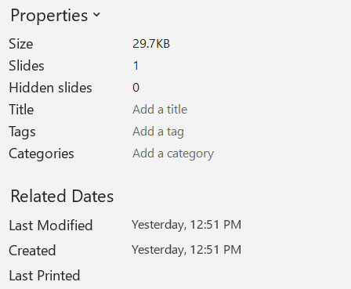

## **Přehled**

Tento článek ukazuje, jak prohlížet informace o prezentaci v Aspose.Slides. Vysvětluje, jak zjistit aktuální formát prezentace bez načtení celého souboru, přečíst její vlastnosti dokumentu a v případě potřeby tyto vlastnosti aktualizovat.

Příklady jsou založeny na API [PresentationInfo](https://reference.aspose.com/slides/cs/cpp/aspose.slides/presentationinfo/) a [DocumentProperties](https://reference.aspose.com/slides/cs/cpp/aspose.slides/documentproperties/) a demonstrují typické operace pro práci s metadaty prezentace.

## **Zkontrolovat formát prezentace**

Před prací s prezentací můžete chtít zjistit, v jakém formátu (PPT, PPTX, ODP a dalších) se prezentace aktuálně nachází.

Formát prezentace můžete zkontrolovat bez načtení prezentace. Viz následující C++ kód:

``` cpp
auto info = PresentationFactory::get_Instance()->GetPresentationInfo(u"pres.pptx");
// PPTX
Console::WriteLine(ObjectExt::ToString(info->get_LoadFormat()));

auto info2 = PresentationFactory::get_Instance()->GetPresentationInfo(u"pres.ppt");
// PPT
Console::WriteLine(ObjectExt::ToString(info2->get_LoadFormat()));

auto info3 = PresentationFactory::get_Instance()->GetPresentationInfo(u"pres.odp");
// ODP
Console::WriteLine(ObjectExt::ToString(info3->get_LoadFormat()));
```

## **Získat vlastnosti prezentace**

Tento C++ kód vám ukazuje, jak získat vlastnosti prezentace (informace o prezentaci):

``` cpp
auto info = PresentationFactory::get_Instance()->GetPresentationInfo(u"pres.pptx");
auto props = info->ReadDocumentProperties();
Console::WriteLine(ObjectExt::ToString(props->get_CreatedTime()));
Console::WriteLine(props->get_Subject());
Console::WriteLine(props->get_Title());
// ...
```

## **Aktualizovat vlastnosti prezentace**

Aspose.Slides poskytuje metodu [PresentationInfo::UpdateDocumentProperties](https://reference.aspose.com/slides/cs/cpp/aspose.slides/presentationinfo/updatedocumentproperties/), která vám umožňuje měnit vlastnosti prezentace.

Řekněme, že máme PowerPointovou prezentaci s dokumentovými vlastnostmi zobrazenými níže.



Tento příklad kódu vám ukazuje, jak upravit některé vlastnosti prezentace:

```cpp
auto fileName = u"sample.pptx";

auto info = PresentationFactory::get_Instance()->GetPresentationInfo(fileName);

auto properties = info->ReadDocumentProperties();
properties->set_Title(u"My title");
properties->set_LastSavedTime(DateTime::get_Now());

info->UpdateDocumentProperties(properties);
info->WriteBindedPresentation(fileName);
```

Výsledky změny dokumentových vlastností jsou zobrazeny níže.


## **Užitečné odkazy**

Pro získání dalších informací o prezentaci a jejích bezpečnostních atributech mohou být tyto odkazy užitečné:

- [Kontrola, zda je prezentace šifrovaná](https://docs.aspose.com/slides/cs/cpp/password-protected-presentation/#checking-whether-a-presentation-is-encrypted)
- [Kontrola, zda je prezentace chráněna proti zápisu (pouze ke čtení)](https://docs.aspose.com/slides/cs/cpp/password-protected-presentation/#checking-whether-a-presentation-is-write-protected)
- [Kontrola, zda je prezentace chráněna heslem před načtením](https://docs.aspose.com/slides/cs/cpp/password-protected-presentation/#checking-whether-a-presentation-is-password-protected-before-loading-it)
- [Potvrzení hesla použitého k ochraně prezentace](https://docs.aspose.com/slides/cs/cpp/password-protected-presentation/#validating-or-confirming-that-a-specific-password-has-been-used-to-protect-a-presentation).

## **Často kladené otázky**

**Jak mohu zkontrolovat, zda jsou písma vložena a která to jsou?**

Hledejte informace o [vložených písmech](https://reference.aspose.com/slides/cs/cpp/aspose.slides/fontsmanager/getembeddedfonts/) na úrovni prezentace a poté porovnejte tyto položky s množinou [písmen skutečně použitých v obsahu](https://reference.aspose.com/slides/cs/cpp/aspose.slides/fontsmanager/getfonts/), abyste zjistili, která písma jsou pro vykreslování kritická.

**Jak rychle zjistit, zda soubor obsahuje skryté snímky a kolik jich je?**

Procházejte [kolekci snímků](https://reference.aspose.com/slides/cs/cpp/aspose.slides/slidecollection/) a pro každý snímek zkontrolujte jeho [pravidlo viditelnosti](https://reference.aspose.com/slides/cs/cpp/aspose.slides/slide/get_hidden/).

**Mohu zjistit, zda je použita vlastní velikost a orientace snímku, a zda se liší od výchozích?**

Ano. Porovnejte aktuální [velikost a orientaci snímku](https://reference.aspose.com/slides/cs/cpp/aspose.slides/presentation/get_slidesize/) se standardními předvolbami; to pomáhá předvídat chování při tisku a exportu.

**Existuje rychlý způsob, jak zjistit, zda grafy odkazují na externí zdroje dat?**

Ano. Procházejte všechny [grafy](https://reference.aspose.com/slides/cs/cpp/aspose.slides.charts/chart/), zkontrolujte jejich [zdroj dat](https://reference.aspose.com/slides/cs/cpp/aspose.slides.charts/chartdata/get_datasourcetype/), a zaznamenejte, zda jsou data interní nebo založená na odkazu, včetně případných poškozených odkazů.

**Jak mohu posoudit „těžké“ snímky, které mohou zpomalit vykreslování nebo export do PDF?**

Pro každý snímek sečtěte počet objektů a hledejte velké obrázky, průhlednost, stíny, animace a multimédia; přiřaďte přibližné hodnocení složitosti, abyste označili potenciální úzká místa výkonu.