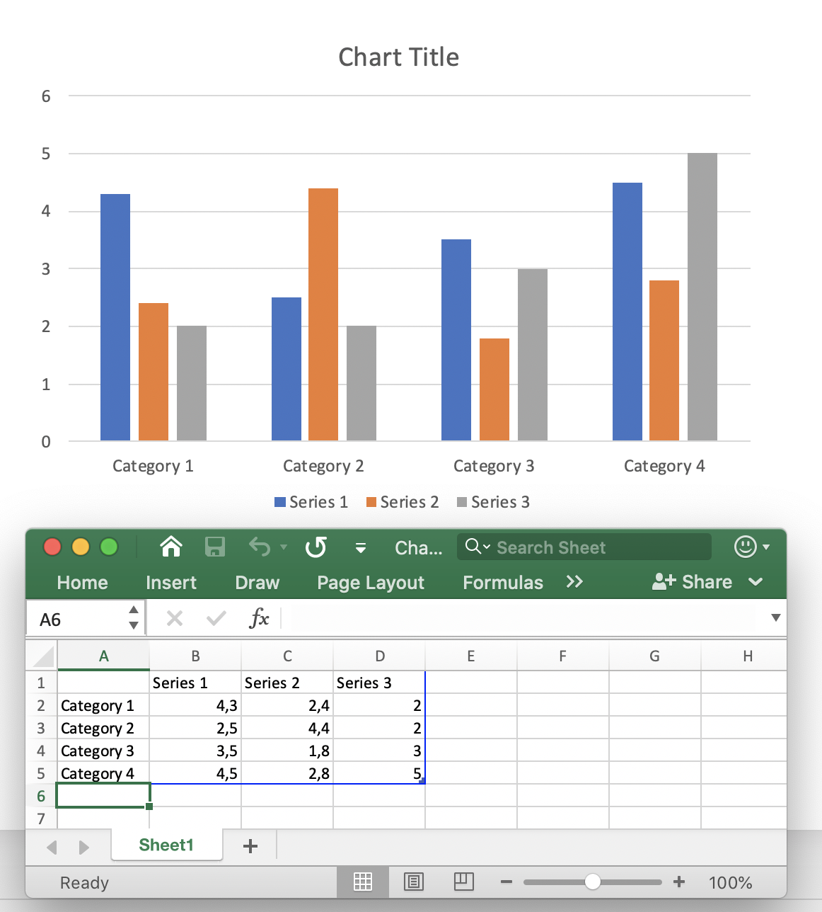

## **Přehled**

Listový list je zdroj dat za grafem v prezentaci. Ukládá názvy kategorií a sérií spolu s číselnými hodnotami zobrazenými v grafu. V Aspose.Slides je tento list k dispozici prostřednictvím sešitu dat grafu, který umožňuje programově pracovat s daty grafu.

Tento článek vysvětluje, jak v datech grafu použít vzorce listu, aby se hodnoty buněk mohly počítat a aktualizovat automaticky místo ručního zadávání. Ukazuje, jak přiřadit vzorce, používat odkazy ve stylu A1 i R1C1, přepočítat vzorce v sešitu a pracovat s podporovanými konstantami, operátory, odkazy na buňky a předdefinovanými funkcemi dostupnými pro listy grafů v prezentacích.

## **O grafových tabulkových vzorcích v prezentacích**
**Grafová tabulka** (nebo list grafu) v prezentaci je zdroj dat grafu. Grafová tabulka obsahuje data, která jsou v grafu znázorněna graficky. Když v PowerPointu vytvoříte graf, list spojený s tímto grafem se automaticky vytvoří také. List grafu je vytvářen pro všechny typy grafů: čárový graf, sloupcový graf, sunburst graf, koláčový graf atd. Pro zobrazení grafové tabulky v PowerPointu stačí dvakrát kliknout na graf:



Grafová tabulka obsahuje názvy prvků grafu (Název kategorie: *Category1*, Název série) a tabulku s číselnými daty odpovídajícími těmto kategoriím a sériím. Ve výchozím nastavení, když vytvoříte nový graf – data grafové tabulky jsou nastavena na výchozí data. Poté můžete data v listu ručně upravit.

Obvykle graf představuje složitá data (např. finanční analytici, vědecké analýzy), kde buňky jsou vypočítány z hodnot v jiných buňkách nebo z jiných dynamických dat. Manuální výpočet hodnoty buňky a její pevné zakódování do buňky ztěžuje budoucí změny. Pokud změníte hodnotu určité buňky, všechny buňky na ní závislé budou také vyžadovat aktualizaci. Navíc mohou data v tabulce záviset na datech z jiných tabulek, což vytváří složitý schéma dat prezentace, které je potřeba snadno a flexibilně aktualizovat.

**Grafový tabulkový vzorec** v prezentaci je výraz pro automatický výpočet a aktualizaci dat grafové tabulky. Vzorec tabulky definuje logiku výpočtu dat pro určitou buňku nebo sadu buněk. Grafový tabulkový vzorec je matematický nebo logický vzorec, který používá: odkazy na buňky, matematické funkce, logické operátory, aritmetické operátory, konverzní funkce, řetězcové konstanty atd. Definice vzorce je zapsána do buňky a tato buňka neobsahuje jednoduchou hodnotu. Vzorec tabulky vypočítá hodnotu a vrátí ji, přičemž tato hodnota je přiřazena buňce. Grafové tabulkové vzorce v prezentacích jsou ve skutečnosti stejné jako excelové vzorce a podporují stejné výchozí funkce, operátory a konstanty pro jejich implementaci.

V [**Aspose.Slides**](https://products.aspose.com/slides/cs/cpp/) je grafová tabulka reprezentována metodou 
[**ChartData::get_ChartDataWorkbook()**](https://reference.aspose.com/slides/cs/cpp/class/aspose.slides.charts.chart_data#a32097093561723a10df0a57dc91acaea) typu 
[**IChartDataWorkbook**](https://reference.aspose.com/slides/cs/cpp/class/aspose.slides.charts.i_chart_data_workbook). 
Vzorec tabulky lze přiřadit a změnit pomocí 
[**IChartDataCell::set_Formula()**](https://reference.aspose.com/slides/cs/cpp/class/aspose.slides.charts.i_chart_data_cell#a6806c6a40e025e6834c4c5f3af3cf692). 
Následující funkčnost je v Aspose.Slides pro vzorce podporována:

- Logické konstanty
- Číselné konstanty
- Řetězcové konstanty
- Chybové konstanty
- Aritmetické operátory
- Porovnávací operátory
- Odkazy na buňky ve stylu A1
- Odkazy na buňky ve stylu R1C1
- Předdefinované funkce

Typicky se v tabulkách ukládají poslední vypočítané hodnoty vzorců. Pokud po načtení prezentace data grafu nebyla změněna – metoda **IChartDataCell.get_Value()** vrátí tyto hodnoty při čtení. Pokud však byla data tabulky změněna, metoda **ChartDataCell.get_Value()** při čtení vyvolá **CellUnsupportedDataException** pro nepodporované vzorce. Důvodem je, že když jsou vzorce úspěšně analyzovány, jsou určeny závislosti buněk a správnost posledních hodnot. Pokud vzorec nelze analyzovat, nelze zaručit správnost hodnoty buňky.

## **Přidání grafového tabulkového vzorce do prezentace**
Nejprve přidejte graf na první snímek nové prezentace pomocí 
[IShapeCollection::AddChart()](https://reference.aspose.com/slides/cs/cpp/class/aspose.slides.i_shape_collection#a2cd4d47fc5c536012ee15b3a69486374). 
List grafu je vytvořen automaticky a lze k němu přistupovat pomocí 
[**ChartData::get_ChartDataWorkbook()**](https://reference.aspose.com/slides/cs/cpp/class/aspose.slides.charts.chart_data#a32097093561723a10df0a57dc91acaea) metody:

``` cpp
auto presentation = System::MakeObject<Presentation>();
    
auto chart = presentation->get_Slides()->idx_get(0)->get_Shapes()->AddChart(ChartType::ClusteredColumn, 150.0f, 150.0f, 500.0f, 300.0f);
auto workbook = chart->get_ChartData()->get_ChartDataWorkbook();

// ...
```

Zapíšeme některé hodnoty do buněk pomocí 
[**IChartDataCell.set_Value()**](https://reference.aspose.com/slides/cs/cpp/class/aspose.slides.charts.i_chart_data_cell#ad85809f520195e09225abae9002635ec) metody 
typu **Object**, což znamená, že můžete předat libovolnou hodnotu metodě:

``` cpp
workbook->GetCell(0, u"F2")->set_Value(System::ObjectExt::Box<double>(-2.5));
workbook->GetCell(0, u"G3")->set_Value(System::ObjectExt::Box<double>(6.3));
workbook->GetCell(0, u"H4")->set_Value(System::ObjectExt::Box<int32_t>(3));
```

Nyní, pro zápis vzorce do buňky, můžete použít 
[**IChartDataCell::set_Formula()**](https://reference.aspose.com/slides/cs/cpp/class/aspose.slides.charts.i_chart_data_cell#a6806c6a40e025e6834c4c5f3af3cf692) metodu:

*Poznámka*: [**IChartDataCell::set_Formula()**](https://reference.aspose.com/slides/cs/cpp/class/aspose.slides.charts.i_chart_data_cell#a6806c6a40e025e6834c4c5f3af3cf692) metoda se používá k nastavení odkazů na buňky ve stylu A1.

Pro nastavení odkazu buňky R1C1Formula můžete použít metodu [**IChartDataCell::set_R1C1Formula()**](https://reference.aspose.com/slides/cs/cpp/class/aspose.slides.charts.i_chart_data_cell#a47f5825dd38d0dddb11ecc3a43d388c7):

Pak pokud se pokusíte přečíst hodnoty z buněk B2 a C2, budou vypočítány:

``` cpp
auto value1 = cell1->get_Value(); // 7.8
auto value2 = cell2->get_Value(); // 2.1
```

## **Logické konstanty**
Můžete ve vzorcích buněk použít logické konstanty jako *FALSE* a *TRUE*:

## **Číselné konstanty**
Čísla lze použít v běžné nebo vědecké notaci pro tvorbu grafových tabulkových vzorců:

## **Řetězcové konstanty**
Řetězcová (nebo literální) konstanta je konkrétní hodnota, která se používá tak, jak je, a nemění se. Řetězcové konstanty mohou být: data, texty, čísla atd.:

## **Chybové konstanty**
Někdy není možné vypočítat výsledek vzorce. V takovém případě se v buňce místo hodnoty zobrazí kód chyby. Každý typ chyby má specifický kód:

- #DIV/0! – vzorec se pokouší dělit nulou.
- #GETTING_DATA – může se zobrazit v buňce, zatímco její hodnota se stále počítá.
- #N/A – informace chybí nebo nejsou k dispozici. Důvody mohou být: buňky použité ve vzorci jsou prázdné, přebytečný mezerník, překlep atd.
- #NAME? – určitá buňka nebo jiný objekt vzorce nelze najít podle jména.
- #NULL! – může se objevit při chybě ve vzorci, např.  (,) nebo mezerník místo dvojtečky (:).
- #NUM! – číselná hodnota ve vzorci může být neplatná, příliš dlouhá nebo příliš malá.
- #REF! – neplatný odkaz na buňku.
- #VALUE! – neočekávaný typ hodnoty. Například řetězcová hodnota přiřazená číselné buňce.

## **Aritmetické operátory**
Můžete použít všechny aritmetické operátory ve vzorcích listu grafu:

|**Operátor**|**Význam**|**Příklad**|
| :- | :- | :- |
|+ (plus)|Sčítání nebo unární plus|2 + 3|
|- (mínus)|Odčítání nebo negace|2 - 3<br>-3|
|* (hvězdička)|Násobení|2 * 3|
|/ (lomítko)|Dělení|2 / 3|
|% (procento)|Procento|30%|
|^ (caret)|Umocnění|2 ^ 3|

*Poznámka*: Pro změnu pořadí vyhodnocování uzavřete část vzorce, která má být vypočtena první, do závorek.

## **Porovnávací operátory**
Můžete porovnávat hodnoty buněk pomocí porovnávacích operátorů. Když jsou dvě hodnoty porovnány těmito operátory, výsledek je logická hodnota buď *TRUE* nebo FALSE:

|**Operátor**|**Význam**|**Příklad**|
| :- | :- | :- |
|= (rovná se)|Rovná se|A2 = 3|
|<> (nerovno)|Nerovná se|A2 <> 3|
|> (větší než)|Větší než|A2 > 3|
|>= (větší nebo rovno)|Větší nebo rovno|A2 >= 3|
|< (menší než)|Menší než|A2 < 3|
|<= (menší nebo rovno)|Menší nebo rovno|A2 <= 3|

## **Odkazy na buňky ve stylu A1**
**Odkazy na buňky ve stylu A1** se používají pro listy, kde sloupec má písmenový identifikátor (např. "*A*") a řádek má číselný identifikátor (např. "*1*"). Odkazy ve stylu A1 lze použít následujícím způsobem:

|**Odkaz na buňku**|**Příklad**|** |** |
| :- | :- | :- | :- |
| |Absolutní|Relativní|Smíšený|
|Buňka|$A$2|A2|<p>A$2</p><p>$A2</p>|
|Řádek|$2:$2|2:2|-|
|Sloupec|$A:$A|A:A|-|
|Rozsah|$A$2:$C$4|A2:C4|<p>$A$2:C4</p><p>A$2:$C4</p>|

Zde je příklad, jak použít odkaz na buňku ve stylu A1 ve vzorci:

## **Odkazy na buňky ve stylu R1C1**
**Odkazy na buňky ve stylu R1C1** se používají pro listy, kde řádek i sloupec mají číselný identifikátor. Odkazy ve stylu R1C1 lze použít následujícím způsobem:

|**Odkaz na buňku**|**Příklad**|** |** |
| :- | :- | :- | :- |
| |Absolutní|Relativní|Smíšený|
|Buňka|R2C3|R[2]C[3]|R2C[3]<br>R[2]C3|
|Řádek|R2|R[2]|-|
|Sloupec|C3|C[3]|-|
|Rozsah|R2C3:R5C7|R[2]C[3]:R[5]C[7]|R2C3:R[5]C[7]<br>R[2]C3:R5C[7]|

Zde je příklad, jak použít odkaz na buňku ve stylu A1 ve vzorci:

## **Předdefinované funkce**
Existují předdefinované funkce, které lze ve vzorcích použít pro zjednodušení jejich implementace. Tyto funkce zapouzdřují nejčastěji používané operace, jako jsou:

- ABS
- AVERAGE
- CEILING
- CHOOSE
- CONCAT
- CONCATENATE
- DATE (1900 datumový systém)
- DAYS
- FIND
- FINDB
- IF
- INDEX (referenční forma)
- LOOKUP (vektorová forma)
- MATCH (vektorová forma)
- MAX
- SUM
- VLOOKUP

## **Často kladené otázky**

**Jsou externí soubory Excel podporovány jako zdroj dat pro graf s vzorci?**

Ano. Aspose.Slides podporuje externí sešity jako [zdroj dat grafu](https://reference.aspose.com/slides/cs/cpp/aspose.slides.charts/chartdatasourcetype/), což vám umožní použít vzorce z XLSX mimo prezentaci.

**Mohou grafové vzorce odkazovat na listy ve stejném sešitu podle názvu listu?**

Ano. Vzorce následují standardní model odkazování v Excelu, takže můžete odkazovat na jiné listy ve stejném sešitu nebo na externí sešit. Pro externí odkazy uveďte cestu a název sešitu pomocí syntaxe Excelu.