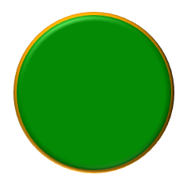

## **Úvod**

V PowerPointu můžete do snímků přidávat tvary. Protože tvary jsou složeny z čar, můžete je formátovat úpravou nebo aplikací efektů na jejich obrysy. Navíc můžete tvary formátovat zadáním nastavení, která řídí, jak jsou jejich výplně vyplněny.


Aspose.Slides pro C++ poskytuje rozhraní a metody, které vám umožňují formátovat tvary pomocí stejných možností, které jsou k dispozici v PowerPointu.

## **Formátování čar**

Pomocí Aspose.Slides můžete pro tvar zadat vlastní styl čáry. Následující kroky popisují postup:

1. Vytvořte instanci třídy [Prezentace](https://reference.aspose.com/slides/cs/cpp/aspose.slides/presentation/).
1. Získejte odkaz na snímek podle jeho indexu.
1. Přidejte do snímku [IAutoShape](https://reference.aspose.com/slides/cs/cpp/aspose.slides/iautoshape/).
1. Nastavte [styl čáry](https://reference.aspose.com/slides/cs/cpp/aspose.slides/linestyle/) tvaru.
1. Nastavte šířku čáry.
1. Nastavte [styl čárkování](https://reference.aspose.com/slides/cs/cpp/aspose.slides/linedashstyle/) čáry.
1. Nastavte barvu čáry pro tvar.
1. Uložte upravenou prezentaci jako soubor PPTX.

Následující kód ukazuje, jak formátovat obdélníkový `AutoShape`:

```cpp
// Vytvořte instanci třídy Presentation, která představuje soubor prezentace.
auto presentation = MakeObject<Presentation>();

// Získejte první snímek.
auto slide = presentation->get_Slide(0);

// Přidejte automatický tvar typu Obdélník.
auto shape = slide->get_Shapes()->AddAutoShape(ShapeType::Rectangle, 50, 150, 150, 75);

// Nastavte barvu výplně pro obdélníkový tvar.
shape->get_FillFormat()->set_FillType(FillType::NoFill);

// Použijte formátování na čáry obdélníku.
shape->get_LineFormat()->set_Style(LineStyle::ThickThin);
shape->get_LineFormat()->set_Width(7);
shape->get_LineFormat()->set_DashStyle(LineDashStyle::Dash);

// Nastavte barvu čáry obdélníku.
shape->get_LineFormat()->get_FillFormat()->set_FillType(FillType::Solid);
shape->get_LineFormat()->get_FillFormat()->get_SolidFillColor()->set_Color(Color::get_Blue());

// Uložte soubor PPTX na disk.
presentation->Save(u"formatted_lines.pptx", SaveFormat::Pptx);
presentation->Dispose();
```

Výsledek:


## **Formátování stylů spojení**

Zde jsou tři možnosti typu spojení:

* Oblý
* Miter
* Sražený

Ve výchozím nastavení, když PowerPoint spojí dvě čáry pod úhlem (například na rohu tvaru), použije nastavení **Oblý**. Pokud však kreslíte tvar s ostrými úhly, můžete upřednostnit možnost **Miter**.


Následující kód v C++ ukazuje, jak byly vytvořeny tři obdélníky (jak je vidět na výše uvedeném obrázku) pomocí nastavení typu spojení Miter, Bevel a Round:

```cpp
// Vytvořte instanci třídy Presentation, která představuje soubor prezentace.
auto presentation = MakeObject<Presentation>();

// Získejte první snímek.
auto slide = presentation->get_Slide(0);

// Přidejte tři automatické tvary typu Obdélník.
auto shape1 = slide->get_Shapes()->AddAutoShape(ShapeType::Rectangle, 20, 20, 150, 75);
auto shape2 = slide->get_Shapes()->AddAutoShape(ShapeType::Rectangle, 210, 20, 150, 75);
auto shape3 = slide->get_Shapes()->AddAutoShape(ShapeType::Rectangle, 20, 135, 150, 75);

// Nastavte barvu výplně pro každý obdélníkový tvar.
shape1->get_FillFormat()->set_FillType(FillType::Solid);
shape1->get_FillFormat()->get_SolidFillColor()->set_Color(Color::get_Black());
shape2->get_FillFormat()->set_FillType(FillType::Solid);
shape2->get_FillFormat()->get_SolidFillColor()->set_Color(Color::get_Black());
shape3->get_FillFormat()->set_FillType(FillType::Solid);
shape3->get_FillFormat()->get_SolidFillColor()->set_Color(Color::get_Black());

// Nastavte šířku čáry.
shape1->get_LineFormat()->set_Width(15);
shape2->get_LineFormat()->set_Width(15);
shape3->get_LineFormat()->set_Width(15);

// Nastavte barvu čáry pro každý obdélník.
shape1->get_LineFormat()->get_FillFormat()->set_FillType(FillType::Solid);
shape1->get_LineFormat()->get_FillFormat()->get_SolidFillColor()->set_Color(Color::get_Blue());
shape2->get_LineFormat()->get_FillFormat()->set_FillType(FillType::Solid);
shape2->get_LineFormat()->get_FillFormat()->get_SolidFillColor()->set_Color(Color::get_Blue());
shape3->get_LineFormat()->get_FillFormat()->set_FillType(FillType::Solid);
shape3->get_LineFormat()->get_FillFormat()->get_SolidFillColor()->set_Color(Color::get_Blue());

// Nastavte styl spojení.
shape1->get_LineFormat()->set_JoinStyle(LineJoinStyle::Miter);
shape2->get_LineFormat()->set_JoinStyle(LineJoinStyle::Bevel);
shape3->get_LineFormat()->set_JoinStyle(LineJoinStyle::Round);

// Přidejte text ke každému obdélníku.
shape1->get_TextFrame()->set_Text(u"Miter Join Style");
shape2->get_TextFrame()->set_Text(u"Bevel Join Style");
shape3->get_TextFrame()->set_Text(u"Round Join Style");

// Uložte soubor PPTX na disk.
presentation->Save(u"join_styles.pptx", SaveFormat::Pptx);
presentation->Dispose();
```

## **Gradientní výplň**

V PowerPointu je Gradientní výplň formátovací možností, která vám umožňuje aplikovat plynulé míchání barev na tvar. Například můžete použít dvě nebo více barev tak, že jedna postupně přechází v druhou.

Zde je postup, jak aplikovat gradientní výplň na tvar pomocí Aspose.Slides:

1. Vytvořte instanci třídy [Prezentace](https://reference.aspose.com/slides/cs/cpp/aspose.slides/presentation/).
1. Získejte odkaz na snímek podle jeho indexu.
1. Přidejte do snímku [IAutoShape](https://reference.aspose.com/slides/cs/cpp/aspose.slides/iautoshape/).
1. Nastavte [FillType](https://reference.aspose.com/slides/cs/cpp/aspose.slides/filltype/) tvaru na `Gradient`.
1. Přidejte své dvě preferované barvy s definovanými pozicemi pomocí metod `Add` ze sbírky gradientových zastávek, kterou poskytuje rozhraní [IGradientFormat](https://reference.aspose.com/slides/cs/cpp/aspose.slides/igradientformat/).
1. Uložte upravenou prezentaci jako soubor PPTX.

```cpp
// Vytvořte instanci třídy Presentation, která představuje soubor prezentace.
auto presentation = MakeObject<Presentation>();

// Získejte první snímek.
auto slide = presentation->get_Slide(0);

// Přidejte automatický tvar typu Elipsa.
auto shape = slide->get_Shapes()->AddAutoShape(ShapeType::Ellipse, 50, 50, 150, 75);

// Aplikujte gradientní formátování na elipsu.
shape->get_FillFormat()->set_FillType(FillType::Gradient);
shape->get_FillFormat()->get_GradientFormat()->set_GradientShape(GradientShape::Linear);

// Nastavte směr gradientu.
shape->get_FillFormat()->get_GradientFormat()->set_GradientDirection(GradientDirection::FromCorner2);

// Přidejte dva gradientové zastávky.
shape->get_FillFormat()->get_GradientFormat()->get_GradientStops()->Add(1.0f, PresetColor::Purple);
shape->get_FillFormat()->get_GradientFormat()->get_GradientStops()->Add(0.0f, PresetColor::Red);

// Uložte soubor PPTX na disk.
presentation->Save(u"gradient_fill.pptx", SaveFormat::Pptx);
presentation->Dispose();
```

Elipsa s gradientní výplní:


## **Vzorková výplň**

V PowerPointu je Vzorková výplň formátovací možností, která vám umožňuje aplikovat dvoubarevný návrh – například tečky, pruhy, šrafování nebo šachovnici – na tvar. Můžete vybrat vlastní barvy pro popředí a pozadí vzorku.

Aspose.Slides poskytuje více než 45 předdefinovaných stylů vzorku, které můžete aplikovat na tvary a zvýšit tak vizuální atraktivitu vašich prezentací. I po výběru předdefinovaného vzorku můžete stále zadat přesné barvy, které se mají použít.

Zde je postup, jak aplikovat vzorkovou výplň na tvar pomocí Aspose.Slides:

1. Vytvořte instanci třídy [Prezentace](https://reference.aspose.com/slides/cs/cpp/aspose.slides/presentation/).
1. Získejte odkaz na snímek podle jeho indexu.
1. Přidejte do snímku [IAutoShape](https://reference.aspose.com/slides/cs/cpp/aspose.slides/iautoshape/).
1. Nastavte [FillType](https://reference.aspose.com/slides/cs/cpp/aspose.slides/filltype/) tvaru na `Pattern`.
1. Vyberte styl vzorku z předdefinovaných možností.
1. Nastavte [Background Color](https://reference.aspose.com/slides/cs/cpp/aspose.slides/ipatternformat/get_backcolor/) vzorku.
1. Nastavte [Foreground Color](https://reference.aspose.com/slides/cs/cpp/aspose.slides/ipatternformat/get_forecolor/) vzorku.
1. Uložte upravenou prezentaci jako soubor PPTX.

```cpp
// Vytvořte instanci třídy Presentation, která představuje soubor prezentace.
auto presentation = MakeObject<Presentation>();

// Získejte první snímek.
auto slide = presentation->get_Slide(0);

// Přidejte automatický tvar typu Obdélník.
auto shape = slide->get_Shapes()->AddAutoShape(ShapeType::Rectangle, 50, 50, 150, 75);

// Nastavte typ výplně na Pattern.
shape->get_FillFormat()->set_FillType(FillType::Pattern);

// Nastavte styl vzorku.
shape->get_FillFormat()->get_PatternFormat()->set_PatternStyle(PatternStyle::Trellis);

// Nastavte barvy pozadí a popředí vzorku.
shape->get_FillFormat()->get_PatternFormat()->get_BackColor()->set_Color(Color::get_LightGray());
shape->get_FillFormat()->get_PatternFormat()->get_ForeColor()->set_Color(Color::get_Yellow());

// Uložte soubor PPTX na disk.
presentation->Save(u"pattern_fill.pptx", SaveFormat::Pptx);
presentation->Dispose();
```

Obdélník s vzorkovou výplní:


## **Obrázková výplň**

V PowerPointu je Obrázková výplň formátovací možností, která vám umožňuje vložit obrázek uvnitř tvaru – efektivně používá obrázek jako pozadí tvaru.

Zde je postup, jak pomocí Aspose.Slides aplikovat obrázkovou výplň na tvar:

1. Vytvořte instanci třídy [Prezentace](https://reference.aspose.com/slides/cs/cpp/aspose.slides/presentation/).
1. Získejte odkaz na snímek podle jeho indexu.
1. Přidejte do snímku [IAutoShape](https://reference.aspose.com/slides/cs/cpp/aspose.slides/iautoshape/).
1. Nastavte [FillType](https://reference.aspose.com/slides/cs/cpp/aspose.slides/filltype/) tvaru na `Picture`.
1. Nastavte režim obrázkové výplně na `Tile` (nebo jiný preferovaný režim).
1. Vytvořte objekt [IPPImage](https://reference.aspose.com/slides/cs/cpp/aspose.slides/ippimage/) z obrázku, který chcete použít.
1. Předávejte obrázek metodě `ISlidesPicture.set_Image`.
1. Uložte upravenou prezentaci jako soubor PPTX.

Řekněme, že máme soubor "lotus.png" s následujícím obrázkem:


```cpp
// Vytvořte instanci třídy Presentation, která představuje soubor prezentace.
auto presentation = MakeObject<Presentation>();

// Získejte první snímek.
auto slide = presentation->get_Slide(0);

// Přidejte automatický tvar typu Obdélník.
auto shape = slide->get_Shapes()->AddAutoShape(ShapeType::Rectangle, 50, 50, 255, 130);

// Nastavte typ výplně na Picture.
shape->get_FillFormat()->set_FillType(FillType::Picture);

// Nastavte režim obrázkové výplně.
shape->get_FillFormat()->get_PictureFillFormat()->set_PictureFillMode(PictureFillMode::Tile);

// Načtěte obrázek a přidejte jej do zdrojů prezentace.
auto image = Images::FromFile(u"lotus.png");
auto picture = presentation->get_Images()->AddImage(image);
image->Dispose();

// Nastavte obrázek.
shape->get_FillFormat()->get_PictureFillFormat()->get_Picture()->set_Image(picture);

// Uložte soubor PPTX na disk.
presentation->Save(u"picture_fill.pptx", SaveFormat::Pptx);
presentation->Dispose();
```

Tvar s obrázkovou výplní:


### **Obrázek dlaždice jako textura**

Pokud chcete nastavit obrázek jako dlaždicovou texturu a přizpůsobit chování dlaždic, můžete použít následující metody rozhraní [IPictureFillFormat](https://reference.aspose.com/slides/cs/cpp/aspose.slides/ipicturefillformat/) a třídy [PictureFillFormat](https://reference.aspose.com/slides/cs/cpp/aspose.slides/picturefillformat/):

- [set_PictureFillMode](https://reference.aspose.com/slides/cs/cpp/aspose.slides/ipicturefillformat/set_picturefillmode/): Nastavuje režim obrázkové výplně – buď `Tile`, nebo `Stretch`.
- [set_TileAlignment](https://reference.aspose.com/slides/cs/cpp/aspose.slides/ipicturefillformat/set_tilealignment/): Určuje zarovnání dlaždic uvnitř tvaru.
- [set_TileFlip](https://reference.aspose.com/slides/cs/cpp/aspose.slides/ipicturefillformat/set_tileflip/): Řídí, zda je dlaždice převrácena horizontálně, vertikálně nebo obojí.
- [set_TileOffsetX](https://reference.aspose.com/slides/cs/cpp/aspose.slides/ipicturefillformat/set_tileoffsetx/): Nastavuje horizontální posun dlaždice (v bodech) od počátku tvaru.
- [set_TileOffsetY](https://reference.aspose.com/slides/cs/cpp/aspose.slides/ipicturefillformat/set_tileoffsety/): Nastavuje vertikální posun dlaždice (v bodech) od počátku tvaru.
- [set_TileScaleX](https://reference.aspose.com/slides/cs/cpp/aspose.slides/ipicturefillformat/set_tilescalex/): Definuje horizontální měřítko dlaždice v procentech.
- [set_TileScaleY](https://reference.aspose.com/slides/cs/cpp/aspose.slides/ipicturefillformat/set_tilescaley/): Definuje vertikální měřítko dlaždice v procentech.

Následující ukázkový kód ukazuje, jak přidat obdélníkový tvar s dlaždicovou obrázkovou výplní a nakonfigurovat možnosti dlaždic:

```cpp
// Vytvořte instanci třídy Presentation, která představuje soubor prezentace.
auto presentation = MakeObject<Presentation>();

// Získejte první snímek.
auto firstSlide = presentation->get_Slide(0);

// Přidejte automatický tvar typu Obdélník.
auto shape = firstSlide->get_Shapes()->AddAutoShape(ShapeType::Rectangle, 50, 50, 190, 95);

// Nastavte typ výplně tvaru na Picture.
shape->get_FillFormat()->set_FillType(FillType::Picture);

// Načtěte obrázek a přidejte jej do zdrojů prezentace.
auto sourceImage = Images::FromFile(u"lotus.png");
auto presentationImage = presentation->get_Images()->AddImage(sourceImage);
sourceImage->Dispose();

// Přiřaďte obrázek k tvaru.
auto pictureFillFormat = shape->get_FillFormat()->get_PictureFillFormat();
pictureFillFormat->get_Picture()->set_Image(presentationImage);

// Nakonfigurujte režim obrázkové výplně a vlastnosti dlaždicování.
pictureFillFormat->set_PictureFillMode(PictureFillMode::Tile);
pictureFillFormat->set_TileOffsetX(-32);
pictureFillFormat->set_TileOffsetY(-32);
pictureFillFormat->set_TileScaleX(50);
pictureFillFormat->set_TileScaleY(50);
pictureFillFormat->set_TileAlignment(RectangleAlignment::BottomRight);
pictureFillFormat->set_TileFlip(TileFlip::FlipBoth);

// Uložte soubor PPTX na disk.
presentation->Save(u"tile.pptx", SaveFormat::Pptx);
presentation->Dispose();
```

Možnosti dlaždic:


## **Jednobarevná výplň**

V PowerPointu je Jednobarevná výplň formátovací možností, která vyplní tvar jednou, jednotnou barvou. Tato jednoduchá barva pozadí je aplikována bez jakýchkoli gradientů, textur nebo vzorů.

Pro aplikaci jednobarevné výplně na tvar pomocí Aspose.Slides postupujte následovně:

1. Vytvořte instanci třídy [Prezentace](https://reference.aspose.com/slides/cs/cpp/aspose.slides/presentation/).
1. Získejte odkaz na snímek podle jeho indexu.
1. Přidejte do snímku [IAutoShape](https://reference.aspose.com/slides/cs/cpp/aspose.slides/iautoshape/).
1. Nastavte [FillType](https://reference.aspose.com/slides/cs/cpp/aspose.slides/filltype/) tvaru na `Solid`.
1. Přiřaďte tvaru preferovanou barvu výplně.
1. Uložte upravenou prezentaci jako soubor PPTX.

```cpp
// Vytvořte instanci třídy Presentation, která představuje soubor prezentace.
auto presentation = MakeObject<Presentation>();

// Získejte první snímek.
auto slide = presentation->get_Slide(0);

// Přidejte automatický tvar typu Obdélník.
auto shape = slide->get_Shapes()->AddAutoShape(ShapeType::Rectangle, 50, 50, 150, 75);

// Nastavte typ výplně na Solid.
shape->get_FillFormat()->set_FillType(FillType::Solid);

// Nastavte barvu výplně.
shape->get_FillFormat()->get_SolidFillColor()->set_Color(Color::get_Yellow());

// Uložte soubor PPTX na disk.
presentation->Save(u"solid_color_fill.pptx", SaveFormat::Pptx);
presentation->Dispose();
```

Tvar s jednobarevnou výplní:


## **Nastavení průhlednosti**

V PowerPointu, když aplikujete jednobarevnou, gradientní, obrázkovou nebo texturovanou výplň na tvary, můžete také nastavit úroveň průhlednosti k řízení opacity výplně. Vyšší hodnota průhlednosti způsobí, že tvar bude průhlednější, což umožní částečně zobrazit pozadí nebo podložní objekty.

Aspose.Slides vám umožňuje nastavit úroveň průhlednosti úpravou alfa komponenty barvy použité pro výplň. Zde je postup:

1. Vytvořte instanci třídy [Prezentace](https://reference.aspose.com/slides/cs/cpp/aspose.slides/presentation/).
1. Získejte odkaz na snímek podle jeho indexu.
1. Přidejte do snímku [IAutoShape](https://reference.aspose.com/slides/cs/cpp/aspose.slides/iautoshape/).
1. Nastavte [FillType](https://reference.aspose.com/slides/cs/cpp/aspose.slides/filltype/) na `Solid`.
1. Použijte `Color` k definování barvy s průhledností (komponenta `alpha` řídí průhlednost).
1. Uložte prezentaci.

```cpp
// Vytvořte instanci třídy Presentation, která představuje soubor prezentace.
auto presentation = MakeObject<Presentation>();

// Získejte první snímek.
auto slide = presentation->get_Slide(0);

// Přidejte automatický tvar typu Obdélník s výplní Solid.
auto solidShape = slide->get_Shapes()->AddAutoShape(ShapeType::Rectangle, 50, 50, 150, 75);

// Přidejte transparentní automatický tvar typu Obdélník nad plný tvar.
auto transparentShape = slide->get_Shapes()->AddAutoShape(ShapeType::Rectangle, 80, 80, 150, 75);
transparentShape->get_FillFormat()->set_FillType(FillType::Solid);
transparentShape->get_FillFormat()->get_SolidFillColor()->set_Color(Color::FromArgb(204, 255, 255, 0));

// Uložte soubor PPTX na disk.
presentation->Save(u"shape_transparency.pptx", SaveFormat::Pptx);
presentation->Dispose();
```

Průhledný tvar:


## **Otáčení tvarů**

Aspose.Slides vám umožňuje otáčet tvary v prezentacích PowerPoint. To může být užitečné při umisťování vizuálních prvků s konkrétními požadavky na zarovnání nebo design.

Pro otočení tvaru na snímku postupujte podle následujících kroků:

1. Vytvořte instanci třídy [Prezentace](https://reference.aspose.com/slides/cs/cpp/aspose.slides/presentation/).
1. Získejte odkaz na snímek podle jeho indexu.
1. Přidejte do snímku [IAutoShape](https://reference.aspose.com/slides/cs/cpp/aspose.slides/iautoshape/).
1. Nastavte vlastnost rotace tvaru na požadovaný úhel.
1. Uložte prezentaci.

```cpp
// Vytvořte instanci třídy Presentation, která představuje soubor prezentace.
auto presentation = MakeObject<Presentation>();

// Získejte první snímek.
auto slide = presentation->get_Slide(0);

// Přidejte automatický tvar typu Obdélník.
auto shape = slide->get_Shapes()->AddAutoShape(ShapeType::Rectangle, 50, 50, 150, 75);

// Otočte tvar o 5 stupňů.
shape->set_Rotation(5);

// Uložte soubor PPTX na disk.
presentation->Save(u"shape_rotation.pptx", SaveFormat::Pptx);
presentation->Dispose();
```

Otáčení tvaru:


## **Přidání 3D sklonových efektů**

Aspose.Slides umožňuje aplikovat 3D sklonové efekty na tvary konfigurací jejich vlastností [ThreeDFormat](https://reference.aspose.com/slides/cs/cpp/aspose.slides/threedformat/).

Pro přidání 3D sklonových efektů na tvar postupujte následovně:

1. Vytvořte instanci třídy [Prezentace](https://reference.aspose.com/slides/cs/cpp/aspose.slides/presentation/).
1. Získejte odkaz na snímek podle jeho indexu.
1. Přidejte do snímku [IAutoShape](https://reference.aspose.com/slides/cs/cpp/aspose.slides/iautoshape/).
1. Nakonfigurujte [ThreeDFormat](https://reference.aspose.com/slides/cs/cpp/aspose.slides/threedformat/) tvaru pro definování nastavení sklonu.
1. Uložte prezentaci.

```cpp
// Vytvořte instanci třídy Presentation.
auto presentation = MakeObject<Presentation>();

auto slide = presentation->get_Slide(0);

// Přidejte tvar na snímek.
auto shape = slide->get_Shapes()->AddAutoShape(ShapeType::Ellipse, 50, 50, 100, 100);
shape->get_FillFormat()->set_FillType(FillType::Solid);
shape->get_FillFormat()->get_SolidFillColor()->set_Color(Color::get_Green());
shape->get_LineFormat()->get_FillFormat()->set_FillType(FillType::Solid);
shape->get_LineFormat()->get_FillFormat()->get_SolidFillColor()->set_Color(Color::get_Orange());
shape->get_LineFormat()->set_Width(2.0);

// Nastavte vlastnosti ThreeDFormat tvaru.
shape->get_ThreeDFormat()->set_Depth(4.0);
shape->get_ThreeDFormat()->get_BevelTop()->set_BevelType(BevelPresetType::Circle);
shape->get_ThreeDFormat()->get_BevelTop()->set_Height(6);
shape->get_ThreeDFormat()->get_BevelTop()->set_Width(6);
shape->get_ThreeDFormat()->get_Camera()->set_CameraType(CameraPresetType::OrthographicFront);
shape->get_ThreeDFormat()->get_LightRig()->set_LightType(LightRigPresetType::ThreePt);
shape->get_ThreeDFormat()->get_LightRig()->set_Direction(LightingDirection::Top);

// Uložte prezentaci jako soubor PPTX.
presentation->Save(u"3D_bevel_effect.pptx", SaveFormat::Pptx);
presentation->Dispose();
```

3D sklonový efekt:



## **Přidání 3D rotačních efektů**

Aspose.Slides umožňuje aplikovat 3D rotační efekty na tvary konfigurací jejich vlastností [ThreeDFormat](https://reference.aspose.com/slides/cs/cpp/aspose.slides/threedformat/).

Pro aplikaci 3D rotace na tvar:

1. Vytvořte instanci třídy [Prezentace](https://reference.aspose.com/slides/cs/cpp/aspose.slides/presentation/).
1. Získejte odkaz na snímek podle jeho indexu.
1. Přidejte do snímku [IAutoShape](https://reference.aspose.com/slides/cs/cpp/aspose.slides/iautoshape/).
1. Použijte [set_CameraType](https://reference.aspose.com/slides/cs/cpp/aspose.slides/icamera/set_cameratype/) a [set_LightType](https://reference.aspose.com/slides/cs/cpp/aspose.slides/ilightrig/set_lighttype/) k definování 3D rotace.
1. Uložte prezentaci.

```cpp
// Vytvořte instanci třídy Presentation.
auto presentation = MakeObject<Presentation>();

auto slide = presentation->get_Slide(0);

auto shape = slide->get_Shapes()->AddAutoShape(ShapeType::Rectangle, 50, 50, 150, 75);
shape->get_TextFrame()->set_Text(u"Hello, Aspose!");

shape->get_ThreeDFormat()->set_Depth(6);
shape->get_ThreeDFormat()->get_Camera()->SetRotation(40, 35, 20);
shape->get_ThreeDFormat()->get_Camera()->set_CameraType(CameraPresetType::IsometricLeftUp);
shape->get_ThreeDFormat()->get_LightRig()->set_LightType(LightRigPresetType::Balanced);

// Uložte prezentaci jako soubor PPTX.
presentation->Save(u"3D_rotation_effect.pptx", SaveFormat::Pptx);
presentation->Dispose();
```

3D rotační efekt:


## **Obnovení formátování**

Následující kód v C++ ukazuje, jak resetovat formátování snímku a vrátit pozici, velikost a formátování všech tvarů s zástupnými objekty na [LayoutSlide](https://reference.aspose.com/slides/cs/cpp/aspose.slides/layoutslide/) do jejich výchozích nastavení:

```cpp
auto presentation = MakeObject<Presentation>(u"sample.pptx");

for (auto&& slide : presentation->get_Slides())
{
    // Resetujte každý tvar na snímku, který má placeholder v rozvržení.
    slide->Reset();
}

presentation->Save(u"reset_formatting.pptx", SaveFormat::Pptx);
presentation->Dispose();
```

## **FAQ**

**Ovlivňuje formátování tvarů konečnou velikost souboru prezentace?**

Pouze minimálně. Vložené obrázky a média zabírají většinu prostoru v souboru, zatímco parametry tvarů, jako jsou barvy, efekty a gradienty, jsou uloženy jako metadata a prakticky nepřidávají žádnou další velikost.

**Jak mohu na snímku detekovat tvary, které mají identické formátování, abych je mohl seskupit?**

Porovnejte klíčové vlastnosti formátování každého tvaru – nastavení výplně, čáry a efektů. Pokud se všechny odpovídající hodnoty shodují, považujte jejich styly za identické a logicky seskupte tyto tvary, což usnadní pozdější správu stylů.

**Mohu uložit sadu vlastních stylů tvarů do samostatného souboru pro opětovné použití v jiných prezentacích?**

Ano. Uložte ukázkové tvary s požadovanými styly do šablony snímků nebo souboru šablony .POTX. Při vytváření nové prezentace otevřete šablonu, klonujte potřebné stylované tvary a opětově aplikujte jejich formátování tam, kde je to potřeba.