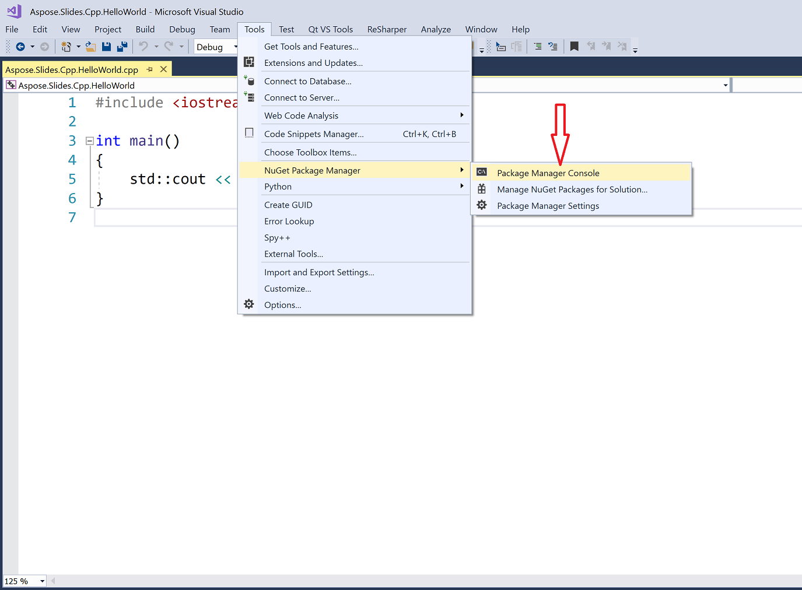

## **Přehled**

Aspose.Slides for C++ je distribuován ve dvou formách:

| Forma | Použít k | Odkud získat |
|---|---|---|
| Balíčky NuGet: [Aspose.Slides.Cpp](https://www.nuget.org/packages/Aspose.Slides.Cpp/) (64‑bit) a [Aspose.Slides.Cpp.x86](https://www.nuget.org/packages/Aspose.Slides.Cpp.x86/) (32‑bit) | Projekty Visual Studio C++ na Windows | NuGet |
| ZIP balíčky pro Windows, Linux a macOS | Sestavení bez NuGet, např. projekty CMake | Stránka ke stažení |

Tento článek ukazuje, jak nainstalovat balíček NuGet ve Visual Studio na Windows a jak použít ZIP balíček s CMake na Linuxu. Obě cesty končí stejnou kontrolou: sestavit a spustit první příklad v [Create Presentations](/slides/cs/cpp/create-presentation/).

## **Windows**

Ve Windows přidejte balíček NuGet do projektu Visual Studio C++. Balíček také nainstaluje svou závislost CodePorting.Translator.Cs2Cpp.Framework a zkopíruje DLL, které váš program potřebuje, do výstupní složky sestavení.

Vyberte balíček podle platformy, pro kterou sestavujete: **Aspose.Slides.Cpp** pro x64 a **Aspose.Slides.Cpp.x86** pro Win32 (x86). Balíček Aspose.Slides.Cpp se nepoužije pro sestavení Win32, takže kompilátor nemůže najít jeho hlavičky.

Windows ZIP balíček je také k dispozici na [download page](https://releases.aspose.com/slides/cpp/).

### **Metoda 1: Instalace nebo aktualizace Aspose.Slides přes správce balíčků NuGet**

1. Otevřete Microsoft Visual Studio.  
2. Vytvořte projekt **Console App** v C++ nebo otevřete existující projekt.  
3. V **Solution Explorer** klikněte pravým tlačítkem na projekt a zvolte **Manage NuGet Packages** (nebo přejděte na **Project** > **Manage NuGet Packages**).  
4. V záložce **Browse** vyhledejte *Aspose.Slides.Cpp*.  
  
5. Klikněte na **Aspose.Slides.Cpp** (nebo **Aspose.Slides.Cpp.x86** pro 32‑bitové sestavení) a poté na **Install**.  
   * Pokud již máte Aspose.Slides nainstalováno a chcete jej aktualizovat, klikněte místo toho na **Update**.

Balíček se stáhne a bude referencován ve vašem projektu.

### **Metoda 2: Instalace nebo aktualizace Aspose.Slides přes konzoli správce balíčků**

1. Otevřete Microsoft Visual Studio.  
2. Vytvořte projekt **Console App** v C++ nebo otevřete existující projekt.  
3. Přejděte na **Tools** > **NuGet Package Manager** > **Package Manager Console**.  
  
4. Spusťte tento příkaz:

   ```powershell
   Install-Package Aspose.Slides.Cpp
   ```

   Pro 32‑bitové (Win32) sestavení nainstalujte místo toho balíček x86:

   ```powershell
   Install-Package Aspose.Slides.Cpp.x86
   ```


Po dokončení instalace se zobrazí potvrzovací zprávy. Balíček je distribuován pod [Aspose EULA](https://about.aspose.com/legal/eula).  


Pro aktualizaci balíčku spusťte `Update-Package Aspose.Slides.Cpp` (nebo `Update-Package Aspose.Slides.Cpp.x86`) v konzoli správce balíčků.

### **Kontrola instalace**

1. Nahraďte obsah hlavního souboru *.cpp* projektu (soubor, který obsahuje `main`) prvním příkladem z [Create Presentations](/slides/cs/cpp/create-presentation/).  
2. Na liště nástrojů vyberte platformu **x64** nebo **x86**, pokud máte nainstalováno Aspose.Slides.Cpp.x86.  
3. Stiskněte **Ctrl+F5** pro sestavení a spuštění programu.

Program uloží *hello.pptx* do složky projektu, což je výchozí pracovní adresář při spuštění programu z Visual Studia.

## **Linux**

Na Linuxu použijte Linux ZIP balíček s CMake. Obsahuje knihovnu Aspose.Slides, její závislost CodePorting.Translator.Cs2Cpp.Framework a konfigurační soubor CMake pro každou z nich. Knihovny jsou sestaveny pro Linux x86_64 s glibc 2.23 nebo novější.

1. Nainstalujte kompilátor C++, make, CMake, unzip a knihovnu fontconfig, na nichž knihovny Aspose.Slides závisí. Na Debianu a Ubuntu:

   ```bash
   sudo apt-get update && sudo apt-get install -y g++ make cmake unzip libfontconfig1
   ```

2. Vytvořte složku projektu a přejděte do ní:

   ```bash
   mkdir hello-slides
   cd hello-slides
   ```

3. Stáhněte Linux ZIP (**Aspose.Slides for C++ Linux**) ze [download page](https://releases.aspose.com/slides/cpp/) do složky projektu a rozbalte jej do podsložky *aspose-slides-cpp*:

   ```bash
   unzip aspose-slides-cpp-linux-*.zip -d aspose-slides-cpp
   ```

4. Vytvořte v kořenové složce projektu soubor *CMakeLists.txt* s následujícím obsahem:

   ```cmake
   cmake_minimum_required(VERSION 3.13)
   project(HelloSlides CXX)

   set(CMAKE_CXX_STANDARD 14)
   set(CMAKE_CXX_STANDARD_REQUIRED ON)

   set(ASPOSE_SLIDES_DIR "${CMAKE_CURRENT_SOURCE_DIR}/aspose-slides-cpp")
   find_package(CodePorting.Translator.Cs2Cpp.Framework REQUIRED CONFIG PATHS "${ASPOSE_SLIDES_DIR}" NO_DEFAULT_PATH)
   find_package(Aspose.Slides.Cpp REQUIRED CONFIG PATHS "${ASPOSE_SLIDES_DIR}" NO_DEFAULT_PATH)

   add_executable(hello main.cpp)
   target_link_libraries(hello PRIVATE Aspose.Slides.Cpp)
   ```

   Dvě volání `find_package` načtou konfigurační soubory CMake rozbaleného balíčku. Framework je nalezen jako první, protože Aspose.Slides na něm závisí. Propojení cíle `Aspose.Slides.Cpp` přidá složky s hlavičkami i obě knihovny do sestavení.

5. Uložte první příklad z [Create Presentations](/slides/cs/cpp/create-presentation/) jako *main.cpp* ve složce projektu.  
6. Sestavte a spusťte program:

   ```bash
   cmake -S . -B build -DCMAKE_BUILD_TYPE=Release
   cmake --build build
   ./build/hello
   ```

Program uloží *hello.pptx* do aktuální složky. CMake zaznamená umístění knihoven v programu, takže nemusíte nastavovat `LD_LIBRARY_PATH`, pokud složka *aspose-slides-cpp* zůstane na svém místě.

Písma použité ve vašich prezentacích, nebo vhodné náhrady, musí být nainstalována v systému, aby se text správně vykresloval při konverzi snímků do PDF nebo obrázků.

## **FAQ**

**Existuje bezplatná verze nebo omezení zkušební verze?**

Ano. Bez licence Aspose.Slides běží v evaluačním režimu: přidává vodoznak „evaluation“ na každý uložený snímek a ořezává text načtený z prezentací. Pro odstranění těchto omezení použijte platnou [license](/slides/cs/cpp/licensing/).

**Proč kompilátor hlásí, že nemůže otevřít *DOM/Presentation.h*?**

Nainstalovaný balíček neodpovídá platformě, pro kterou sestavujete. Aspose.Slides.Cpp se používá jen pro x64 sestavení a Aspose.Slides.Cpp.x86 jen pro Win32 sestavení. Vyberte ve Visual Studiu odpovídající platformu nebo nainstalujte druhý balíček.