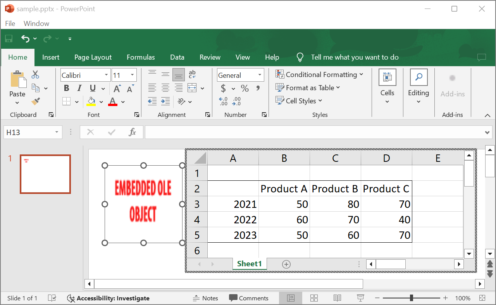

## **Úvod**

Při používání Aspose.Slides pro Java, když přidáte [OleObjectFrame](https://reference.aspose.com/slides/cs/java/com.aspose.slides/oleobjectframe/) do snímku, zobrazí se na výstupním snímku zpráva „EMBEDDED OLE OBJECT“. Tato zpráva je úmyslná a NEJDE o chybu.

Další informace o práci s OLE objekty najdete v článku [Manage OLE](/slides/cs/java/manage-ole/).

## **Vysvětlení a řešení**

Aspose.Slides zobrazuje zprávu „EMBEDDED OLE OBJECT“, aby vás upozornil, že OLE objekt byl změněn a náhledový obrázek je třeba aktualizovat.  

Například pokud přidáte do snímku Microsoft Excel graf jako [OleObjectFrame](https://reference.aspose.com/slides/cs/java/com.aspose.slides/oleobjectframe/) (pro podrobnosti viz článek „Manage OLE“) a poté otevřete prezentaci v Microsoft PowerPoint, na snímku uvidíte tento obrázek:


Pokud chcete zkontrolovat a potvrdit, že byl OLE objekt přidán na snímek, musíte dvakrát kliknout na zprávu „EMBEDDED OLE OBJECT“, nebo na ni můžete kliknout pravým tlačítkem a zvolit možnost **Object > Edit**.


PowerPoint pak otevře vložený OLE objekt.



Snímek může zachovat zprávu „EMBEDDED OLE OBJECT“. Jakmile na OLE objekt kliknete, náhled snímku se aktualizuje a zpráva „EMBEDDED OLE OBJECT“ se nahradí skutečným obrázkem OLE objektu.


Nyní možná budete chtít uložit prezentaci, aby se obrázek OLE objektu správně aktualizoval. Tímto způsobem, po uložení prezentace, při jejím opětovném otevření už nebudete vidět zprávu „EMBEDDED OLE OBJECT“.

## **Další řešení**

Pokud nechcete odstranit zprávu „EMBEDDED OLE OBJECT“ otevřením prezentace v PowerPointu a jejím následným uložením, můžete zprávu nahradit preferovaným náhledovým obrázkem. Následující řádky kódu ukazují, jak postupovat:

```java
import com.aspose.slides.*;

Presentation presentation = new Presentation("embeddedOLE.pptx");
try {
    ISlide slide = presentation.getSlides().get_Item(0);
    IOleObjectFrame oleFrame = (IOleObjectFrame) slide.getShapes().get_Item(0);

    // Přidejte obrázek do zdrojů prezentace.
    IImage image = Images.fromFile("myImage.png");
    IPPImage oleImage = presentation.getImages().addImage(image);

    // Nastavte název a obrázek pro náhled OLE objektu.
    oleFrame.setSubstitutePictureTitle("My title");
    oleFrame.getSubstitutePictureFormat().getPicture().setImage(oleImage);
    oleFrame.setObjectIcon(false);

    presentation.save("embeddedOLE-newImage.pptx", SaveFormat.Pptx);
} finally {
    if (presentation != null) presentation.dispose();    
}
```

Snímek obsahující `OleObjectFrame` se pak změní na tento:

