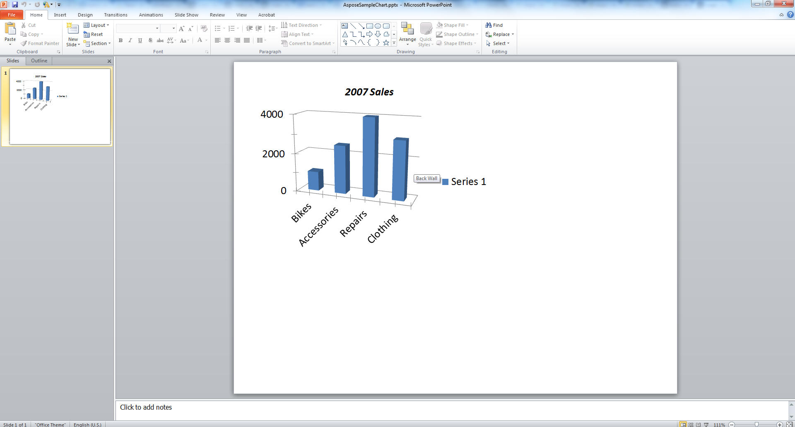

{} 

Grafy jsou vizuální reprezentace dat, které jsou široce používány v prezentacích. Tento článek ukazuje kód pro vytvoření grafu v Microsoft PowerPoint programově pomocí [VSTO](/slides/cs/java/create-a-chart-in-a-microsoft-powerpoint-presentation/) a [Aspose.Slides for Java](/slides/cs/java/create-a-chart-in-a-microsoft-powerpoint-presentation/).

{} 
## **Vytvoření grafu**
Níže uvedené příklady kódu popisují proces přidání jednoduchého 3D sloupcového seskupeného grafu pomocí VSTO. Vytvoříte instanci prezentace Microsoft PowerPoint, přidáte do ní výchozí graf. Poté použijete sešit Microsoft Excel k přístupu a úpravě dat grafu a nastavení vlastností grafu. Nakonec prezentaci uložíte.
### **Příklad VSTO**
Použitím VSTO jsou provedeny následující kroky:

1. Vytvořte instanci prezentace Microsoft PowerPoint.
1. Přidejte do prezentace prázdnou snímek.
1. Přidejte **3D sloupcový seskupený** graf a získáte k němu přístup.
1. Vytvořte novou instanci sešitu Microsoft Excel Workbook a načtěte data grafu.
1. Získejte přístup k listu s daty grafu pomocí Microsoft Excel Workbook instancefromworkbook.
1. Nastavte rozsah grafu v listu a odeberte sérii 2 a 3 z grafu.
1. Upravte data kategorií grafu v listu s daty grafu.
1. Upravte data série 1 grafu v listu s daty grafu.
1. Nyní získejte přístup k názvu grafu a nastavte související vlastnosti písma.
1. Získejte přístup k ose hodnot grafu a nastavte hlavní jednotku, vedlejší jednotky, maximální a minimální hodnoty.
1. Získejte přístup k ose hloubky nebo sériové ose a odeberte ji, protože v tomto příkladu je použita jen jedna série.
1. Nyní nastavte úhly otáčení grafu ve směrech X a Y.
1. Uložte prezentaci.
1. Zavřete instance Microsoft Excel a PowerPoint.

**Výstupní prezentace, vytvořená pomocí VSTO** 




### **Příklad Aspose.Slides pro Java**
Použitím Aspose.Slides pro Java jsou provedeny následující kroky:

1. Vytvořte instanci prezentace Microsoft PowerPoint.
1. Přidejte do prezentace prázdnou snímek.
1. Přidejte **3D sloupcový seskupený** graf a získáte k němu přístup.
1. Získejte přístup k listu s daty grafu pomocí Microsoft Excel Workbook instancefromworkbook.
1. Odeberte nepoužívané série 2 a 3.
1. Získejte přístup k kategoriím grafu a upravte štítky.
1. Získejte přístup k sérii 1 a upravte hodnoty série.
1. Nyní získejte přístup k názvu grafu a nastavte vlastnosti písma.
1. Získejte přístup k ose hodnot grafu a nastavte hlavní jednotku, vedlejší jednotky, maximální a minimální hodnoty.
1. Nyní nastavte úhly otáčení grafu ve směrech X a Y.
1. Uložte prezentaci ve formátu PPTX.

**Výstupní prezentace, vytvořená pomocí Aspose.Slides** 



## **FAQ**

### Můžu pomocí Aspose.Slides vytvořit jiné typy grafů, jako jsou koláčové, čárové nebo sloupcové grafy?

Ano. Aspose.Slides podporuje širokou škálu [chart types](/slides/cs/java/create-chart/), včetně koláčových grafů, čárových grafů, sloupcových grafů, bodových grafů, bublinových grafů a dalších. Požadovaný typ grafu můžete specifikovat pomocí třídy [ChartType](https://reference.aspose.com/slides/cs/java/com.aspose.slides/charttype/) při přidávání grafu.

### Můžu na graf použít vlastní styly nebo motivy?

Ano. Můžete plně přizpůsobit vzhled grafu, včetně barev, písem, výplní, obrysů, mřížek a rozvržení. Přesto aplikace témat Office přesně tak, jak jsou vidět v PowerPointu, vyžaduje ruční nastavení jednotlivých stylů.

### Můžu graf exportovat jako obrázek odděleně od snímku?

Ano, Aspose.Slides vám umožňuje exportovat libovolný tvar – včetně grafů – jako samostatný obrázek (např. PNG, JPEG) pomocí metody `getImage` na grafickém [shape](https://reference.aspose.com/slides/cs/java/com.aspose.slides/shape/).