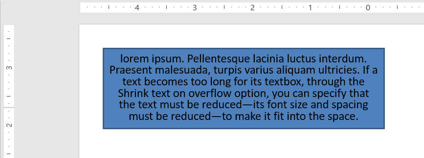

## **Úvod**

Ve výchozím nastavení, když přidáte textové pole, Microsoft PowerPoint používá nastavení **Změnit velikost tvaru tak, aby text odpovídal** pro textové pole – automaticky mění velikost textového pole, aby text vždy do něj pasoval. 


* Když se text v textovém poli prodlouží nebo zvětší, PowerPoint automaticky zvětší textové pole – zvýší jeho výšku – aby mohl pojmout více textu. 
* Když se text v textovém poli zkrátí nebo zmenší, PowerPoint automaticky zmenší textové pole – sníží jeho výšku – aby odstranil nadbytečný prostor. 

V PowerPointu jsou to 4 důležité parametry nebo možnosti, které řídí chování automatického přizpůsobení pro textové pole: 

* **Neautomatické přizpůsobení**
* **Zmenšit text při přetečení**
* **Změnit velikost tvaru tak, aby text odpovídal**
* **Zalamovat text v tvaru.**


Aspose.Slides for Java poskytuje podobné možnosti – některé vlastnosti ve třídě [TextFrameFormat](https://reference.aspose.com/slides/cs/java/com.aspose.slides/TextFrameFormat) – které vám umožní řídit chování automatického přizpůsobení textových polí v prezentacích. 

## **Změnit velikost tvaru tak, aby text odpovídal**

Pokud chcete, aby text v rámečku vždy po úpravách textu do rámečku pasoval, musíte použít možnost **Změnit velikost tvaru tak, aby text odpovídal**. Pro nastavení této volby nastavte vlastnost [AutofitType](https://reference.aspose.com/slides/cs/java/com.aspose.slides/TextFrameFormat#getAutofitType--) (třídy [TextFrameFormat](https://reference.aspose.com/slides/cs/java/com.aspose.slides/TextFrameFormat)) na `Shape`. 


Ukázka Java kódu, jak nastavit, aby text vždy pasoval do svého pole v PowerPoint prezentaci:

```java
Presentation pres = new Presentation();
try {
    ISlide slide = pres.getSlides().get_Item(0);
    IAutoShape autoShape = slide.getShapes().addAutoShape(ShapeType.Rectangle, 30, 30, 350, 100);

    Portion portion = new Portion("lorem ipsum...");
    portion.getPortionFormat().getFillFormat().getSolidFillColor().setColor(Color.BLACK);
    portion.getPortionFormat().getFillFormat().setFillType(FillType.Solid);
    autoShape.getTextFrame().getParagraphs().get_Item(0).getPortions().add(portion);

    ITextFrameFormat textFrameFormat = autoShape.getTextFrame().getTextFrameFormat();
    textFrameFormat.setAutofitType(TextAutofitType.Shape);

    pres.save("Output-presentation.pptx", SaveFormat.Pptx);
} finally {
    if (pres != null) pres.dispose();
}
```

Pokud se text prodlouží nebo zvětší, textové pole bude automaticky změněno velikost (zvýší se výška), aby se do něj vešel celý text. Pokud se text zkrátí, nastane opak. 

## **Neautomatické přizpůsobení**

Pokud chcete, aby textové pole nebo tvar zachovalo své rozměry bez ohledu na změny textu, který obsahuje, musíte použít možnost **Neautomatické přizpůsobení**. Pro nastavení této volby nastavte vlastnost [AutofitType](https://reference.aspose.com/slides/cs/java/com.aspose.slides/TextFrameFormat#getAutofitType--) (třídy [TextFrameFormat](https://reference.aspose.com/slides/cs/java/com.aspose.slides/TextFrameFormat)) na `None`. 


Ukázka Java kódu, jak nastavit, aby textové pole vždy zachovalo své rozměry v PowerPoint prezentaci:

```java
Presentation pres = new Presentation();
try {
    ISlide slide = pres.getSlides().get_Item(0);
    IAutoShape autoShape = slide.getShapes().addAutoShape(ShapeType.Rectangle, 30, 30, 350, 100);
	
    Portion portion = new Portion("lorem ipsum...");
    portion.getPortionFormat().getFillFormat().getSolidFillColor().setColor(Color.BLACK);
    portion.getPortionFormat().getFillFormat().setFillType(FillType.Solid);
    autoShape.getTextFrame().getParagraphs().get_Item(0).getPortions().add(portion);
	
    ITextFrameFormat textFrameFormat = autoShape.getTextFrame().getTextFrameFormat();
    textFrameFormat.setAutofitType(TextAutofitType.None);
	
    pres.save("Output-presentation.pptx", SaveFormat.Pptx);
} finally {
    if (pres != null) pres.dispose();
}
```

Když se text stane pro své pole příliš dlouhým, přeteče mimo něj. 

## **Zmenšit text při přetečení**

Pokud se text stane pro své pole příliš dlouhým, můžete pomocí možnosti **Zmenšit text při přetečení** určit, že velikost a rozestupy textu mají být zmenšeny, aby se vešel do pole. Pro nastavení této volby nastavte vlastnost [AutofitType](https://reference.aspose.com/slides/cs/java/com.aspose.slides/TextFrameFormat#getAutofitType--) (třídy [TextFrameFormat](https://reference.aspose.com/slides/cs/java/com.aspose.slides/TextFrameFormat)) na `Normal`. 



Ukázka Java kódu, jak nastavit, aby se text při přetečení zmenšil v PowerPoint prezentaci:

```java
Presentation pres = new Presentation();
try {
    ISlide slide = pres.getSlides().get_Item(0);
    IAutoShape autoShape = slide.getShapes().addAutoShape(ShapeType.Rectangle, 30, 30, 350, 100);
	
    Portion portion = new Portion("lorem ipsum...");
    portion.getPortionFormat().getFillFormat().getSolidFillColor().setColor(Color.BLACK);
    portion.getPortionFormat().getFillFormat().setFillType(FillType.Solid);
    autoShape.getTextFrame().getParagraphs().get_Item(0).getPortions().add(portion);
	
    ITextFrameFormat textFrameFormat = autoShape.getTextFrame().getTextFrameFormat();
    textFrameFormat.setAutofitType(TextAutofitType.Normal);
	
    pres.save("Output-presentation.pptx", SaveFormat.Pptx);
} finally {
    if (pres != null) pres.dispose();
}
```

{}
Když je použita možnost **Zmenšit text při přetečení**, nastavení se použije pouze tehdy, když se text stane pro pole příliš dlouhým.
{}

## **Zalamovat text**

Pokud chcete, aby se text v tvaru zalamoval uvnitř tohoto tvaru, když text přesáhne hranici tvaru (pouze šířka), musíte použít parametr **Zalamovat text v tvaru**. Pro nastavení této volby musíte nastavit vlastnost [WrapText](https://reference.aspose.com/slides/cs/java/com.aspose.slides/TextFrameFormat#getWrapText--) (třídy [TextFrameFormat](https://reference.aspose.com/slides/cs/java/com.aspose.slides/TextFrameFormat)) na `true`. 

Ukázka Java kódu, jak použít nastavení Zalamovat text v PowerPoint prezentaci:

```java
Presentation pres = new Presentation();
try {
    ISlide slide = pres.getSlides().get_Item(0);
    IAutoShape autoShape = slide.getShapes().addAutoShape(ShapeType.Rectangle, 30, 30, 350, 100);

    Portion portion = new Portion("lorem ipsum...");
    portion.getPortionFormat().getFillFormat().getSolidFillColor().setColor(Color.BLACK);
    portion.getPortionFormat().getFillFormat().setFillType(FillType.Solid);
    autoShape.getTextFrame().getParagraphs().get_Item(0).getPortions().add(portion);

    ITextFrameFormat textFrameFormat = autoShape.getTextFrame().getTextFrameFormat();
    textFrameFormat.setWrapText(NullableBool.True);

    pres.save("Output-presentation.pptx", SaveFormat.Pptx);
} finally {
    if (pres != null) pres.dispose();
}
```

{} 
Pokud nastavíte vlastnost `WrapText` na `False` pro tvar, když se text uvnitř tvaru prodlouží přes šířku tvaru, text se rozšíří za hranice tvaru na jediném řádku. 
{}

## **Často kladené otázky**

**Ovlivňují vnitřní okraje textového rámce AutoFit?**  
Ano. Odsazení (vnitřní okraje) snižuje použitelné místo pro text, takže AutoFit zasáhne dříve – zmenší písmo nebo dříve změní velikost tvaru. Zkontrolujte a upravte okraje před laděním AutoFit.

**Jak AutoFit spolupracuje s manuálními a měkkými konci řádků?**  
Vynucené zalomení zůstává na místě a AutoFit přizpůsobuje velikost písma a rozestupy kolem nich. Odstraněním nepotřebných zalomení se často sníží, jak agresivně AutoFit musí text zmenšovat.

**Mění změna písma motivu nebo spuštění substituce písma výsledky AutoFit?**  
Ano. Nahrazení písma fontem s odlišnými metrikami glyfů změní šířku/výšku textu, což může ovlivnit konečnou velikost písma a zalamování řádků. Po jakékoli změně nebo substituci písma je nutné snímky znovu zkontrolovat.