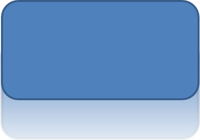

## **Úvod**

Zatímco efekty v PowerPointu lze použít k zvýraznění tvaru, liší se od [výplní](/slides/cs/java/shape-formatting/#gradient-fill) nebo obrysů. Pomocí efektů v PowerPointu můžete vytvořit přesvědčivé odrazy na tvaru, rozšířit záři tvaru atd.


PowerPoint poskytuje šest efektů, které lze použít na tvary. Na tvar můžete použít jeden nebo více efektů.

Některé kombinace efektů vypadají lépe než jiné. Z tohoto důvodu PowerPoint nabízí možnosti pod **Preset**. Možnosti Preset jsou kombinace dvou nebo více efektů, o nichž se ví, že vypadají dobře. Tímto způsobem, když vyberete předvolbu, nebudete muset ztrácet čas testováním nebo kombinováním různých efektů, abyste našli pěknou kombinaci.

Aspose.Slides poskytuje vlastnosti a metody ve třídě [EffectFormat](https://reference.aspose.com/slides/java/com.aspose.slides/effectformat/), které vám umožňují použít stejné efekty na tvary v PowerPoint prezentacích.

## **Použít efekt stínu**

Aspose.Slides pro Java podporuje vnější a vnitřní stíny pro tvary. Můžete přizpůsobit jejich barvu, směr, vzdálenost a poloměr rozostření tak, aby odpovídaly designu vaší prezentace.

### **Použít vnější stín**

Použijte vnější stín, aby karta nebo panel vynikl na pozadí snímku. Stín přesahuje okraje tvaru, čímž vytváří dojem, že je tvar nad snímkem. Nastavte jeho barvu, směr, vzdálenost a poloměr rozostření tak, aby odpovídaly osvětlení a stylu vaší šablony.

Tento Java kód ukazuje, jak použít [efekt vnějšího stínu](https://reference.aspose.com/slides/java/com.aspose.slides/effectformat/#getOuterShadowEffect--) na obdélník:

```java
import com.aspose.slides.*;
import java.awt.Color;

Presentation presentation = new Presentation();
try {
    ISlide slide = presentation.getSlides().get_Item(0);

    IShape shape = slide.getShapes().addAutoShape(ShapeType.RoundCornerRectangle, 20, 20, 200, 100);
    shape.getEffectFormat().enableOuterShadowEffect();
    shape.getEffectFormat().getOuterShadowEffect().getShadowColor().setColor(new Color(169, 169, 169));
    shape.getEffectFormat().getOuterShadowEffect().setDistance(10);
    shape.getEffectFormat().getOuterShadowEffect().setDirection(45);

    presentation.save("shadow_effect.pptx", SaveFormat.Pptx);
} finally {
    presentation.dispose();
}
```


### **Použít vnitřní stín**

Při reprodukci vizuálního stylu šablony použijte vnitřní stín, aby karta nebo panel získaly zapuštěný vzhled. Vnější stín se rozprostírá mimo tvar a dává mu vzhled zvýšeného, zatímco vnitřní stín ztmavuje vnitřek jeho okrajů.

Zavolejte [enableInnerShadowEffect](https://reference.aspose.com/slides/java/com.aspose.slides/effectformat/#enableInnerShadowEffect--), pak nakonfigurujte stín vrácený metodou [getInnerShadowEffect](https://reference.aspose.com/slides/java/com.aspose.slides/effectformat/#getInnerShadowEffect--). Větší hodnoty poloměru rozostření vytvářejí měkčí okraje.

Tento Java příklad vytvoří světle modrou kartu s tmavě šedým vnitřním stínem a uloží ji jako soubor PPTX. Směr stínu je 225 stupňů, jeho vzdálenost je 7 bodů a poloměr rozostření je 6 bodů:

```java
import com.aspose.slides.*;
import java.awt.Color;

Presentation presentation = new Presentation();
try {
    ISlide slide = presentation.getSlides().get_Item(0);

    IAutoShape shape = slide.getShapes().addAutoShape(ShapeType.Rectangle, 20, 20, 200, 100);
    shape.getFillFormat().setFillType(FillType.Solid);
    shape.getFillFormat().getSolidFillColor().setColor(new Color(173, 216, 230));
    shape.getLineFormat().getFillFormat().setFillType(FillType.NoFill);

    shape.getEffectFormat().enableInnerShadowEffect();
    IInnerShadow shadow = shape.getEffectFormat().getInnerShadowEffect();
    shadow.getShadowColor().setColor(new Color(105, 105, 105));
    shadow.setDirection(225);
    shadow.setDistance(7);
    shadow.setBlurRadius(6);

    presentation.save("inner_shadow_effect.pptx", SaveFormat.Pptx);
} finally {
    presentation.dispose();
}
```


Pro odstranění vnitřního stínu zavolejte [disableInnerShadowEffect](https://reference.aspose.com/slides/java/com.aspose.slides/effectformat/#disableInnerShadowEffect--) na formátu efektu tvaru.

## **Použít efekt odrazu**

Pro použití efektu odrazu v Aspose.Slides pro Java můžete přidat zrcadlový odraz k tvarům a upravit parametry jako vzdálenost, průhlednost a velikost. Tento efekt zvyšuje estetiku vašich prezentací tím, že tvarům dodává uhlazenější a sofistikovanější vzhled. Je snadno implementovatelný pomocí jednoduchého kódu, což umožňuje rychlé použití na více prvků pro jednotný design.

Tento Java kód ukazuje, jak použít [efekt odrazu](https://reference.aspose.com/slides/java/com.aspose.slides/effectformat/#getReflectionEffect--) na tvar:

```java
import com.aspose.slides.*;

Presentation presentation = new Presentation();
try {
    ISlide slide = presentation.getSlides().get_Item(0);

    IShape shape = slide.getShapes().addAutoShape(ShapeType.RoundCornerRectangle, 20, 20, 200, 100);
    shape.getEffectFormat().enableReflectionEffect();
    shape.getEffectFormat().getReflectionEffect().setRectangleAlign(RectangleAlignment.Bottom);
    shape.getEffectFormat().getReflectionEffect().setDirection(90);
    shape.getEffectFormat().getReflectionEffect().setDistance(40);
    shape.getEffectFormat().getReflectionEffect().setBlurRadius(2);

    presentation.save("reflection_effect.pptx", SaveFormat.Pptx);
} finally {
    presentation.dispose();
}
```



## **Použít efekt jasu**

Pro použití efektu jasu na tvar v Aspose.Slides pro Java můžete přidat jemnou, zářivou auru kolem tvarů a upravit vlastnosti jako barvu a velikost. Tento efekt pomáhá tvarům vyniknout a přidává atraktivní, nápadný vizuální prvek do vaší prezentace. Je snadno implementovatelný s minimálním kódem, což zvyšuje celkový vzhled vašich snímků.

Tento Java kód ukazuje, jak použít [efekt jasu](https://reference.aspose.com/slides/java/com.aspose.slides/effectformat/#getGlowEffect--) na tvar:

```java
import com.aspose.slides.*;
import java.awt.Color;

Presentation presentation = new Presentation();
try {
    ISlide slide = presentation.getSlides().get_Item(0);

    IShape shape = slide.getShapes().addAutoShape(ShapeType.RoundCornerRectangle, 20, 20, 200, 100);
    shape.getEffectFormat().enableGlowEffect();
    shape.getEffectFormat().getGlowEffect().getColor().setColor(Color.MAGENTA);
    shape.getEffectFormat().getGlowEffect().setRadius(15);

    presentation.save("glow_effect.pptx", SaveFormat.Pptx);
} finally {
    presentation.dispose();
}
```


## **Použít efekt měkkých hran**

Pro použití efektu měkkých hran v Aspose.Slides pro Java můžete vytvořit plynulý, rozmazaný přechod kolem okrajů tvaru. Tento efekt přidává jemnější a rafinovanější vzhled, ideální pro návrhy, které vyžadují jemný, měkčí vzhled. Můžete snadno upravit parametry jako poloměr, abyste dosáhli požadovaného efektu na různých tvarech ve vaší prezentaci.

Tento Java kód ukazuje, jak použít [efekt měkkých hran](https://reference.aspose.com/slides/java/com.aspose.slides/effectformat/#getSoftEdgeEffect--) na tvar:

```java
import com.aspose.slides.*;

Presentation presentation = new Presentation();
try {
    ISlide slide = presentation.getSlides().get_Item(0);

    IShape shape = slide.getShapes().addAutoShape(ShapeType.RoundCornerRectangle, 20, 20, 200, 150);
    shape.getEffectFormat().enableSoftEdgeEffect();
    shape.getEffectFormat().getSoftEdgeEffect().setRadius(8);

    presentation.save("soft_edges_effect.pptx", SaveFormat.Pptx);
} finally {
    presentation.dispose();
}
```


## **Často kladené otázky**

**Mohu na stejný tvar použít více efektů?**

Ano, můžete kombinovat různé efekty, jako je stín, odraz a jas, na jednom tvaru a vytvořit tak dynamičtější vzhled.

**Na jaké tvary mohu aplikovat efekty?**

Efekty můžete použít na různé tvary, včetně automatických tvarů, grafů, tabulek, obrázků, objektů SmartArt, OLE objektů a dalších.

**Mohu aplikovat efekty na seskupené tvary?**

Ano, můžete aplikovat efekty na seskupené tvary. Efekt bude aplikován na celou skupinu.