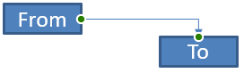

## **Přehled**

Konektor je čára, která může zůstat připojena ke dvěma tvarem, i když se některý z nich pohybuje. Jeho konce se připojují k místům připojení, která jsou v PowerPointu zobrazena zelenými tečkami. Některé ohnuté a zakřivené konektory rovněž nabízejí body úpravy, zobrazené oranžovými tečkami, které řídí polohu jednotlivých segmentů konektoru.

Aspose.Slides reprezentuje konektory pomocí rozhraní [IConnector](https://reference.aspose.com/slides/cs/java/com.aspose.slides/iconnector/). Můžete je vytvářet, připojovat jejich konce k tvarům, vybírat místa připojení, přepočítávat je a měnit geometrii konektorů, které mají body úpravy.

## **Typy konektorů**

Třída [ShapeType](https://reference.aspose.com/slides/cs/java/com.aspose.slides/shapetype/) obsahuje předvolby pro rovné, ohnuté a zakřivené konektory. Následující tabulka ukazuje dostupné geometrie konektorů a počet bodů úpravy definovaných v každé předvolbě.

| Konektor | Image | Počet bodů úpravy |
|---|---|---|
| `ShapeType.Line` |  | 0 |
| `ShapeType.StraightConnector1` |  | 0 |
| `ShapeType.BentConnector2` |  | 0 |
| `ShapeType.BentConnector3` |  | 1 |
| `ShapeType.BentConnector4` |  | 2 |
| `ShapeType.BentConnector5` |  | 3 |
| `ShapeType.CurvedConnector2` |  | 0 |
| `ShapeType.CurvedConnector3` |  | 1 |
| `ShapeType.CurvedConnector4` |  | 2 |
| `ShapeType.CurvedConnector5` |  | 3 |

Počet a význam bodů úpravy jsou součástí vybrané předvolby konektoru. Nepředpokládejte, že dva různé typy konektorů budou mít stejnou strukturu kolekce.

## **Propojit dva tvary**

K přidání konektoru použijte [IShapeCollection.addConnector](https://reference.aspose.com/slides/cs/java/com.aspose.slides/ishapecollection/#addConnector-int-float-float-float-float-), a ke spojení jeho konců použijte [IConnector.setStartShapeConnectedTo](https://reference.aspose.com/slides/cs/java/com.aspose.slides/iconnector/#setStartShapeConnectedTo-com.aspose.slides.IShape-) a [IConnector.setEndShapeConnectedTo](https://reference.aspose.com/slides/cs/java/com.aspose.slides/iconnector/#setEndShapeConnectedTo-com.aspose.slides.IShape-). Po připojení obou konců [IConnector.reroute](https://reference.aspose.com/slides/cs/java/com.aspose.slides/iconnector/#reroute--) vybere nejkratší cestu mezi tvary.

Následující příklad propojuje elipsu a obdélník pomocí ohnutého konektoru:

```java
import com.aspose.slides.*;

Presentation presentation = new Presentation();
try {
    ISlide slide = presentation.getSlides().get_Item(0);

    IAutoShape ellipse = slide.getShapes().addAutoShape(ShapeType.Ellipse, 40, 80, 120, 80);
    IAutoShape rectangle = slide.getShapes().addAutoShape(ShapeType.Rectangle, 320, 240, 140, 80);
    IConnector connector = slide.getShapes().addConnector(ShapeType.BentConnector2, 0, 0, 10, 10);

    connector.setStartShapeConnectedTo(ellipse);
    connector.setEndShapeConnectedTo(rectangle);
    connector.reroute();

    presentation.save("connected-shapes.pptx", SaveFormat.Pptx);
} finally {
    presentation.dispose();
}
```

{}
Volání `reroute` může změnit hodnoty [setStartShapeConnectionSiteIndex](https://reference.aspose.com/slides/cs/java/com.aspose.slides/iconnector/#setStartShapeConnectionSiteIndex-long-) a [setEndShapeConnectionSiteIndex](https://reference.aspose.com/slides/cs/java/com.aspose.slides/iconnector/#setEndShapeConnectionSiteIndex-long-). Po přepočítání přiřaďte konkrétní místa připojení, pokud mají zůstat pevná.
{}

## **Vybrat připojovací místo**

Každý tvarem, ke kterému lze připojit, udává počet míst pomocí [IShape.getConnectionSiteCount](https://reference.aspose.com/slides/cs/java/com.aspose.slides/ishape/#getConnectionSiteCount--). Ověřte preferovaný nulový index místa před jeho přiřazením ke konci konektoru; počet míst se liší podle geometrie tvaru.

Tento příklad připojuje konektor k určitému místu na elipse, pokud takové místo existuje:

```java
import com.aspose.slides.*;

Presentation presentation = new Presentation();
try {
    ISlide slide = presentation.getSlides().get_Item(0);

    IAutoShape ellipse = slide.getShapes().addAutoShape(ShapeType.Ellipse, 40, 80, 120, 80);
    IAutoShape rectangle = slide.getShapes().addAutoShape(ShapeType.Rectangle, 320, 240, 140, 80);
    IConnector connector = slide.getShapes().addConnector(ShapeType.BentConnector3, 0, 0, 10, 10);

    connector.setStartShapeConnectedTo(ellipse);
    connector.setEndShapeConnectedTo(rectangle);

    long preferredSiteIndex = 2;
    if (preferredSiteIndex < ellipse.getConnectionSiteCount()) {
        connector.setStartShapeConnectionSiteIndex(preferredSiteIndex);
    } else {
        System.out.println("The ellipse has only " + ellipse.getConnectionSiteCount() + " connection sites.");
    }

    presentation.save("specific-connection-site.pptx", SaveFormat.Pptx);
} finally {
    presentation.dispose();
}
```

## **Upravit bod konektoru**

Konektory s body úpravy je zpřístupňují přes [IGeometryShape.getAdjustments](https://reference.aspose.com/slides/cs/java/com.aspose.slides/igeometryshape/#getAdjustments--). Prohlédněte si každý [IAdjustValue](https://reference.aspose.com/slides/cs/java/com.aspose.slides/iadjustvalue/) a před změnou zkontrolujte jeho hodnotu [getType](https://reference.aspose.com/slides/cs/java/com.aspose.slides/iadjustvalue/#getType--). Hodnotu měňte pomocí [setRawValue](https://reference.aspose.com/slides/cs/java/com.aspose.slides/iadjustvalue/#setRawValue-long-). Obecná pravidla pro identifikaci úprav předvoleb tvarů jsou popsaná v [Shape Manipulation](/slides/cs/java/shape-manipulations/).

Počet, pořadí, význam a platný rozsah hodnot úpravy závisejí na předvolbě konektoru. Typ úpravy je pouze pro čtení, zatímco hodnota je zapisovatelná. Metoda pouze pro čtení [getName](https://reference.aspose.com/slides/cs/java/com.aspose.slides/iadjustvalue/#getName--) poskytuje další identifikaci, když konektor obsahuje více úprav stejného sémantického typu.

### **Obejít překážku**

V následujícím uspořádání prochází konektor `BentConnector5` mezi dvěma tvary třetím tvarem:


Tento kód vytváří omezený konektor:

```java
import com.aspose.slides.*;
import java.awt.Color;

Presentation presentation = new Presentation();
try {
    ISlide slide = presentation.getSlides().get_Item(0);

    slide.getShapes().addAutoShape(ShapeType.Rectangle, 300, 150, 150, 75);
    IAutoShape sourceShape = slide.getShapes().addAutoShape(ShapeType.Rectangle, 500, 400, 100, 50);
    IAutoShape targetShape = slide.getShapes().addAutoShape(ShapeType.Rectangle, 100, 100, 70, 30);
    IConnector connector = slide.getShapes().addConnector(ShapeType.BentConnector5, 20, 20, 400, 300);

    connector.getLineFormat().setEndArrowheadStyle(LineArrowheadStyle.Triangle);
    connector.getLineFormat().getFillFormat().setFillType(FillType.Solid);
    connector.getLineFormat().getFillFormat().getSolidFillColor().setColor(Color.BLACK);
    connector.setStartShapeConnectedTo(sourceShape);
    connector.setEndShapeConnectedTo(targetShape);
    connector.setStartShapeConnectionSiteIndex(2);

    presentation.save("connector-obstruction.pptx", SaveFormat.Pptx);
} finally {
    presentation.dispose();
}
```

Posunutí svislé odchylky změní cestu tak, že konektor obchází překážku:


Místo předpokladu, že index v kolekci `1` vždy představuje svislou odchylku, tento příklad hledá `ConnectorBendPositionY` a mění ji jen tehdy, když je přítomen očekávaný sémantický typ:

```java
import com.aspose.slides.*;
import java.awt.Color;

Presentation presentation = new Presentation();
try {
    ISlide slide = presentation.getSlides().get_Item(0);

    slide.getShapes().addAutoShape(ShapeType.Rectangle, 300, 150, 150, 75);
    IAutoShape sourceShape = slide.getShapes().addAutoShape(ShapeType.Rectangle, 500, 400, 100, 50);
    IAutoShape targetShape = slide.getShapes().addAutoShape(ShapeType.Rectangle, 100, 100, 70, 30);
    IConnector connector = slide.getShapes().addConnector(ShapeType.BentConnector5, 20, 20, 400, 300);

    connector.getLineFormat().setEndArrowheadStyle(LineArrowheadStyle.Triangle);
    connector.getLineFormat().getFillFormat().setFillType(FillType.Solid);
    connector.getLineFormat().getFillFormat().getSolidFillColor().setColor(Color.BLACK);
    connector.setStartShapeConnectedTo(sourceShape);
    connector.setEndShapeConnectedTo(targetShape);
    connector.setStartShapeConnectionSiteIndex(2);

    IAdjustValue verticalBend = null;
    for (int adjustmentIndex = 0; adjustmentIndex < connector.getAdjustments().size(); adjustmentIndex++) {
        IAdjustValue adjustment = connector.getAdjustments().get_Item(adjustmentIndex);
        System.out.println(adjustment.getName() + ": " + adjustment.getType() + ", raw value = " + adjustment.getRawValue());
        if (adjustment.getType() == ShapeAdjustmentType.ConnectorBendPositionY) {
            verticalBend = adjustment;
            break;
        }
    }

    if (verticalBend == null) {
        System.out.println("The connector does not expose a vertical bend adjustment.");
    } else {
        verticalBend.setRawValue(60000);
        presentation.save("connector-obstruction-fixed.pptx", SaveFormat.Pptx);
    }
} finally {
    presentation.dispose();
}
```

`BentConnector5` má dva nastavení `ConnectorBendPositionX` a jedno nastavení `ConnectorBendPositionY`. Pokud se požadovaný typ vyskytuje vícekrát, před výběrem zkontrolujte `getName` a známou geometrii předvolby. Pokud úprava vrací `ShapeAdjustmentType.Custom`, považujte její význam a rozsah za specifické pro předvolbu a neměňte ji, dokud není tato smlouva známa.

## **Přiřadit hodnoty úprav ke geometrii konektoru**

U ohnutých konektorů lze hodnoty úpravy použít k odhadu polohy jednotlivých segmentů. Tyto výpočty jsou specifické pro předvolbu konektoru:

- `BentConnector4` běžně zpřístupňuje jedno nastavení `ConnectorBendPositionX` a jedno nastavení `ConnectorBendPositionY`.
- Pro tyto pozice odchylky se hodnota vrácená metodou `getRawValue` dělí `100000f`, čímž vznikne podíl šířky nebo výšky rámce konektoru použité ve výše uvedených příkladech.
- Rámec konektoru může být otočen nebo převrácen, takže souřadnice rámce je třeba transformovat před porovnáním se souřadnicemi snímku.

Následující příklady nejprve používají `getType` k identifikaci úprav. Nezabývají se indexy kolekce jako přenositelnými identifikátory.

### **Neotočený konektor**

Počáteční uspořádání obsahuje dva textové tvary propojené `BentConnector4`:


Tento příklad prozkoumá konektor a získá jeho horizontální a vertikální odchylky:

```java
import com.aspose.slides.*;
import java.awt.Color;

Presentation presentation = new Presentation();
try {
    ISlide slide = presentation.getSlides().get_Item(0);

    IAutoShape sourceShape = slide.getShapes().addAutoShape(ShapeType.Rectangle, 100, 100, 60, 25);
    sourceShape.getTextFrame().setText("From");
    IAutoShape targetShape = slide.getShapes().addAutoShape(ShapeType.Rectangle, 500, 100, 60, 25);
    targetShape.getTextFrame().setText("To");
    IConnector connector = slide.getShapes().addConnector(ShapeType.BentConnector4, 20, 20, 400, 300);

    connector.getLineFormat().setEndArrowheadStyle(LineArrowheadStyle.Triangle);
    connector.getLineFormat().getFillFormat().setFillType(FillType.Solid);
    connector.getLineFormat().getFillFormat().getSolidFillColor().setColor(Color.RED);
    connector.getLineFormat().setWidth(3);
    connector.setStartShapeConnectedTo(sourceShape);
    connector.setStartShapeConnectionSiteIndex(3);
    connector.setEndShapeConnectedTo(targetShape);
    connector.setEndShapeConnectionSiteIndex(2);

    for (int adjustmentIndex = 0; adjustmentIndex < connector.getAdjustments().size(); adjustmentIndex++) {
        IAdjustValue adjustment = connector.getAdjustments().get_Item(adjustmentIndex);
        System.out.println(adjustment.getName() + ": " + adjustment.getType() + ", raw value = " + adjustment.getRawValue());
    }
} finally {
    presentation.dispose();
}
```

Pro změnu obou odchylek najděte každý očekávaný typ a upravte hodnoty až po nalezení obou:

```java
import com.aspose.slides.*;

Presentation presentation = new Presentation();
try {
    ISlide slide = presentation.getSlides().get_Item(0);

    IAutoShape sourceShape = slide.getShapes().addAutoShape(ShapeType.Rectangle, 100, 100, 60, 25);
    IAutoShape targetShape = slide.getShapes().addAutoShape(ShapeType.Rectangle, 500, 100, 60, 25);
    IConnector connector = slide.getShapes().addConnector(ShapeType.BentConnector4, 20, 20, 400, 300);
    connector.setStartShapeConnectedTo(sourceShape);
    connector.setStartShapeConnectionSiteIndex(3);
    connector.setEndShapeConnectedTo(targetShape);
    connector.setEndShapeConnectionSiteIndex(2);

    IAdjustValue horizontalBend = null;
    IAdjustValue verticalBend = null;
    for (int adjustmentIndex = 0; adjustmentIndex < connector.getAdjustments().size(); adjustmentIndex++) {
        IAdjustValue adjustment = connector.getAdjustments().get_Item(adjustmentIndex);
        if (adjustment.getType() == ShapeAdjustmentType.ConnectorBendPositionX) {
            horizontalBend = adjustment;
        } else if (adjustment.getType() == ShapeAdjustmentType.ConnectorBendPositionY) {
            verticalBend = adjustment;
        }
    }

    if (horizontalBend == null || verticalBend == null) {
        System.out.println("The connector does not expose the expected bend adjustments.");
    } else {
        horizontalBend.setRawValue(horizontalBend.getRawValue() + 20000);
        verticalBend.setRawValue(verticalBend.getRawValue() + 200000);
        presentation.save("connector-adjusted.pptx", SaveFormat.Pptx);
    }
} finally {
    presentation.dispose();
}
```

Výsledek je konektor, jehož horizontální a vertikální segmenty se posunuly:


Jakmile jsou sémantické typy známy, lze jejich hodnoty převést na souřadnice rámce konektoru. Tento příklad vykreslí tenký obdélník přes svislý segment řízený oběma odchylkami:

```java
import com.aspose.slides.*;

Presentation presentation = new Presentation();
try {
    ISlide slide = presentation.getSlides().get_Item(0);

    IAutoShape sourceShape = slide.getShapes().addAutoShape(ShapeType.Rectangle, 100, 100, 60, 25);
    IAutoShape targetShape = slide.getShapes().addAutoShape(ShapeType.Rectangle, 500, 100, 60, 25);
    IConnector connector = slide.getShapes().addConnector(ShapeType.BentConnector4, 20, 20, 400, 300);
    connector.setStartShapeConnectedTo(sourceShape);
    connector.setStartShapeConnectionSiteIndex(3);
    connector.setEndShapeConnectedTo(targetShape);
    connector.setEndShapeConnectionSiteIndex(2);

    IAdjustValue horizontalBend = null;
    IAdjustValue verticalBend = null;
    for (int adjustmentIndex = 0; adjustmentIndex < connector.getAdjustments().size(); adjustmentIndex++) {
        IAdjustValue adjustment = connector.getAdjustments().get_Item(adjustmentIndex);
        if (adjustment.getType() == ShapeAdjustmentType.ConnectorBendPositionX) {
            horizontalBend = adjustment;
        } else if (adjustment.getType() == ShapeAdjustmentType.ConnectorBendPositionY) {
            verticalBend = adjustment;
        }
    }

    if (horizontalBend == null || verticalBend == null) {
        System.out.println("The connector does not expose the expected bend adjustments.");
    } else {
        float x = connector.getX() + connector.getWidth() * horizontalBend.getRawValue() / 100000f;
        float y = connector.getY();
        float height = connector.getHeight() * verticalBend.getRawValue() / 100000f;
        slide.getShapes().addAutoShape(ShapeType.Rectangle, x, y, 1, height);
        presentation.save("connector-segment-guide.pptx", SaveFormat.Pptx);
    }
} finally {
    presentation.dispose();
}
```

Vodící tvar označuje vypočtený segment:


### **Otočený nebo převrácený konektor**

Když je stejná geografie konektoru orientována svisle, ovlivňují převod souřadnic rámce konektoru na souřadnice snímku hodnoty [IShape.getFrame](https://reference.aspose.com/slides/cs/java/com.aspose.slides/ishape/#getFrame--), [ShapeFrame.getFlipH](https://reference.aspose.com/slides/cs/java/com.aspose.slides/shapeframe/#getFlipH--) a [ShapeFrame.getFlipV](https://reference.aspose.com/slides/cs/java/com.aspose.slides/shapeframe/#getFlipV--).

Tento příklad vytváří a upravuje svisle orientovaný konektor:

```java
import com.aspose.slides.*;
import java.awt.Color;

Presentation presentation = new Presentation();
try {
    ISlide slide = presentation.getSlides().get_Item(0);

    IAutoShape sourceShape = slide.getShapes().addAutoShape(ShapeType.Rectangle, 100, 100, 60, 25);
    sourceShape.getTextFrame().setText("From");
    IAutoShape targetShape = slide.getShapes().addAutoShape(ShapeType.Rectangle, 100, 400, 60, 25);
    targetShape.getTextFrame().setText("To 1");
    IConnector connector = slide.getShapes().addConnector(ShapeType.BentConnector4, 20, 20, 400, 300);

    connector.getLineFormat().setEndArrowheadStyle(LineArrowheadStyle.Triangle);
    connector.getLineFormat().getFillFormat().setFillType(FillType.Solid);
    connector.getLineFormat().getFillFormat().getSolidFillColor().setColor(new Color(102, 205, 170));
    connector.getLineFormat().setWidth(3);
    connector.setStartShapeConnectedTo(sourceShape);
    connector.setStartShapeConnectionSiteIndex(2);
    connector.setEndShapeConnectedTo(targetShape);
    connector.setEndShapeConnectionSiteIndex(3);

    for (int adjustmentIndex = 0; adjustmentIndex < connector.getAdjustments().size(); adjustmentIndex++) {
        IAdjustValue adjustment = connector.getAdjustments().get_Item(adjustmentIndex);
        if (adjustment.getType() == ShapeAdjustmentType.ConnectorBendPositionX) {
            adjustment.setRawValue(adjustment.getRawValue() + 20000);
        } else if (adjustment.getType() == ShapeAdjustmentType.ConnectorBendPositionY) {
            adjustment.setRawValue(adjustment.getRawValue() + 200000);
        }
    }

    presentation.save("vertical-connector-adjusted.pptx", SaveFormat.Pptx);
} finally {
    presentation.dispose();
}
```

Upravený konektor se zobrazí svisle mezi tvary:


Pro libovolný úhel otočení `alpha` rotujte bod rámce konektoru `(x, y)` kolem středu rámce `(x0, y0)`:

`X = (x - x0) * cos(alpha) - (y - y0) * sin(alpha) + x0`

`Y = (x - x0) * sin(alpha) + (y - y0) * cos(alpha) + y0`

Následující kód řeší 90stupňovou orientaci použitou v tomto příkladu a vykreslí červenou vodítku přes odpovídající segment konektoru:

```java
import com.aspose.slides.*;
import java.awt.Color;

Presentation presentation = new Presentation();
try {
    ISlide slide = presentation.getSlides().get_Item(0);

    IAutoShape sourceShape = slide.getShapes().addAutoShape(ShapeType.Rectangle, 100, 100, 60, 25);
    IAutoShape targetShape = slide.getShapes().addAutoShape(ShapeType.Rectangle, 100, 400, 60, 25);
    IConnector connector = slide.getShapes().addConnector(ShapeType.BentConnector4, 20, 20, 400, 300);
    connector.setStartShapeConnectedTo(sourceShape);
    connector.setStartShapeConnectionSiteIndex(2);
    connector.setEndShapeConnectedTo(targetShape);
    connector.setEndShapeConnectionSiteIndex(3);

    IAdjustValue horizontalBend = null;
    IAdjustValue verticalBend = null;
    for (int adjustmentIndex = 0; adjustmentIndex < connector.getAdjustments().size(); adjustmentIndex++) {
        IAdjustValue adjustment = connector.getAdjustments().get_Item(adjustmentIndex);
        if (adjustment.getType() == ShapeAdjustmentType.ConnectorBendPositionX) {
            horizontalBend = adjustment;
        } else if (adjustment.getType() == ShapeAdjustmentType.ConnectorBendPositionY) {
            verticalBend = adjustment;
        }
    }

    if (horizontalBend == null || verticalBend == null) {
        System.out.println("The connector does not expose the expected bend adjustments.");
    } else {
        horizontalBend.setRawValue(horizontalBend.getRawValue() + 20000);
        verticalBend.setRawValue(verticalBend.getRawValue() + 200000);

        float x = connector.getX();
        float y = connector.getY();
        if (connector.getFrame().getFlipH() == NullableBool.True) {
            x += connector.getWidth();
        }
        if (connector.getFrame().getFlipV() == NullableBool.True) {
            y += connector.getHeight();
        }

        x += connector.getWidth() * horizontalBend.getRawValue() / 100000f;
        float rotatedX = connector.getFrame().getCenterX() - y + connector.getFrame().getCenterY();
        float rotatedY = x - connector.getFrame().getCenterX() + connector.getFrame().getCenterY();
        float segmentWidth = connector.getHeight() * verticalBend.getRawValue() / 100000f;
        IAutoShape guide = slide.getShapes().addAutoShape(ShapeType.Rectangle, rotatedX, rotatedY, segmentWidth, 1);
        guide.getLineFormat().getFillFormat().setFillType(FillType.Solid);
        guide.getLineFormat().getFillFormat().getSolidFillColor().setColor(Color.RED);

        presentation.save("rotated-connector-segment-guide.pptx", SaveFormat.Pptx);
    }
} finally {
    presentation.dispose();
}
```

Červená vodítka označuje vypočtený segment po transformaci souřadnic:


Tyto vzorce popisují předvolby použité v příkladech, nikoli univerzální model konektoru. Před použitím stejného výpočtu na jinou předvolbu ověřte typy úprav, orientaci rámce i rozsahy hodnot.

## **Najít úhel směru konektoru**

Směr rovného konektoru lze vypočítat z jeho šířky a výšky, s aplikovanými horizontálními a vertikálními převraty. Následující příklad uvádí úhel ve směru hodinových ručiček od kladné horizontální osy ve souřadnicích snímku:

```java
import com.aspose.slides.*;

Presentation presentation = new Presentation();
try {
    ISlide slide = presentation.getSlides().get_Item(0);
    IConnector connector = slide.getShapes().addConnector(ShapeType.StraightConnector1, 100, 100, 200, 100);

    boolean flipH = connector.getFrame().getFlipH() == NullableBool.True;
    boolean flipV = connector.getFrame().getFlipV() == NullableBool.True;
    float deltaX = connector.getWidth() * (flipH ? -1 : 1);
    float deltaY = connector.getHeight() * (flipV ? -1 : 1);
    double angle = Math.atan2(deltaY, deltaX) * 180.0 / Math.PI;

    if (angle < 0) {
        angle += 360;
    }

    System.out.printf("Connector direction: %.2f degrees%n", angle);
} finally {
    presentation.dispose();
}
```

## **Často kladené otázky**

**Jak mohu zjistit, zda se konektor může připojit k tvaru?**

Zkontrolujte hodnotu [getConnectionSiteCount](https://reference.aspose.com/slides/cs/java/com.aspose.slides/ishape/#getConnectionSiteCount--) tvaru. Kladný počet znamená, že tvar vystavuje místa připojení. Ověřte vybraný index místa před jeho přiřazením ke kterémukoli konci konektoru.

**Mohu identifikovat úpravu konektoru podle jeho indexu v kolekci?**

Index má smysl jen pro známou předvolbu konektoru a rozložení kolekce. Před úpravou hodnoty zkontrolujte [IAdjustValue.getType](https://reference.aspose.com/slides/cs/java/com.aspose.slides/iadjustvalue/#getType--), a použijte [IAdjustValue.getName](https://reference.aspose.com/slides/cs/java/com.aspose.slides/iadjustvalue/#getName--) jako doplňující informaci, když se stejný sémantický typ vyskytuje vícekrát.

**Co se stane, když je připojený tvar smazán?**

Příslušný konektorový konec se odpojí. Konektor zůstane na snímku a lze jej smazat, umístit jako volnou čáru, nebo připojit k jinému tvaru.

**Zůstávají vazby konektoru zachovány při kopírování snímku?**

Vazby jsou obecně zachovány, když jsou kopírovány připojené tvary spolu se snímkem. Pokud je konektor zkopírován bez jednoho ze svých cílových tvarů, je třeba postižený konec znovu připojit.