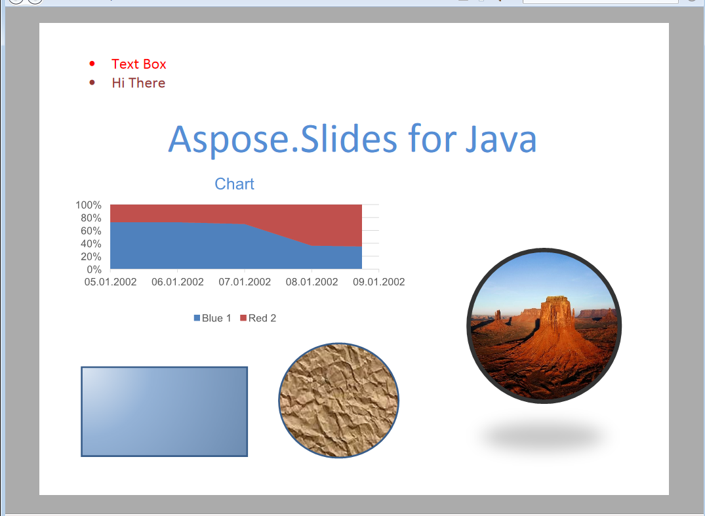

{} 

Specifikace [XML Parser Specification](https://en.wikipedia.org/wiki/Open_XML_Paper_Specification) je jazyk pro popis stránek a formát pevného dokumentu původně vyvinutý společností Microsoft. Stejně jako PDF, XPS je navržen tak, aby zachoval přesnost dokumentu a poskytoval nezávislý vzhled dokumentu na zařízení. 

{} 

## **XPS v Aspose.Slides for Java**
Jakýkoli prezentační dokument, který lze načíst v Aspose.Slides for Java, lze převést do formátu XPS. Aspose.Slides for Java používá vysoce přesný engine pro rozvržení a vykreslování stránek k vytvoření výstupu ve formátu XPS s pevným rozložením. 
O tom, jak exportovat prezentační dokumenty do XPS, se můžete dozvědět v Aspose.Slides for Java v článku [Převod do XPS](https://docs.aspose.com/slides/cs/java/convert-powerpoint-to-xps/).

**Vstupní prezentace** 

**Prezentace převedená do XPS** 

