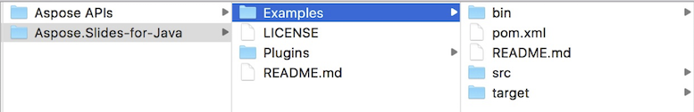
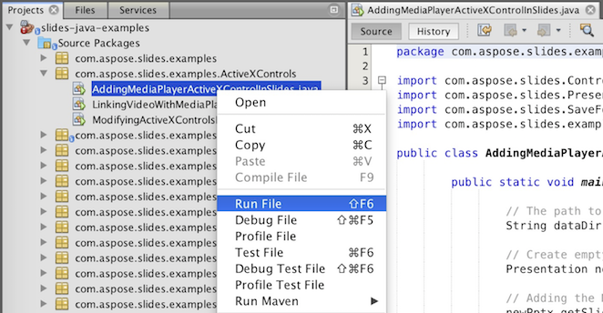

## **Stáhnout Aspose.Slides z GitHubu**
Všechny ukázky Aspose.Slides pro Javu jsou uloženy na [GitHub](https://github.com/aspose-slides/Aspose.Slides-for-Java). Můžete buď naklonovat repozitář pomocí vašeho oblíbeného GitHub klienta, nebo stáhnout ZIP soubor [zde](https://codeload.github.com/aspose-slides/Aspose.Slides-for-Java/zip/master).

Rozbalte obsah ZIP souboru do libovolné složky ve vašem počítači. Všechny ukázky jsou umístěny ve složce **Examples**.



## **Importujte ukázky do IDE**
Projekt používá systém sestavení Maven. Jakékoli moderní IDE může projekt a jeho závislosti snadno otevřít nebo importovat. Níže ukazujeme, jak použít oblíbená IDE k sestavení a spuštění ukázek.

### **IntelliJ IDEA**
Klikněte na nabídku **File** a vyberte **Open**. Procházejte do složky projektu a vyberte soubor **pom.xml**.


Projekt se otevře a automaticky stáhne závislosti. V kartě Project procházejte ukázky ve složce **src/main/java**. Pro spuštění ukázky stačí pravým tlačítkem kliknout na soubor a zvolit „Run ..“, ukázka se spustí a výstup se zobrazí v integrovaném okně konzole.


### **Eclipse**
Klikněte na nabídku **File** a vyberte **Import**. Zvolte **Maven** – Existing Maven Projects.


Procházejte do složky, kterou jste naklonovali nebo stáhli z GitHubu, a vyberte soubor **pom.xml**. Projekt se otevře a automaticky stáhne závislosti. V kartě Package Explorer procházejte ukázky ve složce **src/main/java**. Pro spuštění ukázky stačí pravým tlačítkem kliknout na soubor a zvolit **Run As** – **Java Application**, ukázka se spustí a výstup se zobrazí v integrovaném okně konzole.


### **NetBeans**
Klikněte na nabídku **File** a vyberte **Open Project**. Procházejte do složky, kterou jste naklonovali nebo stáhli z GitHubu. Ikona složky **Examples** ukáže, že se jedná o Maven projekt. Vyberte **Examples** a otevřete jej.


Projekt se otevře a automaticky stáhne závislosti. V kartě Projects procházejte ukázky ve **source packages**. Pro spuštění ukázky stačí pravým tlačítkem kliknout na soubor a zvolit **Run File**, ukázka se spustí a výstup se zobrazí v integrovaném okně konzole.



## **Přidejte knihovnu Aspose.Slides do lokálního Maven repozitáře**
Když importujete projekt **Aspose.Slides Examples** do IDE, Maven automaticky stáhne JAR soubor aspose.slides z [Aspose Maven Repository](https://releases.aspose.com/java/repo/com/aspose/). Pokud nemáte přístup k internetu, můžete JAR přidat ručně do svého lokálního repozitáře.

### **mvn install**
Stáhněte [aspose.slides](https://releases.aspose.com/java/repo/com/aspose/aspose-slides/), rozbalte jej a zkopírujte soubor aspose.slides‑version.jar kamkoli, například na disk C. Proveďte následující příkaz:

```
mvn install:install-file
    - Dfile=c:\aspose.slides-version.jar
    - DgroupId=com.aspose
    - DartifactId=aspose-slides
    - Dversion={version}
    - Dpackaging=jar
```

Nyní je **aspose.slides** JAR zkopírován do vašeho lokálního Maven repozitáře.

### **pom.xml**
Po instalaci stačí v **pom.xml** deklarovat koordináty **aspose.slides**. Přidejte následující úložiště do sekce repositories a závislost do sekce dependencies.

``` xml
<repository>
    <id>AsposeJavaAPI</id>
    <name>Aspose Java API</name>
    <url>https://releases.aspose.com/java/repo/</url>
</repository>

<dependency>
    <groupId>com.aspose</groupId>
    <artifactId>aspose-slides</artifactId>
    <version>26.10</version>
    <classifier>jdk8</classifier>
</dependency>
```

### **Hotovo**
Sestavte projekt, nyní může být **aspose.slides** JAR načten z vašeho lokálního Maven repozitáře.

## **Přispívejte**
Pokud chcete přidat nebo vylepšit ukázku, povzbuzujeme vás k přispění do projektu. Všechny ukázky a demonstrační projekty v tomto repozitáři jsou open source a mohou být volně použity ve vašich vlastních aplikacích.

Pro přispění můžete forknout repozitář, upravit zdrojový kód a odeslat Pull Request. Změny přezkoumáme a zahrneme je do repozitáře, pokud budou užitečné.