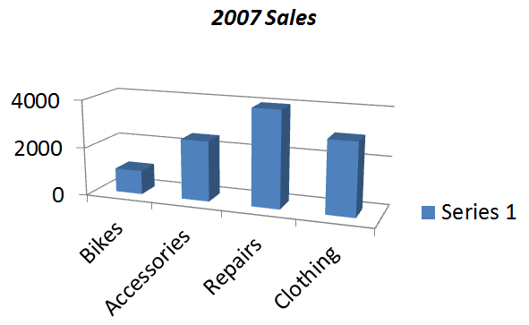

## **Přehled**

Tento článek ukazuje, jak programově v C# vytvářet a přizpůsobovat grafy v prezentacích Microsoft PowerPoint. S Aspose.Slides pro .NET můžete automatizovat generování profesionálních, datově řízených grafů, aniž byste se spolehli na Microsoft Office nebo knihovny Interop. API poskytuje bohatou sadu funkcí pro tvorbu sloupcových grafů, koláčových grafů, spojnicových grafů a dalších – se špičnou kontrolou nad vzhledem, daty i rozvržením. Ať už generujete zprávy, řídicí panely nebo obchodní prezentace, Aspose.Slides vám pomáhá dodávat vizualizace vysoké kvality přímo z vašich .NET aplikací.

## **Příklad VSTO**

V této sekci se ukazuje, jak vytvořit graf v prezentaci Microsoft PowerPoint pomocí **VSTO (Visual Studio Tools for Office)**. S VSTO můžete programově generovat a přizpůsobovat grafy kombinací automatizace PowerPointu a Excelu. Poskytnutý příklad ukazuje, jak přidat **3D shlukový sloupcový graf**, naplnit jej daty z listu Excelu, upravit formátování a rozvržení a uložit finální prezentaci – vše z .NET aplikace.

1. Vytvořte instanci prezentace Microsoft PowerPoint.  
2. Přidejte prázdnou snímku do prezentace.  
3. Přidejte 3D shlukový sloupcový graf a získejte k němu přístup.  
4. Vytvořte novou instanci sešitu Microsoft Excel a načtěte data grafu.  
5. Pomocí instance sešitu Excel získáte přístup k listu s daty grafu.  
6. Nastavte oblast grafu v listu a odstraňte řady 2 a 3 z grafu.  
7. Upravte data kategorií grafu v listu s daty grafu.  
8. Upravte data řady 1 v listu s daty grafu.  
9. Získejte přístup k názvu grafu a nastavte jeho vlastnosti písma.  
10. Získejte přístup k osy hodnot grafu a nastavte hlavní jednotku, vedlejší jednotku, maximální a minimální hodnotu.  
11. Získejte přístup k osy hloubky (řady) grafu a odstraňte ji – v tomto příkladu je použita pouze jedna řada.  
12. Nastavte úhly otáčení grafu ve směrech X a Y.  
13. Uložte prezentaci.  
14. Uzavřete instance Microsoft Excel a PowerPoint.  

```c#
EnsurePowerPointIsRunning(true, true);

// Instantiate a slide object.
Microsoft.Office.Interop.PowerPoint.Slide objSlide = null;

// Access the first presentation slide.
objSlide = objPres.Slides[1];

// Select the first slide and set its layout.
objSlide.Select();
objSlide.Layout = Microsoft.Office.Interop.PowerPoint.PpSlideLayout.ppLayoutBlank;

// Add a default chart to the slide.
objSlide.Shapes.AddChart(Microsoft.Office.Core.XlChartType.xl3DColumn, 20, 30, 400, 300);

// Access the added chart.
Microsoft.Office.Interop.PowerPoint.Chart ppChart = objSlide.Shapes[1].Chart;

// Access the chart data.
Microsoft.Office.Interop.PowerPoint.ChartData chartData = ppChart.ChartData;

// Create an instance of the Excel workbook to work with the chart data.
Microsoft.Office.Interop.Excel.Workbook dataWorkbook = (Microsoft.Office.Interop.Excel.Workbook)chartData.Workbook;

// Access the data worksheet for the chart.
Microsoft.Office.Interop.Excel.Worksheet dataSheet = dataWorkbook.Worksheets[1];

// Set the data range for the chart.
Microsoft.Office.Interop.Excel.Range tRange = dataSheet.Cells.get_Range("A1", "B5");

// Apply the specified range to the chart data table.
Microsoft.Office.Interop.Excel.ListObject tbl1 = dataSheet.ListObjects["Table1"];
tbl1.Resize(tRange);

// Set values for categories and respective series data.
((Microsoft.Office.Interop.Excel.Range)(dataSheet.Cells.get_Range("A2"))).FormulaR1C1 = "Bikes";
((Microsoft.Office.Interop.Excel.Range)(dataSheet.Cells.get_Range("A3"))).FormulaR1C1 = "Accessories";
((Microsoft.Office.Interop.Excel.Range)(dataSheet.Cells.get_Range("A4"))).FormulaR1C1 = "Repairs";
((Microsoft.Office.Interop.Excel.Range)(dataSheet.Cells.get_Range("A5"))).FormulaR1C1 = "Clothing";
((Microsoft.Office.Interop.Excel.Range)(dataSheet.Cells.get_Range("B2"))).FormulaR1C1 = "1000";
((Microsoft.Office.Interop.Excel.Range)(dataSheet.Cells.get_Range("B3"))).FormulaR1C1 = "2500";
((Microsoft.Office.Interop.Excel.Range)(dataSheet.Cells.get_Range("B4"))).FormulaR1C1 = "4000";
((Microsoft.Office.Interop.Excel.Range)(dataSheet.Cells.get_Range("B5"))).FormulaR1C1 = "3000";

// Set the chart title.
ppChart.ChartTitle.Font.Italic = true;
ppChart.ChartTitle.Text = "2007 Sales";
ppChart.ChartTitle.Font.Size = 18;
ppChart.ChartTitle.Font.Color = Color.Black.ToArgb();
ppChart.ChartTitle.Format.Line.Visible = Microsoft.Office.Core.MsoTriState.msoTrue;
ppChart.ChartTitle.Format.Line.ForeColor.RGB = Color.Black.ToArgb();

// Access the chart value axis.
Microsoft.Office.Interop.PowerPoint.Axis valaxis = ppChart.Axes(Microsoft.Office.Interop.PowerPoint.XlAxisType.xlValue, Microsoft.Office.Interop.PowerPoint.XlAxisGroup.xlPrimary);

// Set the values for the axis units.
valaxis.MajorUnit = 2000.0F;
valaxis.MinorUnit = 1000.0F;
valaxis.MinimumScale = 0.0F;
valaxis.MaximumScale = 4000.0F;

// Access the chart depth axis.
Microsoft.Office.Interop.PowerPoint.Axis Depthaxis = ppChart.Axes(Microsoft.Office.Interop.PowerPoint.XlAxisType.xlSeriesAxis, Microsoft.Office.Interop.PowerPoint.XlAxisGroup.xlPrimary);
Depthaxis.Delete();

// Set the chart rotation.
ppChart.Rotation = 20;   // Y-hodnota
ppChart.Elevation = 15;  // X-hodnota
ppChart.RightAngleAxes = false;

// Save the presentation as a PPTX file.
objPres.SaveAs("VSTO_Sample_Chart.pptx", Microsoft.Office.Interop.PowerPoint.PpSaveAsFileType.ppSaveAsDefault, MsoTriState.msoTrue);

// Close the workbook and presentation.
dataWorkbook.Application.Quit();
objPres.Application.Quit();
```

```c#
public static void EnsurePowerPointIsRunning(bool blnAddPresentation)
{
    EnsurePowerPointIsRunning(blnAddPresentation, false);
}

public static void EnsurePowerPointIsRunning()
{
    EnsurePowerPointIsRunning(false, false);
}

public static void EnsurePowerPointIsRunning(bool blnAddPresentation, bool blnAddSlide)
{
    string strName = null;

    // Zkuste přistoupit k vlastnosti Name. Pokud vyvolá výjimku, spusťte novou instance PowerPointu.
    try
    {
        strName = objPPT.Name;
    }
    catch (Exception ex)
    {
        StartPowerPoint();
    }

    // blnAddPresentation se používá k zajištění, že je načtena prezentace.
    if (blnAddPresentation == true)
    {
        try
        {
            strName = objPres.Name;
        }
        catch (Exception ex)
        {
            objPres = objPPT.Presentations.Add(MsoTriState.msoTrue);
        }
    }

    // blnAddSlide se používá k zajištění, že v prezentaci je alespoň jeden snímek.
    if (blnAddSlide)
    {
        try
        {
            strName = objPres.Slides[1].Name;
        }
        catch (Exception ex)
        {
            Microsoft.Office.Interop.PowerPoint.Slide objSlide = null;
            Microsoft.Office.Interop.PowerPoint.CustomLayout objCustomLayout = null;
            objCustomLayout = objPres.SlideMaster.CustomLayouts[1];
            objSlide = objPres.Slides.AddSlide(1, objCustomLayout);
            objSlide.Layout = Microsoft.Office.Interop.PowerPoint.PpSlideLayout.ppLayoutText;
            objCustomLayout = null;
            objSlide = null;
        }
    }
}
```

Výsledek:



## **Příklad Aspose.Slides pro .NET**

Následující příklad ukazuje, jak vytvořit jednoduchý graf v prezentaci PowerPoint pomocí Aspose.Slides pro .NET. Tento kód demonstruje, jak přidat **3D shlukový sloupcový graf**, naplnit jej ukázkovými daty a přizpůsobit jeho vzhled. Pouze pomocí několika řádků kódu můžete dynamicky generovat grafy a integrovat je do svých prezentací bez použití Microsoft Office.

1. Vytvořte instanci třídy [Presentation](https://reference.aspose.com/slides/cs/net/aspose.slides/presentation/).  
2. Získejte odkaz na první snímek.  
3. Přidejte 3D shlukový sloupcový graf a získejte k němu přístup.  
4. Získejte přístup k datům grafu.  
5. Odstraňte nepoužívané řady Series 2 a Series 3.  
6. Upravte kategorie grafu aktualizací popisků.  
7. Aktualizujte hodnoty řady Series 1.  
8. Získejte přístup k názvu grafu a nastavte jeho vlastnosti písma.  
9. Nastavte osu hodnot grafu, včetně hlavní jednotky, vedlejší jednotky, maximální a minimální hodnoty.  
10. Nastavte úhly otáčení grafu na osách X a Y.  
11. Uložte prezentaci ve formátu PPTX.  

```cs
// Vytvořte prázdnou prezentaci.
using (Presentation presentation = new Presentation())
{
    // Přístup k prvnímu snímku.
    ISlide slide = presentation.Slides[0];

    // Přidejte výchozí graf.
    IChart chart = slide.Shapes.AddChart(ChartType.ClusteredColumn3D, 20, 30, 400, 300);

    // Získejte data grafu.
    IChartData chartData = chart.ChartData;

    // Odstraňte nadbytečnou výchozí řadu.
    chartData.Series.RemoveAt(1);
    chartData.Series.RemoveAt(1);

    // Upravte názvy kategorií grafu.
    chartData.Categories[0].AsCell.Value = "Bikes";
    chartData.Categories[1].AsCell.Value = "Accessories";
    chartData.Categories[2].AsCell.Value = "Repairs";
    chartData.Categories[3].AsCell.Value = "Clothing";

    // Nastavte index listu s daty grafu.
    int worksheetIndex = 0;

    // Získejte sešit s daty grafu.
    IChartDataWorkbook workbook = chart.ChartData.ChartDataWorkbook;

    // Upravte hodnoty řad grafu.
    chartData.Series[0].DataPoints.AddDataPointForBarSeries(workbook.GetCell(worksheetIndex, 1, 1, 1000));
    chartData.Series[0].DataPoints.AddDataPointForBarSeries(workbook.GetCell(worksheetIndex, 2, 1, 2500));
    chartData.Series[0].DataPoints.AddDataPointForBarSeries(workbook.GetCell(worksheetIndex, 3, 1, 4000));
    chartData.Series[0].DataPoints.AddDataPointForBarSeries(workbook.GetCell(worksheetIndex, 4, 1, 3000));

    // Nastavte název grafu.
    chart.HasTitle = true;
    chart.ChartTitle.AddTextFrameForOverriding("2007 Sales");
    IPortionFormat format = chart.ChartTitle.TextFrameForOverriding.Paragraphs[0].Portions[0].PortionFormat;
    format.FontItalic = NullableBool.True;
    format.FontHeight = 18;
    format.FillFormat.FillType = FillType.Solid;
    format.FillFormat.SolidFillColor.Color = Color.Black;

    // Nastavte možnosti osy.
    chart.Axes.VerticalAxis.IsAutomaticMaxValue = false;
    chart.Axes.VerticalAxis.IsAutomaticMinValue = false;
    chart.Axes.VerticalAxis.IsAutomaticMajorUnit = false;
    chart.Axes.VerticalAxis.IsAutomaticMinorUnit = false;

    chart.Axes.VerticalAxis.MaxValue = 4000.0F;
    chart.Axes.VerticalAxis.MinValue = 0.0F;
    chart.Axes.VerticalAxis.MajorUnit = 2000.0F;
    chart.Axes.VerticalAxis.MinorUnit = 1000.0F;
    chart.Axes.VerticalAxis.TickLabelPosition = TickLabelPositionType.NextTo;

    // Nastavte otáčení grafu.
    chart.Rotation3D.RotationX = 15;
    chart.Rotation3D.RotationY = 20;

    // Uložte prezentaci jako soubor PPTX.
    presentation.Save("Aspose_Sample_Chart.pptx", SaveFormat.Pptx);
}
```

Výsledek:


## **Často kladené otázky**

**Mohu vytvořit jiné typy grafů, jako jsou koláčové, spojnicové nebo sloupcové grafy s Aspose.Slides?**

Ano. Aspose.Slides pro .NET podporuje širokou škálu [chart types](/slides/cs/net/create-chart/), včetně koláčových grafů, spojnicových grafů, sloupcových grafů, bodových diagramů, bublinových grafů a dalších. Požadovaný typ grafu můžete určit pomocí výčtu [ChartType] při přidávání grafu.

**Mohu na graf použít vlastní styly nebo motivy?**

Ano. Můžete plně přizpůsobit vzhled grafu, včetně barev, písem, výplní, obrysů, mřížek a rozvržení. Nicméně aplikace motivů Office přesně tak, jak jsou zobrazeny v PowerPointu, vyžaduje ruční nastavení jednotlivých stylů.

**Mohu exportovat graf jako samostatný obrázek mimo snímek?**

Ano, Aspose.Slides vám umožňuje exportovat jakýkoli tvar – včetně grafů – jako samostatný obrázek (např. PNG, JPEG) pomocí metody `GetImage` na [shape](https://reference.aspose.com/slides/cs/net/aspose.slides/ishape/).