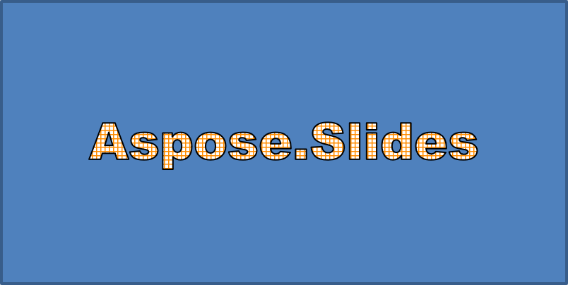

## **Přehled**

Efekty WordArt vám umožňují přidat vizuálně přitažlivý, stylizovaný text do vašich prezentací PowerPoint. S Aspose.Slides for .NET mohou vývojáři programově vytvářet, přizpůsobovat a spravovat WordArt stejně jako v Microsoft PowerPoint – bez nutnosti instalace Office. Tento článek poskytuje přehled práce s WordArtem v .NET, včetně aplikace textových transformací, stylů výplní, obrysů, stínů a dalších možností formátování, aby byl obsah vaší prezentace výražnější a poutavější. WordArt umožňuje zacházet s textem jako s grafickým objektem. Skládá se z efektů nebo speciálních úprav aplikovaných na text, aby byl atraktivnější nebo výraznější.

## **Vytvořte jednoduchou šablonu WordArt a použijte ji na text**

V této sekci prozkoumáme, jak vytvořit jednoduchou šablonu WordArt a aplikovat ji na text pomocí Aspose.Slides for .NET. WordArt nabízí snadný způsob, jak vylepšit vzhled textu pomocí nápaditých vizuálních efektů a stylů. Naučením základních kroků tvorby a použití WordArtu můžete tyto techniky snadno přizpůsobit libovolnému projektu a učinit své prezentace živějšími a zapamatovatelnějšími.

Nejprve vytvoříme jednoduchý text pomocí následujícího C# kódu:

```cs
using (Presentation presentation = new Presentation())
{
    ISlide slide = presentation.Slides[0];

    IAutoShape autoShape = slide.Shapes.AddAutoShape(ShapeType.Rectangle, 20, 20, 400, 200);
    ITextFrame textFrame = autoShape.TextFrame;

    IPortion portion = textFrame.Paragraphs[0].Portions[0];
    portion.Text = "Aspose.Slides";
}
```

Nyní nastavíme výšku písma textu na vyšší hodnotu, aby byl efekt výraznější, pomocí následujícího kódu:

```cs
    portion.PortionFormat.LatinFont = new FontData("Arial Black");
    portion.PortionFormat.FontHeight = 36;
```

Zde aplikujeme výplň vzoru SmallGrid na text a přidáme černý okraj textu šířky 1 pomocí následujícího kódu:

```cs
    portion.PortionFormat.FillFormat.FillType = FillType.Pattern;
    portion.PortionFormat.FillFormat.PatternFormat.ForeColor.Color = Color.DarkOrange;
    portion.PortionFormat.FillFormat.PatternFormat.BackColor.Color = Color.White;
    portion.PortionFormat.FillFormat.PatternFormat.PatternStyle = PatternStyle.SmallGrid;
                
    portion.PortionFormat.LineFormat.FillFormat.FillType = FillType.Solid;
    portion.PortionFormat.LineFormat.FillFormat.SolidFillColor.Color = Color.Black;
```

Výsledný text:



## **Použití dalších efektů WordArt**

Kromě základních transformací vám Aspose.Slides for .NET umožňuje použít řadu pokročilých efektů WordArt k vylepšení vzhledu textu. Patří sem obrysy, výplně, stíny, odrazy a efekty záře. Kombinací těchto funkcí můžete vytvořit poutavé styly textu, které vyniknou ve vašich prezentacích. Tato sekce ukazuje, jak aplikovat tyto efekty programově pomocí jednoduchých, čistých ukázek kódu.

### **Aplikace vnějších stínových efektů**

Vnější stínové efekty pomáhají textu vyniknout tím, že přidají stín za jeho obrys, což vytváří pocit hloubky a oddělení od pozadí. Aspose.Slides for .NET umožňuje snadno aplikovat a přizpůsobovat vnější stíny na textu WordArt. V této sekci se naučíte nastavit barvu stínu, směr, vzdálenost, poloměr rozostření a další parametry pro dosažení požadovaného vizuálního dopadu.

Následující úryvek C# kódu aplikuje stínový efekt na výše vytvořený text.

```cs
    portion.PortionFormat.EffectFormat.EnableOuterShadowEffect();
    portion.PortionFormat.EffectFormat.OuterShadowEffect.ShadowColor.Color = Color.Black;
    portion.PortionFormat.EffectFormat.OuterShadowEffect.ScaleHorizontal = 100;
    portion.PortionFormat.EffectFormat.OuterShadowEffect.ScaleVertical = 100;
    portion.PortionFormat.EffectFormat.OuterShadowEffect.BlurRadius = 4;
    portion.PortionFormat.EffectFormat.OuterShadowEffect.Direction = 230;
    portion.PortionFormat.EffectFormat.OuterShadowEffect.Distance = 30;
    portion.PortionFormat.EffectFormat.OuterShadowEffect.SkewHorizontal = 20;
    portion.PortionFormat.EffectFormat.OuterShadowEffect.SkewVertical = 0;
    portion.PortionFormat.EffectFormat.OuterShadowEffect.ShadowColor.ColorTransform.Add(ColorTransformOperation.SetAlpha, 0.32f);
```

Výsledný text:


{} 
- Když jsou použity OuterShadow a PresetShadow společně, použije se pouze efekt OuterShadow.
- Pokud jsou současně použity OuterShadow a InnerShadow, výsledný efekt závisí na verzi PowerPointu. Například v PowerPoint 2013 se efekt zdvojnásobí, zatímco v PowerPoint 2007 se použije pouze efekt OuterShadow.
{}

### **Aplikace odrazových efektů**

V této sekci prozkoumáme, jak aplikovat odrazové efekty ve vašich snímcích pomocí Aspose.Slides for .NET. Odrazové efekty mohou být účinným způsobem, jak dodat textu nebo tvarům stylový a moderní vzhled, pomoci klíčovým prvkům vyniknout a přidat hloubku vaší prezentaci. Pochopením procesu aplikace a přizpůsobení těchto efektů je můžete snadno přizpůsobit designovým potřebám a požadavkům značky.

Přidejte odrazový efekt k textu pomocí tohoto příkladu C# kódu:

```cs
    portion.PortionFormat.EffectFormat.EnableReflectionEffect();
    portion.PortionFormat.EffectFormat.ReflectionEffect.BlurRadius = 0.5; 
    portion.PortionFormat.EffectFormat.ReflectionEffect.Distance = 4.72; 
    portion.PortionFormat.EffectFormat.ReflectionEffect.StartPosAlpha = 0f; 
    portion.PortionFormat.EffectFormat.ReflectionEffect.EndPosAlpha = 60f; 
    portion.PortionFormat.EffectFormat.ReflectionEffect.Direction = 90; 
    portion.PortionFormat.EffectFormat.ReflectionEffect.ScaleHorizontal = 100; 
    portion.PortionFormat.EffectFormat.ReflectionEffect.ScaleVertical = -100;
    portion.PortionFormat.EffectFormat.ReflectionEffect.StartReflectionOpacity = 60f;
    portion.PortionFormat.EffectFormat.ReflectionEffect.EndReflectionOpacity = 0.9f;
    portion.PortionFormat.EffectFormat.ReflectionEffect.RectangleAlign = RectangleAlignment.BottomLeft;   
```

Výsledný text:


### **Aplikace efektu záře**

V této sekci prozkoumáme, jak aplikovat efekt záře na text pomocí Aspose.Slides for .NET. Efekt záře může učinit váš text výraznějším díky jasnému obrysu, čímž zvýší vizuální přitažlivost vašich snímků. Úpravou nastavení, jako je barva a intenzita, můžete záři snadno přizpůsobit designu a požadavkům značky, aby klíčové body vaší prezentace upoutaly pozornost publika.

Aplikujte efekt záře na text, aby zazářil nebo vynikl, pomocí následujícího kódu:

```cs
    portion.PortionFormat.EffectFormat.EnableGlowEffect();
    portion.PortionFormat.EffectFormat.GlowEffect.Color.R = 255;
    portion.PortionFormat.EffectFormat.GlowEffect.Color.ColorTransform.Add(ColorTransformOperation.SetAlpha, 0.54f);
    portion.PortionFormat.EffectFormat.GlowEffect.Radius = 7;
```

Výsledný text:


### **Aplikace transformací WordArt**

V této sekci prozkoumáme, jak používat transformace v WordArtu s Aspose.Slides for .NET. Transformace vám umožňují ohýbat, natahovat nebo deformovat text, čímž vytvoříte jedinečné a vizuálně působivé efekty. Ovládnutím těchto technik můžete snadno přizpůsobit tvary a styly textu své značce nebo kreativní vizi, což zajistí působivou a profesionální prezentaci.

Použijte vlastnost `Transform` (která se vztahuje na celý blok textu) pomocí následujícího kódu:

```cs
    textFrame.TextFrameFormat.Transform = TextShapeType.ArchUpPour;
```

Výsledný text:


{} 
Aspose.Slides for .NET poskytuje sadu předdefinovaných [typů transformací](https://reference.aspose.com/slides/cs/net/aspose.slides/textshapetype/).
{} 

### **Aplikace 3D efektů na tvary a text**

Vytváření realistických, poutavých vizuálů může výrazně zvýšit dopad vašich prezentací. V této sekci prozkoumáme, jak aplikovat trojrozměrné (3D) efekty na tvary pomocí Aspose.Slides for .NET. Úpravou parametrů, jako je hloubka, úhel a osvětlení, můžete vytvořit působivé 3D transformace, které okamžitě upoutají pozornost publika. Ať už usilujete o jemné zvýraznění nebo dramatické iluze, tyto funkce nabízejí flexibilní způsoby, jak pozvednout svůj design a předat myšlenky poutavějším způsobem.

Použijte následující ukázkový kód pro nastavení 3D efektu na tvar:

```cs
    autoShape.ThreeDFormat.BevelBottom.BevelType = BevelPresetType.Circle;
    autoShape.ThreeDFormat.BevelBottom.Height = 10.5;
    autoShape.ThreeDFormat.BevelBottom.Width = 10.5;

    autoShape.ThreeDFormat.BevelTop.BevelType = BevelPresetType.Circle;
    autoShape.ThreeDFormat.BevelTop.Height = 12.5;
    autoShape.ThreeDFormat.BevelTop.Width = 11;

    autoShape.ThreeDFormat.ExtrusionColor.Color = Color.Orange;
    autoShape.ThreeDFormat.ExtrusionHeight = 6;

    autoShape.ThreeDFormat.ContourColor.Color = Color.DarkRed;
    autoShape.ThreeDFormat.ContourWidth = 1.5;

    autoShape.ThreeDFormat.Depth = 3;

    autoShape.ThreeDFormat.Material = MaterialPresetType.Plastic;

    autoShape.ThreeDFormat.LightRig.Direction = LightingDirection.Top;
    autoShape.ThreeDFormat.LightRig.LightType = LightRigPresetType.Balanced;
    autoShape.ThreeDFormat.LightRig.SetRotation(0, 0, 40);

    autoShape.ThreeDFormat.Camera.CameraType = CameraPresetType.PerspectiveContrastingRightFacing;
```

Výsledný tvar:


Použijte následující ukázkový kód pro nastavení 3D efektu na text:

```cs
    textFrame.TextFrameFormat.ThreeDFormat.BevelBottom.BevelType = BevelPresetType.Circle;
    textFrame.TextFrameFormat.ThreeDFormat.BevelBottom.Height = 3.5;
    textFrame.TextFrameFormat.ThreeDFormat.BevelBottom.Width = 3.5;

    textFrame.TextFrameFormat.ThreeDFormat.BevelTop.BevelType = BevelPresetType.Circle;
    textFrame.TextFrameFormat.ThreeDFormat.BevelTop.Height = 4;
    textFrame.TextFrameFormat.ThreeDFormat.BevelTop.Width = 4;

    textFrame.TextFrameFormat.ThreeDFormat.ExtrusionColor.Color = Color.Orange;
    textFrame.TextFrameFormat.ThreeDFormat.ExtrusionHeight= 6;

    textFrame.TextFrameFormat.ThreeDFormat.ContourColor.Color = Color.DarkRed;
    textFrame.TextFrameFormat.ThreeDFormat.ContourWidth = 1.5;

    textFrame.TextFrameFormat.ThreeDFormat.Depth= 3;

    textFrame.TextFrameFormat.ThreeDFormat.Material = MaterialPresetType.Plastic;

    textFrame.TextFrameFormat.ThreeDFormat.LightRig.Direction = LightingDirection.Top;
    textFrame.TextFrameFormat.ThreeDFormat.LightRig.LightType = LightRigPresetType.Balanced;
    textFrame.TextFrameFormat.ThreeDFormat.LightRig.SetRotation(0, 0, 40);

    textFrame.TextFrameFormat.ThreeDFormat.Camera.CameraType = CameraPresetType.PerspectiveContrastingRightFacing;
```

Výsledný text:


{} 
Aplikace 3D efektů na text nebo jejich tvary – a interakce mezi těmito efekty – je řízena specifickými pravidly. Zvažte scénář zahrnující jak text, tak tvar, který tento text obsahuje. 3D efekt zahrnuje 3D reprezentaci objektu a scénu, na které je umístěn.

- Pokud je scéna nastavena jak pro tvar, tak pro text, prioritu má scéna tvaru a scéna textu je ignorována.
- Pokud tvar nemá vlastní scénu, ale má 3D reprezentaci, použije se scéna textu.
- Pokud tvar nemá žádný 3D efekt, považuje se za plochý a 3D efekt se aplikuje pouze na text.

Tyto chování se vztahují k vlastnostem [ThreeDFormat.LightRig](https://reference.aspose.com/slides/cs/net/aspose.slides/threedformat/lightrig/) a [ThreeDFormat.Camera](https://reference.aspose.com/slides/cs/net/aspose.slides/threedformat/camera/).
{} 

## **Často kladené otázky**

**Mohou být efekty WordArt použity s různými fonty nebo skripty (např. arabština, čínština)?**

Ano, Aspose.Slides for .NET podporuje Unicode a funguje se všemi hlavními fonty a skripty. Efekty WordArt, jako stín, výplň a obrys, lze použít bez ohledu na jazyk, ačkoliv dostupnost fontů a vykreslování mohou záviset na systémových fontech.

**Lze efekty WordArt aplikovat na prvky předlohy snímku?**

Ano, můžete aplikovat efekty WordArt na tvary v předlohách, včetně zástupných symbolů titulků, zápatí nebo textu na pozadí. Změny provedené v předloze se projeví ve všech souvisejících snímcích.

**Ovlivňují efekty WordArt velikost souboru prezentace?**

Mírně. Efekty WordArt, jako stíny, záře a gradientní výplně, mohou mírně zvýšit velikost souboru kvůli přidaným metadatům formátování, ale rozdíl je obvykle zanedbatelný.

**Lze výsledek efektů WordArt zobrazit před uložením prezentace?**

Ano, můžete vykreslit snímky obsahující WordArt do obrázků (např. PNG, JPEG) pomocí metody `GetImage` z rozhraní [IShape](https://reference.aspose.com/slides/cs/net/aspose.slides/ishape/) nebo [ISlide](https://reference.aspose.com/slides/cs/net/aspose.slides/islide/). To vám umožní náhled výsledku v paměti nebo na obrazovce před uložením či exportem celé prezentace.