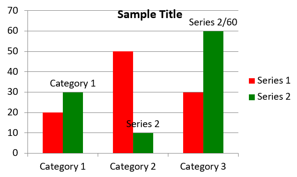

## **Přehled**

Tento článek poskytuje komplexního průvodce, jak vytvořit a přizpůsobit grafy pomocí Aspose.Slides pro .NET. Naučíte se, jak programově přidat graf na snímek, naplnit jej daty a použít různé možnosti formátování tak, aby vyhovovaly vašim konkrétním požadavkům na design. V celém článku jsou podrobně ilustrované příklady kódu, které ukazují každý krok, od inicializace prezentace a objektu grafu po konfiguraci řad, os a legend. Dodržením tohoto průvodce získáte solidní pochopení, jak integrovat dynamické generování grafů do vašich .NET aplikací a zjednodušit proces tvorby datově podložených prezentací.

## **Vytvoření grafu**

Grafy pomáhají lidem rychle vizualizovat data a získat postřehy, které nemusí být ihned patrné z tabulky nebo listu.

**Proč vytvářet grafy?**

Pomocí grafů můžete:

* agregovat, zhušťovat nebo shrnovat velké objemy dat na jediném snímku v prezentaci;
* odhalovat vzory a trendy v datech;
* odhadovat směr a hybnost dat v čase nebo vzhledem k určité jednotce měření;
* odhalovat odlehlé hodnoty, odchylky, chyby a nesmyslná data;
* komunikovat nebo prezentovat složitá data.

V PowerPointu můžete vytvářet grafy pomocí funkce *Vložit*, která nabízí šablony pro navrhování mnoha typů grafů. Pomocí Aspose.Slides můžete vytvářet jak běžné grafy (založené na populárních typech), tak vlastní grafy.

{} 
Použijte výčtový typ [ChartType](https://reference.aspose.com/slides/cs/net/aspose.slides.charts/charttype/) v prostoru názvů [Aspose.Slides.Charts](https://reference.aspose.com/slides/cs/net/aspose.slides.charts/). Hodnoty v tomto výčtu odpovídají různým typům grafů.
{} 

### **Vytvoření seskupených sloupcových grafů**

Tato část popisuje, jak vytvořit seskupené sloupcové grafy pomocí Aspose.Slides pro .NET. Naučíte se inicializovat prezentaci, přidat graf a přizpůsobit jeho prvky, jako jsou název, data, řady, kategorie a stylování. Postupujte podle níže uvedených kroků a uvidíte, jak se generuje standardní seskupený sloupcový graf:

1. Vytvořte instanci třídy [Presentation](https://reference.aspose.com/slides/cs/net/aspose.slides/presentation).
1. Získejte odkaz na snímek pomocí jeho indexu.
1. Přidejte graf s nějakými daty a specifikujte typ `ChartType.ClusteredColumn`.
1. Přidejte název grafu.
1. Přistupte k datovému listu grafu.
1. Vymažte všechny výchozí řady a kategorie.
1. Přidejte nové řady a kategorie.
1. Přidejte nová data do řad grafu.
1. Použijte barvu výplně na řady grafu.
1. Přidejte popisky k řadám grafu.
1. Uložte upravenou prezentaci jako soubor PPTX.

Tento C# kód ukazuje, jak vytvořit seskupený sloupcový graf:

```c#
using System.Drawing;
using Aspose.Slides;
using Aspose.Slides.Charts;
using Aspose.Slides.Export;

// Vytvořte instanci třídy Presentation.
using (Presentation presentation = new Presentation())
{
    // Přístup k prvnímu snímku.
    ISlide slide = presentation.Slides[0];

    // Přidejte seskupený sloupcový graf s výchozími daty.
    IChart chart = slide.Shapes.AddChart(ChartType.ClusteredColumn, 20, 20, 500, 300);

    // Nastavte název grafu.
    chart.ChartTitle.AddTextFrameForOverriding("Sample Title");
    chart.ChartTitle.TextFrameForOverriding.TextFrameFormat.CenterText = NullableBool.True;
    chart.ChartTitle.Height = 20;
    chart.HasTitle = true;

    // Nastavte index listu dat grafu.
    int worksheetIndex = 0;

    // Získání sešitu dat grafu.
    IChartDataWorkbook workbook = chart.ChartData.ChartDataWorkbook;

    // Odstraňte výchozí vygenerované řady a kategorie.
    chart.ChartData.Series.Clear();
    chart.ChartData.Categories.Clear();

    // Přidejte nové řady.
    chart.ChartData.Series.Add(workbook.GetCell(worksheetIndex, 0, 1, "Series 1"), chart.Type);
    chart.ChartData.Series.Add(workbook.GetCell(worksheetIndex, 0, 2, "Series 2"), chart.Type);

    // Přidejte nové kategorie.
    chart.ChartData.Categories.Add(workbook.GetCell(worksheetIndex, 1, 0, "Category 1"));
    chart.ChartData.Categories.Add(workbook.GetCell(worksheetIndex, 2, 0, "Category 2"));
    chart.ChartData.Categories.Add(workbook.GetCell(worksheetIndex, 3, 0, "Category 3"));

    // Získat první řadu grafu.
    IChartSeries series = chart.ChartData.Series[0];

    // Naplňte data řady.
    series.DataPoints.AddDataPointForBarSeries(workbook.GetCell(worksheetIndex, 1, 1, 20));
    series.DataPoints.AddDataPointForBarSeries(workbook.GetCell(worksheetIndex, 2, 1, 50));
    series.DataPoints.AddDataPointForBarSeries(workbook.GetCell(worksheetIndex, 3, 1, 30));

    // Nastavte barvu výplně pro řadu.
    series.Format.Fill.FillType = FillType.Solid;
    series.Format.Fill.SolidFillColor.Color = Color.Red;

    // Získat druhou řadu grafu.
    series = chart.ChartData.Series[1];

    // Naplňte data řady.
    series.DataPoints.AddDataPointForBarSeries(workbook.GetCell(worksheetIndex, 1, 2, 30));
    series.DataPoints.AddDataPointForBarSeries(workbook.GetCell(worksheetIndex, 2, 2, 10));
    series.DataPoints.AddDataPointForBarSeries(workbook.GetCell(worksheetIndex, 3, 2, 60));

    // Nastavte barvu výplně pro řadu.
    series.Format.Fill.FillType = FillType.Solid;
    series.Format.Fill.SolidFillColor.Color = Color.Green;

    // Nastavte první popisek tak, aby zobrazoval název kategorie.
    IDataLabel label = series.DataPoints[0].Label;
    label.DataLabelFormat.ShowCategoryName = true;

    label = series.DataPoints[1].Label;
    label.DataLabelFormat.ShowSeriesName = true;

    // Nastavte řadu, aby pro třetí popisek zobrazovala hodnotu.
    label = series.DataPoints[2].Label;
    label.DataLabelFormat.ShowValue = true;
    label.DataLabelFormat.ShowSeriesName = true;
    label.DataLabelFormat.Separator = "/";

    // Uložte prezentaci na disk jako soubor PPTX.
    presentation.Save("AsposeChart_out.pptx", SaveFormat.Pptx);
}
```

Výsledek:



### **Vytvoření bodových grafů**

Bodové grafy (známé také jako rozptylové grafy nebo x‑y grafy) se často používají k vyhledání vzorů nebo demonstraci korelací mezi dvěma proměnnými.

Použijte bodový graf, když:

* máte párovaná číselná data;
* máte dvě proměnné, které dobře spolu souvisejí;
* chcete zjistit, zda jsou tyto dvě proměnné propojené;
* máte nezávislou proměnnou, která má více hodnot pro závislou proměnnou.

Tento C# kód ukazuje, jak vytvořit bodový graf s odlišnými řadami značek:

```c#
using Aspose.Slides;
using Aspose.Slides.Charts;
using Aspose.Slides.Export;

// Vytvořte instanci třídy Presentation.
using (Presentation presentation = new Presentation())
{
    // Přístup k prvnímu snímku.
    ISlide slide = presentation.Slides[0];

    // Vytvořte výchozí bodový graf.
    IChart chart = slide.Shapes.AddChart(ChartType.ScatterWithSmoothLines, 20, 20, 500, 300);

    // Nastavte index listu dat grafu.
    int worksheetIndex = 0;

    // Získání sešitu dat grafu.
    IChartDataWorkbook workbook = chart.ChartData.ChartDataWorkbook;

    // Odstraňte výchozí řadu.
    chart.ChartData.Series.Clear();

    // Přidejte nové řady.
    chart.ChartData.Series.Add(workbook.GetCell(worksheetIndex, 1, 1, "Series 1"), chart.Type);
    chart.ChartData.Series.Add(workbook.GetCell(worksheetIndex, 1, 3, "Series 2"), chart.Type);

    // Získat první řadu grafu.
    IChartSeries series = chart.ChartData.Series[0];

    // Přidejte nový bod (1:3) do řady.
    series.DataPoints.AddDataPointForScatterSeries(workbook.GetCell(worksheetIndex, 2, 1, 1), workbook.GetCell(worksheetIndex, 2, 2, 3));

    // Přidejte nový bod (2:10).
    series.DataPoints.AddDataPointForScatterSeries(workbook.GetCell(worksheetIndex, 3, 1, 2), workbook.GetCell(worksheetIndex, 3, 2, 10));

    // Změňte typ řady.
    series.Type = ChartType.ScatterWithStraightLinesAndMarkers;

    // Změňte značku řady grafu.
    series.Marker.Size = 10;
    series.Marker.Symbol = MarkerStyleType.Star;

    // Získat druhou řadu grafu.
    series = chart.ChartData.Series[1];

    // Přidejte nový bod (5:2) do řady grafu.
    series.DataPoints.AddDataPointForScatterSeries(workbook.GetCell(worksheetIndex, 2, 3, 5), workbook.GetCell(worksheetIndex, 2, 4, 2));

    // Přidejte nový bod (3:1).
    series.DataPoints.AddDataPointForScatterSeries(workbook.GetCell(worksheetIndex, 3, 3, 3), workbook.GetCell(worksheetIndex, 3, 4, 1));

    // Přidejte nový bod (2:2).
    series.DataPoints.AddDataPointForScatterSeries(workbook.GetCell(worksheetIndex, 4, 3, 2), workbook.GetCell(worksheetIndex, 4, 4, 2));

    // Přidejte nový bod (5:1).
    series.DataPoints.AddDataPointForScatterSeries(workbook.GetCell(worksheetIndex, 5, 3, 5), workbook.GetCell(worksheetIndex, 5, 4, 1));

    // Změňte značku řady grafu.
    series.Marker.Size = 10;
    series.Marker.Symbol = MarkerStyleType.Circle;

    // Uložte prezentaci na disk jako soubor PPTX.
    presentation.Save("AsposeChart_out.pptx", SaveFormat.Pptx);
}
```

Výsledek:


### **Vytvoření koláčových grafů**

Koláčové grafy jsou nejvhodnější pro zobrazení vztahu část‑celku v datech, zejména když data obsahují kategoriální popisky s číselnými hodnotami. Pokud však vaše data obsahují mnoho částí nebo popisků, můžete zvážit místo nich sloupcový graf.

1. Vytvořte instanci třídy [Presentation](https://reference.aspose.com/slides/cs/net/aspose.slides/presentation).
1. Získejte odkaz na snímek pomocí jeho indexu.
1. Přidejte graf s výchozími daty a specifikujte typ `ChartType.Pie`.
1. Přistupte k sešitu dat grafu ([IChartDataWorkbook](https://reference.aspose.com/slides/cs/net/aspose.slides.charts/ichartdataworkbook/)).
1. Vymažte výchozí řady a kategorie.
1. Přidejte nové řady a kategorie.
1. Přidejte nová data do řad grafu.
1. Přidejte nové body do grafu a použijte vlastní barvy na sektory koláčového grafu.
1. Nastavte popisky pro řady.
1. Povolení vodících čar pro popisky řad.
1. Nastavte úhel rotace koláčového grafu.
1. Uložte upravenou prezentaci jako soubor PPTX.

Tento C# kód ukazuje, jak vytvořit koláčový graf:

```c#
using System.Drawing;
using Aspose.Slides;
using Aspose.Slides.Charts;
using Aspose.Slides.Export;

// Vytvořte instanci třídy Presentation.
using (Presentation presentation = new Presentation())
{
    // Přístup k prvnímu snímku.
    ISlide slide = presentation.Slides[0];

    // Přidejte graf s výchozími daty.
    IChart chart = slide.Shapes.AddChart(ChartType.Pie, 20, 20, 500, 300);

    // Nastavte název grafu.
    chart.ChartTitle.AddTextFrameForOverriding("Sample Title");
    chart.ChartTitle.TextFrameForOverriding.TextFrameFormat.CenterText = NullableBool.True;
    chart.ChartTitle.Height = 20;
    chart.HasTitle = true;

    // Nastavte první řadu, aby zobrazovala hodnoty.
    chart.ChartData.Series[0].Labels.DefaultDataLabelFormat.ShowValue = true;

    // Nastavte index listu dat grafu.
    int worksheetIndex = 0;

    // Získání sešitu dat grafu.
    IChartDataWorkbook workbook = chart.ChartData.ChartDataWorkbook;

    // Odstraňte výchozí vygenerované řady a kategorie.
    chart.ChartData.Series.Clear();
    chart.ChartData.Categories.Clear();

    // Přidejte nové kategorie.
    chart.ChartData.Categories.Add(workbook.GetCell(0, 1, 0, "1st Qtr"));
    chart.ChartData.Categories.Add(workbook.GetCell(0, 2, 0, "2nd Qtr"));
    chart.ChartData.Categories.Add(workbook.GetCell(0, 3, 0, "3rd Qtr"));

    // Přidejte nové řady.
    IChartSeries series = chart.ChartData.Series.Add(workbook.GetCell(0, 0, 1, "Series 1"), chart.Type);

    // Naplněte data řady.
    series.DataPoints.AddDataPointForPieSeries(workbook.GetCell(worksheetIndex, 1, 1, 20));
    series.DataPoints.AddDataPointForPieSeries(workbook.GetCell(worksheetIndex, 2, 1, 50));
    series.DataPoints.AddDataPointForPieSeries(workbook.GetCell(worksheetIndex, 3, 1, 30));

    // Nastavte barvu sektoru.
    chart.ChartData.SeriesGroups[0].IsColorVaried = true;

    IChartDataPoint point = series.DataPoints[0];
    point.Format.Fill.FillType = FillType.Solid;
    point.Format.Fill.SolidFillColor.Color = Color.Cyan;

    // Nastavte okraj sektoru.
    point.Format.Line.FillFormat.FillType = FillType.Solid;
    point.Format.Line.FillFormat.SolidFillColor.Color = Color.Gray;
    point.Format.Line.Width = 3.0;
    point.Format.Line.Style = LineStyle.ThinThick;
    point.Format.Line.DashStyle = LineDashStyle.LargeDash;

    IChartDataPoint point1 = series.DataPoints[1];
    point1.Format.Fill.FillType = FillType.Solid;
    point1.Format.Fill.SolidFillColor.Color = Color.Brown;

    // Nastavte okraj sektoru.
    point1.Format.Line.FillFormat.FillType = FillType.Solid;
    point1.Format.Line.FillFormat.SolidFillColor.Color = Color.Blue;
    point1.Format.Line.Width = 3.0;
    point1.Format.Line.Style = LineStyle.Single;
    point1.Format.Line.DashStyle = LineDashStyle.LargeDashDot;

    IChartDataPoint point2 = series.DataPoints[2];
    point2.Format.Fill.FillType = FillType.Solid;
    point2.Format.Fill.SolidFillColor.Color = Color.Coral;

    // Nastavte okraj sektoru.
    point2.Format.Line.FillFormat.FillType = FillType.Solid;
    point2.Format.Line.FillFormat.SolidFillColor.Color = Color.Red;
    point2.Format.Line.Width = 2.0;
    point2.Format.Line.Style = LineStyle.ThinThin;
    point2.Format.Line.DashStyle = LineDashStyle.LargeDashDotDot;

    // Vytvořte vlastní popisky pro každou kategorii v nové řadě.
    IDataLabel label1 = series.DataPoints[0].Label;

    label1.DataLabelFormat.ShowValue = true;

    IDataLabel label2 = series.DataPoints[1].Label;
    label2.DataLabelFormat.ShowValue = true;
    label2.DataLabelFormat.ShowLegendKey = true;
    label2.DataLabelFormat.ShowPercentage = true;

    IDataLabel label3 = series.DataPoints[2].Label;
    label3.DataLabelFormat.ShowSeriesName = true;
    label3.DataLabelFormat.ShowPercentage = true;

    // Nastavte řadu, aby pro graf zobrazovala vodící čáry.
    series.Labels.DefaultDataLabelFormat.ShowLeaderLines = true;

    // Nastavte úhel otáčení pro sektory koláčového grafu.
    chart.ChartData.SeriesGroups[0].FirstSliceAngle = 180;

    // Uložte prezentaci na disk jako soubor PPTX.
    presentation.Save("PieChart_out.pptx", SaveFormat.Pptx);
}
```

Výsledek:


### **Vytvoření čárových grafů**

Čárové grafy (známé také jako čárové diagramy) jsou nejvhodnější v situacích, kdy chcete ukázat změny hodnot v čase. Pomocí čárového grafu můžete najednou porovnat velké množství dat, sledovat změny a trendy v průběhu času, zvýraznit anomálie v řadách dat a další.

1. Vytvořte instanci třídy [Presentation](https://reference.aspose.com/slides/cs/net/aspose.slides/presentation).
1. Získejte odkaz na snímek pomocí jeho indexu.
1. Přidejte graf s výchozími daty a specifikujte typ `ChartType.Line`.
1. Přistupte k sešitu dat grafu ([IChartDataWorkbook](https://reference.aspose.com/slides/cs/net/aspose.slides.charts/ichartdataworkbook/)).
1. Vymažte výchozí řady a kategorie.
1. Přidejte nové řady a kategorie.
1. Přidejte nová data do řad grafu.
1. Uložte upravenou prezentaci jako soubor PPTX.

Tento C# kód ukazuje, jak vytvořit čárový graf:

```c#
using Aspose.Slides;
using Aspose.Slides.Charts;
using Aspose.Slides.Export;

using (Presentation presentation = new Presentation())
{
    IChart lineChart = presentation.Slides[0].Shapes.AddChart(ChartType.Line, 20, 20, 500, 300);

    presentation.Save("lineChart.pptx", SaveFormat.Pptx);
}
```

Standardně jsou body v čárovém grafu spojeny rovnými souvislými čarami. Pokud chcete, aby byly body spojeny čárkovanou čarou, můžete specifikovat požadovaný typ čáry následovně:

```c#
using Aspose.Slides;
using Aspose.Slides.Charts;

using (Presentation presentation = new Presentation())
{
    IChart lineChart = presentation.Slides[0].Shapes.AddChart(ChartType.Line, 20, 20, 500, 300);

    foreach (IChartSeries series in lineChart.ChartData.Series)
    {
        series.Format.Line.DashStyle = LineDashStyle.Dash;
    }
}
```

Výsledek:


### **Vytvoření stromových (Tree Map) grafů**

Stromové mapy jsou nejvhodnější pro prodejní data, když chcete zobrazit relativní velikost kategorií a rychle upoutat pozornost na položky, které představují velké podíly v rámci každé kategorie.

1. Vytvořte instanci třídy [Presentation](https://reference.aspose.com/slides/cs/net/aspose.slides/presentation).
1. Získejte odkaz na snímek pomocí jeho indexu.
1. Přidejte graf s výchozími daty a specifikujte typ `ChartType.Treemap`.
1. Přistupte k sešitu dat grafu ([IChartDataWorkbook](https://reference.aspose.com/slides/cs/net/aspose.slides.charts/ichartdataworkbook/)).
1. Vymažte výchozí řady a kategorie.
1. Přidejte nové řady a kategorie.
1. Přidejte nová data do řad grafu.
1. Uložte upravenou prezentaci jako soubor PPTX.

Tento C# kód ukazuje, jak vytvořit stromovou mapu:

```c#
using Aspose.Slides;
using Aspose.Slides.Charts;
using Aspose.Slides.Export;

using (Presentation presentation = new Presentation())
{
    IChart chart = presentation.Slides[0].Shapes.AddChart(ChartType.Treemap, 20, 20, 500, 300);
    chart.ChartData.Categories.Clear();
    chart.ChartData.Series.Clear();

    IChartDataWorkbook workbook = chart.ChartData.ChartDataWorkbook;
    workbook.Clear(0);

    // Větev 1
    IChartCategory leaf = chart.ChartData.Categories.Add(workbook.GetCell(0, "C1", "Leaf1"));
    leaf.GroupingLevels.SetGroupingItem(1, "Stem1");
    leaf.GroupingLevels.SetGroupingItem(2, "Branch1");

    chart.ChartData.Categories.Add(workbook.GetCell(0, "C2", "Leaf2"));

    leaf = chart.ChartData.Categories.Add(workbook.GetCell(0, "C3", "Leaf3"));
    leaf.GroupingLevels.SetGroupingItem(1, "Stem2");

    chart.ChartData.Categories.Add(workbook.GetCell(0, "C4", "Leaf4"));

    // Větev 2
    leaf = chart.ChartData.Categories.Add(workbook.GetCell(0, "C5", "Leaf5"));
    leaf.GroupingLevels.SetGroupingItem(1, "Stem3");
    leaf.GroupingLevels.SetGroupingItem(2, "Branch2");

    chart.ChartData.Categories.Add(workbook.GetCell(0, "C6", "Leaf6"));

    leaf = chart.ChartData.Categories.Add(workbook.GetCell(0, "C7", "Leaf7"));
    leaf.GroupingLevels.SetGroupingItem(1, "Stem4");

    chart.ChartData.Categories.Add(workbook.GetCell(0, "C8", "Leaf8"));

    IChartSeries series = chart.ChartData.Series.Add(ChartType.Treemap);
    series.Labels.DefaultDataLabelFormat.ShowCategoryName = true;
    series.DataPoints.AddDataPointForTreemapSeries(workbook.GetCell(0, "D1", 4));
    series.DataPoints.AddDataPointForTreemapSeries(workbook.GetCell(0, "D2", 5));
    series.DataPoints.AddDataPointForTreemapSeries(workbook.GetCell(0, "D3", 3));
    series.DataPoints.AddDataPointForTreemapSeries(workbook.GetCell(0, "D4", 6));
    series.DataPoints.AddDataPointForTreemapSeries(workbook.GetCell(0, "D5", 9));
    series.DataPoints.AddDataPointForTreemapSeries(workbook.GetCell(0, "D6", 9));
    series.DataPoints.AddDataPointForTreemapSeries(workbook.GetCell(0, "D7", 4));
    series.DataPoints.AddDataPointForTreemapSeries(workbook.GetCell(0, "D8", 3));

    series.ParentLabelLayout = ParentLabelLayoutType.Overlapping;

    presentation.Save("Treemap.pptx", SaveFormat.Pptx);
}
```

Výsledek:


### **Vytvoření akciových (Stock) grafů**

Akciové grafy se používají k zobrazení finančních dat, jako jsou otevírací, nejvyšší, nejnižší a závěrečné ceny, což pomáhá analyzovat tržní trendy a volatilitu. Poskytují zásadní pohled na výkonnost akcií a usnadňují investorům i analytikům činit informovaná rozhodnutí.

1. Vytvořte instanci třídy [Presentation](https://reference.aspose.com/slides/cs/net/aspose.slides/presentation).
1. Získejte odkaz na snímek pomocí jeho indexu.
1. Přidejte graf s výchozími daty a specifikujte typ `ChartType.OpenHighLowClose`.
1. Přistupte k sešitu dat grafu ([IChartDataWorkbook](https://reference.aspose.com/slides/cs/net/aspose.slides.charts/ichartdataworkbook/)).
1. Vymažte výchozí řady a kategorie.
1. Přidejte nové řady a kategorie.
1. Přidejte nová data do řad grafu.
1. Specifikujte formát HiLowLines.
1. Uložte upravenou prezentaci jako soubor PPTX.

Tento C# kód ukazuje, jak vytvořit akciový graf:

```c#
using Aspose.Slides;
using Aspose.Slides.Charts;
using Aspose.Slides.Export;

using (Presentation presentation = new Presentation())
{
    IChart chart = presentation.Slides[0].Shapes.AddChart(ChartType.OpenHighLowClose, 20, 20, 500, 300, false);

    IChartDataWorkbook workbook = chart.ChartData.ChartDataWorkbook;

    chart.ChartData.Categories.Add(workbook.GetCell(0, 1, 0, "A"));
    chart.ChartData.Categories.Add(workbook.GetCell(0, 2, 0, "B"));
    chart.ChartData.Categories.Add(workbook.GetCell(0, 3, 0, "C"));

    chart.ChartData.Series.Add(workbook.GetCell(0, 0, 1, "Open"), chart.Type);
    chart.ChartData.Series.Add(workbook.GetCell(0, 0, 2, "High"), chart.Type);
    chart.ChartData.Series.Add(workbook.GetCell(0, 0, 3, "Low"), chart.Type);
    chart.ChartData.Series.Add(workbook.GetCell(0, 0, 4, "Close"), chart.Type);

    IChartSeries series = chart.ChartData.Series[0];
    series.DataPoints.AddDataPointForStockSeries(workbook.GetCell(0, 1, 1, 72));
    series.DataPoints.AddDataPointForStockSeries(workbook.GetCell(0, 2, 1, 25));
    series.DataPoints.AddDataPointForStockSeries(workbook.GetCell(0, 3, 1, 38));

    series = chart.ChartData.Series[1];
    series.DataPoints.AddDataPointForStockSeries(workbook.GetCell(0, 1, 2, 172));
    series.DataPoints.AddDataPointForStockSeries(workbook.GetCell(0, 2, 2, 57));
    series.DataPoints.AddDataPointForStockSeries(workbook.GetCell(0, 3, 2, 57));

    series = chart.ChartData.Series[2];
    series.DataPoints.AddDataPointForStockSeries(workbook.GetCell(0, 1, 3, 12));
    series.DataPoints.AddDataPointForStockSeries(workbook.GetCell(0, 2, 3, 12));
    series.DataPoints.AddDataPointForStockSeries(workbook.GetCell(0, 3, 3, 13));

    series = chart.ChartData.Series[3];
    series.DataPoints.AddDataPointForStockSeries(workbook.GetCell(0, 1, 4, 25));
    series.DataPoints.AddDataPointForStockSeries(workbook.GetCell(0, 2, 4, 38));
    series.DataPoints.AddDataPointForStockSeries(workbook.GetCell(0, 3, 4, 50));

    chart.ChartData.SeriesGroups[0].UpDownBars.HasUpDownBars = true;
    chart.ChartData.SeriesGroups[0].HiLowLinesFormat.Line.FillFormat.FillType = FillType.Solid;

    foreach (IChartSeries ser in chart.ChartData.Series)
    {
        ser.Format.Line.FillFormat.FillType = FillType.NoFill;
    }

    chart.Axes.VerticalAxis.MinorGridLinesFormat.Line.FillFormat.FillType = FillType.NoFill;

    presentation.Save("Stock-chart.pptx", SaveFormat.Pptx);
}
```

Výsledek:


### **Vytvoření krabicových (Box and Whisker) grafů**

Krabicové a vousaté grafy se používají k zobrazení rozdělení dat shrnutím klíčových statistických ukazatelů, jako jsou medián, kvartily a potenciální odlehlé hodnoty. Jsou zvláště užitečné při průzkumné analýze dat a statistických studiích, aby rychle ukázaly variabilitu dat a identifikovaly anomálie.

1. Vytvořte instanci třídy [Presentation](https://reference.aspose.com/slides/cs/net/aspose.slides/presentation).
1. Získejte odkaz na snímek pomocí jeho indexu.
1. Přidejte graf s výchozími daty a specifikujte typ `ChartType.BoxAndWhisker`.
1. Přistupte k sešitu dat grafu ([IChartDataWorkbook](https://reference.aspose.com/slides/cs/net/aspose.slides.charts/ichartdataworkbook/)).
1. Vymažte výchozí řady a kategorie.
1. Přidejte nové řady a kategorie.
1. Přidejte nová data do řad grafu.
1. Uložte upravenou prezentaci jako soubor PPTX.

Tento C# kód ukazuje, jak vytvořit krabicový a vousatý graf:

```c#
using Aspose.Slides;
using Aspose.Slides.Charts;
using Aspose.Slides.Export;

using (Presentation presentation = new Presentation())
{
    IChart chart = presentation.Slides[0].Shapes.AddChart(ChartType.BoxAndWhisker, 20, 20, 500, 300);
    chart.ChartData.Categories.Clear();
    chart.ChartData.Series.Clear();

    IChartDataWorkbook workbook = chart.ChartData.ChartDataWorkbook;
    workbook.Clear(0);

    chart.ChartData.Categories.Add(workbook.GetCell(0, "A1", "Category 1"));
    chart.ChartData.Categories.Add(workbook.GetCell(0, "A2", "Category 2"));
    chart.ChartData.Categories.Add(workbook.GetCell(0, "A3", "Category 3"));
    chart.ChartData.Categories.Add(workbook.GetCell(0, "A4", "Category 4"));
    chart.ChartData.Categories.Add(workbook.GetCell(0, "A5", "Category 5"));
    chart.ChartData.Categories.Add(workbook.GetCell(0, "A6", "Category 6"));

    IChartSeries series = chart.ChartData.Series.Add(ChartType.BoxAndWhisker);

    series.QuartileMethod = QuartileMethodType.Exclusive;
    series.ShowMeanLine = true;
    series.ShowMeanMarkers = true;
    series.ShowInnerPoints = true;
    series.ShowOutlierPoints = true;

    series.DataPoints.AddDataPointForBoxAndWhiskerSeries(workbook.GetCell(0, "B1", 15));
    series.DataPoints.AddDataPointForBoxAndWhiskerSeries(workbook.GetCell(0, "B2", 41));
    series.DataPoints.AddDataPointForBoxAndWhiskerSeries(workbook.GetCell(0, "B3", 16));
    series.DataPoints.AddDataPointForBoxAndWhiskerSeries(workbook.GetCell(0, "B4", 10));
    series.DataPoints.AddDataPointForBoxAndWhiskerSeries(workbook.GetCell(0, "B5", 23));
    series.DataPoints.AddDataPointForBoxAndWhiskerSeries(workbook.GetCell(0, "B6", 16));

    presentation.Save("BoxAndWhisker.pptx", SaveFormat.Pptx);
}
```

### **Vytvoření trychtýřových (Funnel) grafů**

Trychtýřové grafy slouží k vizualizaci procesů, které zahrnují sekvenční fáze, kde objem dat klesá postupně z jednoho kroku na další. Pomáhají při analýze míry konverze, identifikaci úzkých míst a sledování efektivity prodejních či marketingových procesů.

1. Vytvořte instanci třídy [Presentation](https://reference.aspose.com/slides/cs/net/aspose.slides/presentation).
1. Získejte odkaz na snímek pomocí jeho indexu.
1. Přidejte graf s výchozími daty a specifikujte typ `ChartType.Funnel`.
1. Uložte upravenou prezentaci jako soubor PPTX.

Tento C# kód ukazuje, jak vytvořit trychtýřový graf:

```c#
using Aspose.Slides;
using Aspose.Slides.Charts;
using Aspose.Slides.Export;

using (Presentation presentation = new Presentation("test.pptx"))
{
    IChart chart = presentation.Slides[0].Shapes.AddChart(ChartType.Funnel, 50, 50, 500, 400);
    chart.ChartData.Categories.Clear();
    chart.ChartData.Series.Clear();

    IChartDataWorkbook workbook = chart.ChartData.ChartDataWorkbook;
    workbook.Clear(0);

    chart.ChartData.Categories.Add(workbook.GetCell(0, "A1", "Category 1"));
    chart.ChartData.Categories.Add(workbook.GetCell(0, "A2", "Category 2"));
    chart.ChartData.Categories.Add(workbook.GetCell(0, "A3", "Category 3"));
    chart.ChartData.Categories.Add(workbook.GetCell(0, "A4", "Category 4"));
    chart.ChartData.Categories.Add(workbook.GetCell(0, "A5", "Category 5"));
    chart.ChartData.Categories.Add(workbook.GetCell(0, "A6", "Category 6"));

    IChartSeries series = chart.ChartData.Series.Add(ChartType.Funnel);

    series.DataPoints.AddDataPointForFunnelSeries(workbook.GetCell(0, "B1", 50));
    series.DataPoints.AddDataPointForFunnelSeries(workbook.GetCell(0, "B2", 100));
    series.DataPoints.AddDataPointForFunnelSeries(workbook.GetCell(0, "B3", 200));
    series.DataPoints.AddDataPointForFunnelSeries(workbook.GetCell(0, "B4", 300));
    series.DataPoints.AddDataPointForFunnelSeries(workbook.GetCell(0, "B5", 400));
    series.DataPoints.AddDataPointForFunnelSeries(workbook.GetCell(0, "B6", 500));

    presentation.Save("Funnel.pptx", SaveFormat.Pptx);
}
```

Výsledek:


### **Vytvoření slunečních (Sunburst) grafů**

Sluneční grafy slouží k vizualizaci hierarchických dat, zobrazujících úrovně jako soustředné kruhy. Pomáhají ilustrovat vztahy část‑celku a jsou ideální pro reprezentaci vnořených kategorií a podkategorií v přehledném, kompaktním formátu.

1. Vytvořte instanci třídy [Presentation](https://reference.aspose.com/slides/cs/net/aspose.slides/presentation).
1. Získejte odkaz na snímek pomocí jeho indexu.
1. Přidejte graf s výchozími daty a specifikujte typ `ChartType.Sunburst`.
1. Uložte upravenou prezentaci jako soubor PPTX.

Tento C# kód ukazuje, jak vytvořit sluneční graf:

```c#
using Aspose.Slides;
using Aspose.Slides.Charts;
using Aspose.Slides.Export;

using (Presentation presentation = new Presentation())
{
    IChart chart = presentation.Slides[0].Shapes.AddChart(ChartType.Sunburst, 20, 20, 500, 300);
    chart.ChartData.Categories.Clear();
    chart.ChartData.Series.Clear();

    IChartDataWorkbook workbook = chart.ChartData.ChartDataWorkbook;
    workbook.Clear(0);

    // Větev 1
    IChartCategory leaf = chart.ChartData.Categories.Add(workbook.GetCell(0, "C1", "Leaf1"));
    leaf.GroupingLevels.SetGroupingItem(1, "Stem1");
    leaf.GroupingLevels.SetGroupingItem(2, "Branch1");

    chart.ChartData.Categories.Add(workbook.GetCell(0, "C2", "Leaf2"));

    leaf = chart.ChartData.Categories.Add(workbook.GetCell(0, "C3", "Leaf3"));
    leaf.GroupingLevels.SetGroupingItem(1, "Stem2");

    chart.ChartData.Categories.Add(workbook.GetCell(0, "C4", "Leaf4"));

    // Větev 2
    leaf = chart.ChartData.Categories.Add(workbook.GetCell(0, "C5", "Leaf5"));
    leaf.GroupingLevels.SetGroupingItem(1, "Stem3");
    leaf.GroupingLevels.SetGroupingItem(2, "Branch2");

    chart.ChartData.Categories.Add(workbook.GetCell(0, "C6", "Leaf6"));

    leaf = chart.ChartData.Categories.Add(workbook.GetCell(0, "C7", "Leaf7"));
    leaf.GroupingLevels.SetGroupingItem(1, "Stem4");

    chart.ChartData.Categories.Add(workbook.GetCell(0, "C8", "Leaf8"));

    IChartSeries series = chart.ChartData.Series.Add(ChartType.Sunburst);
    series.Labels.DefaultDataLabelFormat.ShowCategoryName = true;
    series.DataPoints.AddDataPointForSunburstSeries(workbook.GetCell(0, "D1", 4));
    series.DataPoints.AddDataPointForSunburstSeries(workbook.GetCell(0, "D2", 5));
    series.DataPoints.AddDataPointForSunburstSeries(workbook.GetCell(0, "D3", 3));
    series.DataPoints.AddDataPointForSunburstSeries(workbook.GetCell(0, "D4", 6));
    series.DataPoints.AddDataPointForSunburstSeries(workbook.GetCell(0, "D5", 9));
    series.DataPoints.AddDataPointForSunburstSeries(workbook.GetCell(0, "D6", 9));
    series.DataPoints.AddDataPointForSunburstSeries(workbook.GetCell(0, "D7", 4));
    series.DataPoints.AddDataPointForSunburstSeries(workbook.GetCell(0, "D8", 3));

    presentation.Save("Sunburst.pptx", SaveFormat.Pptx);
}
```

Výsledek:


### **Vytvoření histogramových grafů**

Histogramy slouží k reprezentaci rozdělení číselných dat seskupením hodnot do intervalů nebo košů. Pomáhají identifikovat vzory v datech, jako jsou četnost, zkreslení a rozptyl, a také odhalovat odlehlé hodnoty v datové sadě.

1. Vytvořte instanci třídy [Presentation](https://reference.aspose.com/slides/cs/net/aspose.slides/presentation).
1. Získejte odkaz na snímek pomocí jeho indexu.
1. Přidejte graf s některými daty a specifikujte typ `ChartType.Histogram`.
1. Přistupte k sešitu dat grafu ([IChartDataWorkbook](https://reference.aspose.com/slides/cs/net/aspose.slides.charts/ichartdataworkbook/)).
1. Vymažte výchozí řady a kategorie.
1. Přidejte nové řady a kategorie.
1. Uložte upravenou prezentaci jako soubor PPTX.

Tento C# kód ukazuje, jak vytvořit histogramový graf:

```c#
using Aspose.Slides;
using Aspose.Slides.Charts;
using Aspose.Slides.Export;

using (Presentation presentation = new Presentation())
{
    IChart chart = presentation.Slides[0].Shapes.AddChart(ChartType.Histogram, 20, 20, 500, 300);
    chart.ChartData.Categories.Clear();
    chart.ChartData.Series.Clear();

    IChartDataWorkbook workbook = chart.ChartData.ChartDataWorkbook;
    workbook.Clear(0);

    IChartSeries series = chart.ChartData.Series.Add(ChartType.Histogram);
    series.DataPoints.AddDataPointForHistogramSeries(workbook.GetCell(0, "A1", 15));
    series.DataPoints.AddDataPointForHistogramSeries(workbook.GetCell(0, "A2", -41));
    series.DataPoints.AddDataPointForHistogramSeries(workbook.GetCell(0, "A3", 16));
    series.DataPoints.AddDataPointForHistogramSeries(workbook.GetCell(0, "A4", 10));
    series.DataPoints.AddDataPointForHistogramSeries(workbook.GetCell(0, "A5", -23));
    series.DataPoints.AddDataPointForHistogramSeries(workbook.GetCell(0, "A6", 16));

    chart.Axes.HorizontalAxis.AggregationType = AxisAggregationType.Automatic;

    presentation.Save("Histogram.pptx", SaveFormat.Pptx);
}
```

Výsledek:


### **Vytvoření radarových grafů**

Radarové grafy slouží k zobrazení multivariantních dat ve dvourozměrném formátu, což umožňuje snadné srovnání několika proměnných současně. Jsou zvláště užitečné pro identifikaci vzorů, silných a slabých stránek napříč různými metrikami výkonu nebo atributy.

1. Vytvořte instanci třídy [Presentation](https://reference.aspose.com/slides/cs/net/aspose.slides/presentation).
1. Získejte odkaz na snímek pomocí jeho indexu.
1. Přidejte graf s některými daty a specifikujte typ `ChartType.Radar`.
1. Uložte upravenou prezentaci jako soubor PPTX.

Tento C# kód ukazuje, jak vytvořit radarový graf:

```c#
using Aspose.Slides;
using Aspose.Slides.Charts;
using Aspose.Slides.Export;

using (Presentation presentation = new Presentation())
{
    presentation.Slides[0].Shapes.AddChart(ChartType.Radar, 20, 20, 500, 300);
    presentation.Save("Radar-chart.pptx", SaveFormat.Pptx);
}
```

Výsledek:


### **Vytvoření vícekategoriových grafů**

Vícekategoriové grafy slouží k zobrazování dat, kde je zapojeno více než jedno kategoriální seskupení, což umožňuje porovnávat hodnoty napříč více dimenzemi současně. Pomáhají analyzovat trendy a vztahy v komplexních, vícevrstvých datových souborech.

1. Vytvořte instanci třídy [Presentation](https://reference.aspose.com/slides/cs/net/aspose.slides/presentation).
1. Získejte odkaz na snímek pomocí jeho indexu.
1. Přidejte graf s výchozími daty a specifikujte typ `ChartType.ClusteredColumn`.
1. Přistupte k sešitu dat grafu ([IChartDataWorkbook](https://reference.aspose.com/slides/cs/net/aspose.slides.charts/ichartdataworkbook/)).
1. Vymažte výchozí řady a kategorie.
1. Přidejte nové řady a kategorie.
1. Přidejte nová data do řad grafu.
1. Uložte upravenou prezentaci jako soubor PPTX.

Tento C# kód ukazuje, jak vytvořit vícekategoriový graf:

```c#
using Aspose.Slides;
using Aspose.Slides.Charts;
using Aspose.Slides.Export;

using (Presentation presentation = new Presentation())
{
    ISlide slide = presentation.Slides[0];

    IChart chart = presentation.Slides[0].Shapes.AddChart(ChartType.ClusteredColumn, 20, 20, 500, 300);
    chart.ChartData.Series.Clear();
    chart.ChartData.Categories.Clear();

    IChartDataWorkbook workbook = chart.ChartData.ChartDataWorkbook;
    workbook.Clear(0);

    int worksheetIndex = 0;

    IChartCategory category = chart.ChartData.Categories.Add(workbook.GetCell(0, "c2", "A"));
    category.GroupingLevels.SetGroupingItem(1, "Group1");
    category = chart.ChartData.Categories.Add(workbook.GetCell(0, "c3", "B"));

    category = chart.ChartData.Categories.Add(workbook.GetCell(0, "c4", "C"));
    category.GroupingLevels.SetGroupingItem(1, "Group2");
    category = chart.ChartData.Categories.Add(workbook.GetCell(0, "c5", "D"));

    category = chart.ChartData.Categories.Add(workbook.GetCell(0, "c6", "E"));
    category.GroupingLevels.SetGroupingItem(1, "Group3");
    category = chart.ChartData.Categories.Add(workbook.GetCell(0, "c7", "F"));

    category = chart.ChartData.Categories.Add(workbook.GetCell(0, "c8", "G"));
    category.GroupingLevels.SetGroupingItem(1, "Group4");
    category = chart.ChartData.Categories.Add(workbook.GetCell(0, "c9", "H"));

    // Přidejte řadu.
    IChartSeries series = chart.ChartData.Series.Add(workbook.GetCell(0, "D1", "Series 1"), ChartType.ClusteredColumn);

    series.DataPoints.AddDataPointForBarSeries(workbook.GetCell(worksheetIndex, "D2", 10));
    series.DataPoints.AddDataPointForBarSeries(workbook.GetCell(worksheetIndex, "D3", 20));
    series.DataPoints.AddDataPointForBarSeries(workbook.GetCell(worksheetIndex, "D4", 30));
    series.DataPoints.AddDataPointForBarSeries(workbook.GetCell(worksheetIndex, "D5", 40));
    series.DataPoints.AddDataPointForBarSeries(workbook.GetCell(worksheetIndex, "D6", 50));
    series.DataPoints.AddDataPointForBarSeries(workbook.GetCell(worksheetIndex, "D7", 60));
    series.DataPoints.AddDataPointForBarSeries(workbook.GetCell(worksheetIndex, "D8", 70));
    series.DataPoints.AddDataPointForBarSeries(workbook.GetCell(worksheetIndex, "D9", 80));

    // Uložte prezentaci s grafem.
    presentation.Save("AsposeChart_out.pptx", SaveFormat.Pptx);
}
```

Výsledek:


### **Vytvoření mapových grafů**

Mapové grafy slouží k vizualizaci geografických dat mapováním informací na konkrétní místa, jako jsou země, státy nebo města. Pomáhají analyzovat regionální trendy, demografická data a prostorové rozdělení přehledným a vizuálně atraktivním způsobem.

Tento C# kód ukazuje, jak vytvořit mapový graf:

```c#
using Aspose.Slides;
using Aspose.Slides.Charts;
using Aspose.Slides.Export;

using (Presentation presentation = new Presentation())
{
    IChart chart = presentation.Slides[0].Shapes.AddChart(ChartType.Map, 20, 20, 500, 300);
    presentation.Save("mapChart.pptx", SaveFormat.Pptx);
}
```

Výsledek:


{} 
Obrázek výše zobrazuje uloženou prezentaci otevřenou v PowerPointu. Aspose.Slides zapisuje mapový graf a jeho data správně, ale samotné mapové grafy nevykresluje: při renderování snímku obsahujícího takový graf do obrázku nebo při konverzi do PDF či SVG je oblast grafu prázdná. Ostatní tvary na stejném snímku nejsou ovlivněny.
{} 

### **Vytvoření kombinovaných grafů**

Kombinovaný (nebo combo) graf spojuje dva nebo více typů grafů v jednom diagramu. Tento graf vám umožní zvýraznit, porovnat nebo prozkoumat rozdíly mezi dvěma či více sadami dat, což pomáhá identifikovat vztahy mezi nimi.


Následující C# kód ukazuje, jak vytvořit výše uvedený kombinovaný graf v PowerPointové prezentaci:

```c#
using System.Drawing;
using Aspose.Slides;
using Aspose.Slides.Charts;
using Aspose.Slides.Export;

private static void CreateComboChart()
{
    using (Presentation presentation = new Presentation())
    {
        IChart chart = CreateChartWithFirstSeries(presentation.Slides[0]);

        AddSecondSeriesToChart(chart);
        AddThirdSeriesToChart(chart);

        SetPrimaryAxesFormat(chart);
        SetSecondaryAxesFormat(chart);

        presentation.Save("combo-chart.pptx", SaveFormat.Pptx);
    }
}

private static IChart CreateChartWithFirstSeries(ISlide slide)
{
    IChart chart = slide.Shapes.AddChart(ChartType.ClusteredColumn, 50, 50, 600, 400);

    // Nastavuje název grafu
    chart.HasTitle = true;
    chart.ChartTitle.AddTextFrameForOverriding("Chart Title");
    chart.ChartTitle.Overlay = false;
    IPortionFormat portionFormat = 
       chart.ChartTitle.TextFrameForOverriding.Paragraphs[0].ParagraphFormat.DefaultPortionFormat;
    portionFormat.FontBold = NullableBool.False;
    portionFormat.FontHeight = 18f;

    // Nastavuje legendu grafu
    chart.Legend.Position = LegendPositionType.Bottom;
    chart.Legend.TextFormat.PortionFormat.FontHeight = 12f;

    // Odstraňuje výchozí vygenerované řady a kategorie
    chart.ChartData.Series.Clear();
    chart.ChartData.Categories.Clear();

    int worksheetIndex = 0;
    IChartDataWorkbook workbook = chart.ChartData.ChartDataWorkbook;

    // Přidává nové kategorie
    chart.ChartData.Categories.Add(workbook.GetCell(worksheetIndex, 1, 0, "Category 1"));
    chart.ChartData.Categories.Add(workbook.GetCell(worksheetIndex, 2, 0, "Category 2"));
    chart.ChartData.Categories.Add(workbook.GetCell(worksheetIndex, 3, 0, "Category 3"));
    chart.ChartData.Categories.Add(workbook.GetCell(worksheetIndex, 4, 0, "Category 4"));

    // Přidá první řadu
    IChartSeries series = chart.ChartData.Series.Add(
        workbook.GetCell(worksheetIndex, 0, 1, "Series 1"), chart.Type);

    series.ParentSeriesGroup.Overlap = -25;
    series.ParentSeriesGroup.GapWidth = 220;

    series.DataPoints.AddDataPointForBarSeries(workbook.GetCell(worksheetIndex, 1, 1, 4.3));
    series.DataPoints.AddDataPointForBarSeries(workbook.GetCell(worksheetIndex, 2, 1, 2.5));
    series.DataPoints.AddDataPointForBarSeries(workbook.GetCell(worksheetIndex, 3, 1, 3.5));
    series.DataPoints.AddDataPointForBarSeries(workbook.GetCell(worksheetIndex, 4, 1, 4.5));

    return chart;
}

private static void AddSecondSeriesToChart(IChart chart)
{
    IChartDataWorkbook workbook = chart.ChartData.ChartDataWorkbook;
    const int worksheetIndex = 0;

    IChartSeries series = chart.ChartData.Series.Add(
        workbook.GetCell(worksheetIndex, 0, 2, "Series 2"), ChartType.ClusteredColumn);

    series.ParentSeriesGroup.Overlap = -25;
    series.ParentSeriesGroup.GapWidth = 220;

    series.DataPoints.AddDataPointForBarSeries(workbook.GetCell(worksheetIndex, 1, 2, 2.4));
    series.DataPoints.AddDataPointForBarSeries(workbook.GetCell(worksheetIndex, 2, 2, 4.4));
    series.DataPoints.AddDataPointForBarSeries(workbook.GetCell(worksheetIndex, 3, 2, 1.8));
    series.DataPoints.AddDataPointForBarSeries(workbook.GetCell(worksheetIndex, 4, 2, 2.8));
}

private static void AddThirdSeriesToChart(IChart chart)
{
    IChartDataWorkbook workbook = chart.ChartData.ChartDataWorkbook;
    const int worksheetIndex = 0;

    IChartSeries series = chart.ChartData.Series.Add(
        workbook.GetCell(worksheetIndex, 0, 3, "Series 3"), ChartType.Line);

    series.DataPoints.AddDataPointForLineSeries(workbook.GetCell(worksheetIndex, 1, 3, 2.0));
    series.DataPoints.AddDataPointForLineSeries(workbook.GetCell(worksheetIndex, 2, 3, 2.0));
    series.DataPoints.AddDataPointForLineSeries(workbook.GetCell(worksheetIndex, 3, 3, 3.0));
    series.DataPoints.AddDataPointForLineSeries(workbook.GetCell(worksheetIndex, 4, 3, 5.0));

    series.PlotOnSecondAxis = true;
}

private static void SetPrimaryAxesFormat(IChart chart)
{
    // Nastavuje vodorovnou osu
    IAxis horizontalAxis = chart.Axes.HorizontalAxis;
    horizontalAxis.TextFormat.PortionFormat.FontHeight = 12f;
    horizontalAxis.Format.Line.FillFormat.FillType = FillType.NoFill;

    SetAxisTitle(horizontalAxis, "X Axis");

    // Nastavuje svislou osu
    IAxis verticalAxis = chart.Axes.VerticalAxis;
    verticalAxis.TextFormat.PortionFormat.FontHeight = 12f;
    verticalAxis.Format.Line.FillFormat.FillType = FillType.NoFill;

    SetAxisTitle(verticalAxis, "Y Axis 1");

    // Nastavuje barvu hlavních vertikálních mřížkových čar
    ILineFillFormat majorGridLinesFormat = verticalAxis.MajorGridLinesFormat.Line.FillFormat;
    majorGridLinesFormat.FillType = FillType.Solid;
    majorGridLinesFormat.SolidFillColor.Color = Color.FromArgb(217, 217, 217);
}

private static void SetSecondaryAxesFormat(IChart chart)
{
    // Nastavuje sekundární vodorovnou osu
    IAxis secondaryHorizontalAxis = chart.Axes.SecondaryHorizontalAxis;
    secondaryHorizontalAxis.Position = AxisPositionType.Bottom;
    secondaryHorizontalAxis.CrossType = CrossesType.Maximum;
    secondaryHorizontalAxis.IsVisible = false;
    secondaryHorizontalAxis.MajorGridLinesFormat.Line.FillFormat.FillType = FillType.NoFill;
    secondaryHorizontalAxis.MinorGridLinesFormat.Line.FillFormat.FillType = FillType.NoFill;

    // Nastavuje sekundární svislou osu
    IAxis secondaryVerticalAxis = chart.Axes.SecondaryVerticalAxis;
    secondaryVerticalAxis.Position = AxisPositionType.Right;
    secondaryVerticalAxis.TextFormat.PortionFormat.FontHeight = 12f;
    secondaryVerticalAxis.Format.Line.FillFormat.FillType = FillType.NoFill;
    secondaryVerticalAxis.MajorGridLinesFormat.Line.FillFormat.FillType = FillType.NoFill;
    secondaryVerticalAxis.MinorGridLinesFormat.Line.FillFormat.FillType = FillType.NoFill;

    SetAxisTitle(secondaryVerticalAxis, "Y Axis 2");
}

private static void SetAxisTitle(IAxis axis, string axisTitle)
{
    axis.HasTitle = true;
    axis.Title.Overlay = false;
    IPortionFormat titlePortionFormat =
        axis.Title.AddTextFrameForOverriding(axisTitle).Paragraphs[0].ParagraphFormat.DefaultPortionFormat;
    titlePortionFormat.FontBold = NullableBool.False;
    titlePortionFormat.FontHeight = 12f;
}
```

## **Aktualizace grafů**

Aspose.Slides pro .NET vám umožňuje aktualizovat PowerPointové grafy úpravou dat grafu, formátování a stylování. Tato funkčnost zjednodušuje proces udržování prezentací aktuálních s dynamickým obsahem a zajišťuje, že grafy přesně odrážejí aktuální data a vizuální standardy.

1. Vytvořte instanci třídy [Presentation](https://reference.aspose.com/slides/cs/net/aspose.slides/presentation), která představuje prezentaci obsahující graf.
1. Získejte odkaz na snímek pomocí jeho indexu.
1. Procházejte všechny tvary a najděte graf.
1. Přistupte k datovému listu grafu.
1. Modifikujte řady dat grafu změnou jejich hodnot.
1. Přidejte novou řadu a naplňte ji daty.
1. Uložte upravenou prezentaci jako soubor PPTX.

Tento C# kód ukazuje, jak aktualizovat graf:

```c#
using Aspose.Slides;
using Aspose.Slides.Charts;
using Aspose.Slides.Export;

const string chartName = "My chart";

// Vytvořte instanci třídy Presentation, která představuje soubor PPTX.
using (Presentation presentation = new Presentation("ExistingChart.pptx"))
{
    // Přístup k prvnímu snímku.
    ISlide slide = presentation.Slides[0];

    foreach (IShape shape in slide.Shapes)
    {
        if (shape is IChart chart && chart.Name == chartName)
        {
            // Nastavte index listu dat grafu.
            int worksheetIndex = 0;

            // Získání sešitu dat grafu.
            IChartDataWorkbook workbook = chart.ChartData.ChartDataWorkbook;

            // Změňte názvy kategorií grafu.
            workbook.GetCell(worksheetIndex, 1, 0, "Modified Category 1");
            workbook.GetCell(worksheetIndex, 2, 0, "Modified Category 2");

            // Získat první řadu grafu.
            IChartSeries series = chart.ChartData.Series[0];

            // Aktualizujte data řady.
            workbook.GetCell(worksheetIndex, 0, 1, "New_Series 1"); // Úprava názvu řady.
            series.DataPoints[0].Value.Data = 90;
            series.DataPoints[1].Value.Data = 123;
            series.DataPoints[2].Value.Data = 44;

            // Získat druhou řadu grafu.
            series = chart.ChartData.Series[1];

            // Aktualizujte data řady.
            workbook.GetCell(worksheetIndex, 0, 2, "New_Series 2"); // Úprava názvu řady.
            series.DataPoints[0].Value.Data = 23;
            series.DataPoints[1].Value.Data = 67;
            series.DataPoints[2].Value.Data = 99;

            // Přidejte novou řadu.
            series = chart.ChartData.Series.Add(workbook.GetCell(worksheetIndex, 0, 3, "Series 3"), chart.Type);

            // Naplňte data řady.
            series.DataPoints.AddDataPointForBarSeries(workbook.GetCell(worksheetIndex, 1, 3, 20));
            series.DataPoints.AddDataPointForBarSeries(workbook.GetCell(worksheetIndex, 2, 3, 50));
            series.DataPoints.AddDataPointForBarSeries(workbook.GetCell(worksheetIndex, 3, 3, 30));

            chart.Type = ChartType.ClusteredCylinder;
        }
    }

    // Uložte prezentaci s grafem.
    presentation.Save("AsposeChartModified_out.pptx", SaveFormat.Pptx);
}
```

## **Nastavení rozsahu dat pro graf**

Aspose.Slides pro .NET poskytuje flexibilitu definovat konkrétní rozsah dat z listu jako zdroj pro data vašeho grafu. To vám umožní přímo mapovat část listu na graf, čímž kontrolujete, které buňky přispívají k řadám a kategoriím grafu. Díky tomu můžete snadno aktualizovat a synchronizovat grafy s nejnovějšími změnami v datech listu, aby vaše PowerPointové prezentace odrážely aktuální a přesné informace.

1. Vytvořte instanci třídy [Presentation](https://reference.aspose.com/slides/cs/net/aspose.slides/presentation), která představuje prezentaci obsahující graf.
1. Získejte odkaz na snímek pomocí jeho indexu.
1. Procházejte všechny tvary a najděte graf.
1. Přistupte k datům grafu a nastavte rozsah.
1. Uložte upravenou prezentaci jako soubor PPTX.

Tento C# kód ukazuje, jak nastavit rozsah dat pro graf:

```c#
using Aspose.Slides;
using Aspose.Slides.Charts;
using Aspose.Slides.Export;

const string chartName = "My chart";

// Vytvořte instanci třídy Presentation, která představuje soubor PPTX.
using (Presentation presentation = new Presentation("ExistingChart.pptx"))
{
    // Přístup k prvnímu snímku.
    ISlide slide = presentation.Slides[0];

    foreach (IShape shape in slide.Shapes)
    {
        if (shape is IChart chart && chart.Name == chartName)
        {
            chart.ChartData.SetRange("Sheet1!A1:B4");
        }
    }

    presentation.Save("SetDataRange_out.pptx", SaveFormat.Pptx);
}
```

## **Použití výchozích značek v grafech**

Když použijete výchozí značky v grafech, každá řada grafu automaticky získá odlišný výchozí symbol značky.

Tento C# kód ukazuje, jak automaticky nastavit značku řady grafu:

```c#
using Aspose.Slides;
using Aspose.Slides.Charts;
using Aspose.Slides.Export;

using (Presentation presentation = new Presentation())
{
    ISlide slide = presentation.Slides[0];
    IChart chart = slide.Shapes.AddChart(ChartType.LineWithMarkers, 10, 10, 400, 400);

    chart.ChartData.Series.Clear();
    chart.ChartData.Categories.Clear();

    IChartDataWorkbook workbook = chart.ChartData.ChartDataWorkbook;

    IChartSeries series = chart.ChartData.Series.Add(workbook.GetCell(0, 0, 1, "Series 1"), chart.Type);

    chart.ChartData.Categories.Add(workbook.GetCell(0, 1, 0, "C1"));
    series.DataPoints.AddDataPointForLineSeries(workbook.GetCell(0, 1, 1, 24));

    chart.ChartData.Categories.Add(workbook.GetCell(0, 2, 0, "C2"));
    series.DataPoints.AddDataPointForLineSeries(workbook.GetCell(0, 2, 1, 23));

    chart.ChartData.Categories.Add(workbook.GetCell(0, 3, 0, "C3"));
    series.DataPoints.AddDataPointForLineSeries(workbook.GetCell(0, 3, 1, -10));

    chart.ChartData.Categories.Add(workbook.GetCell(0, 4, 0, "C4"));
    series.DataPoints.AddDataPointForLineSeries(workbook.GetCell(0, 4, 1, null));

    IChartSeries series2 = chart.ChartData.Series.Add(workbook.GetCell(0, 0, 2, "Series 2"), chart.Type);

    // Naplňte data řady.
    series2.DataPoints.AddDataPointForLineSeries(workbook.GetCell(0, 1, 2, 30));
    series2.DataPoints.AddDataPointForLineSeries(workbook.GetCell(0, 2, 2, 10));
    series2.DataPoints.AddDataPointForLineSeries(workbook.GetCell(0, 3, 2, 60));
    series2.DataPoints.AddDataPointForLineSeries(workbook.GetCell(0, 4, 2, 40));

    chart.HasLegend = true;
    chart.Legend.Overlay = false;

    presentation.Save("DefaultMarkersInChart.pptx", SaveFormat.Pptx);
}
```

## **Často kladené otázky**

### Jaké typy grafů jsou podporovány v Aspose.Slides pro .NET?

Aspose.Slides pro .NET podporuje širokou škálu typů grafů, včetně sloupcových, čárových, koláčových, plošných, bodových, histogramových, radarových a mnoha dalších. Tato flexibilita vám umožní vybrat nejvhodnější typ grafu pro vaše potřeby vizualizace dat.

### Jak přidám nový graf na snímek?

Pro přidání grafu nejprve vytvoříte instanci třídy [Presentation](https://reference.aspose.com/slides/cs/net/aspose.slides/presentation), získáte požadovaný snímek pomocí jeho indexu a poté zavoláte metodu pro přidání grafu, kde specifikujete typ grafu a počáteční data. Tento proces integruje graf přímo do vaší prezentace.

### Jak mohu aktualizovat data zobrazovaná v grafu?

Data grafu můžete aktualizovat tak, že přistoupíte k jeho sešitu dat ([IChartDataWorkbook](https://reference.aspose.com/slides/cs/net/aspose.slides.charts/ichartdataworkbook/)), vymažete jakékoli výchozí řady a kategorie a poté přidáte vlastní data. Tímto způsobem můžete programově obnovit graf tak, aby odrážel nejnovější data.

### Je možné přizpůsobit vzhled grafu?

Ano, Aspose.Slides pro .NET poskytuje rozsáhlé možnosti přizpůsobení. Můžete měnit barvy, písma, popisky, legendy a další formátovací prvky tak, aby vzhled grafu odpovídal vašim specifickým požadavkům na design.