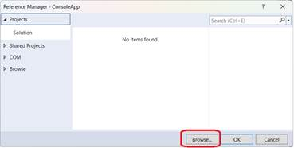

## **Přehled**

Tento článek vysvětluje, jak použít Aspose.Slides pro .NET 6 Cross-Platform ze ZIP balíčku. Popisuje, jak stáhnout balíček, rozbalit soubory ze složky `net6.0/crossplatform`, přidat odkaz na `Aspose.Slides.dll` a nakonfigurovat soubor projektu tak, aby požadované závislé knihovny byly zkopírovány do výstupního adresáře aplikace.

Článek také popisuje obsah cross‑platform balíčku, včetně hlavní Aspose.Slides .NET sestavy a platformně specifických knihoven grafického subsystému pro Windows, Linux a macOS.

{}
Aspose.Slides pro .NET 6 Cross-Platform je také k dispozici na [NuGet](https://www.nuget.org/packages/Aspose.Slides.NET6.CrossPlatform).
{}

## **Použití Cross-Platform Aspose.Slides z ZIP balíčku**

1. Stáhněte ZIP balíček nejnovějšího Aspose.Slides ze [Stránky vydání](https://releases.aspose.com/slides/cs/net/).

2. Rozbalte soubory z *Aspose.Slides.zip\Aspose.Slides\net6.0\crossplatform* a umístěte je do složky, která bude ve vašem projektu použita pro závislosti.

3. Přidejte odkaz na Aspose.Slides.dll.

   

   V našem příkladu (dole) jsou knihovny umístěny ve složce projektu na této cestě: *ConsoleApp\libs\Aspose.Slides\net6.0\crossplatform\...*

   

4. Umístěte zbývající soubory (na kterých Aspose.Slides závisí) do výstupního adresáře přidáním instrukcí do souboru csproj tímto způsobem:

```xml
<ItemGroup>

   <None Update="libs\Aspose.Slides\net6.0\crossplatform\aspose.slides.drawing.capi_vc14x64.dll">
         <CopyToOutputDirectory>PreserveNewest</CopyToOutputDirectory>
         <TargetPath>aspose.slides.drawing.capi_vc14x64.dll</TargetPath>
   </None>

   <None Update="libs\Aspose.Slides\net6.0\crossplatform\aspose.slides.drawing.capi_vc14x86.dll">
         <CopyToOutputDirectory>PreserveNewest</CopyToOutputDirectory>
         <TargetPath>aspose.slides.drawing.capi_vc14x86.dll</TargetPath>
   </None>

   <None Update="libs\Aspose.Slides\net6.0\crossplatform\Aspose.Slides.xml">
         <CopyToOutputDirectory>PreserveNewest</CopyToOutputDirectory>
         <TargetPath>Aspose.Slides.xml</TargetPath>
   </None>

   <None Update="libs\Aspose.Slides\net6.0\crossplatform\libaspose.slides.drawing.capi_appleclang_x86_64.dylib">
         <CopyToOutputDirectory>PreserveNewest</CopyToOutputDirectory>
         <TargetPath>libaspose.slides.drawing.capi_appleclang_x86_64.dylib</TargetPath>
   </None>

   <None Update="libs\Aspose.Slides\net6.0\crossplatform\libaspose.slides.drawing.capi_appleclang_arm64.dylib">
         <CopyToOutputDirectory>PreserveNewest</CopyToOutputDirectory>
         <TargetPath>libaspose.slides.drawing.capi_appleclang_arm64.dylib</TargetPath>
   </None>

   <None Update="libs\Aspose.Slides\net6.0\crossplatform\libaspose.slides.drawing.capi_x86_64_libstdcpp_libc2.23.so">
         <CopyToOutputDirectory>PreserveNewest</CopyToOutputDirectory>
         <TargetPath>libaspose.slides.drawing.capi_x86_64_libstdcpp_libc2.23.so</TargetPath>
   </None>

</ItemGroup>
```

5. Věnujte pozornost `TargetPath`.

   Ve výchozím nastavení `<CopyToOutputDirectory>` kopíruje soubory při zachování jejich relativní cesty, ale potřebujeme, aby závislé knihovny šly do stejné složky, kde je generován výstup (umístění Aspose.Slides.dll).

## **Poznámky**

### **Vlastní grafický subsystém**

| Aspose.Slides.dll                                          | Hlavní .NET sestava zodpovědná za veškerou logiku Aspose.Slides |
| ---------------------------------------------------------- | ---------------------------------------------------------------- |
| aspose.slides.drawing.capi_vc14x64.dll                     | Závislost: implementace grafického subsystému pro Win x64         |
| aspose.slides.drawing.capi_vc14x86.dll                     | Závislost: implementace grafického subsystému pro Win x64         |
| libaspose.slides.drawing.capi_x86_64_libstdcpp_libc2.23.so | Závislost: implementace grafického subsystému pro Linux (x86/x64) |
| libaspose.slides.drawing.capi_appleclang_x86_64.dylib      | Závislost: implementace grafického subsystému pro macOS AMD64 (x86‑64/x64) |
| libaspose.slides.drawing.capi_appleclang_arm64.dylib       | Závislost: implementace grafického subsystému pro macOS ARM64 (AArch64) |

Aspose.Slides.dll používá knihovnu, kterou vyžaduje systém, na kterém běží. Knihovny jsou obvykle umístěny ve stejném umístění jako Aspose.Slides.dll v jakémkoli souborovém systému.

### **Struktura ZIP balíčku**

ZIP balíček obsahuje následující strukturu složek:

  Aspose.Slides

  ├─── net6.0

  │  ├─── crossplatform

  │  └─── default

  ├─── net20

  ├─── net462

  └─── netstandard2.0

* Každá složka obsahuje sestavy pro odpovídající verzi .NET. Pro net6.0 existují dvě verze: default a crossplatform. Poslední obsahuje cross‑platform Aspose.Slides.dll a všechny jeho závislosti. Rozbalený obsah této složky lze použít jako doplněk závislostí v projektu pro vývoj cross‑platform a další instance použití Aspose.Slides.

## **Viz také**

- [Systémové požadavky](/slides/cs/net/system-requirements/)