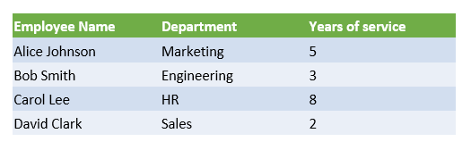

## **Úvod**

Prezentace PowerPoint jsou výkonným způsobem, jak zobrazit a komunikovat informace. Často se používají ve spojení se sešity Excel, kde Excel slouží jako vynikající zdroj strukturovaných dat a PowerPoint vyniká v vizualizaci těchto dat pro publikum.

Existuje mnoho praktických scénářů, kde je kombinace Excelu a PowerPointu nezbytná: hromadná korespondence, vyplňování datových tabulek, generování jedné snímky na záznam dat (hromadné generování snímků), tvorba výukových materiálů a konsolidace více Excelových zpráv do jedné prezentace, jen vyjmenovat několik.

Dosud implementace takových funkcí pomocí Aspose.Slides API vyžadovala spoléhat na řešení třetích stran, jako je Aspose.Cells. Přestože jsou tyto nástroje robustní, mohou být pro uživatele, kteří potřebují jen základní funkci integrace dat, nadměrně složité a nákladné.

## **Jak to funguje**

Aby práce s daty Excelu byla snazší a plynulejší, Aspose.Slides představila nové třídy pro čtení dat ze sešitu Excel a import obsahu do prezentace. Tato funkce otevírá silné nové možnosti pro uživatele API, kteří chtějí využít Excel jako zdroj dat ve svých pracovních postupech s prezentacemi.

Nová funkčnost je navržena pro obecný přístup k datům a není integrována do Document Object Model (DOM) prezentace. To znamená *neumožňuje úpravy ani ukládání souborů Excel* — jejím jediným cílem je otevřít sešity a procházet jejich obsah za účelem získání hodnot buněk.

Na jádře této funkce je nová třída [ExcelDataWorkbook](https://reference.aspose.com/slides/cs/net/aspose.slides.excel/exceldataworkbook/) . Tato třída umožňuje načíst sešit Excel z lokálního souboru nebo streamu. Po načtení poskytuje několik přetížení metody [GetCell](https://reference.aspose.com/slides/cs/net/aspose.slides.excel/exceldataworkbook/getcell/) , kterou můžete použít k získání konkrétních buněk podle jejich polohy (např. indexy řádku a sloupce nebo pojmenované oblasti).

Každé volání [GetCell](https://reference.aspose.com/slides/cs/net/aspose.slides.excel/exceldataworkbook/getcell/) vrací instanci třídy [ExcelDataCell](https://reference.aspose.com/slides/cs/net/aspose.slides.excel/exceldatacell/) . Tento objekt představuje jednu buňku v sešitu Excel a poskytuje vám přístup k její hodnotě jednoduchým a intuitivním způsobem.

#### **Import grafu z Excelu**

Dalším krokem k rozšíření funkčnosti je třída [ExcelWorkbookImporter](https://reference.aspose.com/slides/cs/net/aspose.slides.import/excelworkbookimporter/) . Tato pomocná třída poskytuje funkci pro import obsahu ze sešitu Excel do prezentace. Obsahuje několik přetížení metody [AddChartFromWorkbook](https://reference.aspose.com/slides/cs/net/aspose.slides.import/excelworkbookimporter/addchartfromworkbook/) , která vám pomůže získat vybraný graf ze zadaného sešitu Excel a přidat jej na konec dané kolekce tvarů na zadaných souřadnicích.

#### **Import tabulky z Excelu**

Třída [ExcelWorkbookImporter](https://reference.aspose.com/slides/cs/net/aspose.slides.import/excelworkbookimporter/) také obsahuje několik přetížení metody [AddTableFromWorkbook](https://reference.aspose.com/slides/cs/net/aspose.slides.import/excelworkbookimporter/addtablefromworkbook/) . Tyto metody vám umožní importovat určený rozsah buněk z určeného listu a přidat jej jako tabulku na konec dané kolekce tvarů na zadaných souřadnicích.

Stručně řečeno, jde o lehké a přímočaré API pro čtení dat z Excelu — přesně to, co mnoho vývojářů potřebuje, bez zátěže kompletní knihovny pro zpracování tabulek.

## **Pojďme kódit**

### **Příklad scénáře hromadné korespondence**

V následujícím příkladu implementujeme jednoduchý scénář hromadné korespondence generováním více prezentací na základě dat uložených v sešitu Excel.

Pro zahájení potřebujeme dvě věci:
1. Sešit Excel obsahující data


2. Šablona prezentace PowerPoint


```csharp
// Načíst sešit Excel s daty zaměstnanců.
ExcelDataWorkbook workbook = new ExcelDataWorkbook("TemplateData.xlsx");
int worksheetIndex = 0;

// Načíst šablonu prezentace.
using Presentation templatePresentation = new Presentation("PresentationTemplate.pptx");

// Procházet řádky v Excelu (vynechat hlavičku v řádku 0).
for (int rowIndex = 1; rowIndex <= 4; rowIndex++)
{
    // Vytvořit novou prezentaci pro každý záznam zaměstnance.
    using Presentation employeePresentation = new Presentation();

    // Odstranit výchozí prázdný snímek.
    employeePresentation.Slides.RemoveAt(0);

    // Klonovat šablonový snímek do nové prezentace.
    ISlide slide = employeePresentation.Slides.AddClone(templatePresentation.Slides[0]);

    // Získat odstavce z cílového tvaru (předpokládá se, že se používá index tvaru 1).
    IParagraphCollection paragraphs = (slide.Shapes[1] as IAutoShape).TextFrame.Paragraphs;

    // Nahradit zástupné symboly daty z Excelu.
    string employeeName = workbook.GetCell(worksheetIndex, rowIndex, 0).Value.ToString();
    IPortion namePortion = paragraphs[0].Portions[0];
    namePortion.Text = namePortion.Text.Replace("{{EmployeeName}}", employeeName);

    string department = workbook.GetCell(worksheetIndex, rowIndex, 1).Value.ToString();
    IPortion departmentPortion = paragraphs[1].Portions[0];
    departmentPortion.Text = departmentPortion.Text.Replace("{{Department}}", department);

    string yearsOfService = workbook.GetCell(worksheetIndex, rowIndex, 2).Value.ToString();
    IPortion yearsPortion = paragraphs[2].Portions[0];
    yearsPortion.Text = yearsPortion.Text.Replace("{{YearsOfService}}", yearsOfService);

    // Uložit personalizovanou prezentaci do samostatného souboru.
    employeePresentation.Save($"{employeeName} Report.pptx", SaveFormat.Pptx);
}
```


### **Příklad tabulky Excel**

Ve druhém příkladu jednoduše zkopírujeme data z tabulky Excel a zobrazíme je na snímku PowerPointu v vizuálně přitažlivějším formátu.

V tomto příkladu znovu použijeme stejný sešit Excel z prvního příkladu, který obsahuje jednoduchou tabulku zaměstnanců.

```csharp
// Načíst sešit Excel obsahující data zaměstnanců.
ExcelDataWorkbook workbook = new ExcelDataWorkbook("TemplateData.xlsx");
int worksheetIndex = 0;

// Vytvořit novou prezentaci PowerPoint.
using Presentation presentation = new Presentation();

// Přidat tvar tabulky na první snímek.
ITable table = presentation.Slides[0].Shapes.AddTable(
    50, 200,
    new double[] { 200, 200, 200 },
    new double[] { 30, 30, 30, 30, 30 }
);

// Vyplnit tabulku PowerPoint daty ze sešitu Excel.
for (int rowIndex = 0; rowIndex < 5; rowIndex++)
{
    for (int columnIndex = 0; columnIndex < 3; columnIndex++)
    {
        string cellValue = workbook.GetCell(worksheetIndex, rowIndex, columnIndex).Value.ToString();
        table[columnIndex, rowIndex].TextFrame.Text = cellValue;
    }
}

// Uložit výslednou prezentaci do souboru.
presentation.Save("Table.pptx", SaveFormat.Pptx);
```


### **Příklad importu grafu z Excelu**

V tomto příkladu importujeme graf z prvního listu sešitu Excel použitého v předchozím příkladu. Graf bude v výsledné prezentaci odkazovat na externí sešit.

Nejprve přidáme koláčový graf do sešitu Excel na základě tabulky zaměstnanců.


```csharp
// Vytvořit novou prezentaci PowerPoint.
using Presentation presentation = new Presentation();

// Získat kolekci tvarů z prvního snímku.
IShapeCollection shapes = presentation.Slides[0].Shapes;

// Importovat graf s názvem "Chart 1" z první listu sešitu a přidat jej do kolekce tvarů.
ExcelWorkbookImporter.AddChartFromWorkbook(shapes, 10, 10, "TemplateData.xlsx", "Sheet1", "Chart 1", false);

// Uložit výslednou prezentaci do souboru.
presentation.Save("Chart.pptx", SaveFormat.Pptx);
```


### **Příklad importu všech grafů z Excelu**

Představte si, že máte sešit Excel plný grafů a potřebujete je všechny importovat do prezentace. Každý graf by měl být umístěn na novém snímku.

Následující kód iteruje přes všechny listy ve zdrojovém souboru Excel, extrahuje grafy z každého listu a přidá každý graf na samostatný snímek pomocí rozložení prázdného snímku. Ve výsledné prezentaci bude vložen pouze datový graf, ne celý sešit.

```csharp
// Načíst sešit Excel obsahující data zaměstnanců.
ExcelDataWorkbook workbook = new ExcelDataWorkbook("ExcelWithCharts.xlsx");

// Vytvořit novou prezentaci PowerPoint.
using Presentation presentation = new Presentation();

// Získat prázdné rozložení snímku.
ILayoutSlide blankLayout = presentation.LayoutSlides.GetByType(SlideLayoutType.Blank);

// Získat názvy všech listů obsažených v sešitu Excel.
IList<string> worksheetNames = workbook.GetWorksheetNames();

foreach (var name in worksheetNames)
{
    // Získat slovník, který mapuje indexy grafů na názvy grafů pro list.
    IDictionary<int, string> worksheetCharts = workbook.GetChartsFromWorksheet(name);
    foreach (var chart in worksheetCharts)
    {
        // Přidat nový snímek s použitím prázdného rozložení.
        ISlide slide = presentation.Slides.AddEmptySlide(blankLayout);

        // Importovat zadaný graf ze sešitu Excel do kolekce tvarů snímku.
        ExcelWorkbookImporter.AddChartFromWorkbook(slide.Shapes, 10, 10, workbook, name, chart.Key, false);
    }
}

// Uložit výslednou prezentaci do souboru.
presentation.Save("Charts.pptx", SaveFormat.Pptx);
```

### **Příklad importu tabulky z Excelu**

V tomto příkladu importujeme formátovanou tabulku z listu Excel přímo do prezentace PowerPoint.

Zdrojový list Excel obsahuje formátovanou tabulku s údaji o zaměstnancích:


```csharp
// Vytvořit novou prezentaci PowerPoint.
using Presentation presentation = new Presentation();

// Získat kolekci tvarů z prvního snímku.
IShapeCollection shapes = presentation.Slides[0].Shapes;

// Importovat tabulku z prvního listu sešitu a přidat ji do kolekce tvarů.
ExcelWorkbookImporter.AddTableFromWorkbook(shapes, 10, 10, "TemplateData.xlsx", "Sheet1", "A1:C5");

// Uložit výslednou prezentaci do souboru.
presentation.Save("FormattedTable.pptx", SaveFormat.Pptx);
```



## **Shrnutí**

Tento mechanismus, dostupný přímo v Aspose.Slides, kombinuje práci s daty Excel a prezentacemi na jednom místě. Umožňuje vytvářet snímky s vizuálními grafy a data prezentovaná jako tabulky Excel — bez dalších knihoven či složitých integrací.